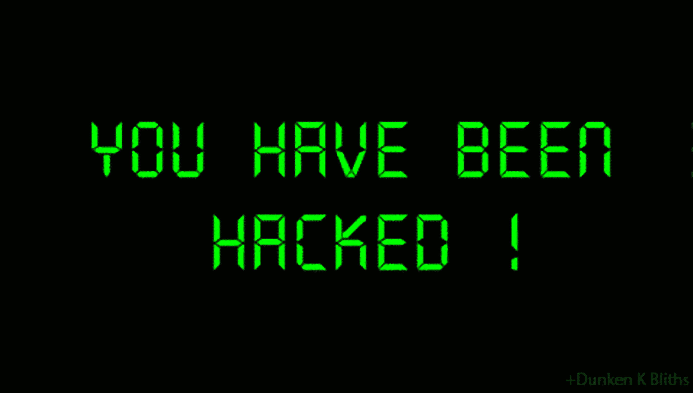
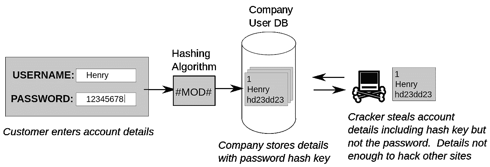

# 如何知道你的账户到目前为止是否安全

> 原文：<https://medium.com/hackernoon/how-to-know-whether-your-account-has-been-safe-till-now-a864b8098ef0>

[https://media.giphy.com/media/lp3GUtG2waC88/giphy.gi](https://media.giphy.com/media/lp3GUtG2waC88/giphy.gif)

你信任各种网络公司的密码。随着数据泄露越来越常见(比如[这个](https://www.wired.com/story/change-your-twitter-password-right-now/)、[这个](https://www.businessinsider.com/quora-says-it-had-massive-hack-that-may-have-affected100-million-users-2018-12?IR=T)和[这个](https://www.vice.com/en_us/article/a3qpk5/t-mobile-hack-data-breach-api-customer-data))，你的数据安全吗？如何知道自己的密码是否被盗？如果不幸发生了，你会怎么做？

# 你被黑了吗？

开门见山，你被黑了吗？让我们来看看:

 [## 了解您是否参与了数据泄露

### 用 Firefox Monitor 找出你是否是数据泄露的一部分。注册获取有关未来违规的警报，并获得…

monitor.firefox.com](https://monitor.firefox.com/) 

去上面的[网站](https://monitor.firefox.com/)输入你的邮箱地址。不要担心你的隐私或安全，Mozilla(一个著名的非盈利组织)维护着这个网站。如果你收到的信息是“这封邮件出现在零数据泄露中”，那么你的帐户到目前为止是安全的，但是如果你的数据受到了任何以前的数据泄露的影响，它会显示类似这样的信息。

如果你的数据遭到破坏，在你开始抓狂之前，有一件重要的事情你应该知道。您的数据仍有很大可能是安全的。要知道如何，你应该了解公司如何存储你的密码。

# 您的数据是如何存储的:

每个在线帐户都有一个相关的密码。当你用密码注册时，它们不会作为原始数据存储在公司的数据库中。相反，它们被馈送到一个哈希算法，以创建一些称为哈希的乱码值，这个过程被称为[哈希](https://www.wired.com/2016/06/hacker-lexicon-password-hashing/)。生成的散列是您的密码所独有的，您的密码无法从它们被追溯。因此，黑客会看到一串随机的字母，而不是你的密码。

By Pluke — Own work, CC0, [https://commons.wikimedia.org/w/index.php?curid=18296416](https://commons.wikimedia.org/w/index.php?curid=18296416)

每次输入密码时，都会生成一个哈希，并与数据库中存储的哈希进行比较。

# 您是否应该关心:

如果没有实际的密码被存储，那么你应该担心你的散列被黑客攻击吗？是的。存储哈希而不是密码并不是完全安全的。一旦黑客得到了哈希值，他们就会使用各种技术试图找出你的密码。是的，您的密码无法被追溯，但它们会通过向哈希算法提供随机数据来尝试生成相同的哈希值。由于每个哈希对于一个密码来说都是唯一的，所以当黑客设法生成精确的哈希值时，他们就已经破解了你的密码。

破解你的密码需要多长时间取决于你密码的强度。这种密码猜测是由功能强大的计算机完成的，因此它们很容易破解常见的密码。当你的密码又长又复杂时，破解你的密码需要几个世纪。换句话说，他们将不可能破解一个又长又复杂的密码，至少目前是这样。

# 你能做什么:

如果您受到了数据泄露的影响，不要惊慌。立即更改您的密码。即使您的数据到目前为止是安全的，也不能保证它会保持原样。为了安全起见，请用更强的密码替换较弱的密码。要创建强密码，一些网站建议至少有 8 个字符，其中至少包含一个大写字母和一个数字。此外，你可能听说过这样的建议，比如使用句子中每个单词的首字母(我喜欢 you ==>Iailwtsoy 的形状)。这些是创建复杂密码的好方法，但是不够长。

我建议一个更好的主意，不用那些首字母，用整个句子。将句子用作密码的这种用法称为 passphrase。你可以创造一个你自己的句子，比如“我将在明年之前变得健康”(有或没有空格)。一个额外的好处是你每天每次输入密码都会得到额外的动力😉。过会儿谢谢我。

试着把不同的句子和不同的叙述联系起来。一个用于你的脸书，一个用于你的 Snapchat，一个用于你的 Insta 等等。即使你的密码被破解了，黑客也无法进入你的其他账户。

> 只需在您的谷歌帐户中添加一个恢复电话号码，就可以阻止高达 100%的自动僵尸程序、99%的批量网络钓鱼攻击和 66%的定向攻击— [谷歌安全博客](https://security.googleblog.com/2019/05/new-research-how-effective-is-basic.html)

尽可能启用双因素身份认证(2FA)。双因素身份验证是使用两种不同方法来验证用户的过程。要了解更多，点击[这里](https://www.cnet.com/how-to/how-and-why-to-use-two-factor-authentication/)

# 结论:

如今一切都变得智能了。你的手机、电视、音箱，甚至你的牙刷都变得智能了。是时候让您的密码变得足够智能来保护您的数据了。请立即更改您的密码。只要你有一个不常见的长密码，每个帐户都有一个独特的双因素认证，你就可以保持冷静😎即使数据泄露每天都在发生。拥有安全可靠的数字生活。

*如果你觉得这篇文章有趣，点击拍手图标(50 次*😍👏*)关注我了解更多技术和隐私。请不要忘记分享你在*[*Firefox Monitor*](https://monitor.firefox.com/)*中发现的东西的经验，告诉我们你的数据是否被攻破，你是否被告知此事(我没有被告知)。*