# 如何标记数据—为对象检测创建 ML

> 原文：<https://medium.com/hackernoon/how-to-label-data-create-ml-for-object-detection-82043957b5cb>

刚刚在 WWDC 2019 上发布的新 Create ML 应用程序是一种非常简单的方式来训练你自己的个性化机器学习模型。所有需要做的就是将包含您的训练数据的文件夹拖到工具中，Create ML 完成剩下的繁重工作。

那么我们如何准备我们的数据呢？

当进行图像或声音分类时，我们只需要将数据组织到文件夹中，但如果我们想要进行对象检测，任务就变得有点复杂了。对于对象检测，我们需要指定一些附加信息。

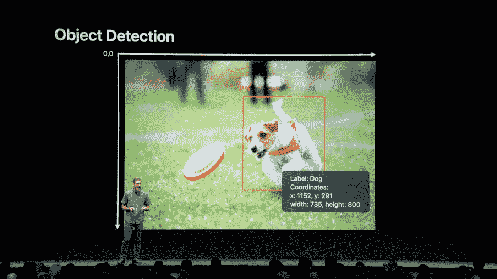

除了我们的图像，我们还需要一个`annotations.json`来显示物体的坐标。注释需要符合以下格式:

```
[
    {
        "image": "image1.jpg",
        "annotations": [
            {
                "label": "carrots",
                "coordinates": {
                    "x": 120
                    "y": 164
                    "width": 230
                    "height": 119
                }
            },
            {
                "label": "orange",
                "coordinates": {
                    "x": 230
                    "y": 321
                    "width": 50
                    "height": 50
                }
            }
        ]
    },
    ...
]
```

> **注意:**x 和 y 坐标是边界矩形的中心，所有坐标以像素为单位

我们如何生成这个 json？(我绝对不想全靠手)

苹果告诉我们

> "你可以从网上下载工具来帮助你建立这些[注释]"

那么我们应该使用什么工具呢？云注解！

Cloud Annotations 就是我为此专门打造的一款工具。它可以让我们快速地在我们的图像上画出方框，并以苹果要求的格式给我们一个`annotations.json`。

# 创建对象存储实例

要使用云注释，我们需要创建一个云对象存储实例。创建一个云对象存储实例给了我们一个可靠的地方来保存我们的训练数据。它还开启了数据收集和协作的潜力，让我们收集用户数据，并允许一个专家团队轻松地对其进行标记。

IBM Cloud 提供了一个精简的对象存储层，其中包括 25 GB 的免费存储空间。(这是我们将在整个教程中使用的)

要创建一个实例，我们首先需要**登录**或**注册**IBM Cloud。

登录后，您应该会找到您的 IBM Cloud dashboard。这是我们可以创建和管理 IBM 云资源的地方。

我们想要创建一个新的云对象存储实例，因此单击**创建资源**按钮。

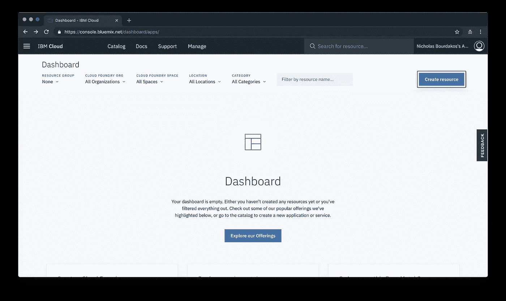

找到并选择**对象存储**选项。

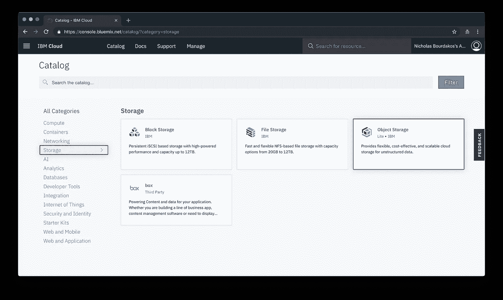

选择一个定价方案，点击**创建**，然后**确认**，弹出如下窗口。

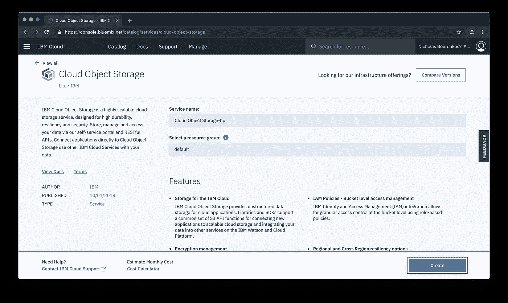

# 资格证书

一旦我们有了对象存储实例，我们就需要一种从 IBM Cloud 外部访问数据的方法。要做到这一点，我们需要为我们的资源创建一组凭证。

我们可以通过导航到**服务凭证**选项卡并单击**新凭证**按钮来完成此操作。

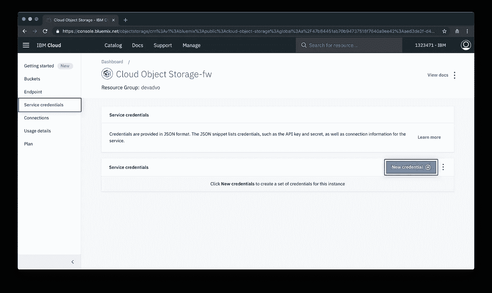

您可以将大多数选项留空，但要确保凭证具有 **Writer** 的角色，并添加以下内联配置参数:

```
{"HMAC": true}
```


添加完成后，单击**查看凭证▾** 下拉菜单，并记下您的 **apikey** 、 **access_key_id** 、 **secret_access_key** 和 **resource_instance_id** 。

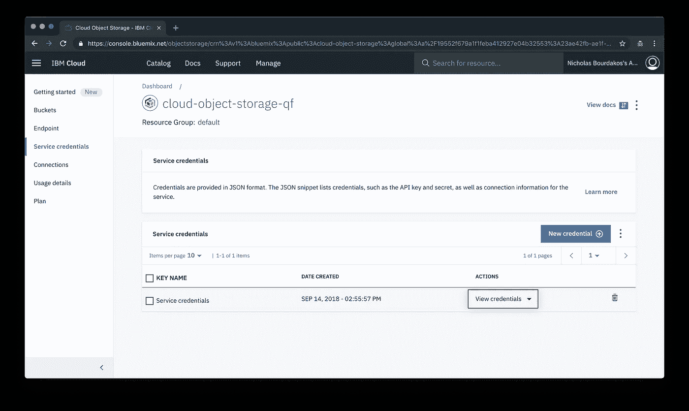

```
{
  **"apikey": "...",**
  "cos_hmac_keys": {
    **"access_key_id": "...",**
    **"secret_access_key": "..."**
  },
  "endpoints": "...",
  "iam_apikey_description": "...",
  "iam_apikey_name": "...",
  "iam_role_crn": "...",
  "iam_serviceid_crn": "...",
  **"resource_instance_id": "..."**
}
```

# 云注释

要使用该工具，只需导航到[云注释工具](https://cloud.annotations.ai/)并添加您的对象存储凭证。

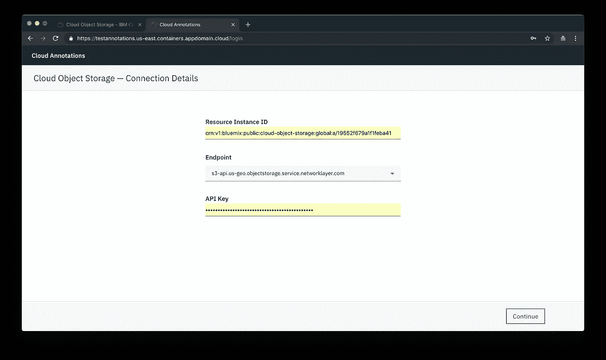

我们将把我们的文件和注释存储在一个叫做**桶**的东西中，我们可以通过点击**创建桶**来创建一个。

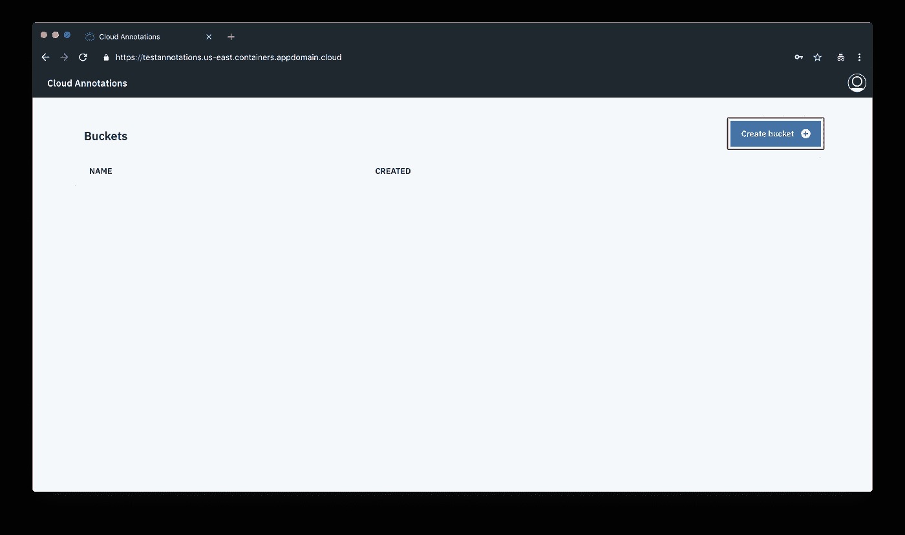

在我们创建并命名我们的 bucket 之后，它会提示我们选择一个注释类型。我们需要选择**本地化**。这允许我们在图像上画出包围盒矩形。

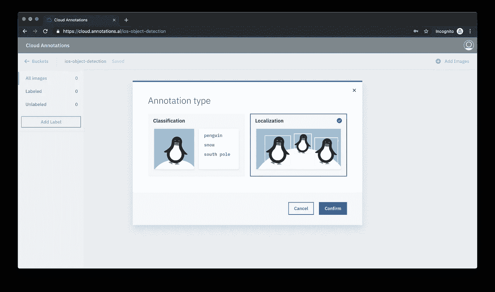

## 培训数据最佳实践

*   我们将训练的模型针对真实世界中的物体照片进行了优化。它们不太可能适用于 x 光、手绘、扫描文档、收据等。
*   训练数据应该尽可能接近要进行预测的数据。例如，如果您的用例涉及模糊且低分辨率的图像(如来自安全摄像机的图像)，您的训练数据应该由模糊且低分辨率的图像组成。通常，您还应该考虑为训练图像提供多种角度、分辨率和背景。
*   我们将训练的模型通常无法预测人类无法分配的标签。因此，如果一个人不能被训练通过看图像 1-2 秒来分配标签，那么模型很可能也不能被训练来做这件事。
*   对于一个可用的模型，我们建议每个标签至少有 50 个训练图像，但是使用 100 个或 1000 个会提供更好的结果。
*   我们将要训练的模型会将图像的大小调整为 300x300 像素，因此在用一个维度比另一个维度长得多的图像训练模型时要记住这一点。

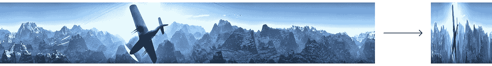

## 标记数据

要标记图像:

1.  上传一个视频或许多图像
2.  创建所需的标签
3.  开始绘制边界框

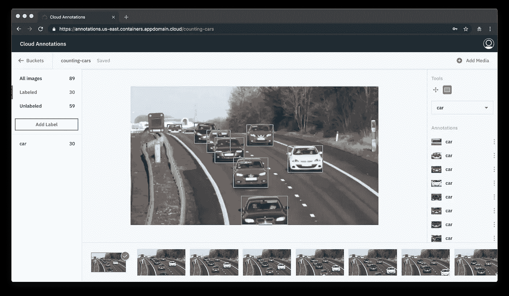

# 获取注释

在我们收集并标记了第一轮图像之后，我们就可以开始训练我们的模型了！

## 装置

要访问我们的注释，我们需要安装云注释 CLI:

```
npm install -g cloud-annotations
```

> ***注意:您需要安装 Node 10.13.0 或更高版本。*** *你可以使用*[*nvm*](https://github.com/creationix/nvm#installation)*(MAC OS/Linux)或者*[*nvm-windows*](https://github.com/coreybutler/nvm-windows#node-version-manager-nvm-for-windows)*在不同项目之间轻松切换节点版本。*

## 下载注释

要下载注释，我们需要做的就是运行以下命令

```
cacli export --create-ml
```

一旦完成，就会有一个名为`exported_buckets`的文件夹，里面有你的桶。你所需要做的就是把这个文件夹拖到创建 ML 应用程序中，你就可以开始了！

感谢阅读！如果您有任何问题，请随时联系 atbourdakos1@gmail.com，通过 [LinkedIn](https://www.linkedin.com/in/nicholasbourdakos) 与我联系，或者通过 [Medium](/@bourdakos1) 和 [Twitter](https://twitter.com/bourdakos1) 关注我。

如果你觉得这篇文章很有帮助，给它一些掌声会很有意义👏并分享出来帮别人找！并欢迎在下方发表评论。