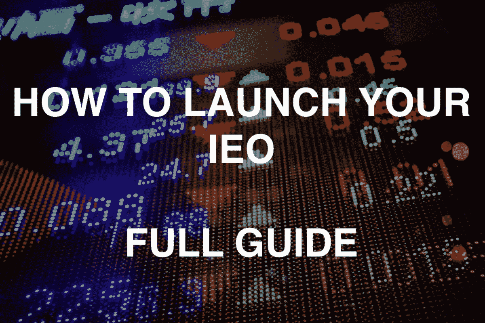

# 如何推出你的 IEO:项目指南+交易所列表

> 原文：<https://medium.com/hackernoon/how-to-launch-your-ieo-guide-for-projects-list-of-exchanges-dcebca23bcac>

# **前言**

几乎所有对加密货币感兴趣的人，最近都没有听说过 IEO。缩写含义 ***初始交易报价*** 暗示在加密交易所进行项目令牌出售。如果解释得更简单的话，这是一个 ICO，其中一个或另一个交易所充当担保人和场所。

以这种方式进行的最后一次象征性销售响亮地宣告了自己的价值，对这一过程中的三方参与者都有利:项目、投资者，当然还有交易所本身。

对于项目来说——目前，这几乎是为项目筹集必要投资的一种有保证的方式，同时又不用进行长期的营销活动和路演。

对于交易者来说，这是一个有时间购买代币并在以后转售获利或战略性 HODL 的机会。

对于交易所来说——是一种吸引新交易者、创造周边繁荣的方式，一种额外的收入来源和销售自己的交换代币(在绝大多数情况下，要投资一个特定的项目，你需要购买然后支付交换代币)。

尽管第一个值得注意的 IEO 案例出现在 2017 年(在币安平台上进行 IEO 的 GIFTO 和 Bread 项目)，但这种吸引投资的方法在 2019 年初受到了严重关注。当然，目前最大的币安交易所扮演了关键角色，它有一个专门的平台来进行令牌销售——币安 Launchpad。就在 2019 年 1 月的那个时候，IEO 通过了 BitTorrent 项目，该项目在不到 15 分钟的时间内筹集了约 720 万美元。IEO 项目获取。事实证明，人工智能的反响和成功丝毫不减——今年 2 月，在同一个交易场所，他们仅用 22 秒就筹集了约 600 万美元。在 Celer 项目的下一次令牌销售中，最大的交易所无法避免技术问题，因为希望参与的人数太多。尽管如此，这并没有影响在几分钟内购买所有可用代币的销售成功完成。

与此同时，投资者和交易者的兴奋是可以理解的——在代币公开交易后，大量在 IEO 期间未能买到代币的人开始在二级市场上购买代币，这往往会将代币送上被遗忘已久的“月球”。最近的一个例子是 TOP token，它在 IEO(在 Houbi Prime 平台上)之后在火币交易所上市时，在第一轮销售中(顺便说一下，在 7 秒内结束)，利润达到了价格的 250%。

当然，看到币安 Launchpad 的成功，感受到市场趋势，其他加密货币交易所开始宣布为 IEO 推出自己的平台。其中包括 KuCoin Spotlight、Huobi Prime、Bittrex IEO、OKEX Jumpstart 和许多其他与大型和小型交易所相关的公司。下面提供了更详细的列表。这意味着这种方法将适用于更多的项目。

让我们从理论转向实践。 ***一个项目需要什么才能到达其中一个平台并处理其项目的一个 IEO？***

# **一般建议**

进入 IEO 的项目准备结构在很大程度上与 ICO 准备重叠。成功项目的总体趋势也清晰可见。

当然，你首先注意到的是:

- **渐进式商业模式**

- **突破性技术**

- **强队**

- **项目及出资方声誉**

这是一个项目在吸引任何投资之前应该有的。我们将在下面的白皮书部分描述这一切。

**MVP/产品原型。**

有了这个条款，一切都尽可能清楚。在当今的密码行业，几乎没有人相信赤裸裸的想法和概念。一个项目至少需要一个 MVP，这个 MVP 比白皮书里的任何文字都更能说明问题。

**中硬帽。**

这与那些旨在筹集数千万美元的项目的日子相去甚远，在绝大多数情况下，这些项目是绝对不合理的。

现在，进入 IEO 的项目平均硬限额很少超过 500 万美元。而且随着愿意以这种方式筹集投资的项目数量的增加，这个数字还会减少。任何数字(软上限和硬上限)都需要一个非常清晰和易于理解的基本原理。此外，我们不能忘记，代币通常以组合轮次出售，只有某一部分分配给 IEO，其余部分将以私人和公共轮次出售，这必须在项目的代币组学中进行计算和反映。

白皮书和令牌组学。

通常，白皮书的大部分内容，至少是初级形式，是由团队和项目的创始人编写的。确实如此——没有人比你更了解你的项目。但是，在写完这份文件和其他材料后，不要向市场专业人士展示或纠正它们，这是一个很大的错误。通常它也适用于技术部分，但首先我们谈论的是令牌组学、计算及其合理性、总体结构、项目披露、定位等等。

任何交易所都会对该项目进行认真的尽职调查——它冒着声誉受损的风险，在 IEO 自己发行该项目，因此没有第二次机会。您的材料(包括白皮书、推介材料、一页纸、网站以及将向公众展示的所有内容)应该尽可能地精美、易懂并具有投资吸引力。

我将再次列出您在撰写白皮书时应该特别注意的事项(除了技术论证之外):

***——词汇学***

***-项目财务模式***

***-所创造的产品/技术的描述、使用案例、优点和用途***

***-潜在项目市场***

***——竞争对手及其案例***

***——团队***

***-现有合作伙伴***

***——一般正确制作的结构***

对于我目前计划推出 IEO 的客户，我们首先制作白皮书和其他基本材料。有必要创建一个模型，在该模型中，对代币的需求将不会通过出售甚至所有代币来完全满足。 ***这是任何 tokensale*** 的关键策略。此外，这对所有人都有好处——进入交易所后，围绕项目的兴奋不会消退，相反，会催生新的浪潮，迫使所有没有时间购买代币的人去做。

**法律意见书**

多次交流征求法律意见，其中包括该项目的 token 是一个 ***实用工具*** 的结论。此外，每个交易所可能都有自己对法律意见的具体要求，您将不得不再次经历这一过程，但要借助交易所推荐/信任的法律公司。

在这个阶段，你已经可以在任何交易所的平台上申请 IEO 了。接下来，我们列出了您可以申请项目评审的交流和链接列表。但是还有一个重要的方面我们会在这个列表之后考虑:额外的营销活动。

# **IEO 交易所**

很难谈论交易所为对 IEO 做出积极决定的项目提出的一般和标准条件。在与各交易所上市团队的面对面交流中，每次都提到，情况可能会有很大变化，取决于项目的细节。在某些情况下，这可能是代币的利息(售出代币的百分比)，而在其他情况下，这可能是挂牌费+代币利息。

与在交易所标准上市的情况一样，他们中的许多人可以通过与特定交易所合作的合作伙伴和代理机构进行接洽。这并不能保证 IEO 的排名，但至少有助于获得交易所代表的反馈，这将在几个月内完成(或仍未得到答复)。然而，选择你的合作伙伴要非常小心。

在这里你可以找到支持和运行 IEOs 的交易所列表以及它们的申请表链接。

[**币安 Launchapad**](https://launchpad.binance.com) : [*敷*](https://docs.google.com/forms/d/e/1FAIpQLSez_ZCgbZBVJrzjAKnw6f-RLPsDCv7iyyJ36C0IrGnYJ8Stvw/viewform)

[**火币质数**](https://www.hbg.com/) : [*应用*](https://www.hbg.com/en-us/application-center/)

[**库币聚光灯**](https://www.kucoin.com/activity/55) : [*应用*](https://docs.google.com/forms/d/e/1FAIpQLSefg678ycNar5hEylFcefJGRUsknXArMKisXsA8ojXQLskEQw/viewform)

[**Bittrex IEO**](https://international.bittrex.com/):[*应用*](https://bittrex.zendesk.com/hc/en-us/requests/new) -选择‘为您的令牌请求一个 IEO’

[**OK jump start**](https://www.okex.com):[*应用*](https://docs.google.com/forms/d/1eGKikA8fvJi7WiK3OZ8kRbXFeIhYtNPrep_DynU7RAI/viewform?edit_requested=true)

**:[*应用*](https://www.idax.pro/#/coins)**

****:[*应用*](https://www.coinbene.com/apply.html#/)****

****[**ProBit**](https://www.probit.com/) : [*敷*](https://docs.google.com/forms/d/e/1FAIpQLSf4b5e25olgKVVY623XBe7Pw1LxFZcCVAGaBXLgJ0sw7KwvkA/viewform)****

****[**Exmarkets launch pad**](https://exmarkets.com/launchpad):在*marketing@coinstruction.com*申请****

******:[*适用*](https://labs.coineal.com/index.html)******

******[**coin is**](https://www.coinis.co.kr/etc/ico/icoHome.do):[*敷*](https://www.coinis.co.kr/home/home001/introICO.do)******

****[**coin tiger**](https://www.cointiger.pro/en-us/#/ieo):[*应用*](https://jinshuju.net/f/nJwmw6)****

****[**液体**](https://www.liquid.com) : [*敷*](https://app.liquid.com/sign-in?redirect=/en/settings/application)****

****[**Bitmeta**](https://www.bitmeta.co.kr) :在*coinlisting@bitmeta.co.kr*应用****

****请注意，支持 IEO 并宣布推出自己的发射台的交易所几乎每周都在增加。该列表将被更新。****

# ******营销******

****例如，尽管在一次面对面的接触中，KuCoin 的代表说，对他们来说，项目的初步营销并不是选择 IEO 作为其启动平台的最重要的事情，但是，我们与交易所的经验表明，在竞争加剧的情况下，项目准备得越充分，就越有可能与强大的交易所达成销售协议。****

****这就是为什么，营销还是必须的。我们建议最小设置:****

******SMM+社区管理******

****最好提前开始社交网络——一步一步来，揭示项目的本质，团队的积极参与，技术解决方案和产品的开发。此外，有必要让现有用户参与进来，与他们交流并及时回答问题。最低 SMM 套餐包括:脸书页面、Twitter、LinkedIn、Telegram chat、Medium。****

******公关******

****在这个阶段，重要的是在出版物中讲述项目的前景和优势——你的解决方案和突破性技术将如何帮助市场和用户，创始人的背景，你的解决方案中的创新。因此，首先，当 IEO 申请提交给交易所时，其代表将会看到您的项目引起了越来越大的轰动，其次，当 IEO 发布时，已经有关于您的出版物，并且围绕您的项目形成了社区。****

****建议在显著和可靠的媒体上发布与项目潜在市场和一般技术/加密主题相关的技术，这样项目可以产生兴趣并找到追随者。****

******社区参与度******

****我们的意思是从主题平台吸引用户。在不同的论坛、Telegram 聊天、Reddit 主题、媒体博客、Bitcointalk 主题等等，围绕着这个项目大肆宣传。许多人会感到惊讶，但是在正确使用这些平台的过程中，他们在项目用户群的增长方面给出了非常好的结果。这将是今后推广 IEO 的良好基础。****

****此类活动将花费 1-2 个月的时间，以收到第一批切实的成果。此外，不要忘记审计和基础工作——白皮书和令牌经济学。将来，当从交易所上市被确认后，营销机器本身将在许多方面发挥作用——来自 IEO 的大肆宣传将吸引大量感兴趣的投资者。****

# ******后记******

****IEO 正在积极发展。大量的交易所正在准备他们的决策，并依靠这种方法为项目吸引投资。IEO 有它的优点和缺点。就像任何一开始就显示出超级结果的现象一样，IEO 迟早也会经历衰退。然而，在信任和开放的基础上与用户建立关系的交易所将会积极而成功地使用这种方法。****

****而且，我们会跟踪情况。如果您有任何问题或想咨询 IEO，请随时联系[我](https://www.linkedin.com/in/sbaloyan/)和我的团队——[X10 代理](http://x10.agency)，它已经在 STO 和 ICO 市场上证明了自己是最强的玩家之一。我们将随时帮助你。****

****在这个时候，IEO 完全有机会成为密码行业融资的标准之一。****