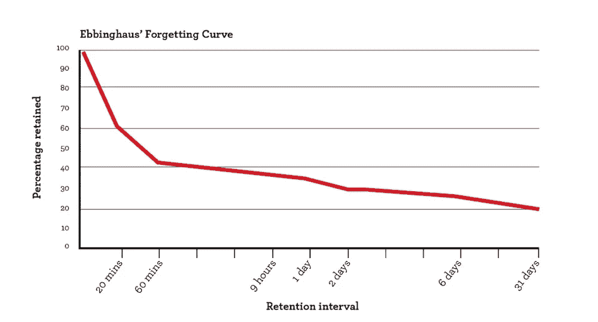

# 如何利用移动学习&空间效应来对抗遗忘曲线

> 原文：<https://medium.com/hackernoon/how-to-leverage-mobile-learning-the-spacing-effect-to-combat-the-forgetting-curve-78e18765ca5e>

Source: Pexel

学会如何学习很可能是我们能够培养的最重要的技能。

如果我们能掌握如何学习，我们就能运用这种技能更快更有效地掌握我们想做的任何事情。学习是打开无数扇门的钥匙。没有其他技术、策略或[生活窍门](https://hackernoon.com/micro-habits-changed-my-life-47f572bfc153)能提供更好的投资回报。

但是要成为更好的学习者——掌握终极元技能——我们首先必须了解*我们是如何学习的。*

在我们开始黑我们的大脑之前，我们必须先了解它是如何工作的。

带着这个目标，我们将尝试通过探索两个对思考这个主题非常有用的概念来收集一些见解:间隔效应和遗忘曲线。然后，我们将考虑如何使用[移动学习](https://www.northpass.com/blog/the-mobile-learning-revolution-why-ld-programs-must-adapt-to-survive)(或“移动学习”)来大规模提高学习主动性。

# 什么是间距效应？

Photo by [Aron Visuals](https://unsplash.com/@aronvisuals?utm_source=medium&utm_medium=referral) on [Unsplash](https://unsplash.com?utm_source=medium&utm_medium=referral)

间隔效应是学习中的一种现象，通过这种现象，当学习分散在一段时间而不是集中在一次学习中时，记忆和回忆会得到改善。这一现象首先由德国心理学家赫尔曼·艾宾浩斯发现，并在他 1885 年的著作《记忆:对实验心理学的贡献》中有所描述。

当我们在多个分散的会话中学习时，我们学得更好。为什么会这样，有很多理论，但它们都归结到同一个核心原则，在本尼迪克特·凯里的《我们如何学习:关于何时、何地以及为什么会发生的惊人真相》中有简洁的总结:

> “为了加强学习，必须出现一些故障……如果没有一点遗忘，你从进一步的学习中不会得到任何好处。”

间隔效应的现实是可论证的，并且有充分的文献证明；根据达特茅斯大学认知与教育实验室主任的一篇文章，“数百项认知与教育心理学的研究表明，与大量重复相比，随着时间的推移，间隔重复接触材料会产生更好的长期学习效果。”

尽管如此，专家们仍不确定间隔效应的确切机制。以下是一些更流行的理论的简要描述:

*   **提取努力假说:**也被称为“[测试效应](https://en.wikipedia.org/wiki/Testing_effect)，该假说认为，在回忆信息时增加努力会导致更好的记忆。根据该理论，检索信息的行为也是重新编码信息的行为。(这是测试被认为能提高记忆力的一个原因；你实际上是在*边考试边学习*。)学习和检索之间的时间增加导致检索过程中的努力增加。更多的时间=更多的努力。更多的努力=更好的记忆。
*   **编码可变性:**根据[这一理论](https://en.wikipedia.org/wiki/Spacing_effect#Encoding_variability)，一旦信息根据“提取线索”在我们的大脑中编码，我们就能够回忆起它提取线索是帮助我们提取某种记忆的刺激。例如，如果你正盯着你的猫看这篇文章，明天看到你的猫可能会帮助你记住编码可变性是怎么回事。你的猫将作为你的检索线索。该理论认为，间隔效应之所以有效，是因为通过多次间隔的会话进行学习为我们提供了一个更强大的检索线索库。所以，如果你明天在盯着你的狗的时候再读这封信，那么你的猫和你的狗都会起到提取线索的作用。
*   **亏空处理:** [这种理论](https://en.wikipedia.org/wiki/Spacing_effect#Deficient_processing)多少有点“玻璃杯是半空的”的观点。根据这个理论，间隔效应是真实的，仅仅因为我们不擅长大剂量学习。这并不是说间隔学习在某种程度上提高了记忆力，只是集中学习对我们的大脑来说太多了。因此，间距效应仅仅是我们自然极限的反映。我们应该避免抑制学习的情况和方法，而不是试图破解我们的大脑。

不管是什么原因，间距效应*是真实存在的，理解其原理可以帮助我们更有效地构建我们的学习。此外，间距效应也是艾宾浩斯另一项发现的天然解毒剂:遗忘曲线。*

# 遗忘曲线？提醒我一下。

遗忘曲线是另一种学习现象的表现，也是由赫尔曼·艾宾浩斯发现并撰写的。这条曲线展示了我们在学习新信息后忘记它的速度。

坦率地说，这有点令人担忧:

Source: [Farnam Street](https://fs.blog/2018/12/spacing-effect/)

根据 Farnam Street 的调查，一般人在学习新材料的一个小时内能记住的不到 50%。显然，我们很擅长遗忘。

然而，如果你记得，遗忘实际上是更好学习的秘方。这就是间距效应的由来。我们可以通过“间隔重复”或“间隔学习”系统来对抗遗忘曲线，我们遗忘的事实有助于我们在未来更好地记忆！

为了对抗遗忘曲线，我们需要实现某种形式的间隔学习系统。在这样一个系统中，我们在一段时间内以设定的时间间隔反复接触到相同的信息。

一个好的空间学习系统(同样根据 Farnam Street)包括以下组件:

1.  审查信息的时间表。
2.  一种存储和组织信息的方式。
3.  用于跟踪进度的指标。
4.  评审会议的持续时间。

对于准备期中考试的普通大学生来说，这个系统可能是非常基础的。它可以包括 1)个人日历，2)笔记本，3)复习测验，4)日常学习。

然而，对于要求更高的场景(比如企业学习计划)，更具可伸缩性的解决方案可能是必要的。这就是移动学习和[移动友好学习管理系统](https://www.northpass.com/) (LMS)发挥作用的地方。

# 移动学习如何提供帮助

 [## 在线培训初学者指南

### 无论你是一个经验丰富的培训经理还是该领域的新手，本指南将为你提供你需要的一切…

www.northpass.com](https://www.northpass.com/beginners-guide-to-online-training) 

移动学习完全符合间隔效应和设计良好的间隔学习系统的原则。

1.  **学习时间表**:移动学习计划可以为学习者提供预定的学习时间表，或者该计划可以按照学习者的进度完成，这取决于[你的特定目标和需求](https://www.northpass.com/beginners-guide-to-online-training/define-persona-and-goals#step-content-1)。
2.  **信息存储/组织**:当移动学习计划通过移动友好的 LMS 管理时，它固有地存在于一个可以存储、组织和向相关方提供相关信息的平台上。
3.  **跟踪进度的指标:**大多数移动学习平台也有固定的成功指标和分析来跟踪和奖励进度。这将有助于保持学习者的参与和项目管理员的知情。这样的指标也将帮助你[计算你的学习计划的投资回报率](https://www.northpass.com/blog/how-to-prove-the-roi-return-on-investment-of-your-online-training-program)。
4.  **课程持续时间:**课程也可以根据您的需要创建。一些项目将这一点发挥到了极致，专注于超短学习片段，作为被称为[微学习](https://hackernoon.com/using-microlearning-to-craft-and-effective-training-program-f68891cd852d)的策略的一部分。

[移动学习](https://www.northpass.com/blog/the-mobile-learning-revolution-why-ld-programs-must-adapt-to-survive)正在帮助各地的组织适应技术、业务和现代劳动力[的根本变化](https://www.northpass.com/blog/everything-you-need-to-know-about-workforce-2.0)。但是，也许更重要的是，移动学习可以很容易地适应一个空间学习系统，以更好地服务于我们大脑的最初功能。

反击遗忘曲线。利用移动学习和空间效应来实现你的学习目标。

# 关于作者

Nick Santaniello 是 Northpass 的内容负责人，这是一个现代的、移动友好的 LMS。你可以在 [Medium](/@SickNantaniello) 或 [LinkedIn](https://www.linkedin.com/in/nick-santaniello/) 上找到尼克，了解最新的劳动力和学习技巧。