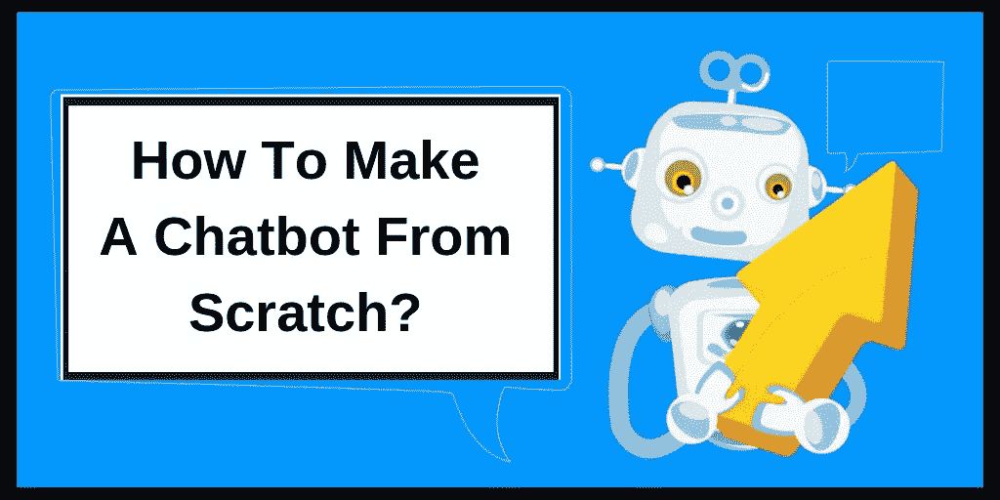

# 如何从零开始制作一个伟大的聊天机器人

> 原文：<https://medium.com/hackernoon/how-to-make-a-chatbot-from-scratch-fc3d95243b03>

## 创建高功能聊天机器人的专家提示。

如今，公司发现很难提高他们的客户体验，因此，他们想知道如何制作聊天机器人。而且，他们根据自己的商业利益和目标，几乎全部投资开发最好的聊天机器人。

在这里，我们将为您提供必要的信息和资源来**创建聊天机器人**。而且，看完这篇博客，你也会知道如何改进你的聊天机器人。

## **什么是聊天机器人？**

聊天机器人是人工智能驱动的系统，用于通过文本或语音界面与人类互动，以回答他们的问题。

聊天机器人的这种品质也是人们期待创造人工智能聊天机器人的主要原因。根据调查，他们有许多企业家对[离岸专用人工智能开发人员](https://www.valuecoders.com/hire-developers/hire-machine-learning-experts)感兴趣，以更好的客户体验来发展他们的业务。

这种交互可以很简单，例如:向聊天机器人询问天气预报，也可以很复杂，比如让聊天机器人解决互联网服务的问题。

## **如何构建聊天机器人？**

下面给出的步骤将帮助您开发聊天机器人:

## **1。知道人工智能聊天机器人的机会**

首先，让你自己意识到人工智能聊天机器人的机会。

公司总是想在他们的业务中利用新的机器人技术，所以他们需要一种方式来思考哪些类型的工作可以通过人工智能解决方案来增强或自动化。

人工智能解决方案可以根据两个标准给予关注:特定类型工作活动的数据和工作复杂性。

数据和工作复杂性的双重分析产生了四种类型的活动模型:创新、专家、效率和有效性。

> **这里也跑过眼**:[2019 人工智能(AI)五大趋势](https://hackernoon.com/top-5-trends-of-artificial-intelligence-ai-2019-693f7a5a0f7b)

## **2。了解客户的目标**

首先，你必须确切地知道你为什么要开发聊天机器人，以及聊天机器人应该做什么。

对此有一个清晰的概念将有助于设计师创建旨在实现目标的对话。

如果设计者知道聊天机器人开发的目的，他们设计与聊天机器人的对话会容易得多。

## **3。聊天机器人对话设计**

聊天机器人的交互分为结构化和非结构化交互。

结构化对话更多的是关于信息的逻辑流动。它包括选择、菜单和表单。

另一方面，非结构化对话流具有自由格式的纯文本。与同事、家人、朋友和其他认识的人的对话被归类在这一部分。

为这些消息创建脚本也需要这样做。相反，在开发消息脚本时，必须记住对话主题必须与聊天机器人所要达到的目的相近。

对于设计者来说，解释用户的回答来创建对话式用户界面的脚本是很重要的。

设计师还关注更容易处理的封闭式对话和让客户能够自然交谈的松散对话。

## **4。选择合适的聊天机器人平台**

尽管可以很容易地获得最强大的平台来构建聊天机器人。所有的平台都有各自的优缺点和具体用途。

为了方便您的选择，我们为您提供了一份清单，列出了开发聊天机器人的最佳平台[:](https://www.valuecoders.com/hire-developers/hire-chatbot-developers)

1.  [**Botsify**](https://botsify.com/) **:** 该平台利用拖放模板开发机器人。一些著名的功能，如通过[智能人工智能](https://hackernoon.com/top-5-trends-of-artificial-intelligence-ai-2019-693f7a5a0f7b)的简单集成，插件，机器学习和分析集成也是可用的。

**2。**[**chat fuel**](https://chatfuel.com/)**:**chat fuel 提供的功能包括添加内容卡并自动与您的关注者共享更新，通过表单在 Messenger 聊天中收集信息，以及允许用户请求信息并通过按钮与您的聊天机器人互动。

**3。** [**哔哔哔**](https://botlist.co/bots/beep-boop) **:** 哔哔哔以提供端到端的开发者体验而闻名，这使得用户有可能关注开发伟大的聊天机器人。

这个平台被认为是开发 slack 机器人的最好和最简单的方式。

> **试读:** [AR 和 VR 在医疗、教育和电子商务领域的应用](https://hackernoon.com/how-ar-and-vr-technologies-transforming-enterprises-43f44784353e)

**4。**[**Flox XO**](https://flowxo.com/)**:**Flow XO 成为唯一一个提供 100 多个集成的聊天机器人平台。它以易于使用的可视化编辑器而闻名。该平台还提供了许多预构建的模板，便于快速入门。

**5。**[**Motion AI**](http://www.motion.ai/)**:**这个平台可以在 Slack、FB Messenger、Smooch 或你的网站上可视化地构建、训练和部署聊天机器人。

这将使您能够像绘制流程图一样绘制您的对话流，以便对机器人的查询结果有一个直观的概述。

6。[**Bottr**](https://www.welcome.ai/bottr-me)**:**这个平台为你扩展了一个选项，可以在你的网站上嵌入你的机器人。你也可以从媒体、维基百科网站或 Wordpress 添加数据，以获得更好的数据覆盖。

7。[**QnA Maker**](https://www.qnamaker.ai/)**:**微软已经开发了 QnA bot，您需要在其中共享您的 FAQ 页面的 URL，该 bot 将根据 FAQ 页面上的信息和结构化数据在短时间(几分钟)内开发完成。

**8。******:**它有预定义的聊天机器人，时机已经成熟。该网站有客户支持、电子商务和食品业务的模板。**

**如果你挑一个电商聊天机器人，那么你只需要添加问答，产品，和一些常规设置。**

****9。**[**bot kit**](https://botkit.ai/)**:**这个平台有许多有用的工具，包括样板应用初学者工具包、Botkit Studio、核心库和用于扩展您的 bot 功能的插件。**

**10。 [**重铸。AI |协同机器人平台**](https://cai.tools.sap/) **:** 这个平台可以让你训练、开发、运行你的机器人。使用 Bot Builder 和可视化流程界面开发和管理您的对话逻辑有助于您快速设置响应。**

****11。**[**octane . ai**](https://home.otoy.com/render/octane-render/)**:**该平台具有预先构建的功能，使您可以轻松地向您的机器人添加消息、内容、填写表格、讨论、展示商品等。**

> ****浏览:** [开发者对 Android 应用开发的见解——你的呢？](/swlh/a-developers-insight-on-android-app-development-what-s-yours-2d28534b789d)**

**12。[**Chatter on**](https://www.chatteron.io/)**:**Chatter 可以通过输入几个机器人和用户之间预期对话的例子来帮助你构建机器人流程和设置 AI。**

****

**13。[**Gupshup**](https://www.gupshup.io)**:**该平台的创新智能消息具有纯文本消息中没有的结构化数据和智能。因此，它使高级消息传递工作流和自动化成为可能。**

****14。**[**conversio . ai**](https://context.reverso.net/translation/italian-english/converso)**:**本平台集成多个平台。它包括请求&会话跟踪，完整用户，并且它有自己的 NLP 解析引擎。**

> ****总结****

**由于聊天机器人有无数的好处，聊天机器人被视为未来。而且，每个企业都在寻求如何创建聊天机器人来增强他们客户的体验。**

**在这里，我们还提到了制作聊天机器人的最佳平台，包括 Botsify、Chatfuel、Beep Boop、Flox XO 等 14 个聊天机器人开发平台。上面列出的。**

**我希望我的话足以回答这些问题(什么是聊天机器人？或者如何构建聊天机器人？或者最好最合适的聊天机器人平台？)上面提到的。**

> ****最后的话:****

**如果你想让你的生意更上一层楼，那么你需要开发一个聊天机器人。为了做到这一点，你必须[雇佣聊天机器人开发者](https://www.valuecoders.com/hire-developers/hire-chatbot-developers)，他们可以构建智能聊天机器人，以简单的方式执行复杂的任务。毕竟，聊天机器人是为了让我们的生活更轻松。**

**为了嵌入[人工智能解决方案](https://www.valuecoders.com/hire-developers/hire-machine-learning-experts)在专家聊天机器人开发者的帮助下获得最佳结果，在竞争对手的跑步市场中强烈推荐。**