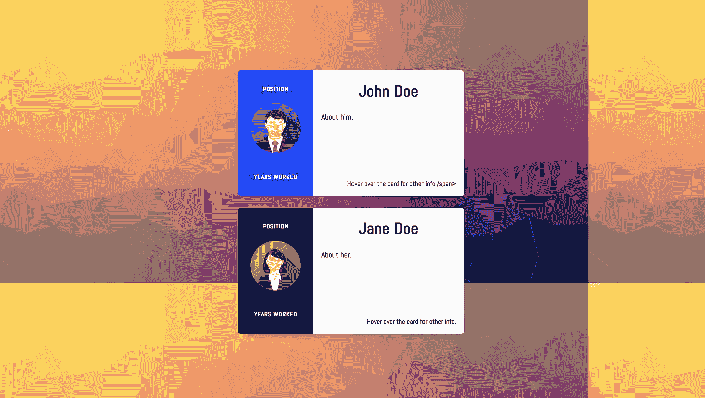

# 如何轻松为自己打造一个酷的介绍网站

> 原文：<https://medium.com/hackernoon/how-to-make-a-cool-introduction-webpage-for-yourself-easily-177f0b7fe1e3>

让我们用 CSS 和 HTML 做一个看起来很酷的卡片介绍网站。

你有没有想过为自己打造一个**简单、干净、酷、短的网站**来简单总结你的经历？

你曾经尝试过制作简单却令人印象深刻的网站吗？它看起来也非常专业。

如果是，您就在正确的页面上。在这里，我们将为我们自己制作一个简单的**酷外观的**网站，不需要太多的代码。

让我们通过**的结果本身**来激发我们建立网站的灵感。

[**完成后，外观如下。**](https://gracious-hodgkin-7eff6d.netlify.com/)

不想转到新链接？嗯，你可能会错过一些令人惊讶的事情，但还是这张图片。



看起来很酷吗？**它也有动画**，当你访问链接本身时你会发现它们。

您可以添加您的形象、专业细节，这将成为您自己的动画、创意网站，供他人使用。

想自己做这个吗？代码简单而优雅，也不是很复杂。

> **所以，让我们深入探讨一些代码**。

首先，让我们制作一个 **HTML 文件**，它以细致的方式保存我们想要存储的信息。

打开您的 **VSC 或崇高文本或您选择的任何其他文本编辑器**。制作一个简单的 html 文件，`**index.html**` 并在其中添加以下基本代码。

```
<html>
<head>
 <title>Your Name</title>
  <link rel="stylesheet" href="index.css" />
</head>
<body></body>
</html>
```

现在让我们在其中添加一些**工作代码**。

在这里添加**下面的代码，制作一个简单的 html 卡片**。您也可以在这里**编辑您想添加到卡片中的详细信息**。

```
<div class="center"><div class="card">
    <div class="additional">
      <div class="user-card">
        <div class="level center">
          Position
        </div>
        <div class="points center">
          Years worked
        </div>
        
      </div>
      <div class="more-info">
        <h1>John Doe</h1>
        <div class="coords">
          <span>Software Engineer</span>
          <span>Joined: 2007</span>
        </div>
        <div class="coords">
          <span>Front End Developer</span>
          <span>Planet Earth</span>
        </div>
        <div class="stats">
          <div>
            <div class="title">Awards</div>
            <div class="value">2019</div>
          </div>
          <div>
            <div class="title">Projects Number</div>
            <div class="value">2019</div>
          </div>
          <div>
            <div class="title">Years</div>
            <div class="value">2019</div>
          </div>
        </div>
      </div>
    </div>
    <div class="general">
      <h1>John Doe</h1>
      <p>About him.</p>
      <span class="more">Hover over the card for other info./span>
    </div>
  </div>
```

您可能知道，上面的代码应该在`**<body> </body>**`标签里面。

现在让我们用动画和颜色来设计卡片。

当然，欢迎 CSS 进入你的项目😄。

制作另一个名为`**index.css**`的文件，为我们上面制作的`**index.html**`文件添加 css 代码。

现在，让我们添加 CSS 代码来设计卡片。这也很简单。只需添加以下代码来设计您的卡。

```
[@import](http://twitter.com/import) url('[https://fonts.googleapis.com/css?family=Abel'](https://fonts.googleapis.com/css?family=Abel'));html, body {
  background: grey;
  font-family: Abel, Arial, Verdana, sans-serif;
}.center {
  position: absolute;
  top: 50%;
  left: 50%;
  -webkit-transform: translate(-50%, -50%);
}.card {
  width: 450px;
  height: 250px;
  background-color: blue;
  background: linear-gradient(#f8f8f8, #fff);
  box-shadow: 0 8px 16px -8px rgba(0,0,0,0.4);
  border-radius: 6px;
  overflow: hidden;
  position: relative;
  margin: 1.5rem;
}.card h1 {
  text-align: center;
}.card .additional {
  position: absolute;
  width: 150px;
  height: 100%;
  background: blue;
  transition: width 0.4s;
  overflow: hidden;
  z-index: 2;
}.card.black .additional {
  background: black;
}.card:hover .additional {
  width: 100%;
  border-radius: 0 5px 5px 0;
}.card .additional .user-card {
  width: 150px;
  height: 100%;
  position: relative;
  float: left;
}.card .additional .user-card::after {
  content: "";
  display: block;
  position: absolute;
  top: 10%;
  right: -2px;
  height: 80%;
  border-left: 2px solid rgba(0,0,0,0.025);*/
}.card .additional .user-card .level,
.card .additional .user-card .points {
  top: 15%;
  color: #fff;
  text-transform: uppercase;
  font-size: 0.75em;
  font-weight: bold;
  background: rgba(0,0,0,0.15);
  padding: 0.125rem 0.75rem;
  border-radius: 100px;
  white-space: nowrap;
}.card .additional .user-card .points {
  top: 85%;
}.card .additional .user-card svg {
  top: 50%;
}.card .additional .more-info {
  width: 300px;
  float: left;
  position: absolute;
  left: 150px;
  height: 100%;
}.card .additional .more-info h1 {
  color: white;
  margin-bottom: 0;
}.card.black .additional .more-info h1 {
  color: white;
}.card .additional .coords {
  margin: 0 1rem;
  color: white;
  font-size: 1rem;
}.card.black .additional .coords {
  color: white;
}.card .additional .coords span + span {
  float: right;
}.card .additional .stats {
  font-size: 2rem;
  display: flex;
  position: absolute;
  bottom: 1rem;
  left: 1rem;
  right: 1rem;
  top: auto;
  color: white;
}.card.black .additional .stats {
  color: white;
}.card .additional .stats > div {
  flex: 1;
  text-align: center;
}.card .additional .stats i {
  display: block;
}.card .additional .stats div.title {
  font-size: 0.75rem;
  font-weight: bold;
  text-transform: uppercase;
}.card .additional .stats div.value {
  font-size: 1.5rem;
  font-weight: bold;
  line-height: 1.5rem;
}.card .additional .stats div.value.infinity {
  font-size: 2.5rem;
}.card .general {
  width: 300px;
  height: 100%;
  position: absolute;
  top: 0;
  right: 0;
  z-index: 1;
  box-sizing: border-box;
  padding: 1rem;
  padding-top: 0;
}.card .general .more {
  position: absolute;
  bottom: 1rem;
  right: 1rem;
  font-size: 0.9em;
}.card .additional img {
  position: relative;
  top: 65px;
  left: 25px;
  border-radius: 50%;
  width: 100px;
  height: auto;
}
```

这将**完全设计并激活你的卡片**，就像你在网页中想要的那样。

如果你有一些困难，这里是 GitHub 上的完整源代码。

是的，就是这样！

你还在等什么？**去炫耀吧！**

[**阅读我之前关于作为初学者制作眼球追踪和人脸检测应用的帖子。**](/@pradyumandixit/make-an-eye-tracking-and-face-detection-app-as-a-beginner-d72e0139546b)