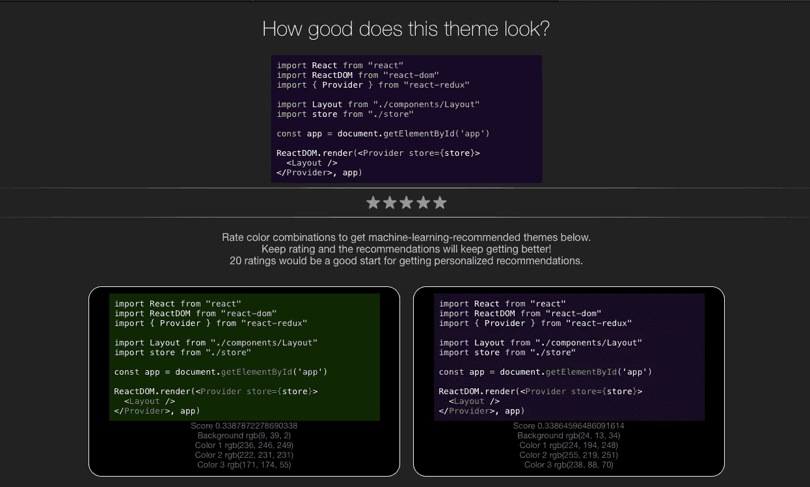

# 如何用 JavaScript 制作一个机器学习推荐系统

> 原文：<https://medium.com/hackernoon/how-to-make-a-machine-learning-recommendation-system-from-scratch-d747be801ce9>

你对机器学习及其应用感兴趣吗？如果你正在寻找学习新的和伟大的东西，机器学习推荐系统怎么样？


Photo by [Franck V.](https://unsplash.com/@franckinjapan?utm_source=medium&utm_medium=referral) on [Unsplash](https://unsplash.com?utm_source=medium&utm_medium=referral)

好吧，不要被那些庞大的术语和词汇吓到或吓到，它们只是告诉某人一些代码到底是做什么的。

机器学习总是出现在新闻中，无论是为了夺走工作还是让机器人理解并回复人类。但是我们到底能用机器学习做什么呢？

答案是，几乎一切。

> 无论人类能做什么，机器学习模型都能做得更好。

现在，在任何看到这种模型彻底失败的人开始愤怒地评论之前，让我稍微改写一下这句话。

> 无论人类能做什么，机器学习模型都能做得更好；只要有时间和努力。

好了，足够的 ML 与人类，让我们进入我们在这里做什么。所以在这里，我们将建立一个机器学习推荐系统。

## **什么是**机器学习推荐系统**？**

**推荐系统**是一个机器学习模型，它会推荐新的选项供选择，并从您之前对某个主题的操作中学习。这意味着模型会理解你的选择，并推荐你“可能”喜欢的选择。你可能见过 Spotify、网飞或亚马逊推荐的商品。这个和那个差不多，但是效率可能低一点。

## 我们到底要推荐什么？

经过一番思考后，电影和歌曲需要大量其他代码和数据，这将使学习更加困难，所以我想到了代码/文本编辑器主题。

每个人(几乎每个人)都喜欢为他们的 IDE 或文本编辑器定制主题，并花费大量时间寻找他们想要使用的主题。

这个问题就是我们在这个例子中的目标，因为它使得学习机器学习推荐系统的**概念变得容易理解，并且构成了一个在现实世界**中**可用的例子。**

## 看起来怎么样？

[**下面是它的样子**](https://zealous-sinoussi-949911.netlify.com) (为了获得最佳效果，请在私人/匿名窗口中打开它)。



现在让我们进入一些代码。我们将使用 **JavaScript、CSS 和 HTML 以及‘brain . js’**机器学习库来制作这个模型。

完整的代码可以在这个 GitHub 库中找到。

现在我们将讨论我们用来使这个模型工作的 **JavaScript** 代码。首先，让我们编写代码来实例化一些变量、库和代码，它们将构成我们网页的 UI。

```
const editorWrapper = document.querySelector(".editor-wrapper")
const colorOne = document.querySelectorAll(".color-1")
const colorTwo = document.querySelectorAll(".color-2")
const colorThree = document.querySelectorAll(".color-3")
const stars = document.querySelectorAll(".star")
const themes = document.getElementById("themes")

window.localStorage.trainingData = window.localStorage.trainingData || JSON.stringify([])

// our current voting combination
const currentColors = {
  back: {},
  one: {},
  two: {},
  three: {},
}
```

这些是我们将用来改变网页中文本颜色和主题的一些变量。

我们现在将**在网页加载时生成一个随机主题**。在这里，我们也给用户投票主题的选择，并使用该数据来推荐更多的主题，将吸引用户。

```
// kick it off by creating a random theme for you to vote on
/* 
  as you vote, saveTrainingData
  - saves to localstorage
  - runs predictThemeCombinations
*/
/*
  predictThemeCombinations
  - trains a neural network from your vote history
  - creates 100,000 random themes
  - runs the themes through the network, getting a score for each
  - sorts and returns the top 20 scored themes
*/   
generateRandomTheme()
predictThemeCombinations()
```

稍后我们将为`generateRandomTheme()`和`predictThemeCombinations()`编写代码。

此外，我们需要为明星写代码，**用户可以使用评级**的主题。我们将使它变得有点互动，当用户悬停在它上面或点击它时，它会变成金色。我们的模型会对主题进行评级，并使用这些数据来预测用户的进一步选择。

```
stars.forEach((star, i) => {
  const score = i / 4
  star.addEventListener("mouseenter", setStars.bind(setStars, i))
  star.addEventListener("mouseleave", clearStars)
  star.addEventListener("click", saveTrainingData.bind(saveTrainingData, score))
})
```

我们还将为`setStars()`和`clearStars()`功能编写代码。

现在让我们为函数`saveTrainingData()`编写代码，该函数用于**用户给主题**评分时生成的分数。这个方法根据分数保存训练数据，用它来训练我们的模型。

```
function saveTrainingData(score) {
  const data = JSON.parse(window.localStorage.trainingData)

  data.push({
    input: [
      Math.round(currentColors.back.r/2.55) / 100, // divide by 255 and round to 2 decimal places
      Math.round(currentColors.back.g/2.55) / 100,
      Math.round(currentColors.back.b/2.55) / 100,
      Math.round(currentColors.one.r/2.55) / 100,
      Math.round(currentColors.one.g/2.55) / 100,
      Math.round(currentColors.one.b/2.55) / 100,
      Math.round(currentColors.two.r/2.55) / 100,
      Math.round(currentColors.two.g/2.55) / 100,
      Math.round(currentColors.two.b/2.55) / 100,
      Math.round(currentColors.three.r/2.55) / 100,
      Math.round(currentColors.three.g/2.55) / 100,
      Math.round(currentColors.three.b/2.55) / 100,
    ],
    output: [score]
  })

  window.localStorage.trainingData = JSON.stringify(data)

  predictThemeCombinations()
  clearStars()
  generateRandomTheme()
}
```

这里我们也使用了方法`clearStars()`，如果用户没有点击页面并移开光标，**会从页面中移除星级**。

`setStars()`方法的作用与我们之前讨论的完全一样。

```
function setStars(whichStar) {
  for (let i = 0; i < stars.length; i++) {
    stars[i].classList.add("gold")
    if (i >= whichStar) {
      break;
    }
  }
}

function clearStars() {
  for (const star of stars) {
    star.classList.remove("gold")
  }
}
```

现在让我们为网页最开始使用的`generateRandomTheme()`编写代码。这个方法只是**得到一个随机的背景颜色和另外 3 个随机的颜色来设置第一个 tim** e 的主题

```
function generateRandomTheme() {
  currentColors.back = getRandomBackgroundRgb()
  currentColors.one = getRandomRgb()
  currentColors.two = getRandomRgb()
  currentColors.three = getRandomRgb()

  editorWrapper.style.background = `rgb(${currentColors.back.r},${currentColors.back.g},${currentColors.back.b})`
  for (let color of colorOne) {
    color.style.color = `rgb(${currentColors.one.r},${currentColors.one.g},${currentColors.one.b})`
  }
  for (let color of colorTwo) {
    color.style.color = `rgb(${currentColors.two.r},${currentColors.two.g},${currentColors.two.b})`
  }
  for (let color of colorThree) {
    color.style.color = `rgb(${currentColors.three.r},${currentColors.three.g},${currentColors.three.b})`
  }
}
```

以及我们上面使用的**补充方法**(如果你称它们为函数的话)。

```
function getRandomRgb() {
  return {
    r: Math.round(Math.random()*205 + 50), // number between 50 and 255
    g: Math.round(Math.random()*205 + 50),
    b: Math.round(Math.random()*205 + 50),
  }
}

function getRandomBackgroundRgb() {
  return {
    r: Math.round(Math.random()*50), // number between 0 and 50
    g: Math.round(Math.random()*50),
    b: Math.round(Math.random()*50),
  }
}
```

以及完成这一切的方法。`predictThemeCombinations()`功能使用用户喜欢的历史训练网络来获得他们可能喜欢的颜色和主题。花一些时间来理解这种方法的工作原理。很简单但是很聪明。

```
function predictThemeCombinations() {
  const data = JSON.parse(window.localStorage.trainingData)
  if (!data.length) {
    return;
  }

  themes.innerHTML = ""
  const net = new brain.NeuralNetwork({activation: "leaky-relu"});
  const results = []

  net.train(data)

  for (let i = 0; i < 100000; i++) {
    const back = getRandomBackgroundRgb()
    const one = getRandomRgb()
    const two = getRandomRgb()
    const three = getRandomRgb()
    const colors = [
      Math.round(back.r/2.55) / 100, // divide by 255 and round to 2 decimal places
      Math.round(back.g/2.55) / 100,
      Math.round(back.b/2.55) / 100,
      Math.round(one.r/2.55) / 100,
      Math.round(one.g/2.55) / 100,
      Math.round(one.b/2.55) / 100,
      Math.round(two.r/2.55) / 100,
      Math.round(two.g/2.55) / 100,
      Math.round(two.b/2.55) / 100,
      Math.round(three.r/2.55) / 100,
      Math.round(three.g/2.55) / 100,
      Math.round(three.b/2.55) / 100,
    ]

    const [ score ] = net.run(colors)
    results.push({ back, one, two, three, score})
  }
```

此外，我们有 **100，000 个结果**，我们不只是想向用户展示第一个。一个**前 20 名推荐**会更好。所以我们只是对结果进行排序，并显示其中的前 20 个结果。

```
// sort results
  const sortedResults = results.sort(function(a, b) {
    var a = a.score
    var b = b.score

    return b - a
  })

  // keep the top 20 results after sorting
  for (let i = 0; i < 20; i++) {
    addNewTheme(sortedResults[i])
  }
}
```

`addNewTheme()`？嗯，这个方法还会**包含很多 HTML，而**会有点难看。但本质上，我们只是在 HTML 组件中使用了颜色主题。

```
function addNewTheme({back, one, two, three, score}) {
  const newTheme = document.createElement("div")
  newTheme.classList.add("predicted-theme")
  newTheme.innerHTML = `
  <div class="editor-wrapper" style="background:rgb(${back.r}, ${back.g}, ${back.b})">
    <span style="color:rgb(${one.r}, ${one.g}, ${one.b})">import</span> React <span style="color:rgb(${one.r}, ${one.g}, ${one.b})">from</span> <span style="color: rgb(${two.r}, ${two.g}, ${two.b})">"react"</span><br/>
    <span style="color:rgb(${one.r}, ${one.g}, ${one.b})">import</span> ReactDOM <span style="color:rgb(${one.r}, ${one.g}, ${one.b})">from</span> <span style="color: rgb(${two.r}, ${two.g}, ${two.b})">"react-dom"</span><br/>
    <span style="color:rgb(${one.r}, ${one.g}, ${one.b})">import {</span> Provider <span style="color:rgb(${one.r}, ${one.g}, ${one.b})">} from</span> <span style="color: rgb(${two.r}, ${two.g}, ${two.b})">"react-redux"</span><br/>
    <br/>
    <span style="color:rgb(${one.r}, ${one.g}, ${one.b})">import</span> Layout <span style="color:rgb(${one.r}, ${one.g}, ${one.b})">from</span> <span style="color: rgb(${two.r}, ${two.g}, ${two.b})">"./components/Layout"</span><br/>
    <span style="color:rgb(${one.r}, ${one.g}, ${one.b})">import</span> store <span style="color:rgb(${one.r}, ${one.g}, ${one.b})">from</span> <span style="color: rgb(${two.r}, ${two.g}, ${two.b})">"./store"</span><br/>
    <br/>
    <span style="color:rgb(${one.r}, ${one.g}, ${one.b})">const</span> app<span style="color:rgb(${one.r}, ${one.g}, ${one.b})"> = </span>document.<span style="color: rgb(${three.r}, ${three.g}, ${three.b})">getElementById</span><span style="color:rgb(${one.r}, ${one.g}, ${one.b})">(</span><span style="color: rgb(${two.r}, ${two.g}, ${two.b})">'app'</span><span style="color:rgb(${one.r}, ${one.g}, ${one.b})">)</span><br/>
    <br/>
    ReactDOM.render<span style="color:rgb(${one.r}, ${one.g}, ${one.b})">(</span>&lt;<span style="color: rgb(${three.r}, ${three.g}, ${three.b})">Provider store={</span>store<span style="color: rgb(${three.r}, ${three.g}, ${three.b})">}</span>&gt;<br/>
    &nbsp;&nbsp;&lt;<span style="color: rgb(${three.r}, ${three.g}, ${three.b})">Layout </span>/&gt;<br/>
    &lt;/<span style="color: rgb(${three.r}, ${three.g}, ${three.b})">Provider</span>&gt;, app<span style="color:rgb(${one.r}, ${one.g}, ${one.b})"">)</span>
  </div>
  <li>Score ${score}</li>
  <li>Background rgb(${back.r}, ${back.g}, ${back.b})</li>
  <li>Color 1 rgb(${one.r}, ${one.g}, ${one.b})</li>
  <li>Color 2 rgb(${two.r}, ${two.g}, ${two.b})</li>
  <li>Color 3 rgb(${three.r}, ${three.g}, ${three.b})</li>
  `
  themes.appendChild(newTheme)
}
```

我有说有点丑吗？嗯，我能说什么呢…

相信我，这个方法除了在我们的前 20 个列表中设置颜色并在组件中设置它们之外什么也不做。

[**同样，完整的代码可以在这个 GitHub 资源库中找到。**](https://github.com/Pradyuman7/Theme-Recommender)

## 所以在**一言以蔽之**

我们给了用户选择背景颜色和文本颜色及其变体的选择。然后，用户对显示为主题的选项组合进行评级。我们选择了这个**选项来训练我们的模型**来呈现符合用户选择的主题。

模型简单地**制造更多用户选择的颜色组合**或相似的颜色，并以此进行训练。这让它可以为用户列出其他可能的选择。然后，我们使用排序获得前 20 个选项，并显示前 20 个。

结果呢？


假设我们是第一次在这里见面， [**我是 Pradyuman Dixit**](/m/signin?operation=register&source=profile-5b4f50298fc3-------------------------follow_profile-) ，我主要写关于**机器学习、Android 开发**，有时也写关于 **Web 开发**。

你可以在这里阅读我的其他**机器学习**帖子:

[**如何从零开始做一个简单的机器学习网站**](https://hackernoon.com/how-to-make-a-simple-machine-learning-website-from-scratch-1ae4756c8b04)

[**如何用简单的代码例子理解机器学习**](/@pradyumandixit/how-to-understand-machine-learning-with-simple-code-examples-a0508dae212b)