# 如何不用代码制作简讯生成器

> 原文：<https://medium.com/hackernoon/how-to-make-a-newsletter-generator-without-code-23ea24095347>

> [最初发布于 Makerpad](https://www.makerpad.co/make/newsletter-generator-chrome-extension)

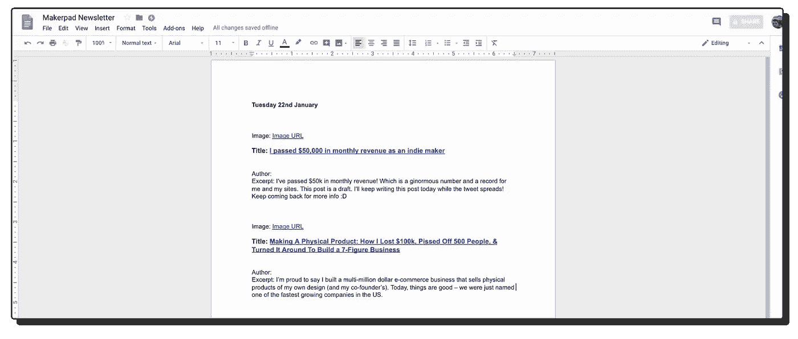

这是一个使用 Pocket Chrome 扩展的简单方法，可以让你轻松地将你在桌面和手机上看到的文章(显然是通过 Chrome 浏览器)保存到一个不断发展的[谷歌](https://hackernoon.com/tagged/google)文档中，你可以用它来填充每周/每天的[时事通讯](https://hackernoon.com/tagged/newsletter)。在我将要描述的版本中，我们将把所有条目(自动地)添加到 Airtable 中，作为一个迷你数据库和引用/添加过滤器/标签等的方式。但你可以直接跳过 Airtable 这一步，直接将 Pocket Chrome Extension 链接到 Google Docs。我将使用 Zapier 来执行这里涉及的所有自动任务。

首先，你需要下载 Pocket Chrome 扩展。拿着它快速旋转一下，看看当你转到一个网页并点击口袋图标保存页面时是什么样子。你会看到下拉菜单允许你标记东西。如果您添加的标签不在您的帐户中，它将会添加该标签。因此，让我们去标记一个测试帖子“时事通讯”。检查它进入你的口袋帐户。

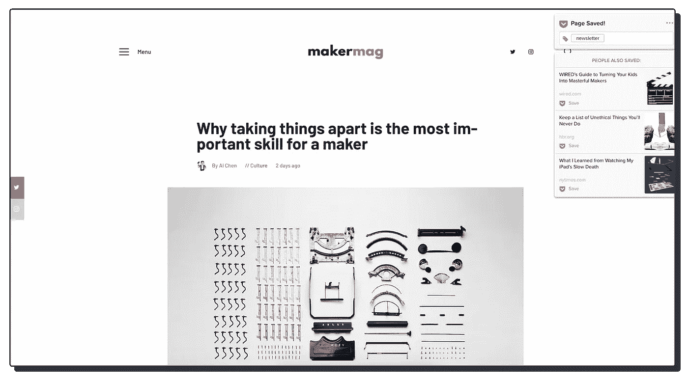

现在前往 Zapier.com(如果你还没有账户，就创建一个。)并发出 zap。从应用程序列表中选择 Pocket 开始使用。

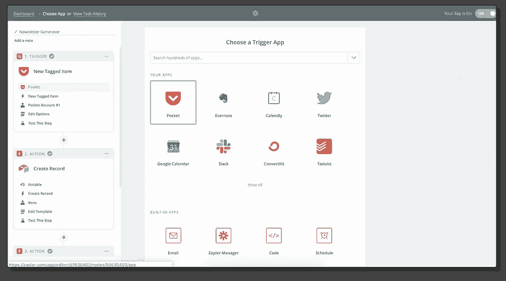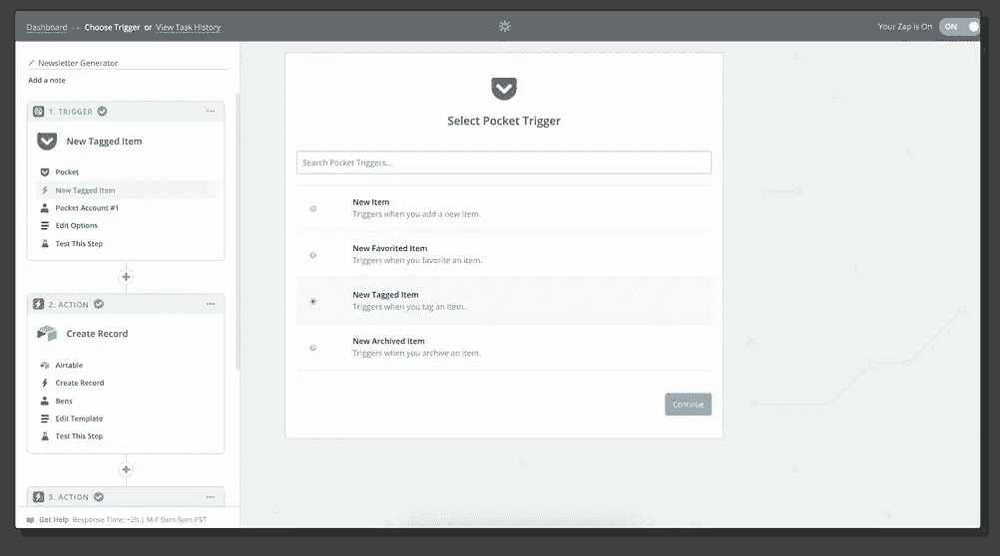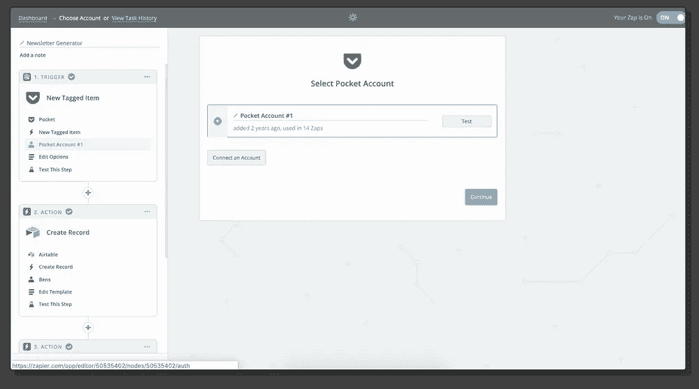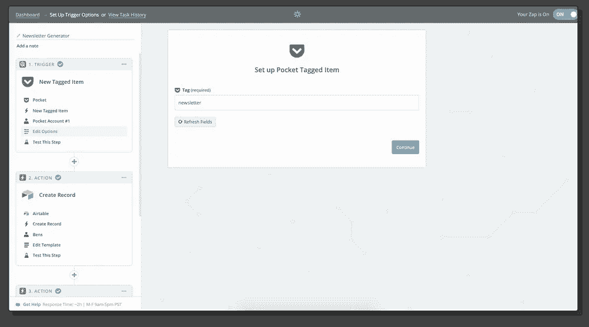

如果您不想将 Airtable 用作数据库，请直接跳过。

‍

在使用 Airtable 创建行动项之前，我们需要设置表和基础。我是这样做的:

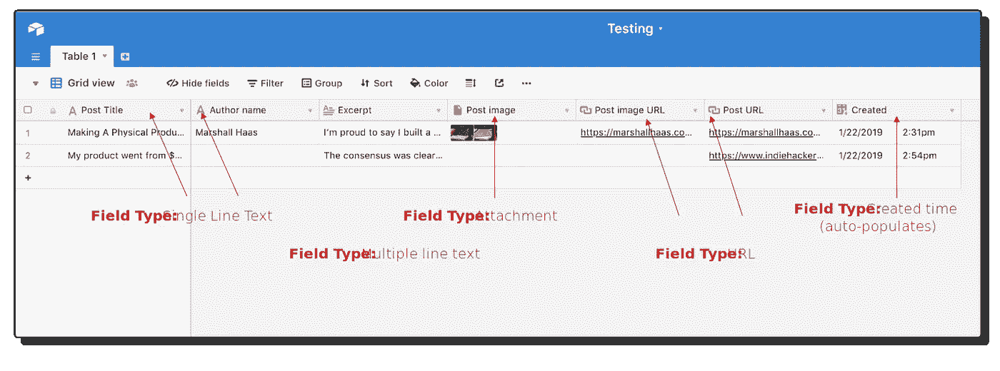

现在让我们在 Zapier 中创建我们的行动项。

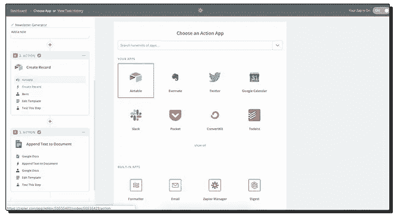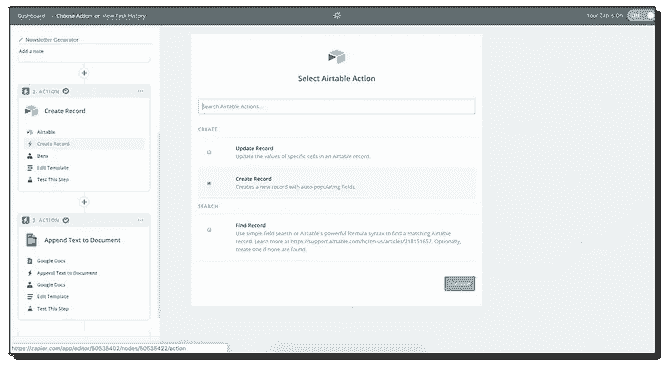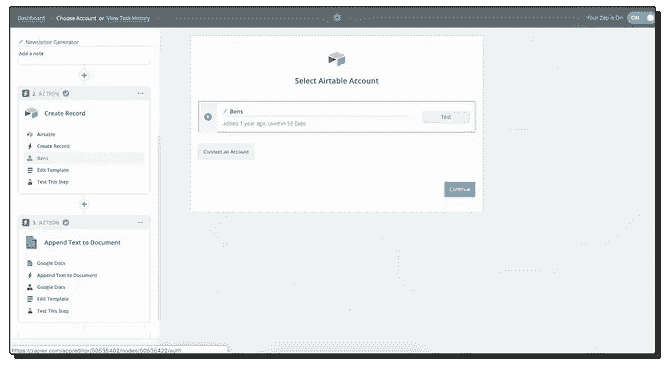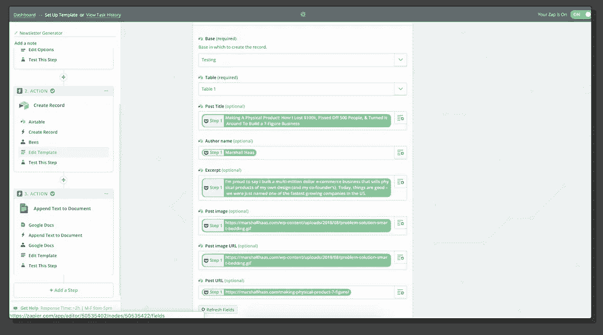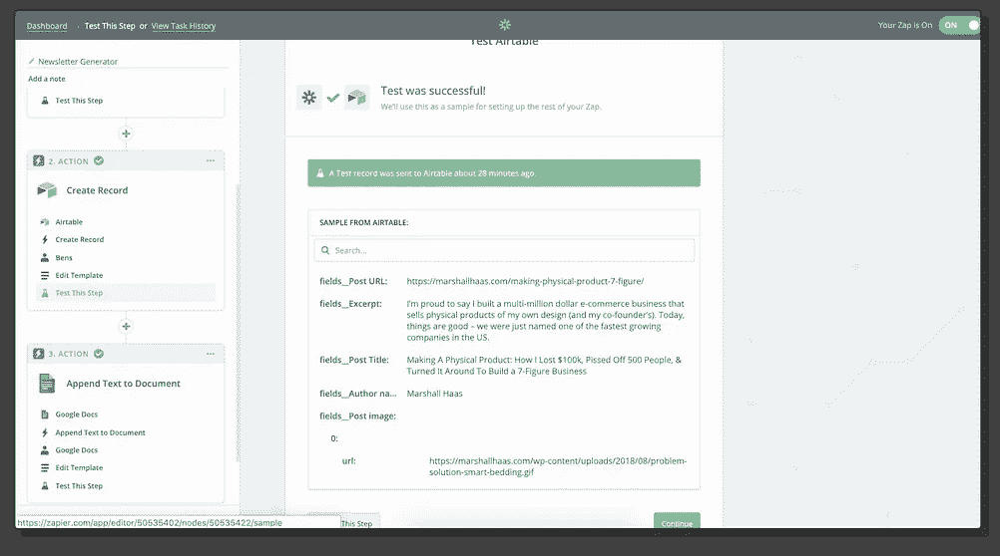

这一步是有数据的，因为之前我们对我们的口袋扩展做了一个测试。如果你没有数据，那么这就是为什么——用扩展名将一篇文章添加到你的口袋中，并使用你想为你的时事通讯捕获的标签……为了方便起见，我将一切都标记为“时事通讯”。

*附注:你可以在这里找到许多不同类型的字段。但有时当你用一篇文章来映射字段时，它不一定会翻译成在另一个平台(medium、wordpress、ghost、custom site 等)上写的另一篇文章——但只要确保你得到了基本的东西……文章标题、URL 和我喜欢的摘录。这样，你至少有一些基本信息和一个简单的方法来阅读你的文档中的文章。请看我在 Airtable 中的例子:*

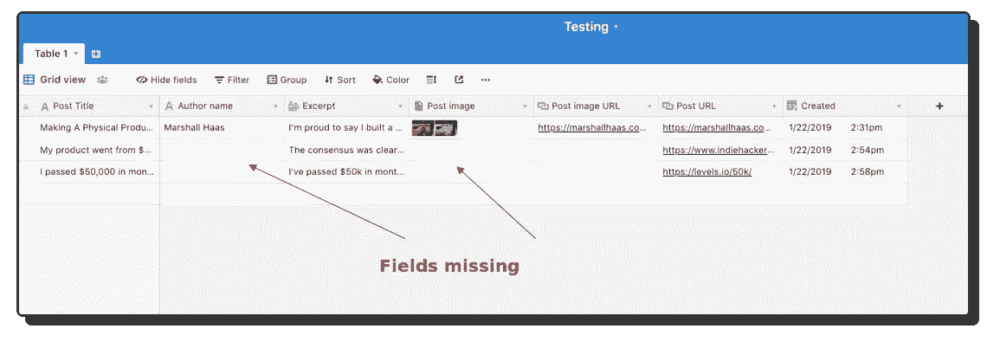

人们跳过了 Airtable…你现在可以重新开始阅读了。

让我们连接到谷歌文档！去谷歌文档上建立一个文档。

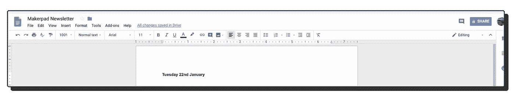

好了，你做完了。回到扎皮尔。

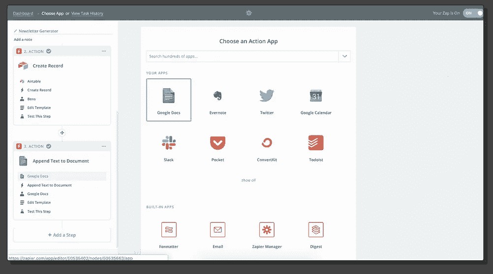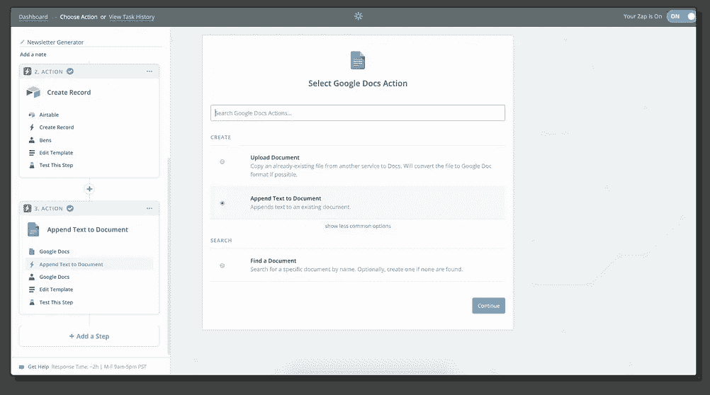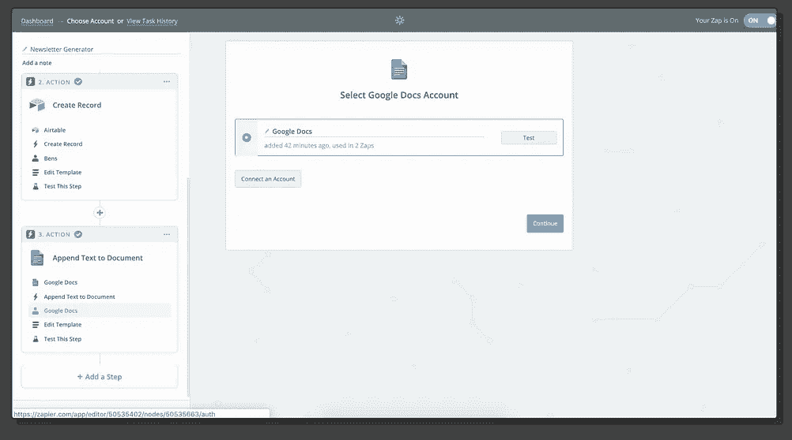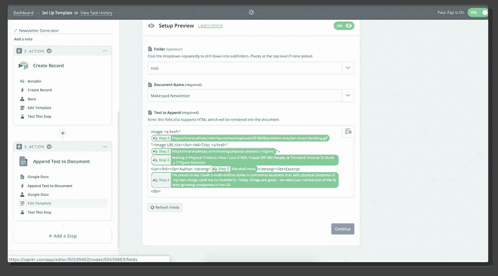

你可以在你的谷歌文档中添加你想要输入的字段，但格式只是为了让它更干净，以便扫描和以后使用。

好吧，所以要添加的文本看起来有点乱，我确实使用了一些代码。

> 图片:[图片网址](”{{Post)
> 
> #### 标题:[{ {职务标题}}](”{{Post)
> 
> 作者:**{ {作者姓名}}**
> 
> 摘录:{ {摘录}}

以下是对上述代码的解释:

所以你可以从上面看到，我对 Zapier 说把文本放在我的谷歌文档中，所以它会这样做:

**图片**:图片 url 的链接

**标题**:超链接的标题文本，也格式化为标题。

**作者**:作者姓名以粗体显示

**节选**:正文

破裂

现在你知道了！当你保存一篇文章时，它会将数据添加到 Airtable，然后将相关信息发送到我的 google doc。

## 你可以[在这里注册时事通讯](https://www.makerpad.co/#newsletter)或者[在 Twitter 上关注我](https://twitter.com/bentossell)获取更新