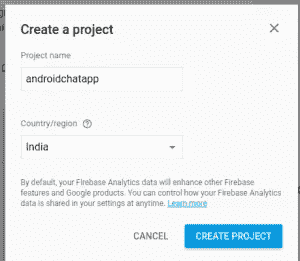
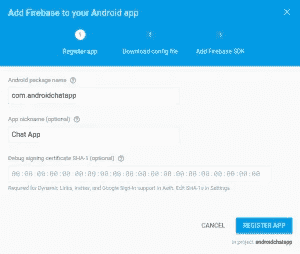
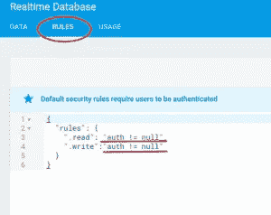
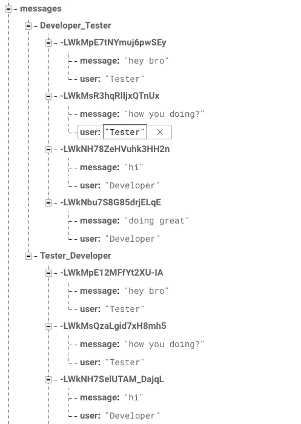
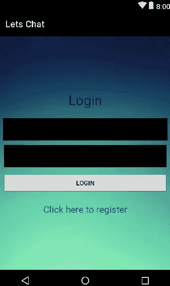

# 如何做一个像 WhatsApp 一样的个人聊天应用

> 原文：<https://medium.com/hackernoon/how-to-make-a-personal-chat-application-like-whatsapp-fda6dd4bcb5b>

让我们制作一个像 WhatsApp 一样的个人化、安全的 android 应用程序😎。

你用**WhatsApp/Facebook Messenger**吗？你对 **Java 或者安卓**感兴趣吗？你有兴趣做一个像 WhatsApp 这样的个人聊天应用吗？

如果是，那么你就在**完美地点**。


Personal Messaging app

这将是你自己的应用，没有广告，没有隐私问题，什么都没有。你几乎可以完全控制 T8。

因此，在这里我们将学习制作一个简单的聊天应用程序，它具有登录/注册功能和聊天消息实现功能，你可以发送聊天消息与你的朋友聊天。

为此，我们将使用**Firebase-real time-Database**作为后端来存储聊天记录并将其发送到其他设备。

你可以在这里找到这个应用的全部代码。

首先，让我们用一个简单的流程图来理解我们的应用**，如果我们在某一点上遇到困难，这将帮助我们。**

我们的 android 应用程序→用户注册或登录→用户可以选择他想要发送消息给的朋友→用户可以键入并发送消息→朋友将在他的设备上接收消息。

在内部，我们将消息存储在我们的数据库中，然后发送给期望的用户。

这是一个**演示用途的应用**，所以我们只会做这么多。但是你可以在应用程序中添加更多更酷的方面，一旦你完成了这些。

Firebase 提供了大量令人惊叹的工具，你可以在你的应用程序中使用，比如 **ML 工具包、实时通知等等**。

# **设置燃烧基**

首先创建一个 firebase 账号。遵循以下步骤:

这里的名字是为了演示的目的，你可以使用任何你想要的名字或头衔，随你便。

1.  从 [**这个链接**](https://firebase.google.com) 进入 firebase 网站，创建一个 Firebase 账号开始。转到 Firebase 控制台，点击“**创建新项目**”按钮创建一个新项目，如下所示。


Firebase

2.给出项目名称和您当前所在的国家，完成后点击“**创建项目**”按钮。



Project

3.在下一个屏幕中，选择“将 Firebase 添加到您的 Android 应用程序”，然后添加包细节和调试签名证书 SHA-1 密钥(如果您想要启用某些功能，如动态链接、邀请和谷歌登录等，这是必需的)。否则它是可选字段)。



Android chatting app

这将下载 google-services.json 文件。下载到你的电脑上。我们稍后会将它添加到我们的 android 应用程序中。

这是必需的，因为 Android Firebase 的默认安全规则只允许经过身份验证的用户读写。

然后单击 Firebase 菜单中的 Database 选项卡。

它显示了 **JSON 树**的根，我们将添加一个名为 listItems 的子节点，然后将在它下面添加每个项目。

当我们向 JSON 树中添加数据时，它将成为现有 JSON 结构中的一个新节点，并带有一个相关的键。

另外**复制数据库的 URL**。别忘了在下面的代码中修改它们。

您可以检查 Rules 选项卡，查看或更改在 Android Firebase 数据库上读写的安全规则。下图显示了默认设置。



Firebase rules

如果您希望对 Firebase 进行自由的未经验证的访问，您可以将这些设置更改为 true。

一旦你完成了这些，让我们创建我们的 **Android 聊天应用**，它将连接到我们刚刚创建的 **Firebase 数据库**。

既然我们几乎已经完成了 Firebase 的设置，让我们深入一些 android 代码。

首先像 android studio 一样在你的 IDE 中做一个**新的 Android 项目，并将你的第一个活动命名为 Register。**

不用说，我们这样命名这个活动，因为我们在应用程序中有更多的**活动**具有不同的功能。

将以下代码添加到您的**注册**活动中。

```
public class Register extends AppCompatActivity {
    EditText username, password;
    Button registerButton;
    String user, pass;
    TextView login;

    @Override
    protected void onCreate(Bundle savedInstanceState) {
        super.onCreate(savedInstanceState);
        setContentView(R.layout.activity_register);

        username = (EditText)findViewById(R.id.username);
        password = (EditText)findViewById(R.id.password);
        registerButton = (Button)findViewById(R.id.registerButton);
        login = (TextView)findViewById(R.id.login);

        Firebase.*setAndroidContext*(this);

        login.setOnClickListener(new View.OnClickListener() {
            @Override
            public void onClick(View v) {
                startActivity(new Intent(Register.this, Login.class));
            }
        });

        registerButton.setOnClickListener(new View.OnClickListener() {
            @Override
            public void onClick(View v) {
                user = username.getText().toString();
                pass = password.getText().toString();

                if(user.equals("")){
                    username.setError("can't be blank");
                }
                else if(pass.equals("")){
                    password.setError("can't be blank");
                }
                else if(!user.matches("[A-Za-z0-9]+")){
                    username.setError("only alphabet or number allowed");
                }
                else if(user.length()<5){
                    username.setError("at least 5 characters long");
                }
                else if(pass.length()<5){
                    password.setError("at least 5 characters long");
                }
                else {
                    final ProgressDialog pd = new ProgressDialog(Register.this);
                    pd.setMessage("Loading...");
                    pd.show();

                    String url = "https://chatapp-60323.firebaseio.com/users.json";

                    StringRequest request = new StringRequest(Request.Method.*GET*, url, new Response.Listener<String>(){
                        @Override
                        public void onResponse(String s) {
                            Firebase reference = new Firebase("https://chatapp-60323.firebaseio.com/users");

                            if(s.equals("null")) {
                                reference.child(user).child("password").setValue(pass);
                                Toast.*makeText*(Register.this, "registration successful", Toast.*LENGTH_LONG*).show();
                            }
                            else {
                                try {
                                    JSONObject obj = new JSONObject(s);

                                    if (!obj.has(user)) {
                                        reference.child(user).child("password").setValue(pass);
                                        Toast.*makeText*(Register.this, "registration successful", Toast.*LENGTH_LONG*).show();
                                    } else {
                                        Toast.*makeText*(Register.this, "username already exists", Toast.*LENGTH_LONG*).show();
                                    }

                                } catch (JSONException e) {
                                    e.printStackTrace();
                                }
                            }

                            pd.dismiss();
                        }

                    },new Response.ErrorListener(){
                        @Override
                        public void onErrorResponse(VolleyError volleyError) {
                            System.*out*.println("" + volleyError );
                            pd.dismiss();
                        }
                    });

                    RequestQueue rQueue = Volley.*newRequestQueue*(Register.this);
                    rQueue.add(request);
                }
            }
        });
    }
}
```

这段代码设置您在 firebase 数据库中的注册。

正如你可能想知道的那样， **Firebase 数据库是一个 NoSQL** ,本质上意味着，你不需要使用 SQL 查询东西。

Firebase 使用引用方法来检索和放置值。

因此，我们必须决定什么和如何使我们的数据库结构。在这里，我们还将让用户注册并使用自定义用户名和密码登录，因此我们也要记住这一点。

我为这个应用程序设计的数据库结构是基于简单性。我们将身份验证细节保存在名为“users”的父节点中，将消息保存在另一个名为“messages”的父节点中。

在内部消息中，我们也通过用户名的顺序来跟踪谁给谁发了消息。

所以在图像中，**这个结构看起来就像这个**一样。

> **用于认证:**


Users database structure

> **用于消息传递:**



Messages database structure

请记住，**这是一个用于教程目的的演示应用**，所以在这里我没有使用任何方法来保持这个安全。但是使用 Firebase 可以使它变得非常安全，你可以在自己完成构建之后再这样做。

让我们再次回到我们的 android 代码。所以是的，错误。

在 register 活动中添加代码后，您是否在项目中看到了错误和大量红线？

别担心，我不是在炫耀什么。错误将会消失。

首先让我们添加我们的**依赖关系**。你可能还想将你的应用程序连接到你创建的 firebase 帐户。

要将其连接到您的 firebase 项目，**进入工具→ Firebase →实时数据库→保存和检索数据→将您的应用程序连接到 Firebase。**

只需再次登录并选择您的项目，它应该会连接。您可能还想在同一个选项卡中执行其他步骤，例如将数据库添加到您的应用程序中。

或者，你可以只复制粘贴**这些依赖集**在你的项目的模块 app 中。

```
dependencies {
    implementation fileTree(dir: 'libs', include: ['*.jar'])
    implementation 'com.android.support:appcompat-v7:28.0.0'
    implementation 'com.firebase:firebase-client-android:2.5.2'
    implementation 'com.android.volley:volley:1.0.0'
    implementation 'com.android.support.constraint:constraint-layout:1.1.3'
    implementation 'com.google.firebase:firebase-database:16.0.5'
    implementation 'com.google.firebase:firebase-auth:16.1.0'
    testImplementation 'junit:junit:4.12'
    androidTestImplementation 'com.android.support.test:runner:1.0.2'
    androidTestImplementation 'com.android.support.test.espresso:espresso-core:3.0.2'
}
```

现在，**只要在错误上按 alt+Enter，大多数错误就会消失**。随着我们的进展，其他人也会这样做。

让我们添加**登录**活动代码，看起来像这样:

```
public class Login extends AppCompatActivity {
    TextView registerUser;
    EditText username, password;
    Button loginButton;
    String user, pass;

    @Override
    protected void onCreate(Bundle savedInstanceState) {
        super.onCreate(savedInstanceState);
        setContentView(R.layout.activity_login);

        registerUser = findViewById(R.id.register);
        username = findViewById(R.id.username);
        password = findViewById(R.id.password);
        loginButton = findViewById(R.id.loginButton);

        registerUser.setOnClickListener(new View.OnClickListener() {
            @Override
            public void onClick(View v) {
                startActivity(new Intent(Login.this, Register.class));
            }
        });

        loginButton.setOnClickListener(new View.OnClickListener() {
            @Override
            public void onClick(View v) {
                user = username.getText().toString();
                pass = password.getText().toString();

                if(user.equals("")){
                    username.setError("can't be blank");
                }
                else if(pass.equals("")){
                    password.setError("can't be blank");
                }
                else{
                    String url = "https://chatapp-60323.firebaseio.com/users.json";
                    final ProgressDialog pd = new ProgressDialog(Login.this);
                    pd.setMessage("Loading...");
                    pd.show();

                    StringRequest request = new StringRequest(Request.Method.*GET*, url, new Response.Listener<String>(){
                        @Override
                        public void onResponse(String s) {
                            if(s.equals("null")){
                                Toast.*makeText*(Login.this, "user not found", Toast.*LENGTH_LONG*).show();
                            }
                            else{
                                try {
                                    JSONObject obj = new JSONObject(s);

                                    if(!obj.has(user)){
                                        Toast.*makeText*(Login.this, "user not found", Toast.*LENGTH_LONG*).show();
                                    }
                                    else if(obj.getJSONObject(user).getString("password").equals(pass)){
                                        UserDetails.*username* = user;
                                        UserDetails.*password* = pass;
                                        startActivity(new Intent(Login.this, Users.class));
                                    }
                                    else {
                                        Toast.*makeText*(Login.this, "incorrect password", Toast.*LENGTH_LONG*).show();
                                    }
                                } catch (JSONException e) {
                                    e.printStackTrace();
                                }
                            }

                            pd.dismiss();
                        }
                    },new Response.ErrorListener(){
                        @Override
                        public void onErrorResponse(VolleyError volleyError) {
                            System.*out*.println("" + volleyError);
                            pd.dismiss();
                        }
                    });

                    RequestQueue rQueue = Volley.*newRequestQueue*(Login.this);
                    rQueue.add(request);
                }

            }
        });
    }
}
```

我们现在还可以添加我们的**聊天**活动代码，这将是聊天被看到的地方。

```
public class Chat extends AppCompatActivity {
    LinearLayout layout;
    RelativeLayout layout_2;
    ImageView sendButton;
    EditText messageArea;
    ScrollView scrollView;
    Firebase reference1, reference2;

    @Override
    protected void onCreate(Bundle savedInstanceState) {
        super.onCreate(savedInstanceState);
        setContentView(R.layout.activity_chat);

        layout = findViewById(R.id.layout1);
        layout_2 = findViewById(R.id.layout2);
        sendButton = findViewById(R.id.sendButton);
        messageArea = findViewById(R.id.messageArea);
        scrollView = findViewById(R.id.scrollView);

        Firebase.*setAndroidContext*(this);
        reference1 = new Firebase("https://chatapp-60323.firebaseio.com/messages/" + UserDetails.*username* + "_" + UserDetails.*chatWith*);
        reference2 = new Firebase("https://chatapp-60323.firebaseio.com/messages/" + UserDetails.*chatWith* + "_" + UserDetails.*username*);

        sendButton.setOnClickListener(new View.OnClickListener() {
            @Override
            public void onClick(View v) {
                String messageText = messageArea.getText().toString();

                if(!messageText.equals("")){
                    Map<String, String> map = new HashMap<String, String>();
                    map.put("message", messageText);
                    map.put("user", UserDetails.*username*);
                    reference1.push().setValue(map);
                    reference2.push().setValue(map);
                    messageArea.setText("");
                }
            }
        });

        reference1.addChildEventListener(new ChildEventListener() {
            @Override
            public void onChildAdded(DataSnapshot dataSnapshot, String s) {
                Map map = dataSnapshot.getValue(Map.class);
                String message = map.get("message").toString();
                String userName = map.get("user").toString();

                if(userName.equals(UserDetails.*username*)){
                    addMessageBox(message, 1);
                }
                else{
                    addMessageBox(message, 2);
                }
            }

            @Override
            public void onChildChanged(DataSnapshot dataSnapshot, String s) {

            }

            @Override
            public void onChildRemoved(DataSnapshot dataSnapshot) {

            }

            @Override
            public void onChildMoved(DataSnapshot dataSnapshot, String s) {

            }

            @Override
            public void onCancelled(FirebaseError firebaseError) {

            }
        });
    }

    public void addMessageBox(String message, int type){
        TextView textView = new TextView(Chat.this);
        textView.setText(message);

        LinearLayout.LayoutParams lp2 = new LinearLayout.LayoutParams(ViewGroup.LayoutParams.*WRAP_CONTENT*, ViewGroup.LayoutParams.*WRAP_CONTENT*);
        lp2.weight = 7.0f;

        if(type == 1) {
            lp2.gravity = Gravity.*LEFT*;
            textView.setBackgroundResource(R.drawable.bubble_in);
        }
        else{
            lp2.gravity = Gravity.*RIGHT*;
            textView.setBackgroundResource(R.drawable.bubble_out);
        }
        textView.setLayoutParams(lp2);
        layout.addView(textView);
        scrollView.fullScroll(View.*FOCUS_DOWN*);
    }
}
```

此外，在该活动中，我们将看到该应用程序的**用户**列表。

```
public class Users extends AppCompatActivity {
    ListView usersList;
    TextView noUsersText;
    ArrayList<String> al = new ArrayList<>();
    int totalUsers = 0;
    ProgressDialog pd;

    @Override
    protected void onCreate(Bundle savedInstanceState) {
        super.onCreate(savedInstanceState);
        setContentView(R.layout.activity_users);

        usersList = (ListView)findViewById(R.id.usersList);
        noUsersText = (TextView)findViewById(R.id.noUsersText);

        pd = new ProgressDialog(Users.this);
        pd.setMessage("Loading...");
        pd.show();

        String url = "https://chatapp-60323.firebaseio.com/users.json";

        StringRequest request = new StringRequest(Request.Method.*GET*, url, new Response.Listener<String>(){
            @Override
            public void onResponse(String s) {
                doOnSuccess(s);
            }
        },new Response.ErrorListener(){
            @Override
            public void onErrorResponse(VolleyError volleyError) {
                System.*out*.println("" + volleyError);
            }
        });

        RequestQueue rQueue = Volley.*newRequestQueue*(Users.this);
        rQueue.add(request);

        usersList.setOnItemClickListener(new AdapterView.OnItemClickListener() {
            @Override
            public void onItemClick(AdapterView<?> parent, View view, int position, long id) {
                UserDetails.*chatWith* = al.get(position);
                startActivity(new Intent(Users.this, Chat.class));
            }
        });
    }

    public void doOnSuccess(String s){
        try {
            JSONObject obj = new JSONObject(s);

            Iterator i = obj.keys();
            String key = "";

            while(i.hasNext()){
                key = i.next().toString();

                if(!key.equals(UserDetails.*username*)) {
                    al.add(key);
                }

                totalUsers++;
            }

        } catch (JSONException e) {
            e.printStackTrace();
        }

        if(totalUsers <=1){
            noUsersText.setVisibility(View.*VISIBLE*);
            usersList.setVisibility(View.*GONE*);
        }
        else{
            noUsersText.setVisibility(View.*GONE*);
            usersList.setVisibility(View.*VISIBLE*);
            usersList.setAdapter(new ArrayAdapter<String>(this, android.R.layout.*simple_list_item_1*, al));
        }

        pd.dismiss();
    }
}
```

现在让我们制作一个**简单的 Java** 类来帮助以更好的方式获取细节，即:

```
public class UserDetails {
    static String *username* = "";
    static String *password* = "";
    static String *chatWith* = "";
}
```

是的，我们都完成了我们的应用程序…

哦，等等，你还是会出错？

这不应该发生，我不知道哪里出错了…

不，只是开玩笑😆

我们还没有添加 UI 代码，这也可能是错误的陈述。

所以让我们先为 register 活动添加 **UI 代码。**

```
<?xml version="1.0" encoding="utf-8"?>
<LinearLayout xmlns:android="http://schemas.android.com/apk/res/android"
    xmlns:tools="http://schemas.android.com/tools"
    android:layout_width="match_parent"
    android:layout_height="match_parent"
    android:background="@drawable/back"
    android:paddingBottom="@dimen/activity_vertical_margin"
    android:paddingLeft="@dimen/activity_horizontal_margin"
    android:paddingRight="@dimen/activity_horizontal_margin"
    android:paddingTop="@dimen/activity_vertical_margin"
    tools:context="com.pd.chatapp.Register"
    android:orientation="vertical"
    android:gravity="center">

    <TextView
        android:layout_width="match_parent"
        android:layout_height="wrap_content"
        android:text="@string/register"
        android:textSize="30sp"
        android:gravity="center"
        android:layout_marginBottom="20dp"/>

    <EditText
        android:id="@+id/username"
        android:layout_width="365dp"
        android:layout_height="49dp"
        android:layout_marginBottom="10dp"
        android:background="#000000"
        android:hint="@string/enter_username"
        android:inputType="text"
        android:maxLines="1"
        android:textColor="#ffffff" />

    <EditText
        android:id="@+id/password"
        android:layout_width="363dp"
        android:layout_height="50dp"
        android:layout_marginBottom="10dp"
        android:background="#000000"
        android:hint="@string/enter_password"
        android:inputType="textPassword"
        android:maxLines="1"
        android:textColor="#ffffff" />

    <Button
        android:layout_width="match_parent"
        android:layout_height="wrap_content"
        android:text="@string/register"
        android:id="@+id/registerButton"
        android:layout_marginBottom="20dp"/>

    <TextView
        android:layout_width="match_parent"
        android:layout_height="wrap_content"
        android:text="@string/click_here_to_login"
        android:textSize="20sp"
        android:gravity="center"
        android:id="@+id/login"/>

</LinearLayout>
```

参加**聊天**活动。

```
<?xml version="1.0" encoding="utf-8"?>
<LinearLayout xmlns:android="http://schemas.android.com/apk/res/android"
    xmlns:tools="http://schemas.android.com/tools"
    android:layout_width="match_parent"
    android:layout_height="match_parent"
    android:background="@drawable/back"
    android:paddingBottom="@dimen/activity_vertical_margin"
    android:paddingLeft="@dimen/activity_horizontal_margin"
    android:paddingRight="@dimen/activity_horizontal_margin"
    android:paddingTop="@dimen/activity_vertical_margin"
    android:orientation="vertical"
    tools:context="com.pd.chatapp.Chat">

    <ScrollView
        android:layout_width="match_parent"
        android:layout_weight="20"
        android:layout_height="0dp"
        android:id="@+id/scrollView">
        <RelativeLayout xmlns:android="http://schemas.android.com/apk/res/android"
            android:id="@+id/layout2"
            android:layout_width="match_parent"
            android:layout_height="wrap_content">
            <LinearLayout
                android:layout_width="match_parent"
                android:layout_height="wrap_content"
                android:orientation="vertical"
                android:id="@+id/layout1">
            </LinearLayout>
        </RelativeLayout>
    </ScrollView>

    <include
        layout="@layout/message_place"
        android:layout_width="match_parent"
        android:layout_height="wrap_content"
        android:gravity="bottom"
        android:layout_marginTop="5dp"/>
</LinearLayout>
```

也为了我们的**登录**活动。

```
<?xml version="1.0" encoding="utf-8"?>
<LinearLayout xmlns:android="http://schemas.android.com/apk/res/android"
    xmlns:tools="http://schemas.android.com/tools"
    android:layout_width="match_parent"
    android:layout_height="match_parent"
    android:paddingBottom="@dimen/activity_vertical_margin"
    android:paddingLeft="@dimen/activity_horizontal_margin"
    android:paddingRight="@dimen/activity_horizontal_margin"
    android:background="@drawable/back"
    android:paddingTop="@dimen/activity_vertical_margin"
    tools:context="com.pd.chatapp.Login"
    android:orientation="vertical"
    android:gravity="center">

    <TextView
        android:layout_width="match_parent"
        android:layout_height="wrap_content"
        android:layout_marginBottom="20dp"
        android:gravity="center"
        android:text="@string/login"
        android:textSize="30sp" />

    <EditText
        android:id="@+id/username"
        android:layout_width="362dp"
        android:layout_height="49dp"
        android:layout_marginBottom="10dp"
        android:background="#000000"
        android:hint="@string/enter_username"
        android:inputType="text"
        android:maxLines="1"
        android:textColor="#ffffff" />

    <EditText
        android:id="@+id/password"
        android:layout_width="358dp"
        android:layout_height="49dp"
        android:layout_marginBottom="10dp"
        android:background="#000000"
        android:hint="@string/enter_password"
        android:inputType="textPassword"
        android:maxLines="1"
        android:textColor="#ffffff" />

    <Button
        android:id="@+id/loginButton"
        android:layout_width="match_parent"
        android:layout_height="wrap_content"
        android:layout_marginBottom="20dp"
        android:text="@string/login" />

    <TextView
        android:layout_width="match_parent"
        android:layout_height="wrap_content"
        android:text="@string/click_here_to_register"
        android:textSize="20sp"
        android:gravity="center"
        android:id="@+id/register"/>

</LinearLayout>
```

还有别忘了**用户位**活动。

```
<?xml version="1.0" encoding="utf-8"?>
<LinearLayout xmlns:android="http://schemas.android.com/apk/res/android"
    xmlns:tools="http://schemas.android.com/tools"
    android:layout_width="match_parent"
    android:layout_height="match_parent"
    android:paddingBottom="@dimen/activity_vertical_margin"
    android:paddingLeft="@dimen/activity_horizontal_margin"
    android:paddingRight="@dimen/activity_horizontal_margin"
    android:paddingTop="@dimen/activity_vertical_margin"
    tools:context="com.pd.chatapp.Users"
    android:orientation="vertical">

    <TextView
        android:layout_width="match_parent"
        android:layout_height="wrap_content"
        android:text="@string/no_users_found"
        android:id="@+id/noUsersText"
        android:visibility="gone"/>

    <ListView
        android:layout_width="match_parent"
        android:layout_height="wrap_content"
        android:id="@+id/usersList"/>
</LinearLayout>
```

同样为了更好的观看，我们在一个不同的布局文件中制作了消息区域。因此，创建一个新的 xml 文件，名为 **message_place.xml** 。

并向其中添加以下代码。

```
<?xml version="1.0" encoding="utf-8"?>
<LinearLayout xmlns:android="http://schemas.android.com/apk/res/android"
    android:layout_width="match_parent"
    android:layout_height="match_parent"
    android:gravity="bottom"
    android:orientation="horizontal">

    <EditText
        android:layout_width="match_parent"
        android:layout_height="wrap_content"
        android:layout_weight="1"
        android:textColorHint="#CFD8DC"
        android:textColor="#CFD8DC"
        android:hint="@string/write_a_message"
        android:id="@+id/messageArea"
        android:maxHeight="80dp"
        />

    <ImageView
        android:layout_width="match_parent"
        android:layout_height="wrap_content"
        android:layout_weight="4"
        android:padding="4dp"
        android:src="@android:drawable/ic_menu_send"
        android:id="@+id/sendButton"/>
</LinearLayout>
```

**什么？你仍然得到一些错误？**

不要担心，那是因为你遗漏了背景和我们使用过的其他图像或资源。你可以在我的 GitHub 账户库中找到它们。

[**app 的源代码**。](https://github.com/Pradyuman7/LetsChat)

地狱，是的！现在**我们真的完全完成了**。完全完成的应用程序应该会出现这样的屏幕:



Android app

让一切**都值得努力**，对吗？

现在你还在等什么？**使用自己的应用程序**与朋友聊天。

**去炫耀吧！！**

[**阅读我之前的帖子，关于从头开始制作一个机器学习 android 游戏。**](https://hackernoon.com/how-to-make-a-machine-learning-android-game-from-scratch-82d9406a7635)