# 如何做一个没有月租费的销售漏斗

> 原文：<https://medium.com/hackernoon/how-to-make-a-sales-funnel-without-monthly-fees-64a532e97640>

Photo credit unsplash.com/@imchenyf

如果你想开始在网上销售数码产品，我专门为你写了这篇文章。我知道外面有很多选择，但是你必须为它们支付月费。这里有一个适合初学者的方法，可以用最少的成本在网上销售数码产品，而且不需要编码。

有这么多让你咬牙切齿的销售行话和术语，为什么我们不以一种更友好的方式重新定义销售漏斗呢？你喜欢以物易物吗？我们可以从这个开始。销售漏斗是当代千禧年时代的易货方法。

虚拟易货:访问者的注意力和自助的电子邮件地址，感觉良好的有组织的知识。

销售漏斗也被称为点击漏斗。当你听到销售漏斗时，你首先想到的是一端比另一端窄的圆柱形塑料锥体吗？点击漏斗怎么样？你看到了什么？我看到雅达利游戏 [Tempest](https://www.atari.com/games/tempest-4000/) 通过黑色隧道点击霓虹色粒子。

好吧，也许销售人员之间需要销售词汇来交流知识，但消费者需要吗？如果你想从我这里买东西，你是在我的销售漏斗中还是我们已经建立了某种融洽的关系？

让我们直奔主题吧。如果我想卖一个数码产品，你想在网上数百万的数码产品中购买我的数码产品，你怎么找到我？说起来容易做起来难。

对于网上销售数码产品的初学者，这里有一个概述。我必须建立我的产品的存在，价值和沟通，才能在网上找到你。实际上，更像是让你更容易找到我的产品。请注意我是如何提到三个要素的。请允许我详细说明。

1.  **存在** —应有固定的位置，容易到达，包含可用于货币交易的产品的内容、细节和价格。这意味着允许项目交易。
2.  **价值**——应该有一个关于产品包含什么、提供什么、允许你做什么或不做什么的信息表示，最好有证据来源。
3.  **沟通** —应广泛传播产品存在和价值中注明的信息。这是针对目标产品用户的信息。

在这篇文章中，我将关注如何建立你的数字产品的价值交换。最重要的是，它将使用没有月费的工具。理所当然，在线托管任何网站都会产生一些相关费用，所以你需要自己的网站。我不知道你是怎么想的，但是如果我建立了一些东西，我讨厌每月支付费用来维持它的运行。

本节将涵盖融洽关系的建立、价值交换或所谓的销售漏斗。以下是销售漏斗的主要组成部分，包括描述:

1.  **网站** —潜在客户可以找到你的地方
2.  **登陆页面** —您的提议和优惠
3.  **邮箱注册** —初始值兑换
4.  **点滴活动** —与附加价值建立融洽关系
5.  **货币交易**——为你的专业知识获得报酬

对各部分的解释如下。一个网站需要有一个公共域名和访问服务器，允许你上传软件，如 WordPress。

目标页面是潜在客户对您的产品产生初步兴趣后到达的地方。该页面将包含说服潜在客户的任何细节，并允许主要通过电子邮件与您进一步沟通，因为他们对您提供的内容感兴趣。

如果你的提议没有夸大其词地得到了潜在客户的电子邮件地址，那么干得好。如今，你的简短的 2 页彩色 PDF，每周简讯，或垃圾邮件的虚拟礼物不会让你觉得有权获得某人的合法电子邮件地址。普通的登录页面读者足够聪明，在忍受了多年的垃圾邮件后不会放弃他们宝贵的收件箱。这部分应该是高度有针对性的，为你的利基增长你的电子邮件列表。

滴滴出行，这是另一个愚蠢的术语，是你的潜在客户成为销售线索的地方。我们称之为电子邮件活动。您应该在这里发送电子邮件，向您的销售线索提供更多价值。信任是赢得的，融洽不是免费的(注意)。从你发送的电子邮件中，你正在建立领导对你的信任。打破这种信任，你就没有销售！

作为现实生活中的一个销售类比，想象一个陌生人走近你，他们问的第一个问题是你是否想买一本他们写的练习本。除非你知道这本书如何具体地帮助你，并且先读几章，否则你不会买。

最后但不是最后一步是获得最终的价值交换；钱！我们希望领导为我们提供的帮助支付报酬。销售线索变成了客户。因此，即使我们的电子邮件免费赠送了 50%的产品，我们也应该已经建立了足够的信任和渴望来获得销售线索。

现在让我们从技术角度出发，开始构建。以下是我将带你建立你自己的价值交换系统的步骤。从 WordPress 开始，免费工具将会在适当的地方使用，WordPress 是一个已经存在多年的软件系统，已经成熟并被广泛采用。这是我们能够保持低开支的原因之一。

这些步骤的概要是:

*   服务器托管
*   WordPress 安装
*   WordPress 主题
*   电子邮件选择加入插件
*   电子邮件消息活动插件
*   电子商务销售插件
*   商户支付处理器

从任何地方，任何人，我不在乎你选择谁，只要他们有 cpanel 和 QuickInstall，对你来说会更容易。通过位于 cpanel 的 QuickInstall，你可以选择使用你的电子邮件地址和域名来安装 WordPress。

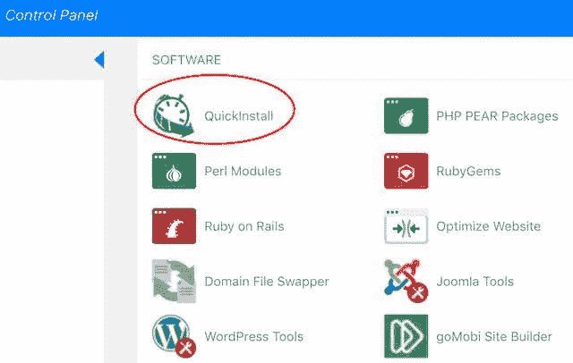

Many shared web hosting companies have Cpanel and Quickinstall. VPSs do not.

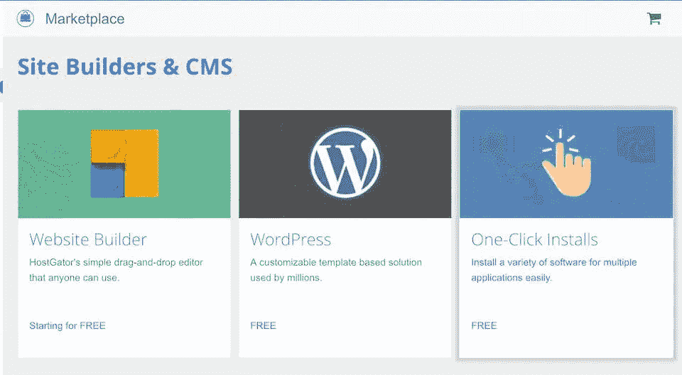

Cpanel installers. The one-click installs are a lie.

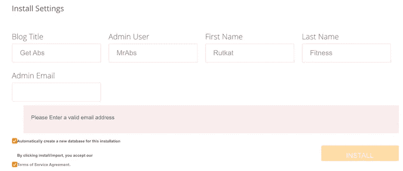

See? That has to be about 99 clicks there to install.

一旦你收到来自 WordPress CMS 的确认邮件，登录，你将进入仪表板页面。为了安全起见，请确保您安装了最新的 WordPress core。根据 WordPress 的说法，这种更新可能每天都有。开个玩笑，不过好像是。然后你会想要禁用所有那些假装免费，但实际上并不免费的膨胀插件。我也卸载它们，这是另一个安全提示。

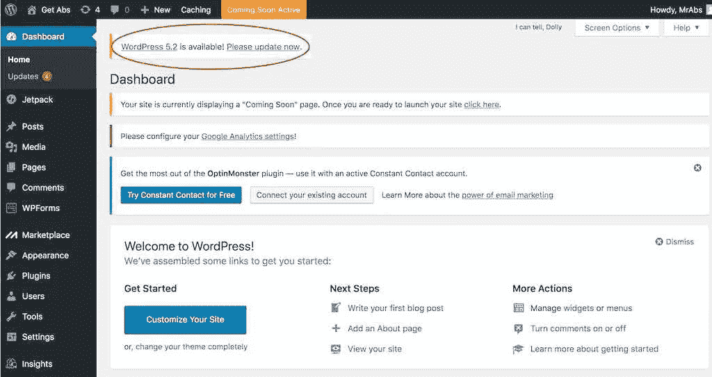

Get the latest WordPress version core or it will be hacked.

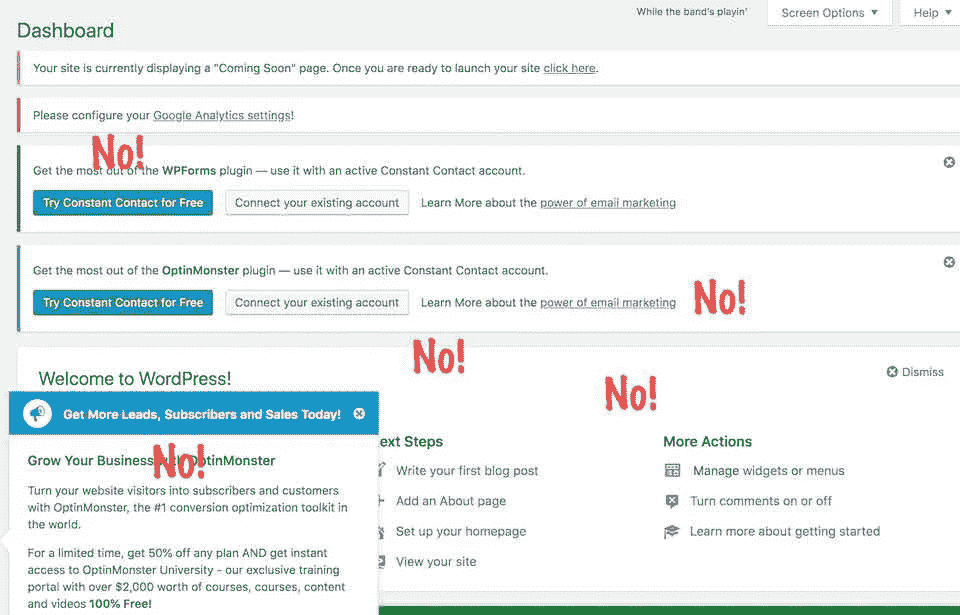

Default plug-ins trying to sink their teeth into your wallet.

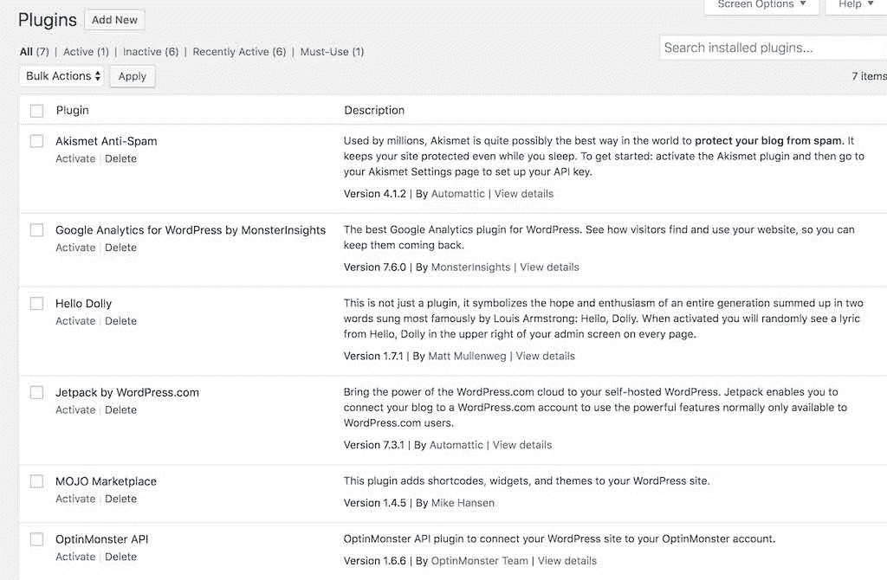

Deactivate and delete the plugins shown. They are unnecessary.

接受一个预装的默认主题，不要成为业余爱好者。走出去，找到更吸引人的东西。你可以查看[themeforest.net](https://themeforest.net/)的许多主题，如果你是注册用户，包括每月一个免费主题。我也用它们。在安装了令人愉快的新主题后，先不要太兴奋。你应该通过设置来自定义主题，这样你的网站可以是独一无二的。如果你很懒，只是想测试一下，上传你自己的 logo 并至少发布一个帖子应该是最起码的。

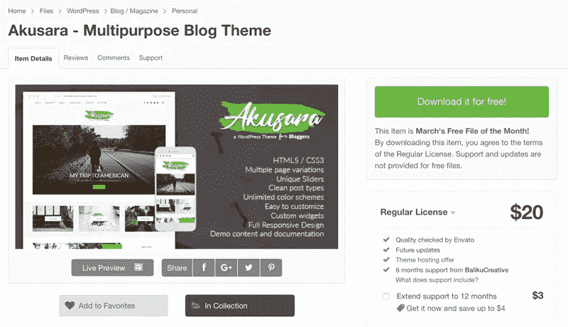

I got this premium theme free from themeforest. It’s mediocre quality.

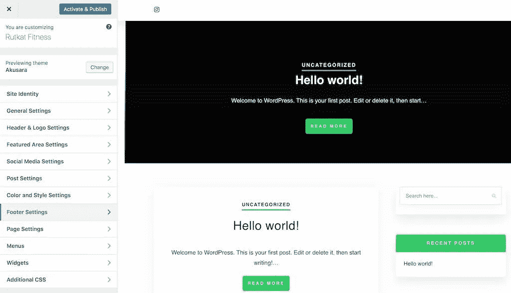

Upload your premium theme by FTP or using the build-in uploder

**电子邮件选择插件** 从这里我们将需要一个高级插件。这个插件的功能非常惊人。你可以像使用 [MailChimp](https://mailchimp.com/) 、 [Constant Contact](https://constantcontact.com/) 、 [Get Response](https://getresponse.com/) 、 [Aweber](https://aweber.com/) 等一样获得分析。那些服务商很有钱。我没有。你可能会惊讶地发现 [Mailster](https://codecanyon.net/item/mailster-email-newsletter-plugin-for-wordpress/3078294) 是一个每月 0 美元的大数目。以下是你将从一个高级插件中获得的一些特性，这个插件是我个人购买的，但并不附属于它:

*   html 电子邮件模板
*   个性化的高 dpi 徽标
*   电子邮件 mx 记录验证
*   跟踪电子邮件打开
*   电子邮件通知
*   导入/导出订户
*   克朗·乔布斯

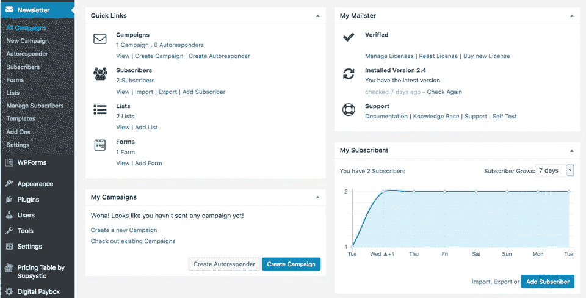

The Mailster plugin menu and dashboard.

这个插件不是免费的，但是它完全值得一次性购买。获得并安装插件后。您需要对其进行配置。下面是截图:

1.  创建列表
2.  创建一个表单，设置列表选项和双选入
3.  为双重选择加入创建订阅的感谢页面
4.  点击使用它！按钮并复制短代码[newsletter_signup_form id=1]以用于您的登录页面。(小部件和 iframe 可用)
5.  创建活动自动回复

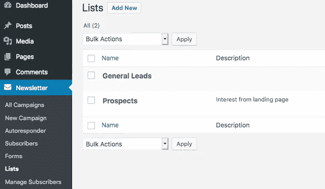

1\. Create a subscriber list and name it.

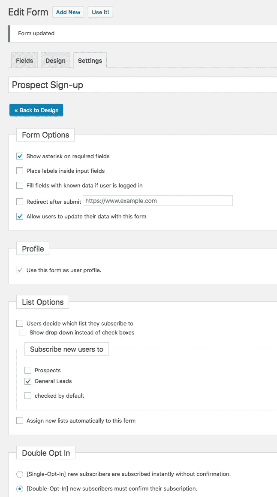

2\. Create a form and set the options shown in the screenshot.

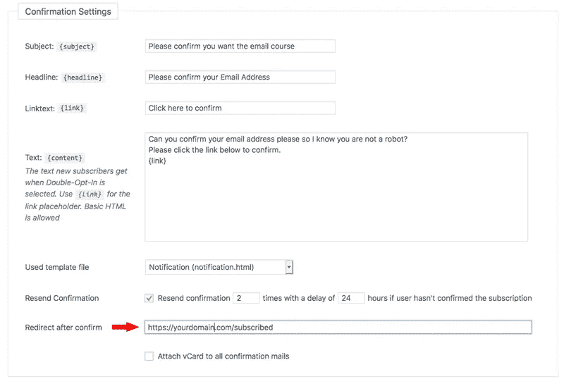

3\. Enter your “thank you” page url at the bottom of form settings.

4\. The button settings and shortcode when you click Use It! at the top of form settings.

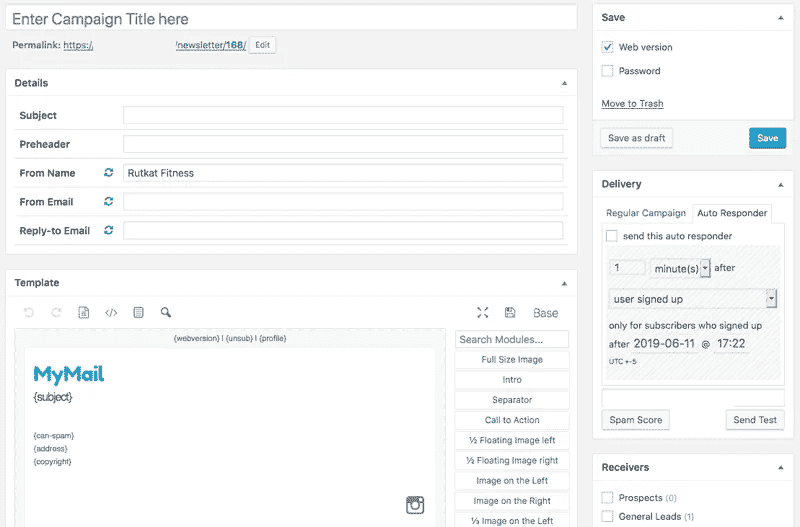

5\. A new autoresponder requires a campaign form as shown here.

电子邮件活动是您将定期发送给您的潜在客户列表的电子邮件。自动回复邮件是访问者在您的登录页面注册后，您希望在一段时间后通过电子邮件发送出去的邮件。创建新的自动回复邮件会打开新的活动表单。两者的区别在于，自动回复器对要发送的消息有两个触发器；事件触发器和时间段触发器。活动仅在特定时间段触发。

*这部分需要好的策略*,因为此时你已经赢得了潜在客户的电子邮件地址，将他们转化为销售线索。使用双重选择加入方法，可以验证电子邮件地址。现在来决定你应该发送多少封自动回复邮件。

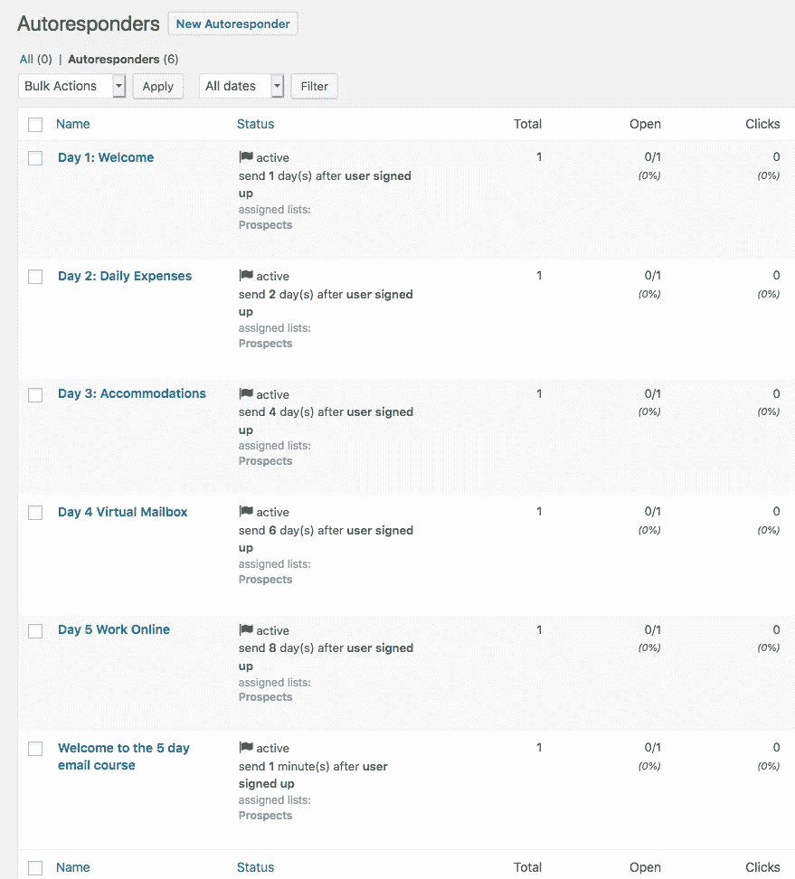

I use six autoresponder messages to build rapport by shoving value into the visitor’s inbox.

恭喜你，你还没有完成！现在你准备出售或至少要求你的前景捐赠，但你将需要另一个插件来接收付款。通过这种方式，你可以自动化你的交易，以换取交付数字商品。

我推荐一个银行账户，一个在线支付网关，比如我花了几个小时研究的 [Stripe](https://stripe.com/) 和 premium[plugin Digital Paybox](https://codecanyon.net/item/digital-paybox-pay-and-download/2637036)。数字付费箱具有:

*   多个支付网关，如 stripe 甚至比特币
*   多种货币
*   固定和灵活定价
*   防止被盗的临时下载链接

一旦你安装并激活了数字付费箱插件，填写设置部分，你的新客户将会收到一条迷人的信息。消息部分下面是要添加的每个支付处理器的字段。选择你想用的那个。

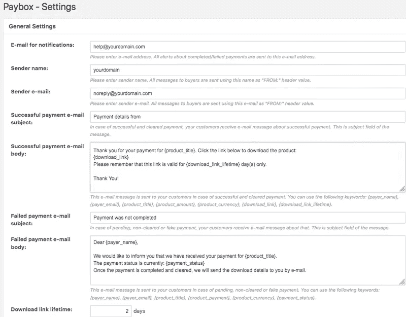

The Paybox transaction email message and settings.

Add a file of your digital product and price using this form shown.

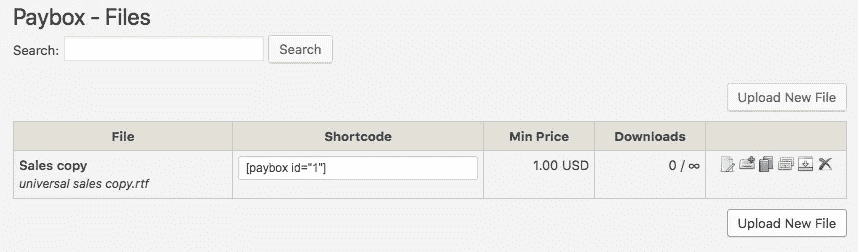

Copy the shortcode generated from the file upload and paste it on your sales page.

This is how the Digital Paybox widget will appear on your sales page.

干得好！这就是销售漏斗的 A-Z 过程。如果你有任何困难，或需要我为你建立一个销售漏斗，请联系我的[twitter.com/therutkat](https://twitter.com/therutkat)或[instagram.com/rutkatfitness](https://instagram.com/rutkatfitness)。