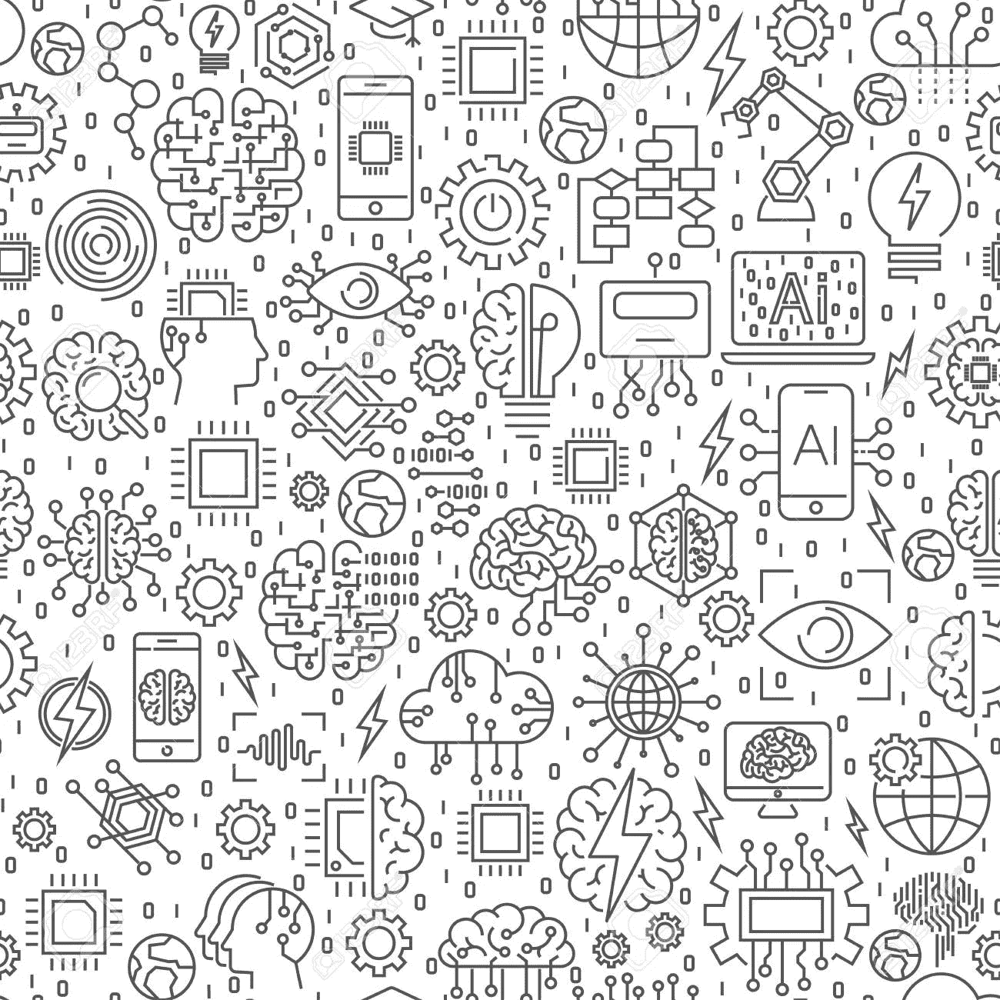
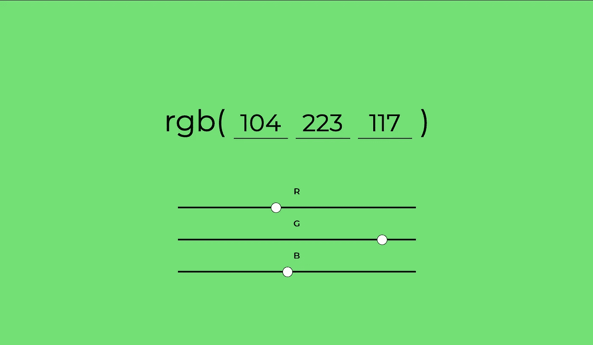
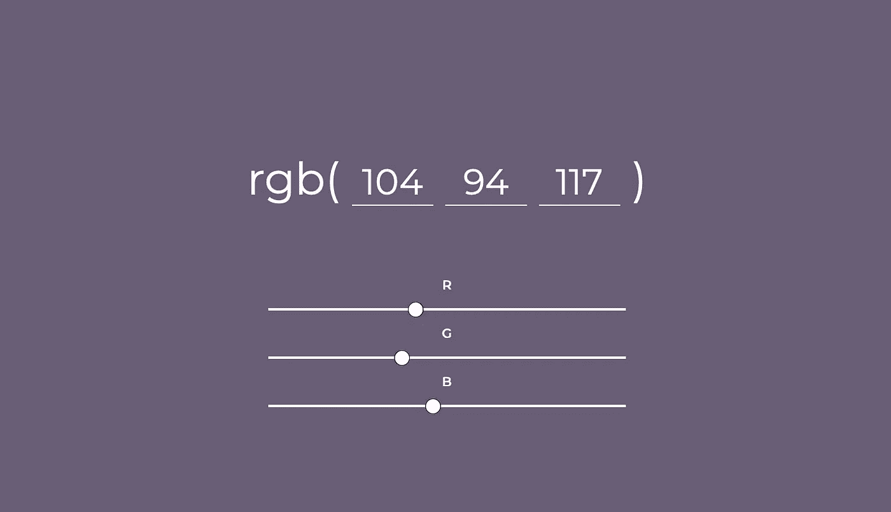

# 如何从零开始做一个简单的机器学习网站

> 原文：<https://medium.com/hackernoon/how-to-make-a-simple-machine-learning-website-from-scratch-1ae4756c8b04>

学习制作一个简单的机器学习网站，它根据可变的背景对比度来调整文本颜色🖌。

对于刚接触机器学习的人来说，这可能有点儿**混乱**。如果你是**机器学习的新手**，我建议你在这里看看我的这篇文章:

[**如何用简单的代码例子理解机器学习**](https://hackernoon.com/how-to-understand-machine-learning-with-simple-code-examples-a0508dae212b)

你对**机器学习**有热情吗？您是否正在尝试从头开始实现一个简单的**机器学习网页**？

你想用 **HTML/CSS 和 JavaScript** 做点酷的东西吗？

如果是，那么你就在**完美的地方**。



Machine Learning, AI

这里我们将使用一个简单的机器学习库 **brain.js** 制作一个简单的网页，根据背景颜色改变文本颜色。

让我们以结果本身开始我们的兴奋之旅。

这里是网页的链接。

转到上面的链接，尝试改变滑块的 **RGB 值，你会注意到自动**相对于**背景对比度**改变文本颜色**。**

这就是我们将要在这里建造的**。**

**什么？你**没打开**那个链接？你可能会错过一些很酷的东西，但不管怎样，这里有给你的**截图**。**

****

**Green background, black text**

****

**Violet-ish background, white text**

**没完全从**截图**中得到感觉？下面是一张 GIF:**

****

**Colour-Learning GIF**

**这里是你可能想看的完整源代码。**

**让我们进入**一些代码。****

**首先，我们将**制作一个简单的 html 文件**，在那里我们将构建我们的网页。我们也将需要简单的滑块的 R，G，B 值。**

**因此，`**index.html**`的代码应该是这样的:**

```
<!DOCTYPE html>
<head>
<meta charset="UTF-8">
	<script src="https://code.jquery.com/jquery-3.3.1.js" integrity="sha256-2Kok7MbOyxpgUVvAk/HJ2jigOSYS2auK4Pfzbm7uH60=" crossorigin="anonymous"></script>
  	<script src="https://cdnjs.cloudflare.com/ajax/libs/brain/0.6.3/brain.js"></script>
  	<link rel="stylesheet" type="text/css" href="style.css">
	<title>Colour Learning</title>
</head>

<body>
	<div class="container" id="container">
		<div class="rgbValues">
			rgb(
			<input id="red" type="number" min="0" max="255" maxlength="3" onKeyPress="if(this.value.length == 3) return false" value=0  />
			<input id="green" type="number" min="0" max="255" maxlength="3" onKeyPress="if(this.value.length == 3) return false" value=0 />
			<input id="blue" type="number" min="0" max="255" maxlength="3" onKeyPress="if(this.value.length == 3) return false" value=0 />
			)
		</div>
		<div class="colorPicker">
			<label for="redSlider">R</label>
			<input type="range" min="0" max="255" step="1" id="redSlider" value="0"/>
			<label>G</label>
			<input type="range" min="0" max="255" step="1" id="greenSlider" value="0">
			<label>B</label>
			<input type="range" min="0" max="255" step="1" id="blueSlider"value="0">
		</div>
	</div>

	<script type="text/javascript" src="app.js"></script>
</body>
</html>
```

**这里我们还使用了脚本`**brain.js**`,它是一个机器学习 JavaScript 库。**

**现在让我们设计我们的网页，让它在滑块移动时改变颜色。是的，**欢迎 CSS** 加入你的项目。**

**`**style.css**`的代码应该是这样的:**

```
@import url('https://fonts.googleapis.com/css?family=Montserrat');

body {
	margin: 0;
}

label {
	color: white;
	font-size: 20px;
	font-weight: bold;
	-webkit-transition: .3s; 
    transition: color .3s
}

.rgbValues input {
	background: transparent;
	border-color: white;
	border-style: solid;
	border-top: none;
	border-left: none;
	border-right: none;
	outline: none;
	font-family: 'Montserrat', sans-serif;
	width: 10%;
	font-size: 80%;
	color: white;
	text-align: center;
	-webkit-transition: .3s; 
    transition: border-color .3s
    transition: color .3s
}

.container {
	width: 100vw;
	height: 100vh;
	background-color: rgb(0,0,0);
	transition: background-color 500ms;
}

.rgbValues {
	font-size: 5vw;
	font-family: 'Montserrat', sans-serif;
	color: white;
	text-align: center;
	position: absolute;
	top: 35%;
	left: 50%;
	transform: translate(-50%, -50%);
	width: 90%;
	-webkit-transition: .3s; 
    transition: color .3s
}

.colorPicker {
	position: absolute;
	top: 68%;
	left: 50%;
	transform: translate(-50%, -50%);
	text-align: center;
	font-family: 'Montserrat', sans-serif;
}

.colorPicker input {
	-webkit-appearance: none;  /* Override default CSS styles */
    appearance: none;
    display: block;
    border: none;
    width: 40vw; 
    height: 4px; 
    background: white; 
    outline: none; 
    -webkit-transition: .2s; 
    transition: background .2s;
    margin: 25px;
}

.colorPicker input::-webkit-slider-thumb {
    -webkit-appearance: none; 
    appearance: none;
    width: 25px; 
    height: 25px;
    border: 1px solid black;
    border-radius: 20px;
    background: white; 
    cursor: pointer; 
}

/* For Firefox remove arrow menu input field*/
input[type='number'] {
    -moz-appearance:textfield;
}

/* Webkit browsers like Safari and Chrome remove arrow menu input field */
input[type=number]::-webkit-inner-spin-button, input[type=number]::-webkit-outer-spin-button {
    -webkit-appearance: none;
    margin: 0;
}
```

**是的，我们做到了。现在**进入你的网页**，看看滑块是如何改变颜色的。**

**什么？文字颜色**不变**背景也不变？**

**嗯，不要担心，这是因为我们还没有添加机器学习代码，这些代码将训练我们的神经网络，并使它了解将文本更改为哪种颜色。**

**我试图对代码块进行注释，这样会更容易理解。**

**此外，我们还需要**添加代码来改变背景颜色**。所以让我们先完成这个。代码看起来会像这样:**

```
// Change background colour
function changeBackgroundColor(r,g,b){
	container.style.backgroundColor = `rgb(${r}, ${g}, ${b})`;
}
```

**所以让我们用 JavaScript 来研究一些**机器学习代码。****

```
// creations of object for neural network
function createNetworkObject(r,g,b){
	var networkObject = {r:null, g:null, b:null};
	networkObject.r = r/255;
	networkObject.g = g/255;
	networkObject.b = b/255;

	return networkObject;
}
// Machine learning probability label
function networkLabel(result){ if(result.light > result.dark)
		result = 'light'; 
        else 
	        result = 'dark';

	return result;
}
```

**上面的代码**为我们的神经网络**创建了对象，并添加了将成为我们标签的亮或暗的标签，以改变文本的颜色。**

**现在让我们开始用数据训练我们的神经网络**，当然还有代码。代码看起来会像这样:****

```
// create new neural network object
const network = new brain.NeuralNetwork();

// training data
network.train([
	{ input: { r: 0.62, g: 0.72, b: 0.88 }, output: { light: 1 } },
	{ input: { r: 0.1, g: 0.84, b: 0.72 }, output: { light: 1 } },
	{ input: { r: 0.33, g: 0.24, b: 0.29 }, output: { dark: 1 } },
	{ input: { r: 0.74, g: 0.78, b: 0.86 }, output: { light: 1 } },
	{ input: { r: 0.31, g: 0.35, b: 0.41 }, output: { dark: 1 } },
	{ input: {r: 1, g: 0.42, b: 0.52}, output: { dark: 1 } },
	{ input: {r: 0, g: 0, b: 1}, output: { dark: 1 } },
	{ input: {r: 0.8, g: 0.44, b: 1}, output: { dark: 1 } },
	{ input: {r: 0, g: 0.44, b: 1}, output: { dark: 1 } },
	{ input: {r: 0.3 , g: 0.6, b: 1}, output: { dark: 1 } },
	{ input: {r: 0.1, g: 0.6, b: 0}, output: { dark: 1 } }
]);

// grab inputs in .rgbValues div
var input = document.querySelectorAll(".rgbValues input");
// grab inputs in .colorPicker div
var sliderInput = document.querySelectorAll('.colorPicker input');

// rgb slider
for(var i = 0; i < sliderInput.length; i++){
	sliderInput[i].addEventListener("input", function(){
		var redSlider = document.getElementById("redSlider").value;
		var greenSlider = document.getElementById("greenSlider").value;
		var blueSlider = document.getElementById("blueSlider").value;

		document.getElementById("red").value = redSlider;
		document.getElementById("green").value = greenSlider;
		document.getElementById("blue").value = blueSlider;

		changeBackgroundColor(redSlider,greenSlider,blueSlider);

		var networkObject = createNetworkObject(redSlider,greenSlider,blueSlider);
		var MLresult = network.run(networkObject);

		MLresult = networkLabel(MLresult);
		console.log(MLresult);

		changeElementsColor(MLresult, input, sliderInput);
	});
}

// rgb value input (the non slider one)
for(var i = 0; i < input.length; i++){
	input[i].addEventListener("keyup", function(e){
		// right arrow key to next tab
		if(e.keyCode == 39){
			$(this).next('input, select').focus();
		}
		// left arrow key to previous tab
		if(e.keyCode == 37){
			$(this).prev('input, select').focus();
		}
		// max value input 255
		if(e.target.value > 255){
			e.target.value = 255;
		}

		var container = document.getElementById("container");
		var red = document.getElementById("red").value;
		var green = document.getElementById("green").value;
		var blue = document.getElementById("blue").value; 

		// change slider values to correspong to rgb value input(s)
		document.getElementById('redSlider').value = red;
		document.getElementById('greenSlider').value = green;
		document.getElementById('blueSlider').value = blue;

		changeBackgroundColor(red, green, blue);

		// machine learning 
		var networkObject = createNetworkObject(red,green,blue);
		var MLresult = network.run(networkObject);

		MLresult = networkLabel(MLresult);
		console.log(MLresult);

		changeElementsColor(MLresult, input, sliderInput);
	});

	// when input changes from up down arrows keys to change value
	input[i].addEventListener("change", function(){
		var container = document.getElementById("container");
		var red = document.getElementById("red").value;
		var green = document.getElementById("green").value;
		var blue = document.getElementById("blue").value;

		changeBackgroundColor(red, green, blue);

		// machine learning 
		var networkObject = createNetworkObject(red,green,blue);
		var MLresult = network.run(networkObject);

		MLresult = networkLabel(MLresult);
		console.log(MLresult);

		var MLresult = network.run(networkObject);

		// black text for 'light' colours
		changeElementsColor(MLresult, input, sliderInput);
	});
}
```

**请**参考我提供的评论**，它会帮助你更好地理解这段庞大而直接的代码。**

**现在我们应该在我们的机器学习代码中添加能够创造奇迹的代码。这段代码帮助**根据需要和训练改变文本颜色**。**

```
// change colors on page relative to background
function changeElementsColor(result, input, sliderInput){
	if (result == 'light'){
			for(var i = 0; i < input.length; i++){
				input[i].parentElement.style.color = "black";
				input[i].style.color = "black";
				input[i].style.borderColor = "black";
			}
			for(var i = 0; i < sliderInput.length; i++){
				sliderInput[i].style.backgroundColor = 'black';
			}
			// grab label element
			var label = document.getElementsByTagName('LABEL');
			for(var i = 0; i < label.length; i++){
				label[i].style.color = 'black';
			}
		}
		else if (result == 'dark'){
			for(var i = 0; i < input.length; i++){
				input[i].parentElement.style.color = "white";
				input[i].style.color = "white";
				input[i].style.borderColor = "white";
			}
			for(var i = 0; i < sliderInput.length; i++){
				sliderInput[i].style.backgroundColor = 'white';
			}

			var label = document.getElementsByTagName('LABEL');
			for(var i = 0; i < label.length; i++){
				label[i].style.color = 'white';
			}
		}
}
```

**而且没错，**就是这样。****

**看看你的**网页，根据对比度自动改变文字颜色**，使用**机器学习。****

**如果你对上面的代码有困难，请看看这里的源代码。**

**你已经成功地用简单的 JavaScript、HTML 和 CSS 建立了一个机器学习网站。**

**你还在等什么？**

****去炫耀吧！！****

**以防我们在这里第一次见面， [**我是 Pradyuman Dixit**](/m/signin?operation=register&source=profile-5b4f50298fc3-------------------------follow_profile-) ，我主要写关于**机器学习、Android 开发**，有时写关于 **Web 开发**。**

**你可以在这里阅读我的其他**机器学习**帖子:**

**[**如何用简单的代码例子理解机器学习**](https://hackernoon.com/how-to-understand-machine-learning-with-simple-code-examples-a0508dae212b)**

**[**初学如何做一个机器学习安卓游戏**](https://hackernoon.com/how-to-make-a-machine-learning-android-game-from-scratch-82d9406a7635)**