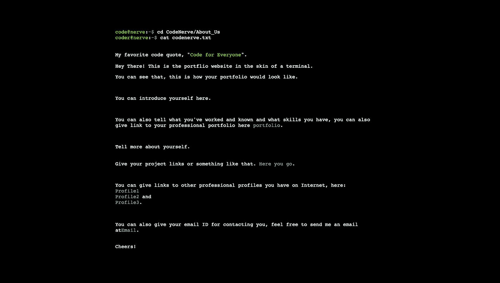

# 如何给自己做一个类似作品集网站的终端

> 原文：<https://medium.com/hackernoon/how-to-make-a-terminal-like-portfolio-website-for-yourself-27d7a7030004>

让我们编写一个看起来像终端的投资组合网站。

你是程序员吗？你喜欢编程吗？你用过终端吗？你希望有一个像终端一样的投资组合网站吗？

这就是我们在这篇文章中要做的。

让我们从结果本身开始，我们要在这里建立的，是我用于我的创意作品集网站。去看看下面的链接，在一个新的标签中打开下面的链接，我会等待…

[**看起来是这样的。**](https://Pradyuman7.github.io)

不想去新的链接？你会错过一些很棒的东西，但不管怎样，这是图片。



terminal based portfolio website

你喜欢吃吗?想为自己建造这个吗？然后跟着读…

这是我在 **GitHub 页面**上的个人网站作品集。您也可以将它托管在 GitHub 页面上，或者使用另一个从 GitHub 部署您的代码的服务(免费！)，像 [**Netlify**](https://www.netlify.com) 。

如果你想使用 GitHub Pages，那么，进入 [**GitHub**](https://github.com) **，**新建一个库，命名为**【your-username】. GitHub . io**。

你必须把你自己的用户名放在上面的括号里，这也是区分大小写的。

如果您不想使用 GitHub 页面，那么您可以随意命名这个存储库。

> 现在让我们进入一些代码。

首先让我们为你的网页制作 HTML 文件。html 代码非常容易理解，因为我们要做的大部分魔术都是在 JavaScript 或 CSS 中。

我把这个文件命名为**index.html**。代码将是这样的:

```
<html> 
  <head> 
    <title>CodeNerve</title> 
    <script type="text/javascript"  src="https://ajax.googleapis.com/ajax/libs/jquery/1.4.2/jquery.min.js"></script> 
    <link rel="stylesheet" type="text/css" href="index.css">
  </head> 
  <body> 
    <script type="text/javascript" src="index.js"> 
    </script> 
    <div id="console"></div> 
    <script type="text/javascript", src="index2.js">
    </script>
  </body> 
</html>
```

这只是简单的 HTML，使我们的投资组合的基础。

现在我们可以让它看起来更好，看起来像一个终端。这就是 CSS 是我们的救星的地方。对于 CSS，我们将背景设为黑色，终端文本设为白色，标签设为亮绿色。

CSS 文件的代码， **index.css** 看起来像这样:

```
body {
	background-color: #000
}

#console {
	font-family: courier, monospace;
	color: #fff;
	width:750px;
	margin-left:auto;
	margin-right:auto;
	margin-top:100px;
	font-size:14px;
}

a {
	color: #0bc;
	text-decoration: none;
}

#a {
	color: #0f0;
}

#c {
	color: #0bc;
}

#b {
	color: #ff0096;
}

#k {
    	animation: change 1s;
}

#op{
    	color: #888888
}

@keyframes change {
    	0%  { color:  #0f0; }
    	50% { color:  #0f0; }
    	99% { color: black; }
}
```

完成这些后，现在我们必须为文本自动输入和文本本身编写代码。首先，让我们自己完成文本自动输入部分，我们将使用 **JavaScript** 来完成。

**index.js** 文件的代码如下所示:

```
var Typer={
	text: null,
	accessCountimer:null,
	index:0, 
	speed:2,
	file:"", 
	accessCount:0,
	deniedCount:0, 
	init: function(){
		accessCountimer=setInterval(function(){Typer.updLstChr();},500); 
		$.get(Typer.file,function(data){
			Typer.text=data;
			Typer.text = Typer.text.slice(0, Typer.text.length-1);
		});
	},

	content:function(){
		return $("#console").html();
	},

	write:function(str){
		$("#console").append(str);
		return false;
	},

	addText:function(key){

		if(key.keyCode==18){
			Typer.accessCount++; 

			if(Typer.accessCount>=3){
				Typer.makeAccess(); 
			}
		}

    		else if(key.keyCode==20){
			Typer.deniedCount++; 

			if(Typer.deniedCount>=3){
				Typer.makeDenied(); 
			}
		}

    		else if(key.keyCode==27){ 
			Typer.hidepop(); 
		}

    		else if(Typer.text){ 
			var cont=Typer.content(); 
			if(cont.substring(cont.length-1,cont.length)=="|") 
				$("#console").html($("#console").html().substring(0,cont.length-1)); 
			if(key.keyCode!=8){ 
				Typer.index+=Typer.speed;	
			}
      		else {
			if(Typer.index>0) 
				Typer.index-=Typer.speed;
			}
			var text=Typer.text.substring(0,Typer.index)
			var rtn= new RegExp("\n", "g"); 

			$("#console").html(text.replace(rtn,"<br/>"));
			window.scrollBy(0,50); 
		}

		if (key.preventDefault && key.keyCode != 122) { 
			key.preventDefault()
		};  

		if(key.keyCode != 122){ // otherway prevent keys default behavior
			key.returnValue = false;
		}
	},

	updLstChr:function(){ 
		var cont=this.content(); 

		if(cont.substring(cont.length-1,cont.length)=="|") 
			$("#console").html($("#console").html().substring(0,cont.length-1)); 

		else
			this.write("|"); // else write it
	}
}
```

上面的代码显示了我们在终端上看到的内容。现在让我们设置打字速度，使网址看起来像网址。

在上面的代码下面添加下面的代码，在同一个文件中， **index.js** 。

```
function replaceUrls(text) {
	var http = text.indexOf("http://");
	var space = text.indexOf(".me ", http);

	if (space != -1) { 
		var url = text.slice(http, space-1);
		return text.replace(url, "<a href=\""  + url + "\">" + url + "</a>");
	} 

	else {
		return text
	}
}

Typer.speed=3;
Typer.file="[your-name].txt"; // add your own name here
Typer.init();

var timer = setInterval("t();", 30);
function t() {
	Typer.addText({"keyCode": 123748});

	if (Typer.index > Typer.text.length) {
		clearInterval(timer);
	}
}
```

现在一切都为我们的投资组合网站设置好了。尽情享受吧！！

但是…等等，

哪里是我们想要的文本，当然上面的任何代码都没有给出要键入的文本，当然这些都不是 ML 或 AI 会自动为我们获取文本。

所以用你的名字做一个文件作为文件名，加上**。txt** 扩展名。文件名应该像**【你的名字】。txt** 。

添加以下详细信息，并替换为您想要放在文件夹中的文本。

```
<span id="a">your-first-name@your-last-name</span>:<span id="b">~</span><span id="c">$</span> cd CodeNerve/<!-- laglaglaglaglaglag -->About_Us
<span id="a">your-first-name@your-last-name</span>:<span id="b">~</span><span id="c">$</span> cat <!-- laglaglaglaglaglaglaglaglag -->[your-name].txt<br/><br/>
My favorite code quote, "<span id="k">Quote you like</span>". <!-- sjkfhskjf -->

Hey There! This is the portflio website in the skin of a terminal.<!-- laglaglaglaglaglaglaglaglaglaglaglag --><p>You can see that, this is how your portfolio would look like.</p>
<p>You can introduce yourself here.</p> <!-- bitlagbitlagbitlagbitlagbitlagbitlag -->
<p> You can also tell what you've worked and known and what skills you have, you can also give link to your professional portfolio here<a href="link"> portfolio</a>.</p><!-- delaydelaydelaydelaydelaydelaydelay -->
<p>Tell more about yourself. <br><br><br>Give your project links or something like that. <a href="link"> Here you go</a>.</p><!-- moredelaymoredelaymoredelaymoredelaymoredelaymoredelay-->
<p> You can give links to other professional profiles you have on Internet, here: <br> <a href="link1">Profile1</a> <br> <a href="link2">Profile2</a> and <br> <a href="link3">Profile3</a>.</p>

You can also give your email ID for contacting you<!-- slightdelayhere-->, feel free to send me an email at<!-- longlonglongcomment --><a href="Your email ID">Email</a>.

<p>Cheers!</p>
```

我们都完成了，现在可以肯定:)

你可以在这里找到完整的源代码。

如果您使用过 GitHub Pages，您的网站将出现在，**[您的用户名].github.io.**

如果你没有用过 GitHub Pages，而是用 Netlify 这样的网站。然后进入 Netlify，登录并点击绿色按钮，上面写着**来自 git** 的新网站。

**从 GitHub** 部署代码，它会给你一个你的站点所在的 url。

你已经在一个终端的外壳中为自己建立了一个个人网站。

**你还在等什么？去炫耀吧！！**

[**阅读我之前关于为初学者构建眼球追踪和人脸检测应用的帖子。**](https://hackernoon.com/make-an-eye-tracking-and-face-detection-app-as-a-beginner-d72e0139546b)