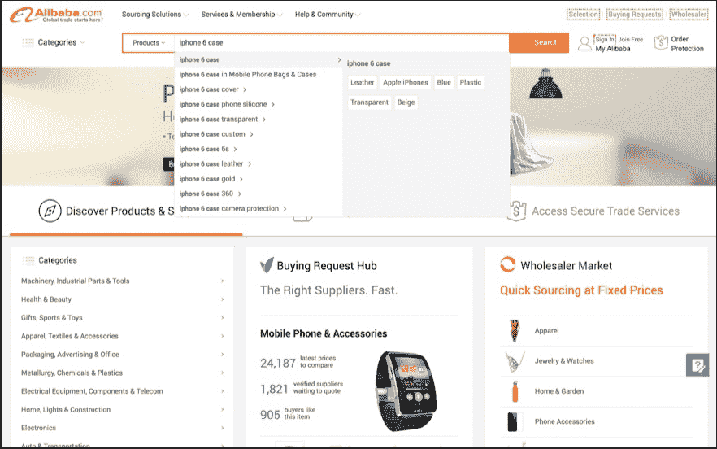
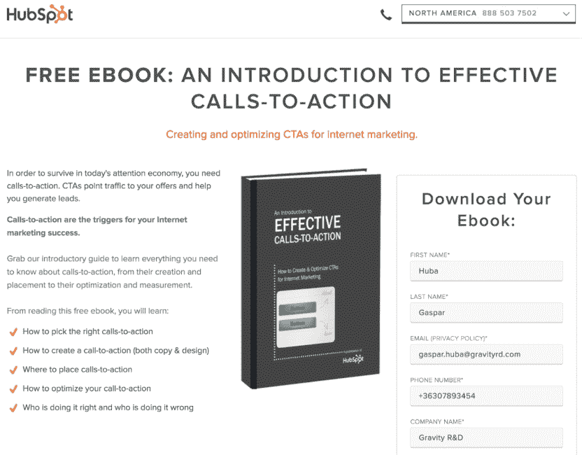
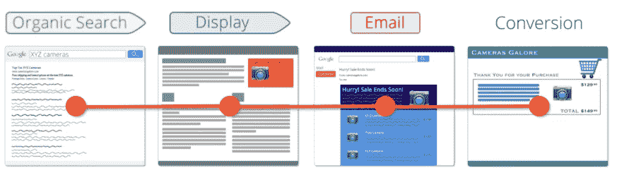
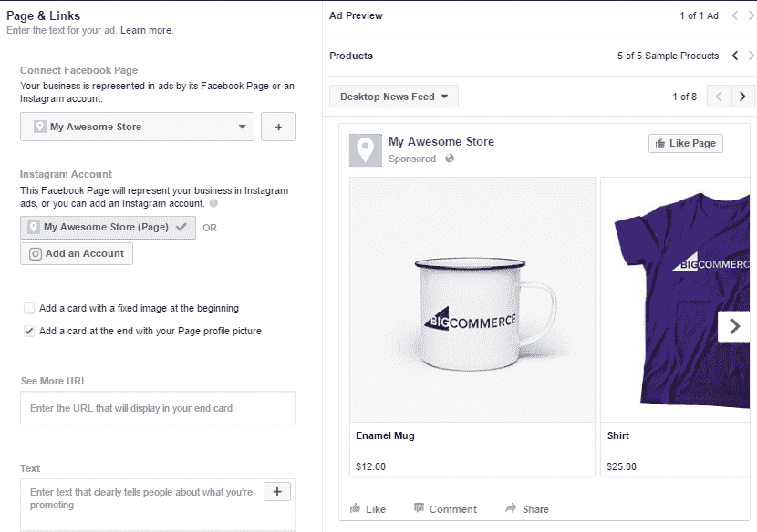
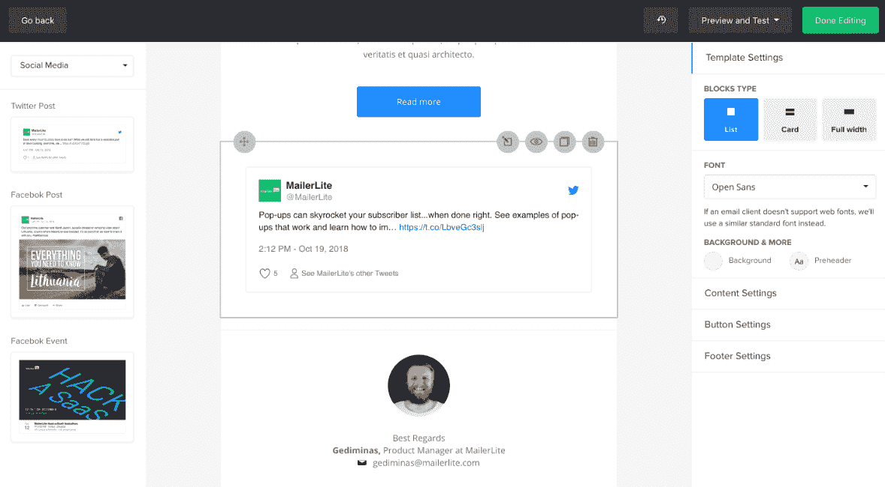
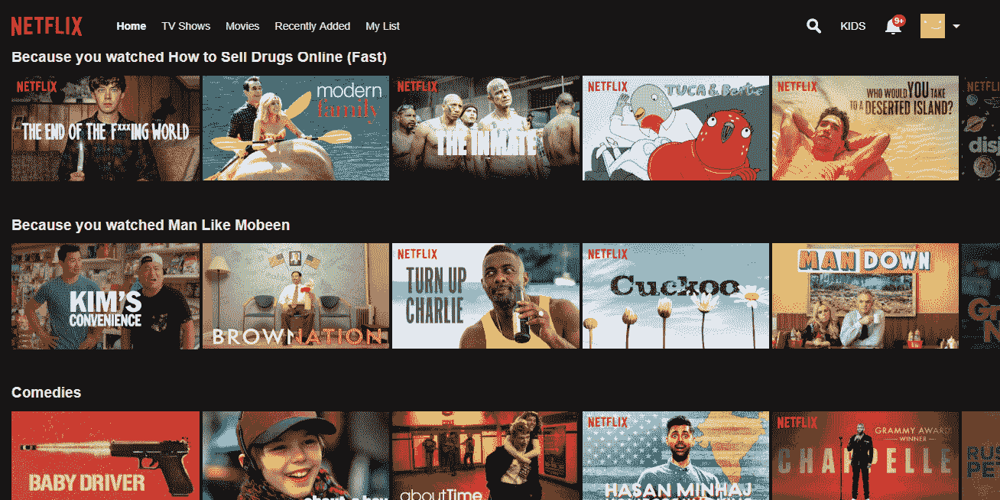
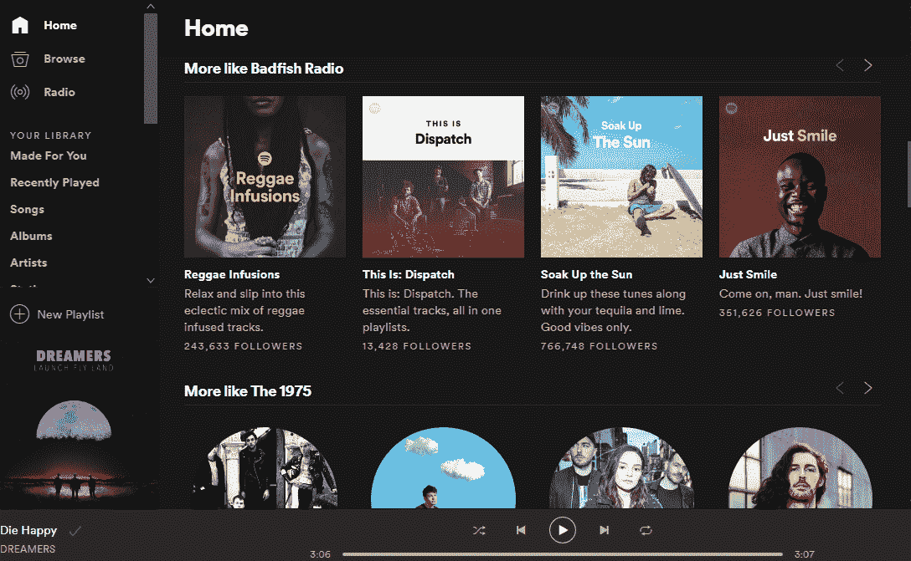
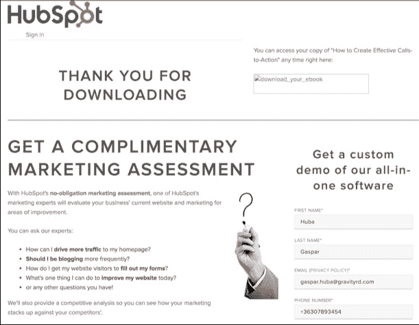
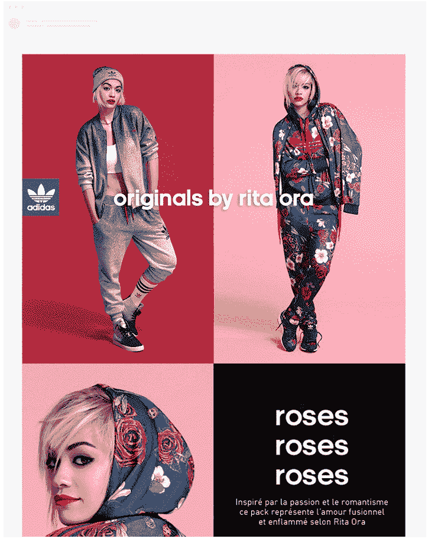
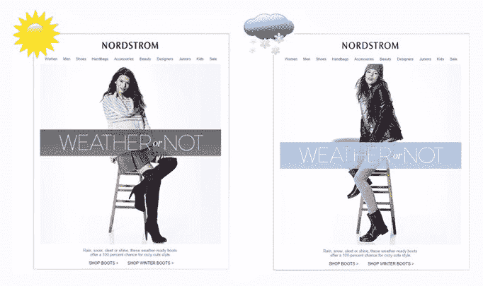

# 如何让动态内容为您的业务服务

> 原文：<https://medium.com/hackernoon/how-to-make-dynamic-content-work-for-your-business-c366adca08dd>

*Photo by Tranmautritam from Pexels*

如今，根据个人需求和偏好定制[用户体验(UX)](https://hackernoon.com/why-you-should-care-about-user-experience-638e0ba88087) 已经成为数字营销的重中之重。近年来，主要方法已经变成使用动态内容，即根据用户信号(如过去的交互、浏览历史和位置)而变化的内容。

已经发现动态内容通过提供更直观和相关的体验来增加转化率。通过提供[个性化体验](https://hackernoon.com/personalization-can-drive-meaning-for-brands-e3072d3490f3)，减少不必要和冗余的信息，用户会遇到更少的摩擦，并在他们的发现过程中看到合乎逻辑的下一步。这导致了更多的参与和更多的接触点，为转化提供了机会。

本文讨论了动态内容的工作原理，可以在哪里实现它们，并提供了如何让它为您的业务服务的技巧。

# 动态内容如何工作

动态内容很大程度上取决于信息。这就是建立[客户关系管理(CRM)](https://hackernoon.com/mvp-for-crm-how-to-avoid-unnecessary-functions-72f80681225a) 数据库的用武之地。这包含了你从所有过去的互动中收集的所有用户数据。

例如，当用户注册网飞或 Spotify 等内容门户网站时，他们最初会被要求勾选他们感兴趣的内容。这使得这些平台能够提供初步的推荐，随着用户在上面花费更多的时间，它们可以在此基础上进行构建。用户在网站上花费的时间越多，他们与网站的互动越多，收集的信息就越多，这些信息可以用来提供更加个性化和相关的体验。

# 您可以在其中使用动态内容

虽然推荐系统已经成为提供更好的 UX 不可或缺的一部分——网飞一度估计他们的系统每年价值 10 亿美元。

*   **改进的网站搜索**

随着搜索继续成为越来越重要的导航元素，提高网站搜索的质量可以极大地影响转化率。甚至简单地优化搜索框内和周围的自动完成和自动更正功能也能把季节性购买者变成常客。

*Source:* [*https://neilpatel.com*](https://neilpatel.com)

正如你在上面看到的，你也可以直接对你的搜索词进行推荐。这加快了发现过程，因为访问者不必浏览您的目录就可以跳到他们感兴趣的项目。这对房源量大的平台特别有帮助。阿里巴巴在这方面加大了赌注，当用户将鼠标悬停在推荐的搜索词上时，一个常用的过滤关键词列表也会显示出来。

*   **动态 CTAs**

[行动号召](https://hackernoon.com/calls-to-action-are-the-new-pop-up-ads-54d14e279552)按钮对于提高转化率非常重要。通过确保用户数据在所有渠道中保持一致，您可以展示动态 CTA，从而简化用户从首次互动到转化的过程。

例如，您需要确保已经订阅了您的电子邮件的用户不会被错误地呈现另一个订阅表单。相反，应该提示他们进行更深层次的互动，比如提供免费试用或免费下载。

*Source:* [*https://neilpatel.com*](https://neilpatel.com)

# 如何让动态内容为您服务

拥有世界上所有的数据并不能自动确保改善 UX。这里有一些关于如何让动态内容为你的业务服务的提示。

**#1。采取多渠道方法**

在这个多沟通渠道和设备的时代，重要的是要理解用户在转化之前可能会与你的品牌进行多次互动。这意味着你需要确保用户在每次交互中都有愉快的体验。

*Source:* [*https://www.semrush.com*](https://www.semrush.com)

您可以使用多种工具在场外促销中提供[特定于客户档案的内容](https://enhancv.com/resume-examples/content-marketing/)。例如，在 BigCommerce 上，你可以使用他们与脸书动态广告的直接整合。这使您可以根据用户的商店浏览历史自动个性化重定向广告创意。

*Source:* [*https://www.semrush.com*](https://www.semrush.com)

与此同时，谷歌分析有其[多渠道漏斗和顶级转化路径](https://support.google.com/analytics/answer/1191180?hl=en)报告。这可以帮助您确定从个性化中获益最大的特定接触点和资产。使用此类工具，您可以将 UX 细分为更小的特定渠道体验，从而确保客户在旅程的每个阶段都能获得积极的体验。

**#2。提高动态内容块的参与度**

[电子邮件营销自动化](https://hackernoon.com/10-most-popular-misconceptions-about-email-marketing-automation-5711ac6ad8d4)平台提供动态内容块，使您能够向更大的电子邮件中添加内容片段，这些内容片段仅对某些订户可见。假设您想要发送一份新闻稿，其中有一个部分重点介绍在某个特定城市进行的促销活动。您可以使用动态内容块向特定的订阅者显示该部分，而不是在举行促销的地方创建新的用户群。

这些块也可以以社交媒体内容的形式插入到您的电子邮件中，只有某些订户才能看到。

*Source:* [*https://www.mailerlite.com*](https://www.mailerlite.com)

这些动态内容块增加了个性化的互动层，有可能带来更多的点击，最终带来更多的转化。

**#3。使动态页面搜索引擎友好**

虽然动态页面通常对 UX 来说很棒，但是不注意你的动态 URL 可能会让[搜索引擎](https://hackernoon.com/the-best-search-engines-on-the-internet-9c0314250601)很难索引它。为了让谷歌更容易抓取你的网页，你可以做以下几件事:

*   **清理网址**——例如，yourcontent.com/index.php?=2017–01–11-news,将网址从*改为 yourwebsite.com/latest-news/*。这使得它对搜索引擎更加友好。
*   **将过滤后的 URL 返回到主页面**——这对电子商务商店尤其重要。将过滤的页面设置为“noindex，follow”，例如:

网址:*yourwebsite.com/store/jackets/*

*yourwebsite.com/store/jackets/?orderby=popularity&min _ price = 100&max _ price = 250*

*yourwebsite.com/store/jackets/? order by =人气&min _ price = 200&max _ price = 500*

*yourwebsite.com/store/jackets/? order by =人气&min _ price = 500&max _ price = 1000*

*   创建网站地图来帮助谷歌找到你的页面——这可以在谷歌搜索控制台中进行管理。

拥有动态页面是很棒的。让它们出现在搜索引擎结果中就更好了。

# 动态内容的最佳示例

## 网飞

网飞是目前的黄金标准，当谈到保持用户参与和现场推荐系统。如果你不知道[热门内容](https://blog.sharelov.com/marketers-guide-to-the-top-social-media-trends/)是什么，网飞在利用你过去的互动来推荐你喜欢的内容方面做得很好。

## Spotify

同样，Spotify 在利用用户历史记录将他们留在平台上方面做得很好。他们在管理播放列表方面做得更好，使用户能够在平台上发现更多的内容。

## 轮毂点

正如你前面看到的，HubSpot 向合格的潜在客户提供免费的电子书下载，以换取基本的联系信息。提交后，用户会被重定向到另一个页面，在那里他们可以申请 HubSpot 软件的定制演示。

*Source:* [*https://neilpatel.com*](https://neilpatel.com)

如您所见，之前提交的表单中的所有信息都已经填写完毕。这可能是一个小的接触，但当你减少任何形式的摩擦时，用户都会很感激。

## 诺德斯特龙

基于性别的个性化在营销邮件中很常见，你可以在下面阿迪达斯的例子中看到。

*Source:* [*https://media.giphy.com/media/55d8P2huZKyKk8383d/giphy.gif*](https://media.giphy.com/media/55d8P2huZKyKk8383d/giphy.gif)

Nordstrom 更进一步，利用用户的位置，根据用户所在地的相关天气动态改变内容。

*Source:* [*https://instapage.com*](https://instapage.com)

## 外卖食品

用户不再只是欣赏个性化的内容和体验，他们已经开始期待它。随着能够帮助企业提供这种体验的工具和平台的激增，我们没有理由不利用动态内容的力量来提高参与度和转化率。因为你可以[测试动态内容的功能](https://www.simform.com/functional-testing-types/)，坚持下去最终会产生真正有用的内容。

您的数字营销工作的哪些部分可以受益于动态内容？请在下面的评论中发表意见。