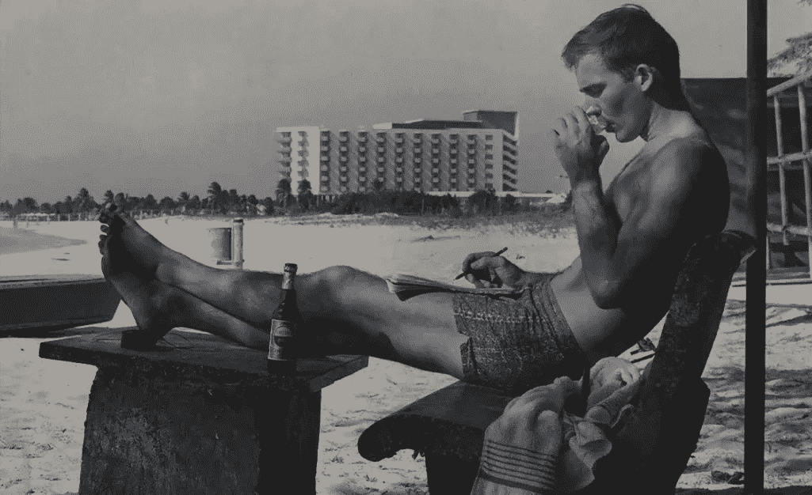
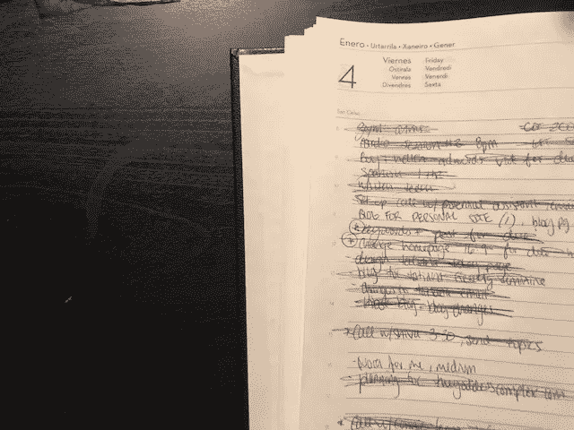
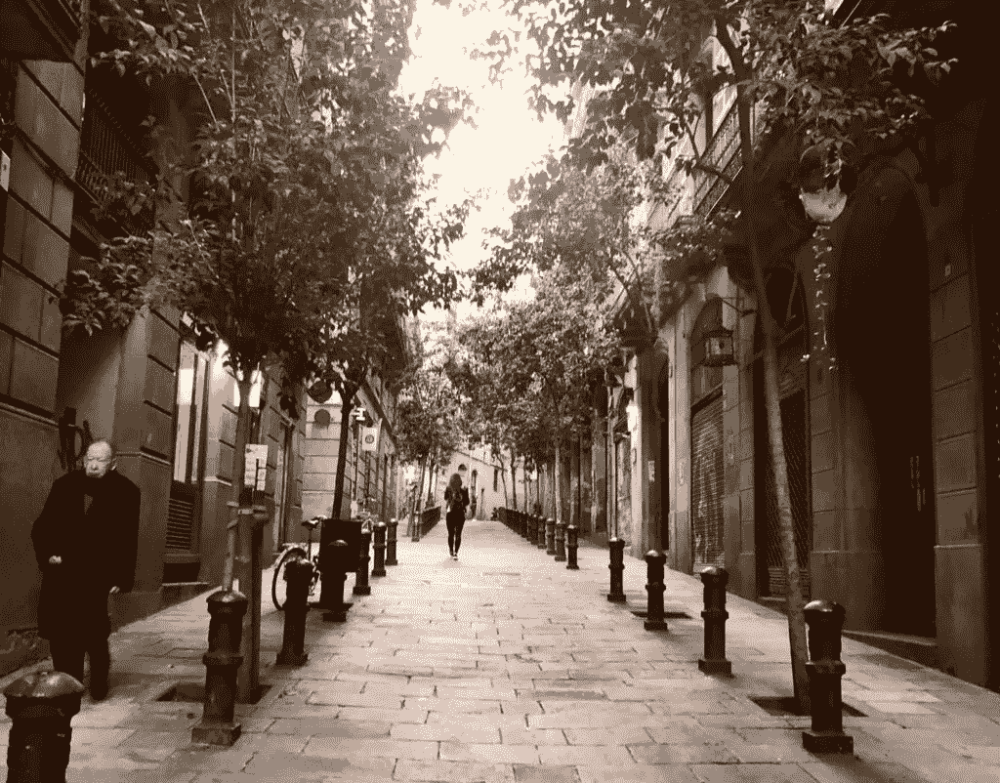
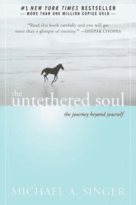

# 通往创造性一致性的道路

> 原文：<https://medium.com/hackernoon/how-to-manage-the-highs-and-lows-for-creative-consistency-fb8f9884ccef>

我认为当你承担任何“创造性”的负担时，你真的呈现出躁狂和抑郁状态的两极属性。我经营着一家创意企业，所以不幸的是，这是一场个人和职业的斗争。

大概 6 个月前，我在创意和专业上如火如荼。我可以带着热情和执行力处理任何事情。这是一种美妙的感觉，我相信你也经历过。

最近，我终于决定在一个家庭成员的手中解决过去的性虐待问题，并妥善处理它。这个过程打开了毫无价值和无能为力的潘多拉魔盒。这对我的创造力和抵制创造的能力造成了巨大的伤害。我发现自己对自己充满了如此多的怀疑和消极(这是性虐待对你的一个有趣的影响)，以至于我实际上失去了利用我整个职业生涯和激情的能力:我的创造性声音。

我已经有六个多月没有用自己的声音写下自己的心声了。这是我的第一件作品。我一直在探索，为什么我们会经历创造性死亡的低谷，以及我们如何将自己从创造性的一致性中拉出来。

因为创造性的工作是如此的个人化，创造是我们外在领域，更高的“自我”的内在部分，创造力随着我们非常容易动摇的人类情感流动，就像我刚刚经历的那样。

创造性和一致性是对立的，但也完全不是。

创造力就像肌肉。创造力的增长来自于一致性。一致性激发创造力。当然，你需要两者来从你的激情、天赋、专注等中创造收入。

世界上有很多不可思议的创意，但很少有人发展出足够的创意一致性能力，以上升到下一个水平并被人听到。

反思这整个时期，我写下了一些我认为对穿越创造性停滞的沙漠至关重要的事情:

# 如果你不能创造，观察:

有一天，我试着写作，讨厌每一个出现在我脑海里的想法。我决定以不同的方式看待这种情况，只是观察其他人在创造什么和已经创造了什么。我重新审视了一些作品、博客文章、诗歌、艺术和书籍，它们在我刚开始创作时给了我灵感。我一直是亨特·S·汤普森的超级粉丝，所以我重读了*朗姆酒日记。*如果你不知道，这是关于一名记者/作家从纽约搬到波多黎各为一家报社工作，然后发生了一堆倒霉事。不管怎样，我在从纽约搬到西班牙之前读了这本书，然后发生了一堆糟糕的事情。像这样的作者写的书对我来说就像是一个蓝图。它总是让我正确看待:这是我的生活和工作，就像这本书一样，是一场不断变化的冒险，需要有很多戏剧才能让它变得精彩。

正如这些艺术家和作者创造了一些启发我的东西，我有责任至少尝试用我被赋予的生活做类似的事情。

我想每次回去探索我最初的灵感时，我都回到了这个思考过程的起点。

# 设定难以置信的小创意目标:

我认为这些创造力的压抑就像一种字面上的疾病；好像我感冒了，而不是陷入了我的感觉…不管怎样，你不能在生病一周左右后匆忙跑五英里去健身房。你必须从小的、渐进的步骤开始，让你自己、你的身体和你的思想恢复和谐，这样你就可以表演了。我注意到，在缺乏灵感的时候，我醒得晚，我不太关心自己的身体健康，我会求助于我认为有挑战性的事情；一切都变成了“过得去”。就好像你真的“染上”了冷漠。

当我让我的思想和情感超越了我的创造性努力时，我确实需要让我自己、身体和头脑重新回到一起。就像流感一样，你必须循序渐进地恢复战斗状态。

*   我定了一个目标，在 Kindle 上读完 60 页的艺术之战。
*   我设定了一个目标，创建并组织一个想法的电子表格。字面意思就是创造它。
*   我设定了一个目标，写下一些我可以写的话题(这篇文章就是其中之一)。
*   我设定了一个目标来概述这篇文章。
*   很快，这就完成了，我的想法开始流动。

在我创作狂热的高峰期，我可能花了三天时间写了一篇本可以在三十分钟内完成的文章，但至少它发生了。以一些情绪打击为后盾的反抗，很难挺过去；面包屑的痕迹让我们*至少*在前进。

# 比其他人早起:

这很可能只是我，但从我还是个孩子的时候起，凌晨 3 点到 7 点之间的时间就让我着迷并给了我灵感。在一个陌生的世界里，独自一人，保持清醒，做好准备是令人振奋和充满力量的。当我搬到西班牙时，我发现实际上有一个词可以形容这些时间:*。实际上我现在已经纹身了。*

*就像我之前提到的，当经历创造性抑郁时，我会比平时醒得晚。有时候，强迫自己早上 6 点起床会有很大的不同。*

*这背后有实际的科学依据，而不仅仅是我童年的记忆:[根据统计，由于昼夜节律](http://psycnet.apa.org/record/2012-02789-001)，醒得越早的人情绪越积极。*

*对包括我自己在内的许多人来说，在收到大量电子邮件和电话之前，清晨是我唯一能真正理清自己想法的时间。保持这一点很重要，不要让情绪和压力阻碍创造力。*

# *任何种类的体力活动:*

*我知道有些人在淋浴时有他们最好的想法，我在健身房或散步时有我最好的想法。当我生活中的那一部分被消除时，那些想法也会被消除。这是我不得不强迫自己做的另一件事，为那些想法让路；有时，即使只是一次轻松的散步也是完美的。我住在巴塞罗那，所以只要抬头看任何一座建筑，都会看到令人惊叹的景色，我不禁会被它所吸引。*

**

# *冥想(不一定要非常瑜伽或超精神):*

*对许多人来说，这个话题仍然太“遥远”而不值得考虑，这让他们很尴尬；我完全理解。我并不真的练习瑜伽意义上的冥想。如果不先做伸展运动，我甚至不认为我能十字形坐着。不是我的事。但我确实欣赏“与高我重新连接”意义上的冥想。我把它作为一种学习承认想法并让它们过去的方式。*

*如果你能学会坐在那里 15 分钟，感受每一种情绪，思考每一件事，不让它影响你的呼吸或心脏，那就是胜利。我称之为“让大脑远离戏剧”，因为我们对思想和情感的反应是如此的戏剧化。这也是一个与更伟大、更有灵感、更有创造力、更充实的我重新连接的时间，这个我还没有被展现出来。*

*我推荐迈克尔·a·辛格的一本书，名为《自由的灵魂:超越自我的旅程》 ，这本书从实践的角度塑造了我看待冥想和体验的方式。*

**

# *明白你对某人来说是不可或缺的:*

*令我惊讶的是，即使像亨特·S·汤普森这样的灵感来源也经历了这样的衰弱期，但他的作品仍然吸引了数百万像我一样的人。这让我很欣慰。*

*要明白你的工作在更大范围内做出了贡献。想想你快乐地在社交媒体上滚动，浏览美术馆，挑选和阅读书籍的时间。想想你发现的一篇你喜欢的文章，或者你读过的一篇以某种方式打动你的推文或 Instagram 帖子。那些都是和你非常相似的人*的作品*。你的工作有内在价值，有一天可能对其他人(或数百万人)非常重要。创造是你的工作，不管那对你来说是什么。*

*[*——索菲亚*](http://sophiaellismarketing.com)*

**原载于 2019 年 1 月 5 日 sophiaellismarketing.com***。***