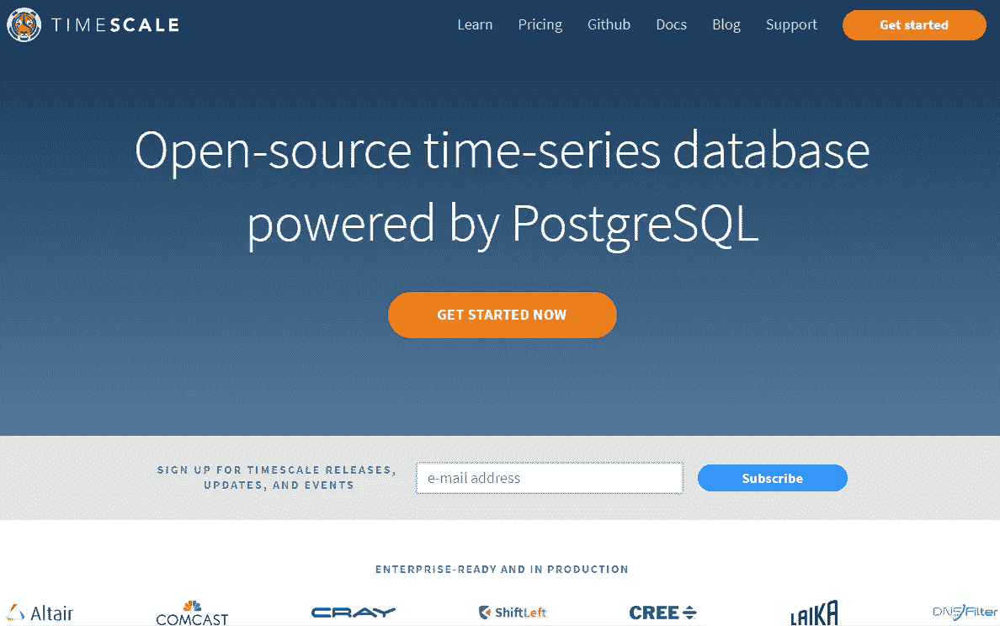

# 如何营销和销售开源软件？时间刻度和红帽

> 原文：<https://medium.com/hackernoon/how-to-market-and-sell-open-source-software-to-enterprise-ft-timescale-red-hat-8c9c992c0c25>

**免责声明:我与本文讨论的任何公司都没有关系*

商业中有一个永恒的现象，强大的产品团队努力营销和销售他们的优秀产品。这真的是一场闹剧。

在一个完美的世界里，销售和营销是不存在的。人们会立即找到他们需要的产品。创作者可以立即将他们的产品送到理想顾客的手中。

然而，这不是我们生活的世界。

不仅很难找到我们需要的解决方案，而且我们往往不知道我们想要什么或需要什么。

因此，销售和营销是产品团队的重要补充。

这就把我们带到了今天小型营销案例研究的主要讨论主题。

我想拆分一家名为【T2 时标】的公司。这是一个很好的例子，说明了产品第一的公司如何在首轮融资阶段改善他们的上市。

*告诫。我不是开发人员，所以坦率地说，这些产品的很多细节我都不知道。*

我所知道的是如何营销和销售产品。

很明显，这家公司以牺牲市场营销为代价，把产品和技术放在第一位。只要看看他们网站上的顶级导航:

*   学习
*   定价
*   开源代码库
*   文件（documents 的简写）
*   博客
*   支持
*   开始

我是说 Github 在他们的主导航里！

他们的核心任务没有阴影，但我们建立业务来销售产品，我认为我们可以在这里做得更好。

真的，我希望时标从红帽的书里拿一页。

这是一个很好的比较，因为两家公司都向企业销售和实现开源软件。

以下是你在 Red Hat 网站上看到的主要导航:

*   制品
*   解决方法
*   服务和支持
*   开放源码

差别是巨大的。

现在，我喜欢时标的原因是他们的核心价值很简单，而且沟通良好。这是运行使用时序数据的数据库的更好方法。嘣。我们走吧。

也有一吨高姿态标志突出的时标。这也不错。

那么，我们该何去何从呢？

这是我希望看到的时间表。

首先，Red Hat 要求用户在访问任何东西之前先建立一个帐户。对于内部销售团队来说，这对于销售线索的挖掘非常重要。帮助用户了解如何最好地利用他们的新技术。

我特别想强调的是,“驱动销售线索”对“销售团队”来说并不一定是一件坏事。重要的是与所有用户进行对话，培养免费增值关系。这就是营销人员和销售团队教育用户并打开销售可能性的方式。交易结束后，这是我们确保持续成功、[扩大收入](https://www.profitwell.com/blog/topic/expansion-revenue)和下线推荐的方法。

在软件领域，入职非常重要，因为糟糕的实施会扼杀交易。我赌 100 美元，时标也是如此。或许比“典型的”SaaS 公司更甚。

继续，我希望看到时标将他们的产品包装成更多的“解决方案”前进的方法。红帽在这方面做得很好。

它也出现在时标的主页上，但被埋在了页面下面。不是最佳的。

展示解决方案而不仅仅是技术的关键是，这些类别反映了不同的买家角色，这些角色非常适合时标的技术。

这让人们一眼就能看出他们是否应该对这家公司感兴趣，并在他们反弹之前抓住他们。

最后，我们来谈谈服务产品。

据我所知，像 Red Hat 这样的公司在开源环境中赚钱的很大一部分是通过服务收入。这沿袭了甲骨文等前辈公司的传统。一个伟大的(高利润)商业模式，即使甲骨文并不喜欢它。

## 现在，我们来谈谈增长渠道。

很明显这些家伙是在向开发商推销。我认为试图向任何其他工作职能推销是没有意义的。你只需要一定水平的技术知识就知道你需要这个工具。

因此，发展的游戏名称是让尽可能多的需要处理时间序列数据的开发人员得到这个产品。

将会有一部分市场面临这个紧迫的问题，并且知道他们需要一个解决方案。对于这些人来说，一些显而易见的渠道浮现在脑海中。

当然是谷歌。无论是广告还是有机搜索。内容营销在这里大有可为。我喜欢他们已经在运营一个博客，这个博客为他们的网站带来了一半的流量。好动作。

Youtube 也是。尤其是对于寻求可视化代码遍历的人来说。鉴于他们强大的产品团队和技术人才，采用一种利用其团队专业知识的视频内容教育方法是有意义的。创建内容的成本很低，并且很容易保持频繁的发布时间表。

接下来:堆栈溢出。我认为他们可以在这里拥有强大的有机存在。但是，我也发现，在我研究这个的时候，它也提供了广告。对我来说这是一个显而易见的渠道。

还有，Quora。对于时间序列数据的查询，似乎很棒。需要一点挖掘搜索量，但可能是可行的。
对于其他不那么垫底的渠道……

LinkedIn。目标受众中的开发者肯定在这个频道上。尤其是在更大的企业公司，专业的形象是被期待的。棘手的事情将是创建正确的内容、优惠和挂钩，放在这个渠道的前面，因为 LinkedIn 可能非常昂贵。此外，他们的企业产品的 LTV 必须支持这些高采购成本。例如，如果他们每笔交易只赚 500 美元 LTV，LinkedIn 可能不是最好的关注渠道，除非他们有更大的资金来源。

接下来是开发领域的会议和活动。当然是开源会议。尤其是任何可能有企业级与会者的会议。我确信有很多很多的活动为他们的产品找到了合适的受众。他们应该尽可能多地开展活动营销。

最后，赞助 PostgreSQL 相关的编码课程。因为这似乎是他们的核心技术，所以在他们职业生涯的早期进入开发人员的核心堆栈是值得的。后来，当他们继续为其他公司工作时，他们会带着他们的工具堆栈，自下而上地销售给其他组织。我不知道我给客户推荐了多少次工具，比如 HubSpot、Unbounce、Shopify、Klaviyo、X Theme 等等。技术操作员就是这样工作的。

## 总的来说，我们想用这项技术做一些基本的事情，作为一个免费增值和开源工具。

首先，让尽可能多的用户掌握他们获取时间序列数据的工具。

第二，在企业组织中寻找令人敬畏的应用程序，并在屋顶上大声呼喊这些徽标和案例研究。

最后，使用时间刻度找到很酷的项目，并传播给开发社区的任何人。

我将以此结束——祝贺这些家伙完成了他们的首轮融资以及迄今为止取得的成功！有了一个更强大的营销团队来赞美他们的产品，我认为他们将在未来几年内取得巨大成功。

*原载于【AndrewIshimaru.com】**。***