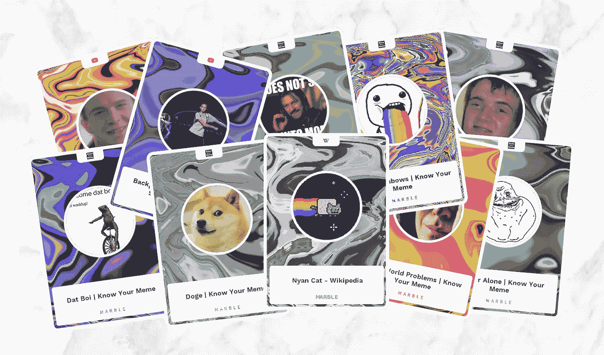
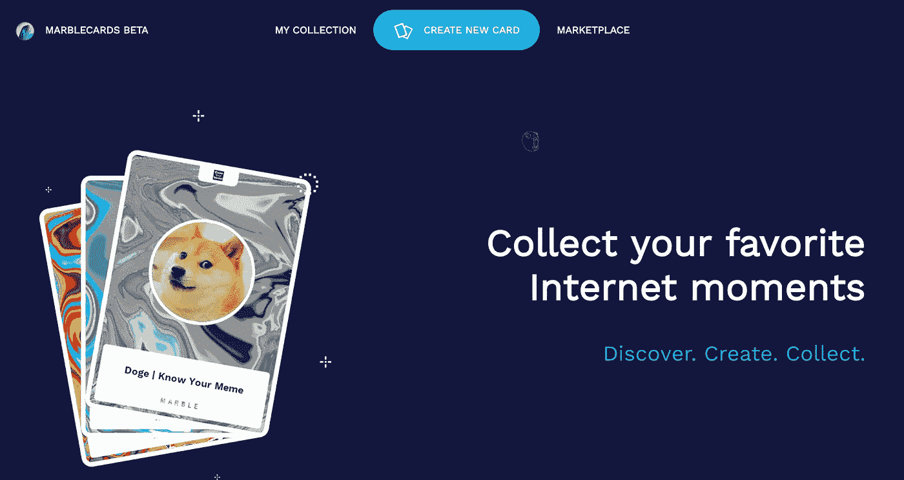

# 模因是互联网的灵魂

> 原文：<https://medium.com/hackernoon/how-to-measure-the-value-of-memes-cf8545dd5419>

YouTubers 和大胆的公司知道如何利用迷因来宣传他们的信息和产品。只需观看佩迪派的任何东西或者看看堡垒之夜的 T2 舞蹈动作。但是，有可能衡量一个模因的价值吗？

比如，我们怎么知道 Doge 是不是比青蛙佩佩更有价值？两位瑞典企业家 Johan Unger 和 Mattias Tyrberg 试图通过推出 MarbleCards 来解决这个问题。这是一个允许人们从互联网上的任何东西创建数字卡片的平台。MarbleCards 的创始人认为，有了一个收集互联网内容的市场，模因的价值最终会显现出来。他们的诀窍是允许任何网页变成一张卡片，但[只有一次](http://www.marble.cards)。

## **弹珠卡到底是什么？**

> 约翰:这是一张来自互联网上任何东西的数字卡。如果它有网址，就可以做成卡片。每张弹珠卡都是独一无二的，它将网页上的内容与生成艺术图案结合成一个独特的数字项目。

大理石卡是以太坊上的 ERC-721 代币，它保证每张卡的所有权，并且只能创建一次。维基百科上的青蛙佩佩和 KnowYourMeme 上的 Doge 将分别只有一个主人。MarbleCards 允许创作者和所有者在拍卖中出售这些独特的卡片，最终将揭示哪个模因最有价值。第一个买卡的人不会花很多钱，但如果它很受欢迎，它的价格会随着时间的推移而上涨。

## 这个真的有市场吗？

> 马蒂亚斯:我们相信是的！我们从一开始就关注加密收藏品市场，并且很高兴看到像 CryptoKitties、Axie Infinity 和 Gods Unchained 这样的项目以不同的方式获得牵引力。

这些新平台正在弥合炉石等数字游戏和万智牌等实体收藏品之间的差距。有了[不可替代的代币](https://hackernoon.com/an-overview-of-non-fungible-tokens-5f140c32a70a)，就有可能保证数字收藏品的真实性、稀有性和所有权。

## 每种只有一张卡片，当你用完迷因时会发生什么？

> 约翰:听起来像是第一世界的问题！不，说真的，我们认为这不会发生。维基百科和 KnowYourMeme 等网站上最受欢迎的模因可能会很快售出，但每天都有新的模因诞生。

MarbleCards 的创始人认为迷因是理查德·道金斯最初描述他们的方式:任何传播的想法都是迷因。因此，一首流行歌曲、一段 YouTube 视频或一条朗朗上口的推文都是模因，如果它们传播开来的话。有了 MarbleCards，你可以收集所有这些，以及任何其他对你有价值的想法或数字信息。

## 收集互联网，你们是认真的吗？

> 马蒂亚斯:我们非常认真，我们对大理石卡有很大的计划。人们不会简单地在以太坊上构建一个应用程序。推出测试版已经做了很多工作，我们对即将到来的卡片设计中的算法艺术有很大的野心。我的意思是，我们本质上是为互联网内容创建漂亮的框架，所以我们真的需要让这些尽可能有趣。

创始人还计划添加游戏元素，类似于你可以从一个雄心勃勃的收藏卡牌游戏中期待的东西。只不过，有了大理石卡片，人们可以自己制作卡片。这是一个全新的东西，我们很期待它的发展。

MarbleCards 即将推出，KnowYourMeme.com 是第一个可用的网站。任何对密码、收藏品或生殖艺术感兴趣的人都可以登录[网站查看](http://www.marble.cards)