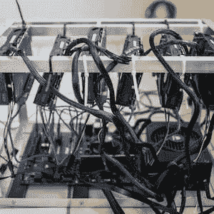
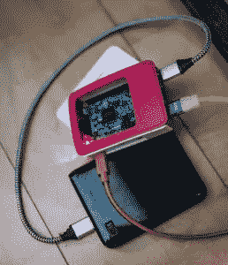
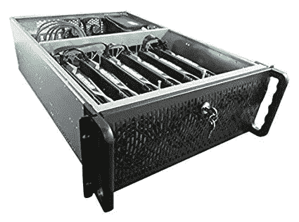
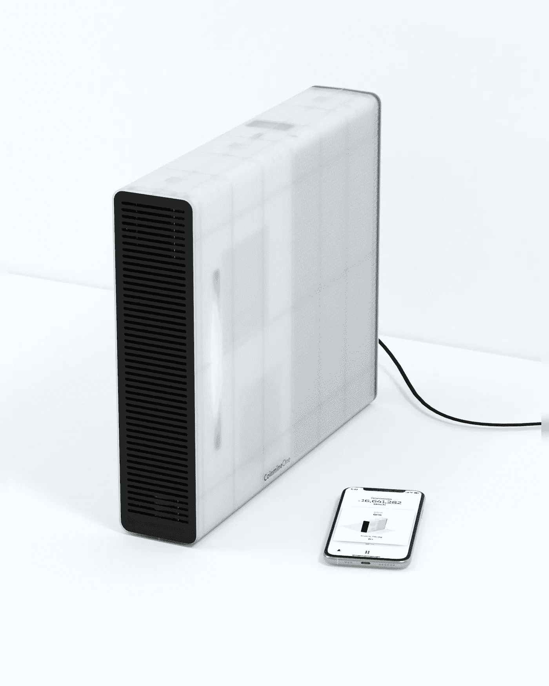
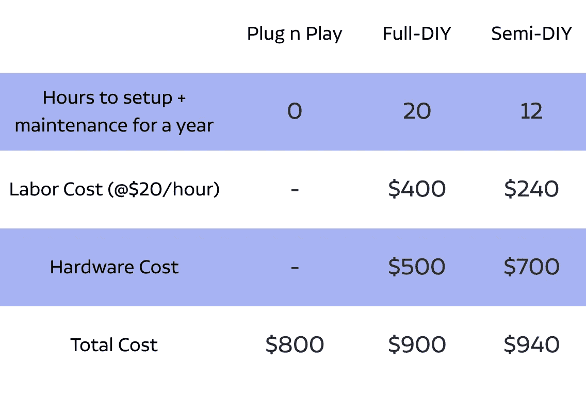

# 如何从家里挖掘加密货币

> 原文：<https://medium.com/hackernoon/how-to-mine-cryptocurrency-from-home-91df45403e89>

有三种方法可以在家挖掘和激活密码。全 DIY、半 DIY 和即插即用。让我们看看时间和金钱方面的成本，以及从哪里开始。

像比特币、以太坊和其他许多加密网络都运行在分散计算上。这意味着这些网络是由全世界数百万台计算机驱动的。作为计算的交换，这些计算机获得了密码。

不同的加密协议有时使用不同类型的计算。比特币和以太坊的工作证明计算称为挖掘。Tezos 的赌注证明计算被称为赌注。比特币闪电有路由，比特币节点有验证。不管怎样，它总是一种计算，有三种方法可以帮助你增强加密网络并为你的计算获得加密。

**1。全 DIY** 花钱最多
**时间**:研究如何造一个，然后造一个矿工和闪电节点。安装操作系统和软件，并在未来几年保持更新。
**金钱**:构建 miner 和 lightning node 的部件，外加安装和更新所需的显示器、键盘和鼠标。

下面是一个 DIY 硬件和软件设置的例子。

Miner, Bitcoin Lightning Node not included.

Bitcoin Lightning Software Not Included

Bitcoin Lightning Node, Software Setup Not Included

**2。半 DIY** 多花钱省点时间
**时间**:研究用哪一个，安装操作系统和软件，并在未来几年保持更新。
**金钱**:购买一个预建的加密矿工或闪电节点(设置、更新和度量需要一个显示器、键盘和鼠标)

这里有一个半 DIY 硬件和软件设置的例子。

**Pre-Built Miner (Bitcoin Lightning Node not included, Software may or may not be included)**

**3。** **即插即用**
不花时间，只花钱。
**时间**:无
**金钱**:购买一个一体机加密矿工和比特币闪电节点。包括硬件、软件和更新。用 app 控制。

这里有一个即插即用解决方案的例子。

Coinmine Plug-n-Play miner and Bitcoin Lightning node. Software and updates included.

不管你怎么做，你都要花费时间和/或金钱。

时间就是金钱。

我们甚至用同样的方式谈论他们。你两个都花了。

我们知道这一点，因为我们亲身经历过。我们从小就在组装电脑。在开始 Coinmine 之前，我们在 Ubuntu 和 Ethos 上从头开始构建自己的矿工。今天，有赌注，比特币闪电和新协议也要跟上。

有很多全 DIY 和半 DIY 硬件和软件解决方案的资源，包括帮助指南、在线小组和预建设备。这里有几个例子。

**全 DIY 资源:** 1 .[vosk coin YouTube](https://www.youtube.com/channel/UCT44w6854K62cSiwA1aiXfw)2。[http://notsofast.com](http://notsofast.com)
3。[https://proofofwalken.com/](https://proofofwalken.com/)4。[http://ethosdistro.com/](http://ethosdistro.com/)5
。[https://simplemining.net/](https://simplemining.net/)

**半 DIY 资源:** 1。[https://miningstore.com/](https://miningstore.com/shop/)2。[https://www.etsy.com](https://www.etsy.com/market/mining_rig)

如今只有几种即插即用的解决方案。

**即插即用资源:** 1。[https://coinmine.com/](https://coinmine.com/)(挖矿和比特币闪电节点)
2。[https://store.casa/](https://store.casa/)(按年订阅的比特币闪电节点)

这里只是一个例子，说明当你决定为自己的采矿、比特币闪电和其他加密解决方案选择即插即用、全 DIY 或半 DIY 时，时间和金钱如何增加总拥有成本。

您可以根据自己的情况使用此表作为模板。也许您的时间更有价值，也许您可以以更低的价格购买硬件，或者也许您需要的时间不同。如果你有一个更大的采矿设备，你也应该记住你的电费。不管你怎么做，越多的人支持加密——越好。请务必了解总拥有成本，包括启动和维护硬件和软件的时间和金钱。今天，你比以往任何时候都有更多的选择来获得奖励，为加密和建立一个新的世界。