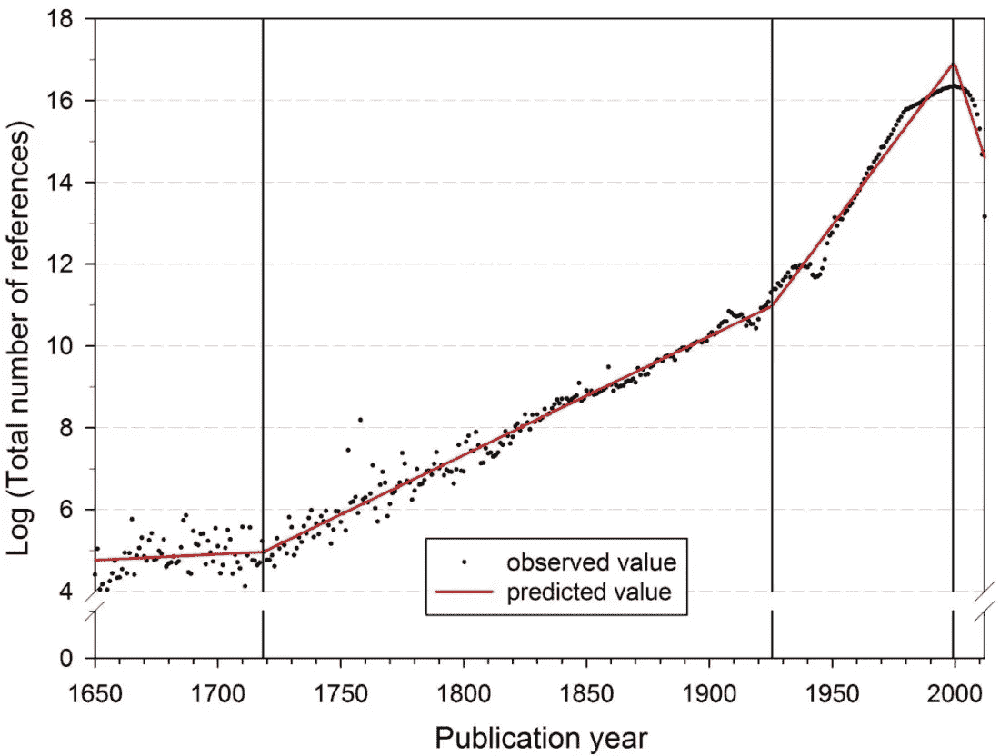

# 如何将你的算法交易经验货币化

> 原文：<https://medium.com/hackernoon/how-to-monetize-your-algorithmic-trading-experience-39552d0d9b69>

Image © Immersion Imagery, Shutterstock.

成为一名算法交易者，你付出了血、汗和泪的代价…这对你有什么影响？如果答案不是“我再也不需要工作了”，那么你需要读一下这篇文章。

路易斯·莫利纳&朱利安·莫利纳

学习交易是一项艰巨的任务。

但是我不需要告诉*你*这一点。

你去过那里。

你知道的。

你投入了无数的时间，狼吞虎咽地读书，盯着屏幕融化了你的眼角膜。掉了一堆头发，没指甲咬了。

你的键盘已经被无情的编码磨坏了——但是——到目前为止还没有任何改变生活的事情发生。

你有过成功和失败的经历。当然，有足够多的好消息让你坚持下去…但是，你仍然觉得你还没有抓住它。

你已经度过了你的*啊哈*时刻，并且确信你已经爬上了陡峭的学习曲线，但是银行账户仍然离你梦想的地方很远。

你猜怎么着？就应该是这样的！

是的，你没听错。

你被博客和论坛上为数不多的成功故事弄得眼花缭乱，以为自己落后了，但事实是这不是真的。

很少有人有改变人生的交易经历。

你属于绝大多数群体。

99%的人。

事实是，任何一个人，不管她训练得多努力，不管她有多聪明，不管她对数字或代码有多擅长……在所有的牺牲、时间和金钱投入之后，从长远来看，持续跑赢市场的机会仍然非常渺茫。

战胜市场绝非易事。

这就是为什么几乎一半的可投资资金是被动投资，通过 ETF 跟踪指数的原因之一。

这就是为什么[主动型经理人正在慢慢成为濒危物种](https://www.bloomberg.com/opinion/articles/2018-04-23/active-money-managers-are-doomed)的原因。

在 AUM，即使是那些大楼里满是宽客和许多零的大公司也不能提供任何接近可靠的东西，所以你为什么要提供呢？

那么…你应该放弃吗？

忘了它？

把你所有的努力和辛苦得来的知识付诸东流？

绝对不会。

你在大脑中精心组装的昂贵工具箱肯定能派上用场。

你只需要改变你的策略。

# 走出盒子

我们已经在某件事情上工作了一段时间。

我们提出了一个理论，解释了为什么投资公司的交易智能没有进化到足以在市场中占据主导地位。

核心论点是，尽管公司获得了大量人才，但它们未能以一种能够产生最佳结果的方式组织人力和机器资源。

直截了当地说，投资公司内部的人在各自为政。

不管是由于激励机制、工作流程、职位划分还是组织要求，关键是——除了少数例外——公司内部很少合作。

事实上，小团队，有时甚至个人都在绝对保密的情况下工作。

是的，保密。

在投资行业，保密是理所当然的。没有人希望他们的邻居知道他们在做什么。没有人希望自己的算法落在别人手里。

这种全行业的方法可能是建立在这样一种信念之上的，即保密使玩家相对于其他市场参与者具有优势。还有一个广为接受的观点是，如果算法被广泛使用，它会失去性能。

不要误会我的意思…我不是说这种想法背后的推理有缺陷。

我要说的是，肯定有其他方法可以解决这些问题，如果找到其他解决方案，那么保密就不再是系统中的一个要求。

所以，再一次…你猜怎么着？

是的，我们确实找到了其他解决方案。

# 全球贸易情报

我们发明了一个框架来打破并超越占统治地位的算法交易模型，并正在推进其实施。

简而言之，我们的模型是关于全球人群创造交易算法，并让他们竞争奖金。

到目前为止一切顺利，对吧？

现在，请做好撞击的准备…

在每次比赛结束后，算法在社区内开源，这样人们就可以分支和改进最好的算法，并把它们放回比赛中，一遍又一遍。这是我们模型的核心。

现在深呼吸。

放轻松。

这不是亵渎。

如果它还没有被理解，并且你还在纠结于*交易*和*开源*被用在同一个句子中的矛盾想法，那么再深呼吸一次，然后按照我的推理…它会想起来的…只要打开你的思维…

开源和开放合作是促进知识进步的最有效的方法。

不需要相信*我*。

这实际上是经过科学证明的，一语双关。

几个世纪以来，科学界一直在开放研究成果、发现和突破。再加上通信技术的进步，[共享模式的结果是，科学产出目前每 9 年翻一番](http://blogs.nature.com/news/2014/05/global-scientific-output-doubles-every-nine-years.html)，看起来非常像指数增长。

Segmented growth of the annual number of cited references from 1650 to 2012

如果科学家们总是在筒仓里工作，你认为人类会怎样？

如果人们总是渴望为自己保留知识，你认为我们的世界会是什么样子？

狩猎和采集？

石器时代？

嗯……同样的推理也适用于投资的主动管理，尤其是算法交易。

投资公司正处于交易的石器时代，因为它们在各自为政。

各公司都在进行一场军备竞赛，闭门造车生产更好的算法，以获得对做同样事情的其他公司的优势。

他们被困在落后的体制中；一条不通向任何地方的路。

# 超级 lgos 的时代

我们对交易未来的愿景是完全不同的:我们设想在人类和机器的开放全球合作中发展出一种卓越的交易智能，为所有人服务。

在我们的模型中，比赛被组织成一个多层的联盟系统，旨在推动向交易大资本发展。

人群自发组织成团队，他们需要在小联盟中获胜才能进入更高的联盟。

底层联赛是短期比赛，资金要求很低，奖金也相对较少。更高的联赛有更长的比赛周期，更高的资本要求，并提供可观的奖金。

赢得联赛的球队获得足够的奖金来支付下一个联赛的资金需求，为表现出色的球队提供流动性。

一个足够大的群体在这种模式下工作和玩耍，将产生如此多样的策略和如此加速的进化，以至于失去优势的算法肯定会被迅速取代，从而否定当前系统的保密文化所体现的两个主要问题。

此外，一个足够大的群体在开放的合作中肯定会产生一种卓越的智慧，这种智慧将超越并打破当前封闭、落后的模式。

Superalgos 项目正在建立一个交易情报市场，各种身份的投资者都可以在这个市场上租用大众的集体交易情报来管理他们的资产。

在我们的模型中，大众拥有企业。

没有中间人。

算法制造商决定使用他们的算法收取的费用，在有趣的比赛和奖金的基础上增加奖励。

一些市场参与者，如 Quantopian、QuantConnect 或 Numerai，正在玩弄外包算法的概念和大众的预测；然而，他们也让他们的群众在筒仓中工作，因为贡献者之间几乎没有合作。不用说，他们的群众也不拥有企业。

最终，Superalgos 应该成为市场中的主导者，拥有该业务的全球业余和专业人士军团零成本工作，产生卓越和不断发展的交易智能，具有可验证和可靠的市场顶级性能。

# 这对你有什么好处

到目前为止，你可能已经找到了一些你想成为 Superalgos 一员的好理由。

然而，到目前为止，你可能已经推断出了更多…

运行 Superalgos 模型所需的技术已经开发了一年多，它仍然处于起步阶段，核心团队和扩展开发团队中的一些开发人员在 alpha 阶段开发了一个工作 MVP。

还记得人群建筑 algos 在交易情报市场拥有*租赁业务*吗？

猜猜谁拥有*系统维护*业务？

没错:开发团队。

我们在开发团队的全球网络上分配系统的开发和维护。作为一个开放的项目，我们努力创建一个高度弹性的人才团体，负责生产和维护项目运行所需的技术。

如果你带来了你的算法交易经验，并建立了一个缺失的拼图，你就可以分享维护平台的业务，这意味着只要你继续维护你的模块，就可以分享运行在平台上的算法所支付的费用。

我们网站上的[加入开发团队](https://superalgos.org/developers-join-dev-team.shtml)页面涵盖了如何成为 Superalgos 开发人员的大部分细节。

如果你喜欢这篇文章，你可能也会喜欢其他相关主题的文章:

[Superalgos &交易奇点](https://hackernoon.com/superalgos-part-one-the-trading-singularity-6f66f419982f)

*“在未来的某一天，能够胜过市场上所有其他实体的交易智能将会出现。人类和当前的算法都将被 Superalgos 超越。”*

[Superalgos:打造交易超级市场](https://hackernoon.com/superalgos-part-two-building-a-trading-supermind-a47bdc73aed)

“一个由人类和机器共同思考和工作的超级智慧，正在尽一切努力最大限度地发挥群体的集体智慧，从而最大限度地缩短超级怪兽出现的时间。”

简单介绍一下我:我是一名企业家，很久以前就开始了他的职业生涯，设计和构建银行系统。经过多年发展出许多有趣的想法后，我在 2017 年创办了 Superalgos。最后，一生的项目。

*关注 Superalgos 上的* [*推特*](https://twitter.com/superalgos) *或* [*脸书*](https://www.facebook.com/Superalgos-375022859724428)*；或访问我们的* [*电报*](https://t.me/superalgoscommunity) *或我们的* [*网站*](https://superalgos.org/) *。*