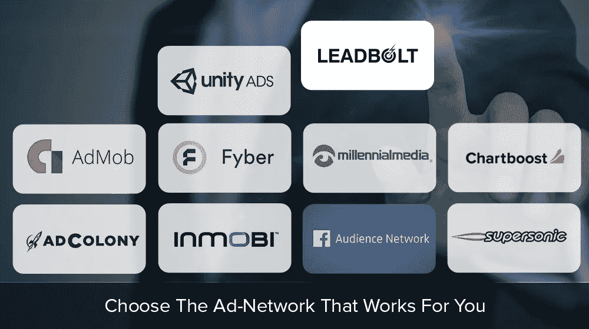
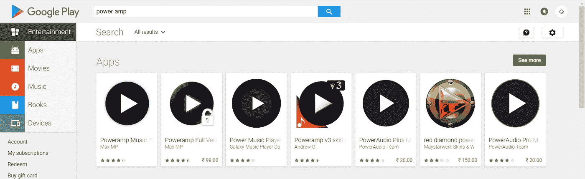
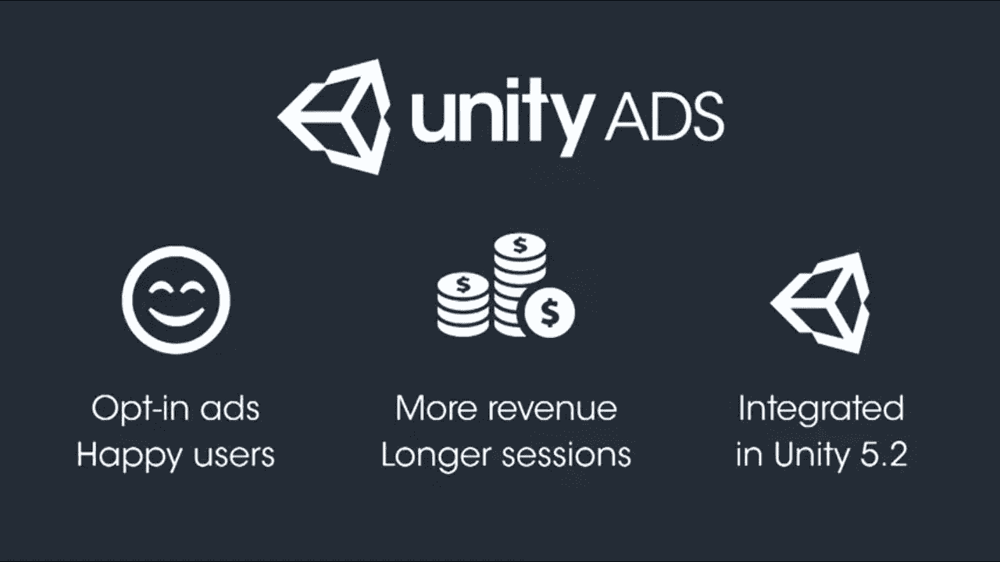
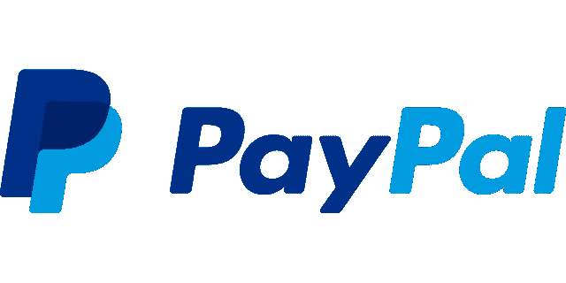
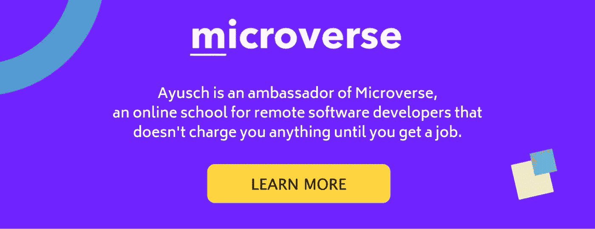

# 如何在 2019 年将你的移动应用货币化

> 原文：<https://medium.com/hackernoon/how-to-monetize-your-mobile-app-in-2019-d28c7a146bb8>

据推测，由于手机和数据价格下降，全球智能手机用户数量增加，移动应用市场将大幅增长。分析师预测，2017 年至 2021 年期间，全球移动应用市场将以 15.14%的 CAGR 增长。

如此广阔的市场也为开发商提供了进入这一潮流并以此为生的机会。2017 年，Sensor Tower 计算出去年应用商店的收入为 385 亿美元(比 2016 年增长 34.7%)，而 Google Play 的估计收入为 2010 万美元(比 2016 年增长 34.2%)。2017 年，这两个市场的总收入约为 587 亿美元，比 2016 年增长了 35%。

而在 2018 年这个数字已经上升到 921 亿美元，其中 76%来自手机游戏。到 2021 年，全球智能手机用户总数将达到 38 亿，略低于当今全球人口的一半。这一增长归功于最近印度和中国移动设备使用的激增。

那么，开发者如何利用这个机会，在继续开发优秀应用的同时为自己做点什么呢？这就是这篇文章的全部内容。

我在下面整理了一份详尽的清单，列出了你可以从移动应用中赚钱并从移动应用开发中获得可持续收入的所有方法。我们开始吧！

# 广告

这是最明显的一个。营销人员想尽一切办法来抓住用户的注意力，让他们进入他们的销售漏斗。有预算的营销人员不会羞于在付费广告上花钱。这导致热门关键词的竞争更加激烈，从而导致该词的竞价更高。

Image Source [Openxcell](https://www.openxcell.com/10-popular-mobile-ad-networks-for-app-monetization)

这意味着你的应用程序上显示的广告对广告商来说将有更高的 **CPC** (每次点击成本)/ **CPM** (每千次展示成本)，这反过来意味着如果广告被点击甚至被观看，你将获得更多收入。

一旦你整合了广告，你就可以专注于尽可能多的营销你的移动应用，扩大你的用户群。

> * *注意:除了用户群/下载次数，你的应用的每日活跃用户也很重要。一个下载量 10000，DAU 4000 的 app，远比一个下载量 100000，DAU 只有 1000 的 app 有价值。所以，作为开发人员，你的工作是开发一些功能来吸引用户，同时也要关注新用户的聚集。***

在选择广告平台时，你应该考虑他们的**广告客户** **基数**，也就是说，有多少广告客户愿意在这个平台上花钱，因为最终，是广告客户为广告付费，你从中获得分成。下面是一个详尽的广告网络列表，你可以考虑拥有大量的广告客户群，并允许你从广告中获得可持续的收入。

**最佳广告网络**

*   Admob :谷歌的 Admob 是最受欢迎的跨平台移动广告网络。它提供高 CPM，你还可以获得与 40 个其他第三方广告网络相关的额外优势。
*   **Unity 广告** : Unity 广告对手机游戏有效。还记得那个无限冲浪游戏吗？你可以看一段视频，然后得到一把生命钥匙；开头在结尾提升？很可能是由 Unity 广告推动的。Unity 是游戏领域的领先公司，其 Unity Engine 是开发手机游戏最受欢迎的软件。它在这个平台上有超过 1B 的游戏玩家，所以规模永远不是问题；)
*   **脸书观众网**:脸书广告长期以来一直是数字营销的先锋，被尼尔·帕特尔、加里·维纳查克等数字营销大师奉为圣杯。脸书已经将其网络扩展到移动设备，现在广告客户也可以将他们的活动扩展到移动设备。
*   InMobi :这个广告网络真是独一无二。他们不按人口统计来定位广告，而是采用恰当的定位方法。他们研究用户如何与你的应用程序互动，并策划用户可以与之互动的广告，从而提供更好的优惠，并最终提高每次点击费用。谈到它的规模，它是最大的移动广告网络之一。它的目标用户超过 15 亿，并且仍在增长。
*   千禧传媒:它被普遍认为是仅次于谷歌的 Admob 的第二大广告网络。它鲜为人知，但在美国确实很受欢迎，因为它有各种各样的广告选择。

其他一些值得一提的是处理优质广告的 Leadbolt。出版商通过 DDM(直接交易市场)直接与优质广告合作伙伴建立联系。 **AdColony** 是一个移动视频广告平台，吸引了广告的高度参与，从而带来了高 CPM 和 CPCV。

# 付费和免费版本

付费应用是在 **playstore** 上赚钱的好方法。广告收入是波动的，取决于有多少广告商愿意在你的应用上做广告。但是创建一个付费应用程序是很棒的。你决定你的应用程序的收费，如果用户想下载，他必须支付全部费用。

但是没有人愿意为一个不知名的商品买单。很难让人放弃这些钱，更不用说为一个不知名的应用付费了。那么如何着手呢？

在 playstore 上结账 **PowerAmp** 。它在 playstore 上提供 15 天的试用版，之后如果用户希望继续使用该应用，他/她必须在 playstore 上购买完整版。

通过这种方式，用户可以体验到应用程序的感觉，以及它是否符合用户的目的。最后，如果他觉得有用，他可以在 playstore 上购买完整版后继续使用该应用程序。

# 应用内购买/免费增值

虽然创建试用版和付费版的应用程序是销售应用程序的好方法，但这可能会导致用户留存率下降。用户可以选择在试用期结束后卸载该应用程序，因为它不再可用。但是这样你就失去了所有的广告收入！！

为了防止这种情况，谷歌推出了一个更优雅的解决方案，即应用内购买。应用内购买允许用户为应用中的扩展功能付费，同时继续使用基础版本。

例如，应用内购买可以让用户删除应用中的所有广告，从而带来更好的应用体验。

这种模式有许多优点。如果用户不想为该特性付费，您仍然可以对用户隐藏该特性，同时让他使用基础版本。这样，你将增加你的 dau，同时也有广告收入。这比用户卸载应用程序要好，并且支付的选项总是开放的，以防用户改变主意；)

**DAU** 是你向投资者推销你的应用时的一个重要指标(如果你最终打算这么做的话)，最好不要搞砸了。因此，免费增值模式非常适合让你的用户参与进来，同时希望他们为扩展功能付费。

# 奖励广告

这款最适合**手游**。这种模式特别受 Unity 的欢迎，用户必须观看 30 秒的广告才能解锁一些特殊的东西，如双倍的硬币/点数，提供延长的健康，或任何其他令人兴奋的功能。

这对各方来说都是一个双赢的局面。广告商物有所值。用户必须耐着性子看完整个广告，才能获得好处。因此，广告商的信息传播得更好。

用户只需静坐 30 秒，就能获得一些优势，比如额外的积分、健康或其他任何东西，否则他将不得不为此付费，或者只是凑合着享受这些好处。在一个人人都爱免费赠品的世界里，这是一个伟大的策略。

开发商最终胜出！！由于广告的**高** **参与**率，广告是昂贵的，这导致开发商的收入增加。除此之外，用户还会收到免费的东西，这让他一直沉迷于这款应用，从而增加了花在这款应用上的平均时间和 **DAUs** 。

如果你能找到一种方法将这种模式集成到你的应用程序中，它会有很好的回报。

# 赞助

这有点**非传统**而且我认为它有很好的潜力，如果做得好，会有巨大的回报。

我们非常了解赞助在 youtube 视频中的运作方式，即一个受欢迎的 YouTube 频道从希望其产品在该频道上得到评论的公司那里免费获得一定数量或一些商品，从而吸引人们对其产品的关注，并最终导致销售额增加。

这在技术上被称为“**影响者营销**”。但这只有在你有大量用户或者你的应用有特定目标的情况下才有效。例如，健身应用程序可以从健身乐队制造商那里获得赞助，以推广他们的乐队。即使这个应用程序可能没有很大的用户群，但每个用户都将是该公司的目标用户，这才是最重要的。

# 捐款

这一类别包括从众筹捐款到贝宝捐款的一切。老实说，广告不是一种很好的用户体验，如果做得过火，实际上会导致沮丧的用户卸载应用程序。

因此，如果你不想整合广告，你可以尝试上面提到的其他选项之一，或者添加一个通过 PayPal 捐款的选项。

你所要做的就是建立一个 PayPal 账户并创建一个 paypal.me 链接。然后你添加一个屏幕，让用户捐赠他们喜欢的应用程序，当他们点击捐赠按钮时，在网页浏览器中打开链接(PayPal.me/XYZ)。用户可以选择捐赠他们喜欢的任何数量。

就我个人而言，我总是尝试并支付应用程序，如果它服务于我的目的，因为我知道它对开发者来说意义重大。如果没有，我会尝试通过贝宝链接捐款。所以，你也可以这样做。

**顺便说一下，这里是我的支付宝链接:**[**https://www.paypal.me/ayusch**](https://www.paypal.me/ayusch)

去给我买瓶啤酒吧！😉

# 结论

上面给出了一个详尽的可行方法列表，开发者可以用它来赚钱。如果我遗漏了什么，请告诉我，我很乐意审阅。

喜欢你读的书吗？别忘了在 [***【脸书】***](https://www.facebook.com/AndroidVille)****Whatsapp、*** *和****LinkedIn****上分享这个帖子。**

**你可以在*[*LinkedIn*](https://www.linkedin.com/in/ayuschjain)*[*Quora*](https://www.quora.com/profile/Ayusch-Jain)*[*Twitter*](https://twitter.com/ayuschjain)*和*[*insta gram*](https://www.instagram.com/androidville/)*那里我* ***回答*** *相关问题另外学习 android 开发可以访问*[*【https://ayusch.com】*](https://ayusch.com)*或者任何* [*网校*](http://microverse.org) *。****

**

Microverse.org**