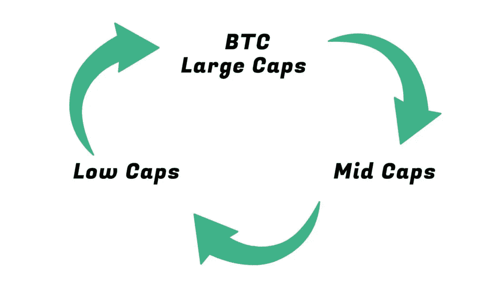
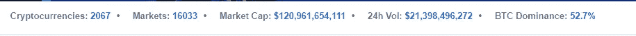
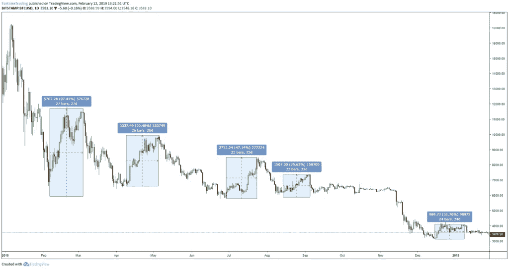
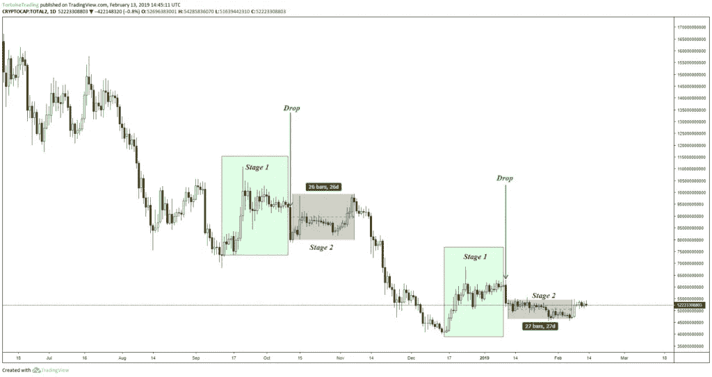
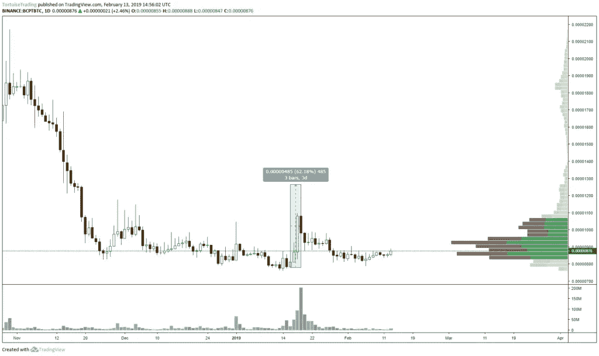

# 如何驾驭加密市场周期

> 原文：<https://medium.com/hackernoon/how-to-navigate-the-crypto-market-cycle-992beae8f364>

在价值 1200 亿美元的加密市场中，资金的流动有一个明确的模式，新来者需要一些时间来完全理解正在发生的事情。你越早明白，你的情况就越好，价格波动也就越少。

**读完这篇文章后，你会:**

*   了解资金如何在加密市场中流动
*   对何时持有 BTC、菲亚特或 ALTS 有一个大致的计划
*   知道哪些硬币通常一起移动

当我们看一下像可口可乐这样市值为 2110 亿美元的公司时，1200 亿美元对于一个行业来说是一个相对较小的市值。这种小市值表明该行业仍处于萌芽状态，还有足够的时间来学习和涉足该行业。

**加密的市场周期是:**

1.  BTC 和大盘股趋势上升
2.  中盘趋势上升
3.  低盖泵
4.  市场趋势下降

这是一种概括，总是有随机的泵和硬币逆潮流而动。对任何投资者来说，尤其是新投资者，当你站在市场趋势和流动的一边时，你会更容易获利。

我将分解周期的每一步，并提供一个我如何在整个过程中转移我的分配的总体计划。在我们开始之前，我想定义一些事情。

**BTC 关联**

自 8 月份以来，BTC 和 alt 一直呈强正相关。这意味着当 BTC 移动时，ALTS 也跟着移动，向上或向下。由于价格如此低迷，从 BTC 传来的任何一丝希望都会提振整个市场。

在牛市中，BTC 和 ALTS 之间存在负相关关系。我预计这种情况会在某个时候出现，因此请密切关注市场反应的任何变化。

专业:瑞士联邦理工学院、长期技术学院、BCH 大学(我还可以列举更多，但我会保持简单)

**大盘股:**Coinmarketcap.com[上大致排名前 20 的硬币](https://coinmarketcap.com/)减去 BTC 和梅杰斯

**中帽:**大约 20–100 对[Coinmarketcap.com](https://coinmarketcap.com/)

**低大写:**其他一切

*我知道这是一种粗略的排序方式，但是对于本文来说已经足够了*

# 第一阶段:BTC 和大盘股趋势上升

通常 BTC 会在市场下跌和盘整后开始下一轮上涨。菲亚特/系绳流入市场，推动 BTC 上升，各大公司也紧随其后。

自熊市开始以来，这一阶段平均持续 25 天。在这个阶段，最保险的做法是持有 BTC。然而，在过去的几个月里，在此期间持有大宗商品实际上是持有杠杆 BTC，进一步增加了你的收益。我会仔细查看大盘股，通常会挑选一两只我认为最有实力的股票。一旦我开始看到 BTC/主要市场的疲软，或者阶段在 15-20 天左右，我就会退出，把我的配置转移到中型股，寻找主要市场的空头。

# 第二阶段:中盘趋势上升

当 BTC 开始波动时，大型股和中型股就会活跃起来。自熊市开始以来，我们已经看到一些硬币消亡，一些人看到的泵比其他人少。并非所有的硬币都会再次上涨，所以为了安全起见，我在玩现货 alts 时会坚持使用币安。如果这枚硬币在币安，至少目前是这样，那么肯定会有足够的需求来交易它。

一旦 BTC 和大公司开始表现疲软，通常会有一个相对较大的下降，影响整个市场。这为第二阶段创造了一个很好的买入机会，也是我打算建仓的时候。上图的下跌是一些资金离开市场，一些资金转移到市场上的其他硬币。从这一点上，我们可以开始看到 BTC 和总市值(不包括 BTC)的横向趋势。请记住，在考察总市值时，大型股占据了市场的大部分。这表明同样的钱在硬币之间转移，没有新的钱进入。

第二阶段的长度不同，许多中盘趋势将从第一阶段开始。然而，大部分收益将出现在“下跌”后的第二阶段。这也给了低价位在强劲的成交量上以更高的高点和更高的低点显示力量的时间。这些是我想要的硬币。

# 第三阶段:低容量泵

Example: BlockMason Credit Protocol pumps and dumps 63% in 3 days

就在中盘交易量最大并开始见顶的时候，资金流入低盘。这标志着周期的结束，我发现这个阶段通常持续 1-2 周。

薄书硬币泵和转储第一，然后低 satoshi 硬币。当交易泵和转储硬币，不要 FOMO 和购买大绿色蜡烛。多数情况下，它们会像大灯芯一样收盘，这样你就买了顶。当交易开始时，假设是在币安，我建议设置止损，然后在交易视图上报警。这将使头寸得到保护，并在卖出时发出警报信号。目前，币安没有允许交易者同时止损和获利的 OCO 交易。这使得交易波动性很大的硬币变得格外危险。

# 第四阶段:市场趋势下降

当低价股开始上涨时，市场的其他部分通常会下跌，BTC 的处境岌岌可危。我的目标是退出所有的 alt 和 BTC 和系绳/菲亚特，而市场决定其下一步走向。当市场下跌时，我不想被套牢。不要和 Alt 结婚，尤其是在熊市。我们在这个领域仍然处于初级阶段，我们不知道哪一个 Alts 将会成为 1%。

# 一起移动的硬币

*这只是一个观察结果，可以随时改变*

1.  **BTC/LTC/ETH/BCH**
2.  **EOS/ADA/NEO**
3.  **DASH/XMR/ZCASH/IOTA**
4.  **XLM/XRP**
5.  **纳米/ONT/兽医**
6.  **万/WTC**
7.  **近地天体/气体**
8.  **POE/OST**
9.  **维贝/DLT/VIB**
10.  **热/NPXS**
11.  **风暴/MFT/钥匙**

你知道还有其他的吗？把它们留在评论里吧。

*原载于*[*tortoisetrading.co*](https://tortoisetrading.co/how-to-navigate-the-crypto-money-flow-cycle/)*。*