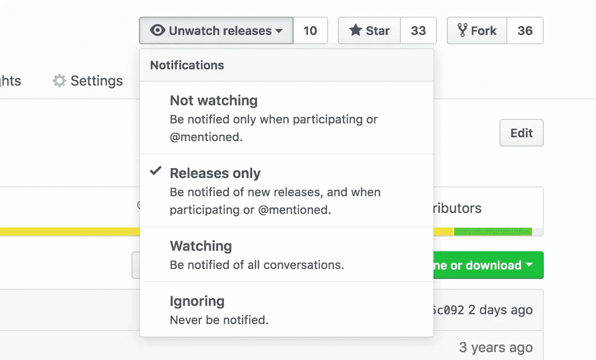
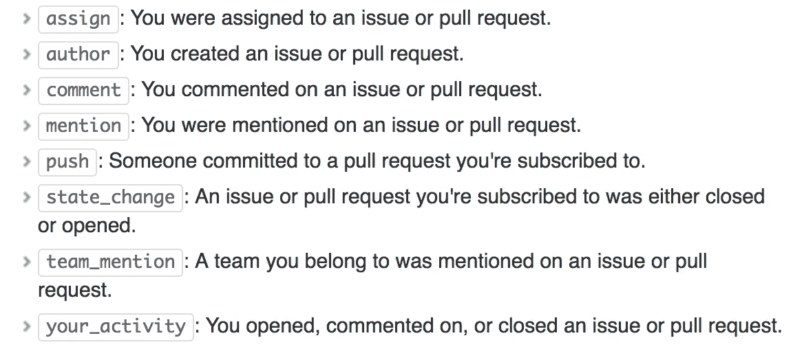
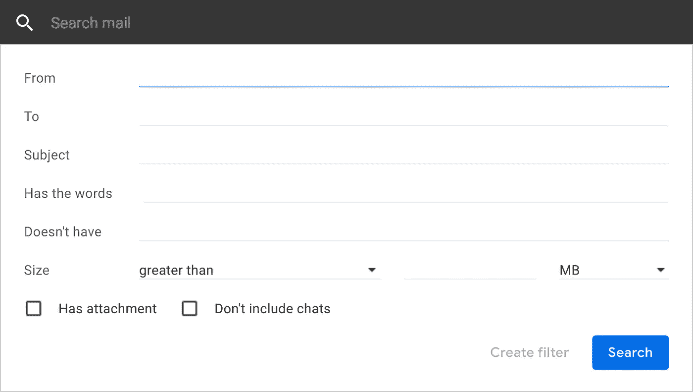
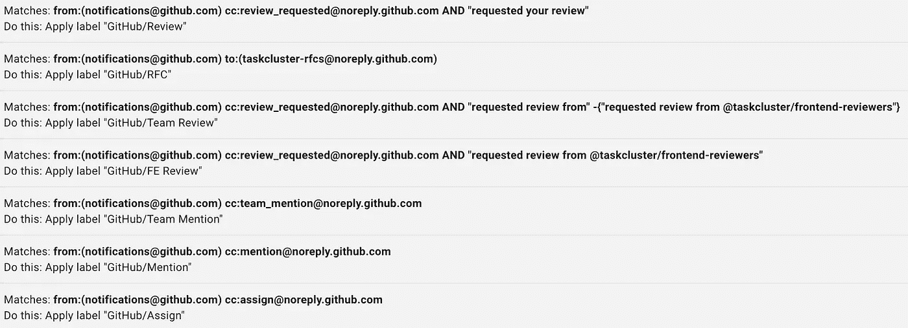
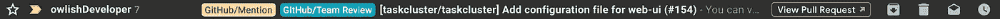

# 如何从不错过 GitHub 提及

> 原文：<https://medium.com/hackernoon/how-to-never-miss-a-github-mention-fdd5a0f9ab6d>

Photo by [David Troeger](https://unsplash.com/@jetlag?utm_source=medium&utm_medium=referral) on [Unsplash](https://unsplash.com?utm_source=medium&utm_medium=referral)

你的团队使用 [GitHub](https://hackernoon.com/tagged/github) 作为他们主要的源代码版本控制吗？我的会，因此我的[电子邮件](https://hackernoon.com/tagged/email)客户端会不断收到 GitHub 消息。每次我在服用 PTO 后恢复工作时，我的一部分都会死去，因为我知道我会回到一页又一页的 GitHub 通知中。此外，如果你碰巧在一个分布式团队中工作，或者你的团队的工作是开源的，那么很有可能你每天醒来都会看到一两页通知。在这篇文章中，我想和你分享两个帮助我管理 GitHub 通知的技巧。

# **降低噪音**

帮你自己一个忙，去 GitHub 的[观看页面](https://github.com/watching)取消订阅任何你不想在新的拉请求和问题出现时收到提醒的存储库。如果您只关心发布的时间，那么导航到存储库的主页，并从下拉菜单中单击“仅发布”。

# 创建过滤器

我发现帮助我管理 GitHub 通知的最好方法之一是创建过滤规则，将标签(标记)附加到电子邮件上。标签类似于文件夹，只是您可以将多个标签应用于一封邮件。我想大多数电子邮件服务都会支持标签，但是如果你的不支持，那么你可能早就该换一个了。

## 识别通知原因

GitHub 在他们的信息方面做得非常好；他们使用电子邮件标题和抄送电子邮件地址来提供通知原因。`From`标题将始终为`[notifications@github.com](mailto:notifications@github.com)` ，第二个抄送电子邮件地址将包含通知原因。通知原因的后缀将始终是`[@noreply](http://twitter.com/noreply).github.com`；但是，前缀将包含通知原因。原因如下:

[https://help.github.com/articles/about-email-notifications/#filtering-email-notifications](https://help.github.com/articles/about-email-notifications/#filtering-email-notifications)

*注意:* `*review_request*` *似乎从*列表中遗漏了

## 给 GitHub 邮件分配标签

为了这篇文章，我将使用 Gmail 服务。如果你以前从未创建过过滤器，去[https://support.google.com/mail/answer/6579?hl=en](https://support.google.com/mail/answer/6579?hl=en)看看如何创建过滤器的简单步骤。

An empty filter form

`From`和`Has the words`输入字段通常足以过滤相应的 GitHub 邮件。对于前者，它将永远是`notifications@github.com`。以下是我在标记 GitHub 通知时考虑的必备条件(以下值对应于`Has the words`字段)。

**请求您的审核**

`cc:review_requested@noreply.github.com AND “requested your review”`

**要求团队评审**

`cc:review_requested@noreply.github.com AND “requested review from”`

**在一个发布/拉动请求中提到了您**

`cc:mention@noreply.github.com`

**您被分配到一个发放/拉动请求**

`cc:assign@noreply.github.com`

*注:* `*AND*` *、* `*cc:*` *、* `*“ ”*` *为搜索算子，可用于生成改进的过滤结果。请随意查看* [*搜索操作符*](https://support.google.com/mail/answer/7190?hl=en) *的完整列表。*

这是我的 GitHub 过滤器的完整列表。

My current list of GitHub filters

…下面是它在用户界面中的显示方式。

作为结束语，减少噪音和创建过滤器对我帮助很大。事实上，我只是在意识到我一直没有提到 GitHub 之后才开始使用标签，特别是在我没有创建也不是审核者的拉请求上。我希望你喜欢这篇文章。请随意分享你的任何其他建议。