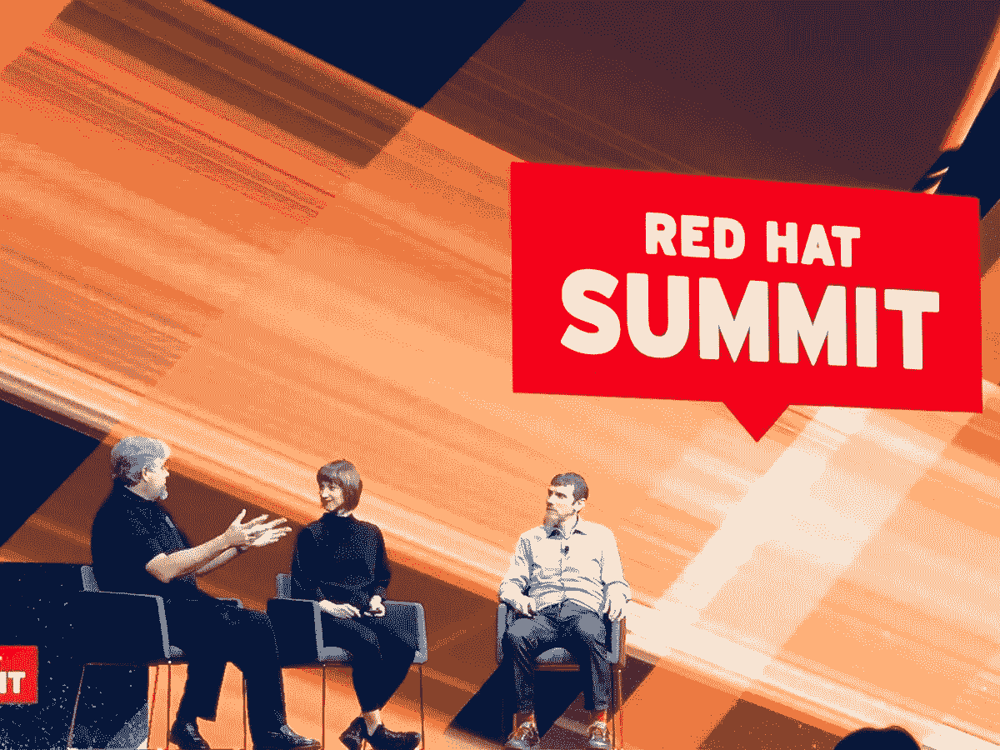

# 如何组织小组

> 原文：<https://medium.com/hackernoon/how-to-organize-a-panel-676b9d82d678>

## 给小组组织者的七个建议

# #1 了解可能出错的方式

如果你还没有读过《 [*十大面板灾难及如何避免》*](http://bit.ly/quaesita_paneldisasters)*》*现在就来看看吧——你回来的时候我还会在这里。

# #2 你只有一份工作！

实际上，您有四个**特定于面板的**任务。(你还有很多关于整个事件，你英雄你。)

到目前为止，**最重要的工作**是挑选一个熟练的版主，所以我的[版主指南](http://bit.ly/quaesita_moderator)可能对你也有用。名单上的灾难几乎都在一个好的版主手里蒸发了。

你的第二份工作是照顾，嗯，组织。范围(通常)包括帮助[主持人](http://bit.ly/quaesita_moderator)协调会议，确保舞台环境舒适，召集小组成员等等。

你的**第三项工作**是选择小组成员，有两条重要原则需要记住:

1.  有适当数量的小组成员。各不相同。
2.  共同的舒适区决定了这个话题。

你的**最后一项工作**将是制作一张好的信息幻灯片，作为小组讨论时的视觉辅助。

# #3 非专家是优秀的主持人

确保你理解一个版主做什么，并且选择一个有能力做这项工作的人。(参见[主持人指南](http://bit.ly/quaesita_moderator)。)领域专业知识不够，有时甚至会对你不利。

> 与直觉相反，主持人最安全的选择是一个非该主题的专家。

非专家不仅更有可能与观众产生共鸣，并要求解释小众术语，而且他们也不太可能因小组中的不同意见而明显受挫。观点鲜明的专家可能会主导对话，而不是促进对话，从而破坏小组讨论。他们也可能担心因为提示澄清而丢面子。

Everything about the organization and moderation of this AI leadership panel was exemplary. The moderator choice was perfect — pay attention to how skillfully [Liv Boeree](/@livboeree) phrases questions to engage nonexpert audience members.

非专家也使自己暴露在更少的职业风险中——如果我主持一个小组，比如说，虚拟现实(不是我的领域),我不必担心因为让两个小组成员支持不同的观点而受到严厉的评判。如果主题是 AI(我的领域)，其中一个成员的观点可能会与我的观点大相径庭。如果我斥责他们或者不给他们说话的空间，我就是一个混蛋版主。如果我不这么做，我会觉得默许他们的观点是在冒职业风险。

也就是说，主持人的专业知识不应该比普通观众少。

# #4 有一个合适的小组成员数量:因人而异。

太多的小组成员很难上演一出好戏，而太少的小组成员可能不具备吸引观众的综合明星力量。两者都对你的活动不利。

> 这是关于明星影响力和讨论质量的结合。

就内容质量而言，主持人倾向于支持两人小组成员。这种形式不是主流的主要原因是出席率。观众需要“有趣”人物的自助餐，如果他们只看到两个名字，他们更有可能跳过，但每个额外的人意味着更难进行真正的讨论和公平地分享聚光灯。四个小组成员是一个好节目的安全极限——没有一个好的主持人就不要尝试。

不要忘记，观众会仔细考虑你的小组成员，所以你的任何选择都可能被解释为一种声明…特别是如果所有的小组成员在某些方面都是相同的。

Many moderators favor the two-panelist format for quality of content. People pictured: [Ritch Houdeck](https://www.linkedin.com/in/ritch-houdek-17638b), SVP of Technology at Kohl’s, [me](https://twitter.com/quaesita), and [Chris Wright](https://twitter.com/kernelcdub), CTO at Red Hat. Location: San Francisco.

# #5 共同舒适区决定了主题

通过选择小组成员的身份，您有效地设定了小组范围的界限。无聊的小组成员对每个人都不好，所以一个好的主持人被训练来推动他们谈论他们共同感兴趣的任何事情。如果你想管理一个技术性的天体物理学小组，不要邀请从未学过物理的人。

# 噪声中的#6 背景信号

还记得那些冗长的自我介绍吗？它们占用了整个会议的分配时间，并且由于导致小组讨论迟到而打乱了会议日程。避免这种情况的最好方法是确保所有的信息都可以被观众看到。你的秘密武器是背景幻灯片(或者没有投影仪的房间里的微型面板的背景海报)。如果有疑问，复制下面的一个。不要忘记确保演讲者知道坐哪个座位——如果与幻灯片中的姓名顺序不符，观众将会感受到不必要的不和谐。

This is almost the gold standard on how to make a background slide. Items passing my harshest checklist: photos of the speakers are present, we know who the moderator is (the orange tag on Liv’s photo), the panel title is present, and names are accompanied by key details. What’s missing? Social media information for the panelists. There were a lot of tweets with great comments from the audience (we panelists do use them as feedback) but they were hard to find because they weren’t tagged.

# #7 信任你的版主

你挑选的[主持人](http://bit.ly/quaesita_moderator)任务艰巨，所以他们指望你的支持。在他们需要的地方帮助他们，但不要紧张地徘徊。在你签完字后，是时候交出方向盘了。不要坚持帮他们整理他们告诉你他们不想要或不需要的东西。

在帕斯卡的赌注风格，你也可以对他们有信心。如果他们不熟练，无论如何你也很难挽救这个面板。如果他们是熟练的，你的信任会让每个人的体验更加积极。

祝你好运！