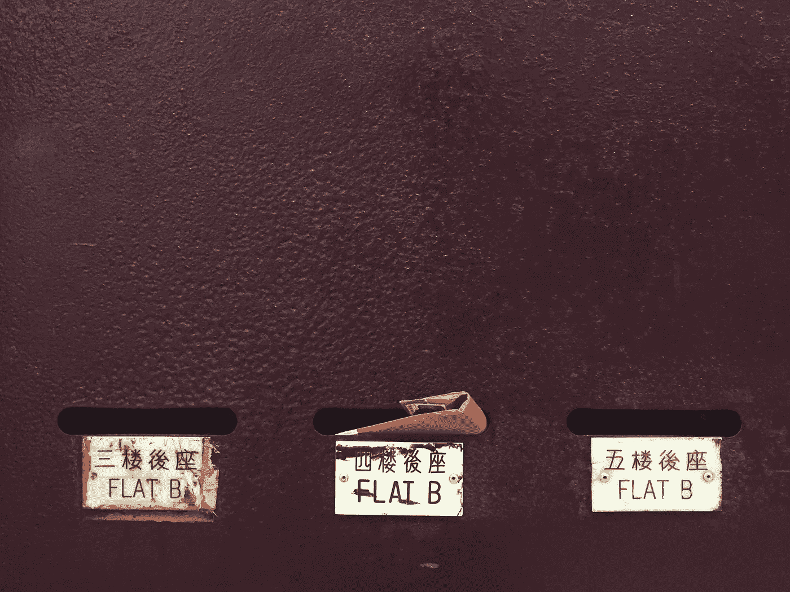

# 如何完全定制 Rails 事务性电子邮件(设计)

> 原文：<https://medium.com/hackernoon/how-to-override-and-customize-devise-mailers-with-rails-bada2cf5a1e1>



Photo by [Damon Lam](https://unsplash.com/photos/asbgMLPcp9Q?utm_source=unsplash&utm_medium=referral&utm_content=creditCopyText) on [Unsplash](https://unsplash.com/?utm_source=unsplash&utm_medium=referral&utm_content=creditCopyText)

在 RMTWRK，我们正在建立世界上最大的[仅远程工作委员会](http://rmtwrk.com),以帮助雇用远程或分布式团队的公司与寻求更灵活工作环境的人进行匹配。因此，我们的 rails 应用程序有两种用户类型，公司用户、招聘人员和个人用户、希望被聘用的人员，我们希望为每种用户类型分别发送确认电子邮件。此外，我们希望使用 [Mailgun](http://mailgun.com/) 的 API 来发送电子邮件，而不是通过 SMTP(稍后将详细介绍)，最后，我们希望使用令人惊叹的 [Premailer](https://github.com/premailer/premailer) gem 在发送电子邮件之前内嵌 CSS 样式。

device 是一个历史悠久、写得最好的 ruby/rails 库，也是最容易定制、变通和覆盖的库之一。虽然它做的太多了，但有时很难知道从哪里开始。

我们将讨论定制 Devise 电子邮件的 3 种方法(或者程度，如果你愿意的话)。

**方法 1:** 简单定制 device 的默认邮件
**方法 2:** 定制 device 用于发送邮件的“布局”和“模板”
**方法 3:** 覆盖 device 发送邮件的方式，使用 API (Mailgun)而不是 SMTP

我将简要介绍前两种方法，并链接到其他资源

## 方法 1:简单定制 Devise 的默认电子邮件

如果你只想修改一些简单的布局，比如**电子邮件确认**电子邮件或**密码重置**电子邮件，那么这就是适合你的方法。首先在你的终端中运行以下程序，然后你可以在*视图/设计/邮件*中编辑你感兴趣的邮件的视图

```
rails generate devise:views
```

要了解更多细节，最好的地方是 GitHub 上的[device Readme](https://github.com/plataformatec/devise#configuring-views)。

## **方法 2:** 定制 Devise 用于发送电子邮件的“布局”和“模板”

如果您想更进一步，定制每个电子邮件模板呈现的布局，那么您可以通过创建自己的 Mailer 类来实现。Devise 也有一个很好的自述文件，告诉你如何做到这一点:[如何:创建自定义布局](https://github.com/plataformatec/devise/wiki/How-To:-Create-custom-layouts)。

使用这种方法需要注意几个潜在的问题。如果您有两种资源类型，比如说**用户**和**个人**(我们实际模型的名称)，拥有两个独立的邮件程序的最简单方法是在每个*资源*中使用方法`**devise_mailer**`。rb 模型文件(下面是简化的例子)。如果您计划移动邮件模板的位置，请确保删除“设计/邮件”中的现有模板，因为它们将覆盖您的其他视图。

这是一个简单的定制设计邮件的例子:

```
class RmtwrkDeviseMailer < Devise::Mailer
  helper  :application *# helpers defined within `application_helper`* include Devise::Controllers::UrlHelpers *# eg. `confirmation_url`
*  default template_path: 'rmtwrk/devise/mailerdefault from: 'RMTWRK <rmtwrk@wrkhq.com>'
  default reply_to: 'RMTWRK <rmtwrk@wrkhq.com>'
  layout  'mailer_rmtwrk'
end
```

你可以告诉你的**个人**模型像这样使用`devise_mailer`方法来使用这个邮件程序:

```
class Individual < ApplicationRecord
  devise :database_autenticatable,..., :confirmable def devise_mailer
    RmtwrkDeviseMailer
  end
end
```

但是如果你想在发送之前对邮件做一些其他的事情呢？这就是方法 3 的用武之地。

## **方法 3:** 覆盖 Devise 发送电子邮件的方式，使用 API 而不是 SMTP

我们的限制:

1.  通过 API 而不是 SMTP 发送电子邮件。出于各种原因，大多数电子邮件提供商建议使用他们的 API 而不是 SMTP。这里以[森德里德的](https://sendgrid.com/blog/web-api-or-smtp-relay-how-should-you-send-your-mail/)和[麦根的](https://help.mailgun.com/hc/en-us/articles/202236484-Should-I-use-SMTP-or-the-HTTP-API-)理由为例。
2.  两个*资源*模型；**用户**和**个人**，使用定计。
3.  独立品牌，即每个型号的*布局*文件。
4.  使用 Premailer 内联我们的 CSS。

为了实现这一点，这个难题的关键部分是覆盖您感兴趣的`Devise::Mailer`方法。在本例中，我们将只关注电子邮件确认电子邮件。默认情况下，这由`confirmation_instructions`方法处理，默认情况下使用`ActionMailer`和 SMTP。

这是我们最终定制设计邮件程序的样子:

我希望这有所帮助！请留下评论或问题，我很乐意回应，但老实说，在 10 个月左右的时间里，最有可能发现这个问题的人可能就是我，嗨，未来的我！

最佳——安德鲁·格蒂格