# 如何顺利通过 KYC 程序:由昌格利解释🚀

> 原文：<https://medium.com/hackernoon/how-to-pass-kyc-changelly-ae36ded55bd5>

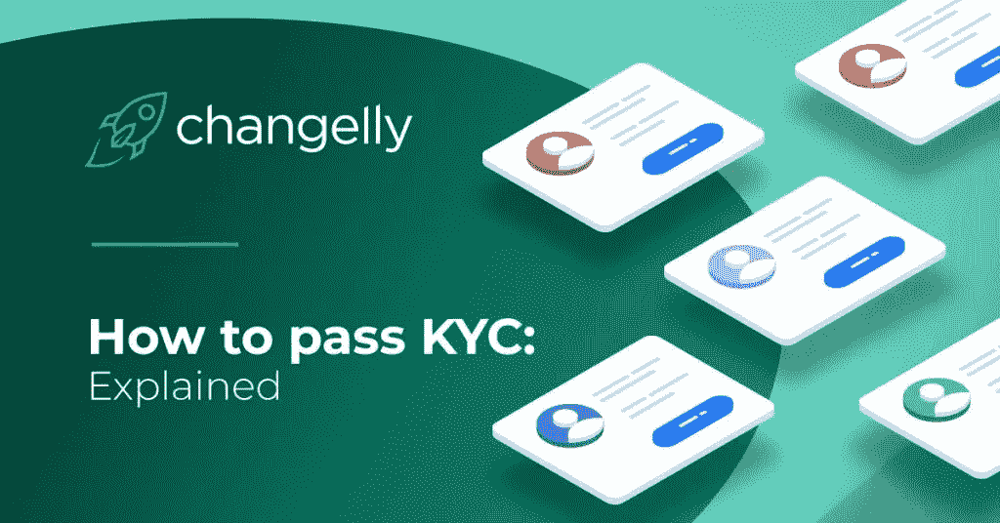

加密货币是一种奇妙的新技术，它将我们与金钱的互动提升到了一个全新的水平。区块链技术吸引了一系列投资者、公司和银行的关注，并为一系列行业提供了巨大的潜力。

*然而，在早期，加密成为欺诈活动的一种简单手段，如运行虚假的 ICO 项目、侵入交易者的账户并窃取资金，以及在暗网上交易。*

*世界各地的立法者都在关注这些问题，并要求加密货币服务实施 KYC，即了解您的客户程序，旨在揭示真实的客户身份。*

# 信任和安全的问题

在 Changelly，我们知道透明度和匿名性在加密领域有多么重要。我们试图在为每个人提供一个平稳和灵活的交换过程和遵守在某些情况下可能对加密有严格限制的规定之间取得平衡。

因此，我们准备了这本方便的指南来展示当 Changelly 用户在 KYC 程序中时实际发生了什么，以便您能够看到这个过程没有什么不方便的。

# KYC 的工作多么多变

*   当您将资金发送到 Changelly 提供的地址时，交换过程就开始了。

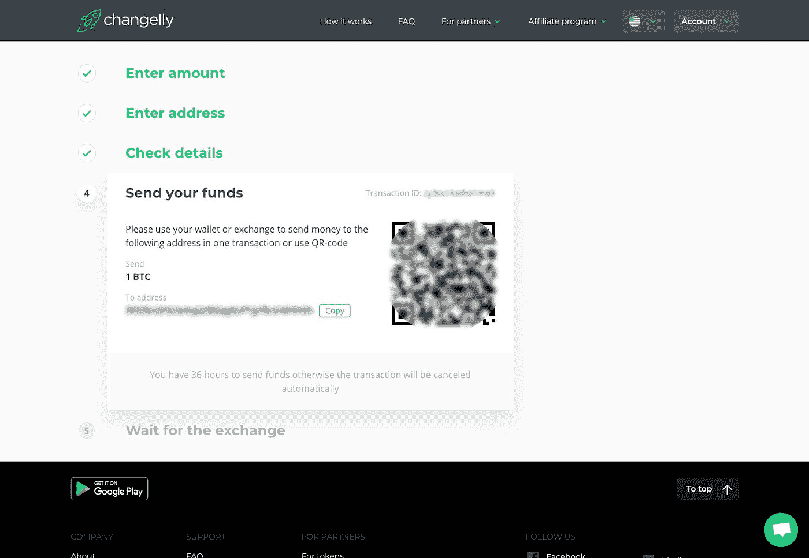

*   “等待交换”的步骤包括三个阶段，即:获得确认、交换加密资产、发送到用户的钱包。

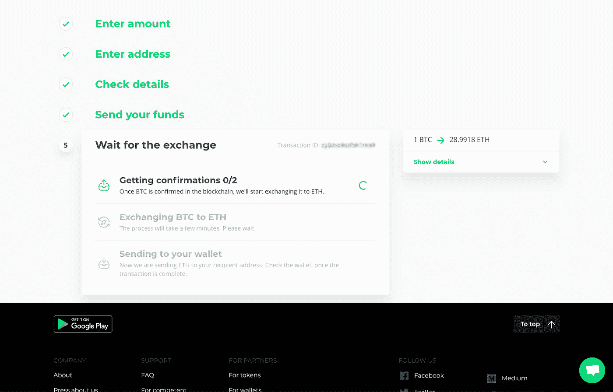

*   如果您在 KYC，您将看到“交易暂停”步骤，这意味着您的交易正在由 Changelly 的 KYC 提供商 SumSub 检查。
*   首先，你需要选择用户类别。如果您是新用户，请选择此用户类型，然后提供您的电子邮件地址并为 Changelly 帐户创建密码，然后按“创建帐户”按钮。

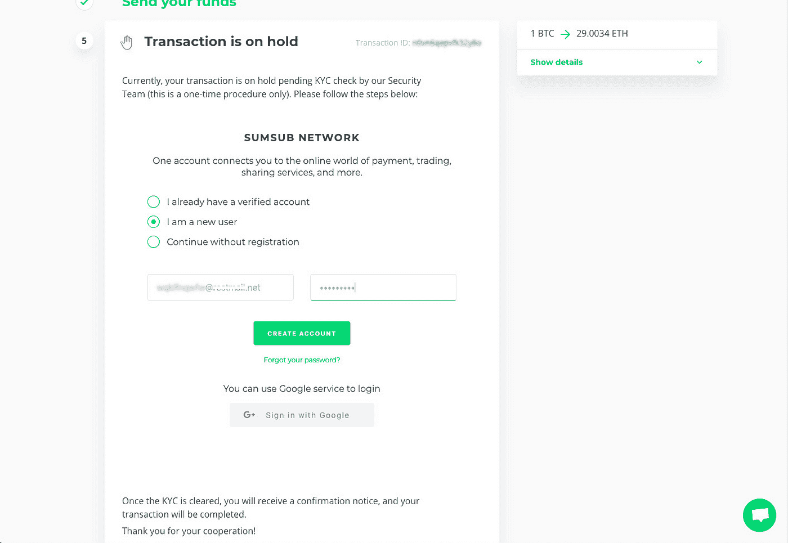

*   要验证您的电子邮件地址，请输入通过电子邮件发送给您的验证码，然后单击“验证”按钮。

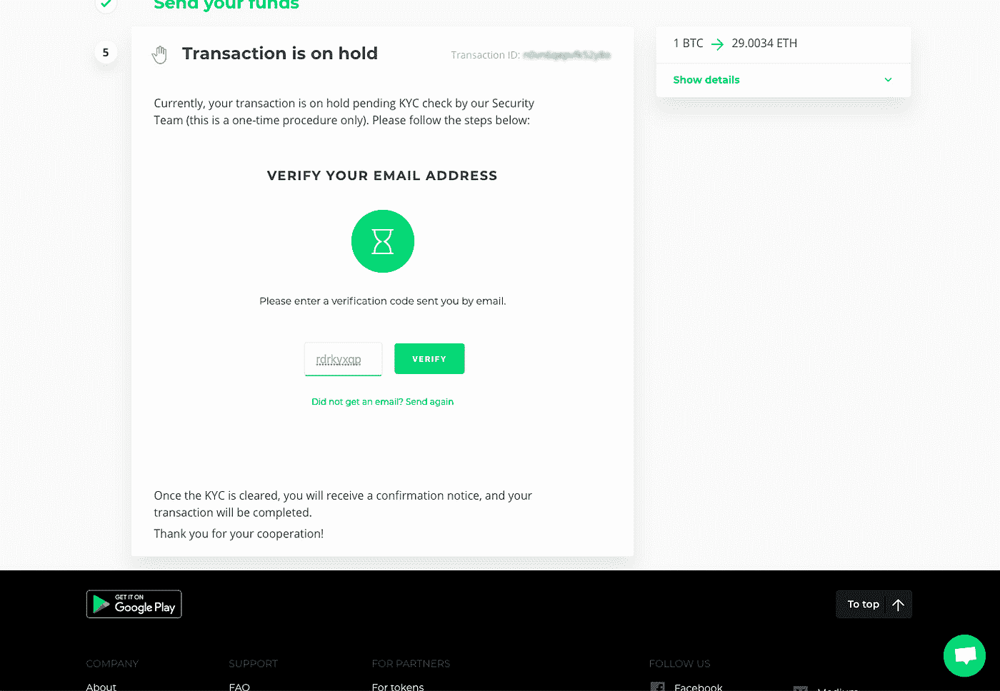

*   要开始对 Changelly 进行身份验证，请按“上传新文档”。准备下列文件之一:护照、身份证或驾驶执照。不要忘记确保选择的文档是有效的。

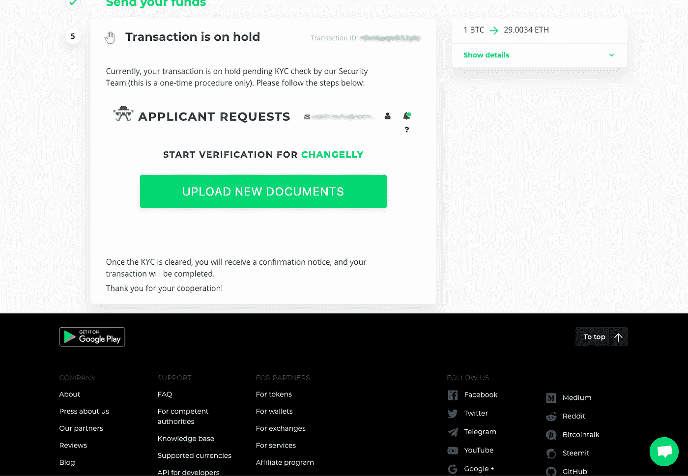

*   接受 Changelly 通用条款和条件、隐私政策，然后单击下一步。

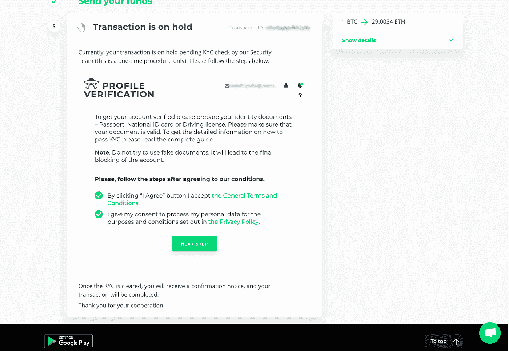

*   在提供的字段中输入您的名字和姓氏，然后单击下一步。

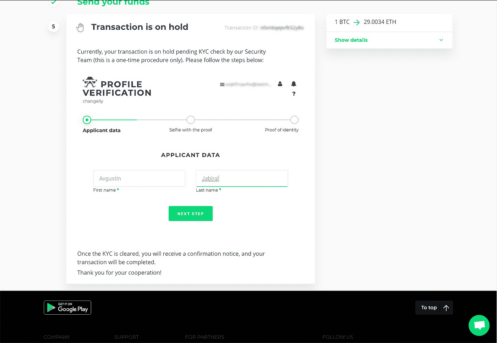

*   将您自己的照片与文档一起上传。

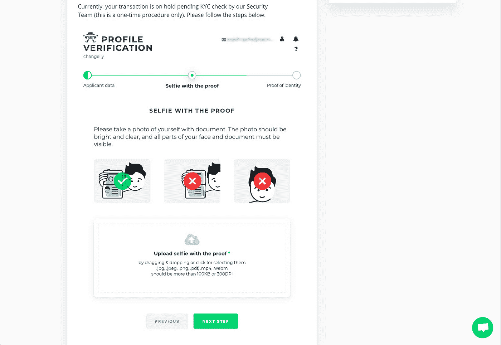

*   制作照片的正确方法在标有绿色勾号的图片中有说明。

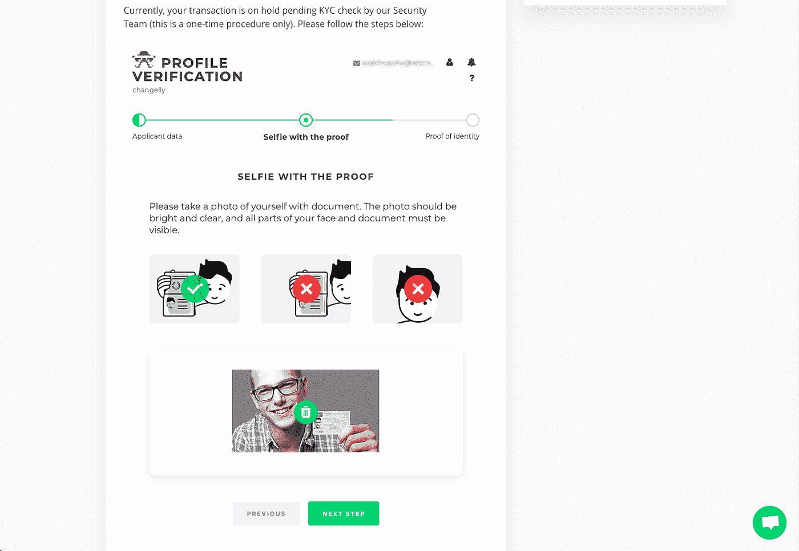

*   选择您的身份所在的国家和 ID 类型。下载文档的照片，然后点击进入下一步。

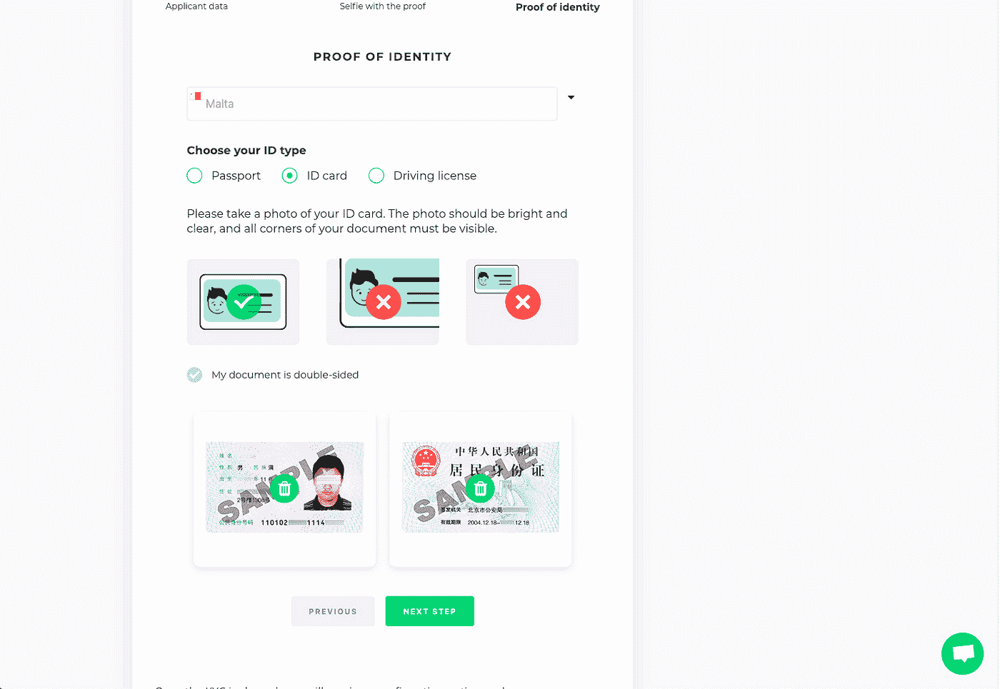

*   再次检查所有提供的信息，然后单击下一步。

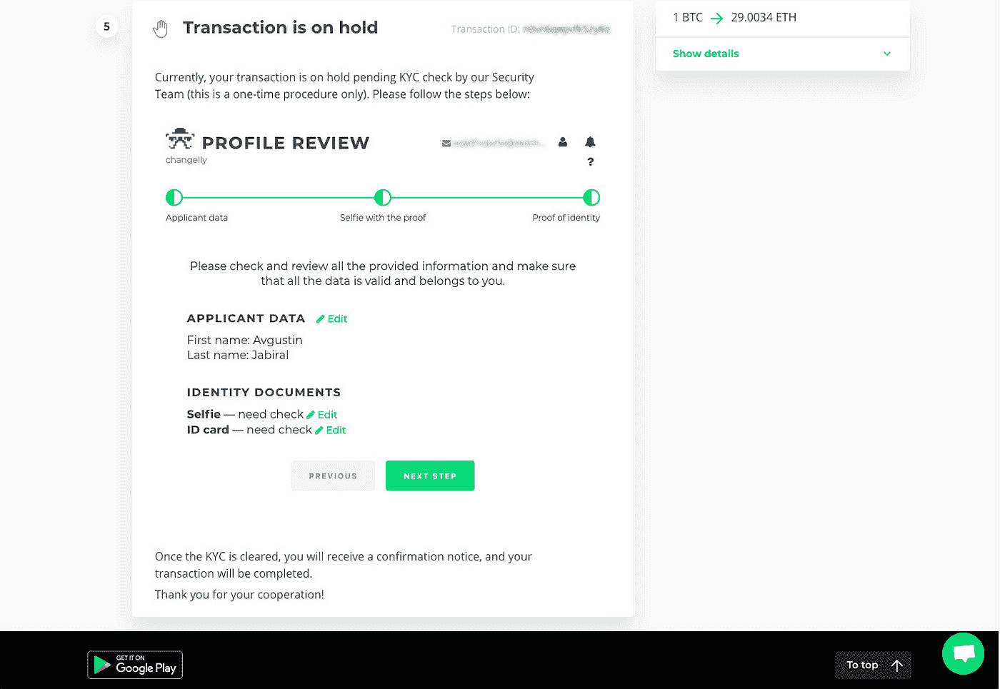

*   从现在开始，系统将检查您的文件。该过程通常需要 1 到 3 分钟，但可能需要 24 小时。

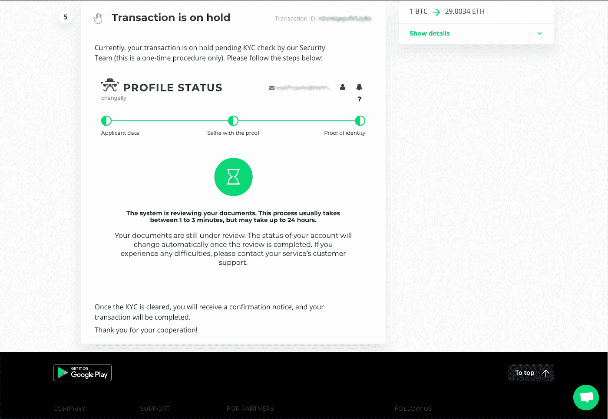

*   一旦您看到“验证程序已完成 90%”这句话，您将在 2 分钟内获得最终解决方案。

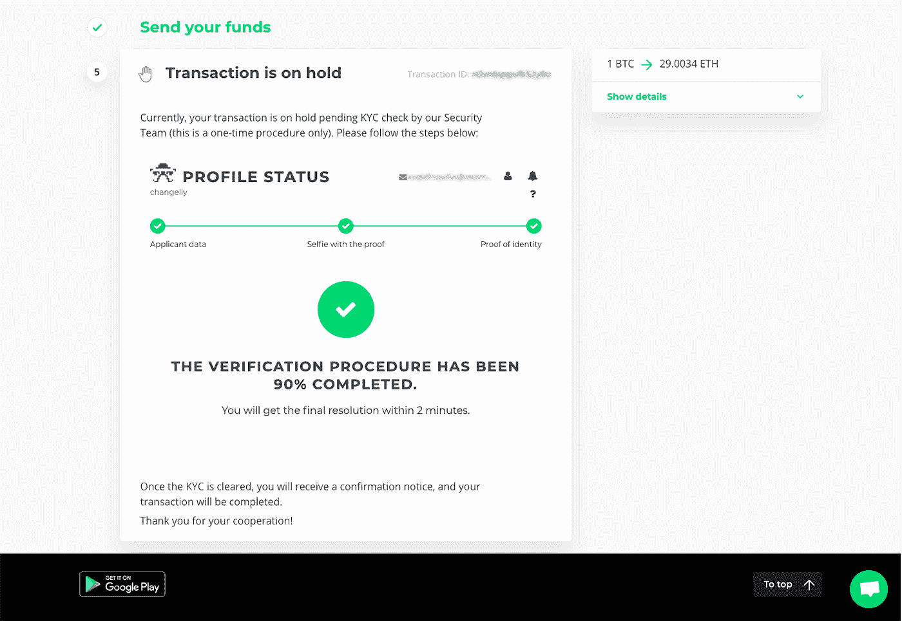

*   当您成功通过 KYC 程序时，您的交易将被向前推进，您将被重定向回交换处理页面。

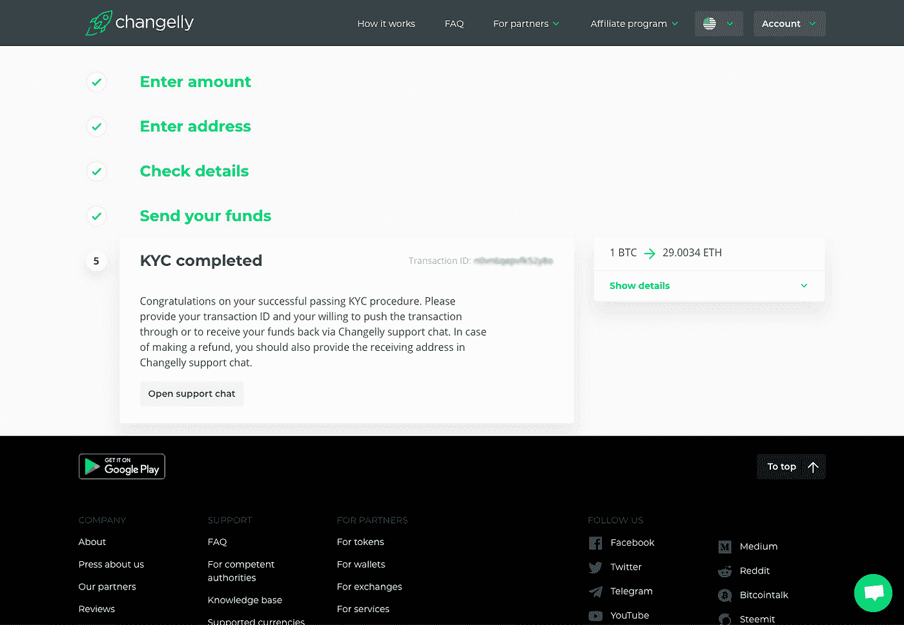

*   就是这样！祝贺 KYC 成功通过。

## 外卖食品

最初催生 crypto 的匿名思想被证明是一把双刃剑。一方面，加密服务应该尊重和保护用户拥有隐私和保持匿名的权利。另一方面，加密货币交易所不应通过提供永久隐藏痕迹的机会来支持非法活动。然而，不可否认的是，KYC 实现已经成为我们不能忽视的大规模加密的副作用。

现在，当你读完这篇教程的时候，不要忘记和你的朋友分享。此外，在社交媒体上订阅我们，了解最新的 Changelly 新闻和更新:

[推特](https://twitter.com/Changelly_team)
[脸书](https://m.facebook.com/changellyteam)
[电报](https://t.me/join_changelly)
[Reddit](https://www.reddit.com/r/Changelly)
[Youtube](https://www.youtube.com/channel/UCDEC0Iw44JxM7cwf4VKFIyA)

不错的交换，#Changellions！

*原载于 2019 年 5 月 15 日*[*https://changelly.com*](https://changelly.com/blog/how-to-pass-kyc-changelly/)*。*