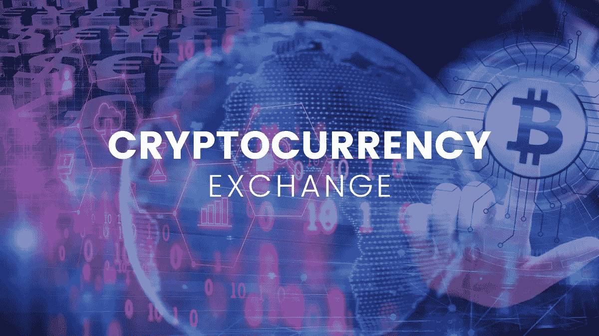
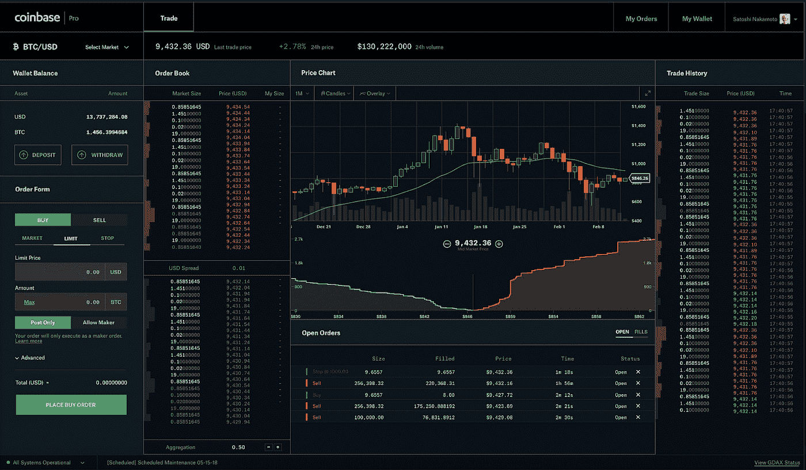
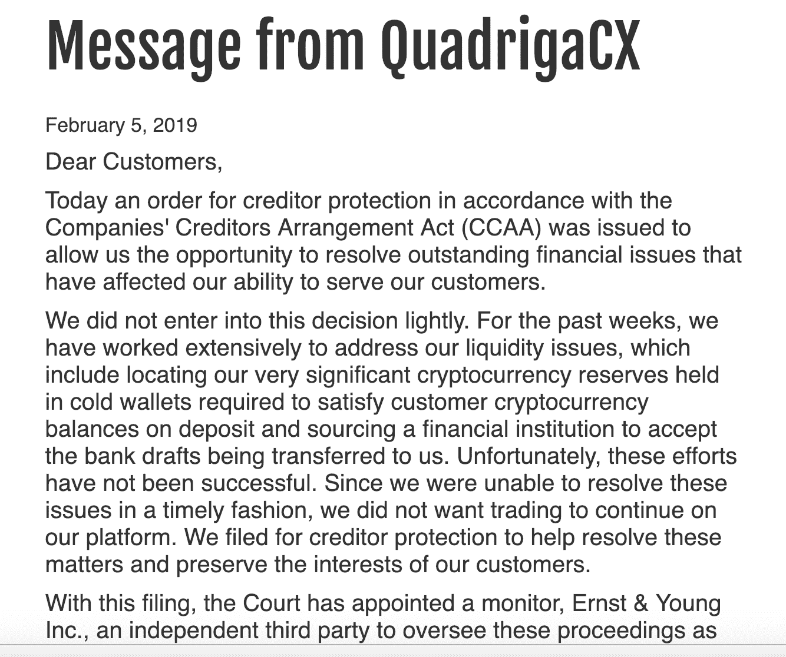
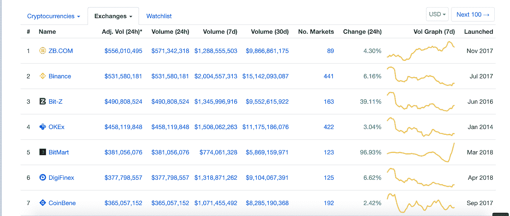
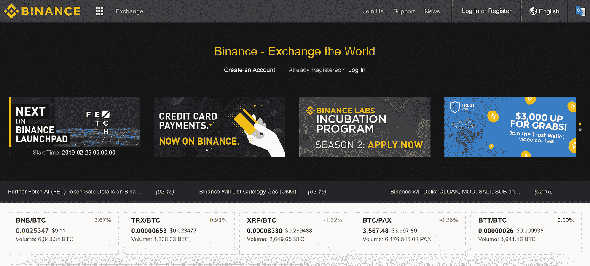

# 如何选择最佳的密码货币兑换

> 原文：<https://medium.com/hackernoon/how-to-pick-the-best-cryptocurrency-exchange-bcabc359a9dd>

交易所是密码货币的门户，但是通过这个门户会有很多考虑和潜在的陷阱。随着超过 200 家数字货币交易所[在 CoinMarketCap](http://coinmarketcap.com/exchanges/volume/24-hour/) 上上市，新加入密码交易的人，甚至是有经验的交易者，都在努力做出正确的选择。在本文中，我们将研究如何选择最好的密码货币交换，考虑诸如个人需求、安全性和可用性等关键问题。

# 选择最佳密码货币兑换的 7 个关键考虑事项

# 1.位置，位置，位置

首先，您要确保您要使用的交易所在您所在的国家可以使用并合法运营。由于许多国家围绕密码货币的监管迷雾，一些交易所并不是在所有辖区都运营。特别是，美国公民可能会发现，许多交易所不接受他们为客户，而在美国，各州的规定可能各不相同。因此，如果您能了解一些您所在地区密码货币的监管情况，将会有所帮助。

[比特币基地](https://coinbase.com)、[双子座](https://gemini.com/)和[比特克斯](https://bittrex.com/)都是美国受监管的密码货币交易所，前两种选择提供了用菲亚特换取密码货币的机会。比特币基地是新用户的热门选择，尽管它为更有经验的交易者提供了“专业”选择。

即使您认为您可以通过使用虚拟专用网络或类似的方式来规避交易所的政策，这也是不明智的。如果交易所在您所在地不合法运作，那么如果您的资金最终被扣留，或者如果其他事情出错，您将几乎没有或没有追索权。

# 2.真实性和声誉

进入密码货币交易市场几乎没有障碍。任何人都可以建立一个交流平台和网站，如果他们知道怎么做的话。因此，你有责任对你信任的公司进行尽职调查。检查交易所是否合法注册为公司。查看他们的网站，看看是否有关于创始人或管理团队的可核实的信息。是否有物理地址或只是一个邮政信箱号码？

密码社区是非常活跃和活跃的。因此，即使在谷歌、Twitter 或 Reddit 上快速搜索加密货币交易所的评论，通常也会从现有用户那里获得对交易所信誉的见解。此外，如果一家交易所受到监管，那么可以相当有把握地假设这家公司声誉良好。例如，总部位于旧金山的北海巨妖交易所在世界各地的监管机构和执法机构中享有盛誉。

# 3.安全性

数字货币交易是一些最臭名昭著的加密事件的主题。在 2014 年的 [Mt.Gox 交易所黑客](http://blockonomi.com/mt-gox-hack/)事件中，损失了 74 万个比特币，相当于当时的 4.3 亿美元。最近，加拿大交易所 QuadrigaCX 承认，在其创始人于 2018 年底去世后，它丢失了约 1.37 亿美元的加密货币，显然是将该交易所的所有私钥带进了坟墓。

在撰写本文的时候，[猜测盛行](/altcoin-magazine/altcoin-news-is-crypto-exchange-quadrigacx-an-exit-scam-e0c9f6cedaf0)QuadrigaCX 事件是一个退出骗局。不管事实是否如此，退出骗局和黑客攻击的风险使得你选择一个安全的加密货币交易所变得绝对重要。对于最大的交易所来说，这意味着将任何存储的资金放在冷库中，并采取足够的安全措施，例如由一群受信任的人进行多重签名访问。充足的保险是保护损失资金的另一种方法。后来，该公司设法取回钱包，但发现它们都被掏空了。

币安、 [Bitstamp](https://www.bitstamp.net/) 和比特币基地都在安全方面享有盛誉。然而，即使是最受信任的加密货币交易所也可能成为事故的牺牲品。因此，最好的方法之一就是不要把你的密码留在交易所里。除非你打算马上交易，否则把它放进一个适当安全的加密货币钱包里。最安全的选择是来自知名公司如 Ledger 或 Trezor 的基于硬件的冷藏钱包。

# 4.成交量和流动性

交易量较高的交易所通常具有较高的流动性，这意味着它们更有可能快速满足您的订单。在币安、 [Coinbene](https://www.coinbene.com/) 或 [Kucoin](https://www.kucoin.com/#/) 等大型交易所交易主要密码时，交易量低和流动性差很少成为问题。硬币市值有[排名表](https://coinmarketcap.com/rankings/exchanges/)，你可以看到交易所按交易量列出。

然而，较大的交易所会收到许多上市申请，导致审批要求更加严格。这可能会限制一些较小的项目，因此它们只能在交易量较低的较小交易所上市。因此，低流动性会成为一个问题。

# 5.客户支持

更大的交易所拥有更大的客户群，进行更多的交易。因此，它们的客户支持往往比较小的交易所发展得更好。当选择加密货币交易所时，检查一下他们有什么样的支持，用什么语言，以及如何联系他们。

同样，加密社区通常对诸如糟糕的客户支持这样的问题直言不讳，所以快速搜索通常会给你一个总体质量的概念。Gemini 和 Bittrex 是两家在客户服务方面一直表现良好的交易所。

# 6.费用和费率

大多数交易所向做市商和接受者收取费用。一条经验法则是，交易规模越大，占交易比例的费用就越低。有些交易所就是比其他交易所贵。尽管比特币基地是新手的好切入点，但经验丰富的交易者往往会避开它，因为费用较高。

还值得检查不同平台之间的加密货币汇率。一些密码交易所将提供比其他更好的利率。如果低费用对你很重要，那么币安是个不错的选择。使用币安硬币(BNB)的好处是费用更低。

# 7.可用性

在不同的加密货币交换站点之间，用户界面的质量可以有很大的不同。有些是令人眼花缭乱的面板和选项卡，显示图表、表格和烛台。其他人更圆滑，对初学者更友好。虽然经验丰富的交易者可能喜欢更多的信息，相对新手可能会喜欢“少即是多”的界面。Poloniex 曾是全球最大的交易所之一，但随着用户界面更加友好的竞争出现，该交易所的交易量大幅下滑。

你是否想从你的智能手机进入交易所是一个进一步的考虑。并非所有的加密货币交易平台都提供移动应用，尽管现在许多平台都提供了。币安移动应用一直被评为最佳加密货币兑换应用。

# 结果

有时，在选择加密货币交易所时，您可能无法考虑上述所有因素。尤其是如果你想买一个更深奥的替代硬币。然而，最好的加密货币交易所是那些在这个列表的大多数标准上得分很高的交易所。由于数字货币大部分仍然不受监管，那么作为尽职调查的一部分，比较加密货币交易所应该是你最重要的优先事项。但最终，这就是让环境如此令人兴奋、多变和充满潜力的原因。

**欲了解更多信息，请访问** [**aelf.io**](http://aelf.io/)