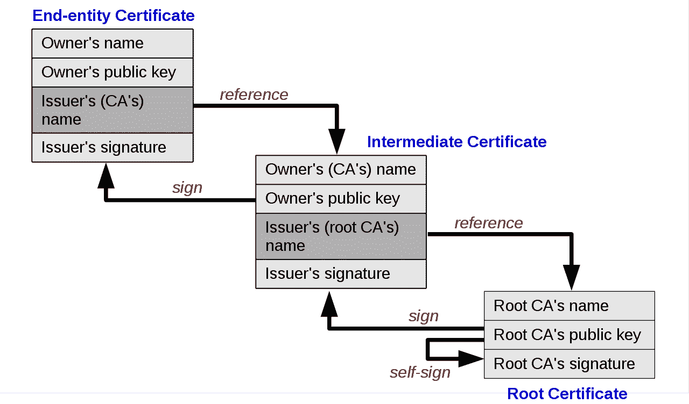
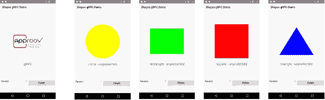
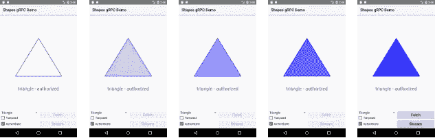

# 如何固定移动 gRPC 连接

> 原文：<https://medium.com/hackernoon/how-to-pin-mobile-grpc-connections-fd3ff1143dda>

## gRPC 连接的移动 API 的最后一英里安全性

在[考虑用于移动 API 的 gRPC](https://blog.approov.io/consider-grpc-for-mobile-apis)中，我们评估了用于移动应用的 [gRPC](https://grpc.io/) 。我们看了一下常见的操作，例如:

*   一个基本的请求-响应 API 调用
*   基于令牌的认证
*   单个请求、流响应 API 调用

我的结论是，对我来说，RPC 函数调用范例比设计和实现一个*完全 RESTful* API 实现更自然，并且我说过，当 API 是静态的并且很好理解时，我会毫不犹豫地将 gRPC 用于移动客户端。

对于移动应用，[证书锁定](https://www.owasp.org/index.php/Certificate_and_Public_Key_Pinning)是加强 API 安全性的一项重要功能，在这个续集中，我们将研究 Android 上 gRPC 的证书锁定。剧透警告——最后，它非常类似于固定一个 restful 连接。

# 证书锁定

[传输层安全性(TLS)](https://en.wikipedia.org/wiki/Transport_Layer_Security) 是一项广为接受且不断发展的标准，旨在加强隐私和消息完整性。建立连接时，服务器端点将其公钥证书发送给发出请求的客户端。客户端遵循信任的证书链，直到它到达它隐式信任的根证书。

Source: [Wikipedia — chain of trust](https://en.wikipedia.org/wiki/Public_key_certificate#/media/File:Chain_of_trust.svg): image originally via Gary Stevens of [HostingCanada.org](https://hostingcanada.org/)

Android 和 iOS 设备维护着一套它们绝对信任的证书。不幸的是，欺骗移动设备信任由意想不到的证书颁发机构签署的证书太容易了。诊断工具，如 [mitmproxy](https://docs.mitmproxy.org/stable/concepts-howmitmproxyworks/) ，使用同样的技术来拦截和潜在地干扰加密的 HTTPS 流。

在移动设备上，应使用[证书锁定](https://www.owasp.org/index.php/Certificate_and_Public_Key_Pinning)来限制对网站叶证书的信任，或仅限于应用程序本身信任的中间或根授权机构。您可以对证书、它们的公钥或它们的公钥散列进行 pin。存储这些证书或密钥 pin 的选项包括:

*   预加载:在分布式应用程序包中嵌入 pin 通常是最容易实现的。不过，升级引脚集需要现场升级应用程序，因此建议在每个版本中安装多个叶引脚和中间引脚。
*   第一次使用时的信任(豆腐):端点的公钥在安装或升级后第一次使用时确定。安全性取决于首次使用时环境的安全性。
*   Pin 服务器:从受信任的服务器请求 pin。您如何信任 pin 服务器？也许你 pin pin 服务器！如果 pin 服务器是稳定的，这允许您管理一组动态的端点，而不需要为所服务的 pin 的每次改变进行应用程序升级。仅当 pin 服务器的证书发生变化时，才需要升级。这是一个有趣的权衡，也是未来文章的主题。

验证锁定证书时，客户端会验证证书的签名和请求的主机名。因为同一个 IP 地址可能共享多个主机名，[服务器名称指示](https://en.wikipedia.org/wiki/Server_Name_Indication)是一个 TLS 扩展，它使客户端能够通过虚拟主机名请求特定的证书。除了在虚拟主机中使用之外，这种技术还简化了从本地主机提供的自签名证书的调试。

# 锁定 gRPC 管理的渠道

使用 gRPC，客户端对*存根*接口进行 *rpc 调用*，存根接口通过*通道*向服务器发送一个或多个 proto 请求消息，并从服务器接收一个或多个响应消息。在[中，考虑用于移动 API 的 gRPC](https://blog.approov.io/consider-grpc-for-mobile-apis)，我们使用一个简单的管理通道进行传输。为了锁定通道，我们将启用 TLS (SSL)并创建我们自己的一组可信证书，与设备上已安装的证书分开。我们将使用 Android 作为例子。

首先，我们将在演示应用程序中构建自己的密钥库。为了方便起见，我们将一组公钥证书存储为原始资源，并在 certs.xml 资源文件中标识这些资源:

当启动`ShapesActivity`时，创建密钥库，并且密钥库和服务器名称覆盖被传递给我们固定的受管通道`PinnedChannelBuilder`:

我们覆盖了服务器名称，这样服务器将响应一个终端实体证书，该证书的公共名称(CN)与我们固定的名称相匹配。

我们正在构建的`PinnedChannelBuilder`将使用定制的`SSLSocketFactory`进行连接。Java 的安全和网络堆栈让这变得有些乏味，需要 1)构建一个包含我们的`java.security.KeyStore`的`javax.net.ssl.TrustManagerFactory`，2)创建一个包含这个`TrustManagerFactory`的`javax.net.ssl.SSLContext`，以及 3)从`SSLContext`中公开`javax.net.ssl.SSLSocketFactory`:

虽然很麻烦，但这与为 restful HTTPS 连接构建自定义套接字工厂没有太大区别，尽管许多网络堆栈和 Android N 有方便的方法来隐藏这种复杂性。

# 尝试一下

为了进行测试，我们使用了之前使用的相同的 shapes 演示应用程序。我们在本地主机上运行一个 gRPC 服务器，为运行在本地 Android 模拟器上的 shapes 应用程序提供一个`shapes.proto` API。

首先，我们将使用 [openssl](https://www.openssl.org/) 为本地主机生成一个自签名私钥、公钥证书对:

应该将 localhost.crt 证书文件复制到 shape 应用程序的原始资源目录中(`app/src/main/res/raw/`)。类似地，我们生成一个`otherhost.crt`证书文件，并将其复制到原始资源目录中。

我们将把`localhost.key`私钥和`localhost.crt`证书文件安装到我们的 gRPC 服务器中。gRPC 服务器通常配置为双向 SSL。我们的客户正在锁定 gRPC 服务器，而不是反过来，所以确保禁用了相互 SSL。

现在我们启动应用程序。被管通道向服务器请求`localhost`证书，通道连接成功。点击`Stream`按钮，我们看到预期的响应:

为了测试锁定，我们从应用程序中删除 localhost 证书并重新启动。这一次，服务器传送本地主机证书，但是信任管理器没有找到匹配的固定证书，因此通道连接失败:

为了简单起见，我们只展示了自签名的叶证书。一个更好的做法是把中级证书固定下来。Square 的 [certstrap 工具](https://github.com/square/certstrap)是一个很好的资源，可以用来生成您自己的测试证书授权和更长的密钥链，如果您想探索这些场景的话。

# 包扎

在 Android 上，我们能够演示一个固定的 gRPC 通道，这并不比固定一个 restful HTTPS 连接更困难。包括[考虑用于移动 API 的 gRPC】，我们已经展示了:](https://blog.approov.io/consider-grpc-for-mobile-apis)

*   一个基本的请求-响应 API 调用
*   基于令牌的认证
*   单个请求、流响应 API 调用
*   到服务器的固定 TLS 连接

gRPC 的函数调用范例，以及 gRPC 从单个原型文件为许多目标语言生成客户端和服务器 API 接口的能力，以及我们对基本和安全 API 功能的演示，使 gRPC 成为移动 API 开发的合理方法。