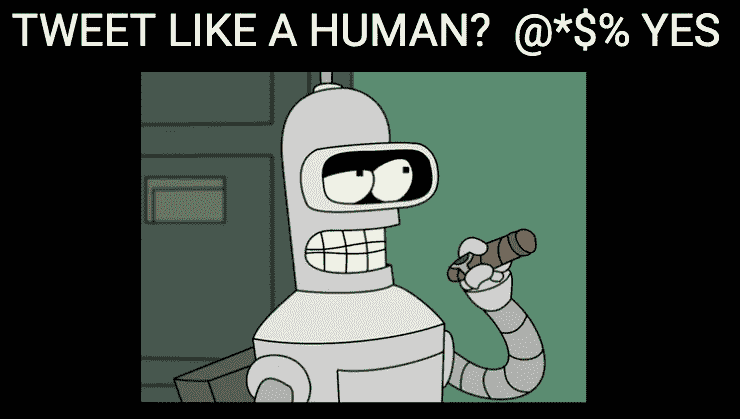

# 如何防止 AI 中的尴尬

> 原文：<https://medium.com/hackernoon/how-to-prevent-embarrassment-in-ai-5e64f437b9bb>

## 必不可少的安全网将拯救你的培根

Here’s the audio version of the article, read for you by the author.

你将如何防止[机器学习](http://bit.ly/quaesita_simplest)中的尴尬？答案是……部分。

Audio version of the article, read for you by the author.

# 期待意想不到的事情！

明智的产品经理和设计师可能会看到一些远在千里之外的问题，并帮助您在生产代码中制定预防性的解决方案，从而挽救您的生命。不幸的是， [AI](http://bit.ly/quaesita_ai) 系统很复杂，你的团队通常不会考虑到所有的事情。

> 会有令人讨厌的惊喜迫使你进入被动模式。

现实生活也是如此。当我计划我的假期时，我是一丝不苟的，但是我没有考虑到由于贝类中毒赞助的医院之旅而错过去罗马的火车的可能性。真实的故事。它教会了大学时代的我永远不要重复*这句话，“我已经想好了一切。”*

Speaking of things [nobody expects](http://bit.ly/thespanishinquisition)…

当意想不到的事情出现时，我们所能期望的最好结果是能够减轻有效反应负担的基础设施。让我们来谈谈为人工智能构建基础设施。

# 来自地狱的聊天机器人

互联网喜欢疯狂的聊天机器人，所以让我们看看一个基于微软聊天机器人的例子。

想象一下，你想制造一个像人类一样发微博的人工智能系统。很自然，你会在真实的人类推特上训练它。现在，快进到它完美地工作。

哒哒！你现在有了一个聊天机器人，它学会了使用脏话，以及当你匿名给这个永远的青少年时，你会得到的其他不受欢迎的行为。(我看到你了，我的巨魔们，[这是给你们的](http://bit.ly/trollololo)。)

虽然结果如预期的那样工作，但是你的用户很沮丧，因为你的机器人诅咒了他们(或者更糟)。很明显，你没有做好准备。你犯了两个错误:你选择的[目标](http://bit.ly/quaesita_first) ( *“像人一样发微博”*而不是*“像一个有礼貌且聪明的人一样发微博，我的企业会为与*联系在一起而感到自豪】 )以及你使用的[数据](http://bit.ly/quaesita_aibias) ( *“来自自由放养的人类的未删节的例子”*)。

# 明显有远见

经验丰富的[机器学习实践者](http://bit.ly/quaesita_datasci)可以预测这个笑点——对此感到惊讶是业余的。常识让你明白，让聊天机器人像人一样发微博实际上是在乞求它开始骂人。

> [AI](http://bit.ly/quaesita_emperor) 系统不会自己思考。事实上，他们根本不思考。

这是人类说话的方式，所以期待你的系统在你的[数据集](http://bit.ly/quaesita_hist)中反映这一不幸的事实——因为不管出于什么悲惨的原因，那些辛辣的词语和古怪的行为*就是你的[数据](http://bit.ly/quaesita_hist)中的*。 [ML/AI](http://bit.ly/quaesita_emperor) 系统是不会自己思考的，不管你怎么试图拟人化它们。他们只是把你展示给他们的图案变成[食谱](http://bit.ly/quaesita_simplest)来创造更多同样的东西。

[Analytics](http://bit.ly/quaesita_datasci) is about getting your eyes on your [data](http://bit.ly/quaesita_hist). It helps you discover issues and plan for them.

当一个行为是不受欢迎的并且你已经预料到了，你可以写代码让它马上变得不可能。如果你缺乏*先验*的思考，甚至还有保护:运行良好的团队在发布之前很久就对训练[数据](http://bit.ly/quaesita_hist)部署[分析](http://bit.ly/quaesita_analysts)并且他们确切地知道他们要求他们的机器学生从学习的[教科书中的内容。如果团队没有通过冥想看到它的到来，当](http://bit.ly/quaesita_aibias)[分析师](http://bit.ly/quaesita_analysts)让他们沉浸在我们这个物种华丽抒情的例子中时，他们几乎不可能错过它。

理想情况下。但是，如果领导们没有提前想到这一点，分析师们打着瞌睡忽略了这一点，那会怎么样呢？

# 事后诸葛亮的后备计划

不要把所有的鸡蛋放在预见篮子里。仅仅依靠你预测所有问题的能力是不明智的。保持安全(r)的一种方法是使用保护:策略层。

> 不要把所有的鸡蛋放在预见篮子里。使用策略层！

一个**策略层**是一个独立的逻辑层，位于 [ML/AI 系统](http://bit.ly/quaesita_emperor)之上。这是一个必备的人工智能安全网，它检查输出，过滤输出，并确定如何处理输出。例如，您的策略可能会说，*“输出中的任何单词都不允许与我们的脏话黑名单相匹配。”*

违反策略的潜在输出会触发您选择的回退，比如*“将冒犯的单词从句子中删除。”或者如果你给了一个微笑，微笑用一个更好的微笑词来代替。*

# 人工智能礼仪

如果有足够多的读者对本文感兴趣，我将写一篇后续文章，更详细地解释策略层。与此同时，如果您将策略层视为人工智能版本的人类礼仪，您就可以直观地了解一些关键点。

> 策略层是相当于人类礼仪的人工智能。

要理解为什么它们是比保护你的系统免受不良数据[影响的天真方法更好的选择，请思考一下 *I* 如何做到不骂 *you* 的巧妙技巧。我碰巧知道一些跨越几种语言的非常辛辣的词，但是你不会听到我在舞台上说这些词。那不是因为我没有想到。是因为我自己在*过滤*。社会教会了我良好的礼仪。幸运的是你(和你的用户！)机器学习](http://bit.ly/quaesita_aibias)也有一个等价的解决方案……这正是政策层。

现在你知道它们的存在，而且它们很容易构建，如果你不立即将它们整合到你的 AI 系统中，那将是非常粗鲁的。

Further etiquette wisdom from the internet.

# 感谢阅读！人工智能课程怎么样？

如果你在这里玩得开心，并且你正在寻找一个为初学者和专家设计的有趣的应用人工智能课程，这里有一个我为你制作的娱乐课程:

Enjoy the entire course playlist here: [bit.ly/machinefriend](http://bit.ly/machinefriend)

# 喜欢作者？与凯西·科兹尔科夫联系

让我们做朋友吧！你可以在 [Twitter](https://twitter.com/quaesita) 、 [YouTube](https://www.youtube.com/channel/UCbOX--VOebPe-MMRkatFRxw) 、 [Substack](http://decision.substack.com) 、 [LinkedIn](https://www.linkedin.com/in/kozyrkov/) 上找到我。有兴趣让我在你的活动上发言吗？使用[表格](http://bit.ly/makecassietalk)取得联系。