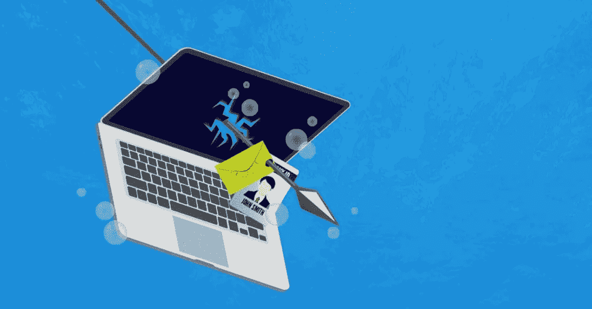
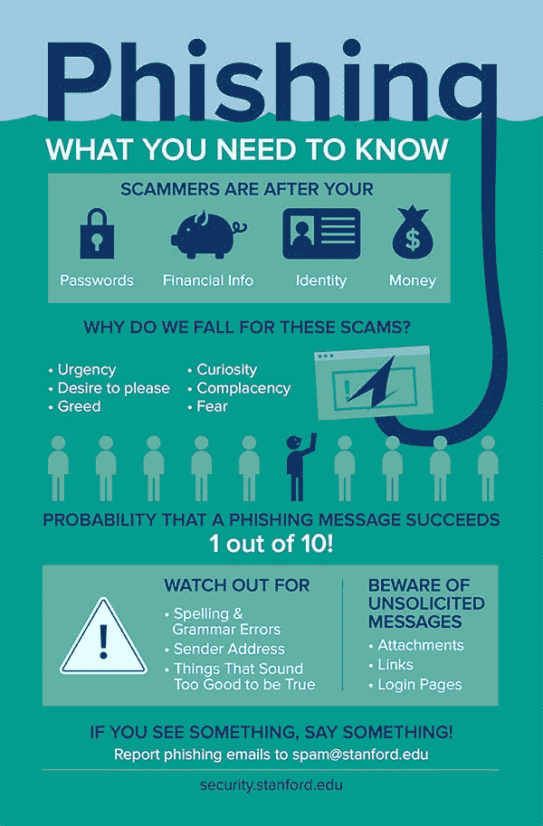

# 如何防止鱼叉式网络钓鱼攻击

> 原文：<https://medium.com/hackernoon/how-to-prevent-spear-phishing-attacks-df35b11133b7>

鱼叉式网络钓鱼是一种针对个人或组织的电子邮件欺骗攻击，旨在窃取您的财务信息或帐户详情等敏感信息。网络罪犯还可以利用它在目标计算机上安装恶意软件。与普通的网络钓鱼攻击不同，鱼叉式网络钓鱼邮件似乎来自朋友或合法组织，如 PayPal、Google 等。

来自可靠来源的电子邮件会导致一些欺诈网站要求您发布一些机密信息或下载一个软件。根据网络世界的调查，[95%的企业安全漏洞](https://www.networkworld.com/article/2164139/how-to-blunt-spear-phishing-attacks.html)是鱼叉式网络钓鱼攻击的结果。即使是大型组织也会成为这类攻击的受害者。 [CNN spear phish hack](https://securityaffairs.co/wordpress/21691/cyber-crime/attackers-used-spear-phishing-attack-hack-cnn-blogs.html) 是每个人都容易受到这些威胁的一个例子。

网络钓鱼攻击由来已久。由于网络罪犯从这些骗局中获取了巨额利润，这种攻击很有可能会继续发生。幸运的是，有一些方法可以避免成为这些骗局的牺牲品。像 phishprotection.com[这样的网站为企业和组织提供反网络钓鱼解决方案。如果你在互联网上稍微小心一点，这些攻击是可以预防的。](https://www.phishprotection.com/content/spear-phishing-prevention/)

这里有一些方法可以避免成为鱼叉式网络钓鱼骗局的受害者。

# 加密敏感数据

加密是保护自己免于成为这些骗局的受害者的好方法。它确保只有授权人员才能访问您的数据。使用全磁盘加密对设备上的数据进行加密。或者，您可以购买加密驱动器来保护您的数据。在使用互联网时，考虑注册 VPN 来加密互联网流量。你也可以使用像 boxcryptor 这样的工具在云上加密你的数据。这样，即使您的帐户被劫持，您的数据也会受到保护。

# 实施 DMARC 认证

在这个数字时代，没有什么是不可能的。假设你收到一封来自 ceo@company.com 的邮件，不要仅仅因为你是从该公司的地址收到的，就认为它是可信的。网络罪犯可以伪造电子邮件的“发件人”字段。鱼叉式网络钓鱼电子邮件看起来很真实，会导致成功的网络钓鱼攻击。实现 DMARC(基于域的消息认证、报告和一致性)有助于防止这些攻击的发生。

这项技术依赖于既定的 SPF(发件人策略框架)和 DKIM(域名密钥识别邮件)标准进行电子邮件身份验证。它根据数据库分析电子邮件，如果没有与发件人电子邮件匹配的记录，它将拒绝该电子邮件。该报告将提交给安全管理员。所有主要的电子邮件提供商，如 Google、Yahoo、AOL，都使用 DMARC 认证来确保用户不会收到假冒的电子邮件。

这是一项伟大的技术，但并非万无一失。2017 年 5 月，黑客成功对谷歌发起了[钓鱼攻击，将谷歌文档链接发送给 Gmail 用户。虽然谷歌在一个小时内停止了攻击，但损害仍然存在。该公司采取了特殊措施，并加强其安全性，以防止另一次](https://money.cnn.com/2017/05/03/technology/google-docs-phishing-attack/index.html)[谷歌鱼叉网络钓鱼](https://money.cnn.com/2017/07/18/technology/google-new-phishing-protection/index.html)攻击。

这并不意味着 DMARC 不能保护你。它仍然有效。这是你应该采取的保护自己免受网络攻击的众多步骤之一。

# 利用人工智能

实施一个人工智能系统，阻止鱼叉式网络钓鱼攻击企图，如品牌假冒、商业电子邮件泄露等。机器学习可以用来分析数据并从中找出模式。使用复杂的人工智能算法，机器学习可以找出模式并发现可能导致攻击的异常。机器学习与强大的异常检测算法相结合，有助于限制鱼叉式网络钓鱼攻击的蔓延。

# 多因素认证

启用多因素身份认证是防止鱼叉式网络钓鱼攻击的另一个好方法。它为您的数据增加了一层额外的安全性。许多企业正在实施这项技术。像谷歌这样的网站已经向用户提供了两步验证。因此，即使黑客掌握了你的一些信息，他们仍然需要绕过另一层安全措施。MFA 要求至少两件身份证明。它可能是一个随机生成的令牌，您的号码上的 OTP，或者额外的登录。尽可能实现它。你将有一个额外的安全层。

# 可疑语法

商业和企业向文案人员支付一大笔费用，让他们创作出语法正确、内容精彩、标题醒目的电子邮件。一个受人尊敬的组织给你发一封语法、标点和错误都很糟糕的邮件是极不可能的。但是，如果您碰巧遇到这种情况，很可能是一些没有经验的骗子发送的。这封邮件的正文中会有一个链接，将你引向一个虚假的网站，要求提供敏感信息。小心谨慎，不要把你的任何信息告诉他们。

# 让您的系统保持最新

让你的系统保持最新是非常重要的。确保你运行的是最新版本的操作系统。如果你运行的是 Windows，微软总是担心用户安全。他们总是在更新安全补丁，这样你的安全就不会受到威胁。安全补丁是必要的，因为它们可以检测最新的网络钓鱼技术，并可以保护您免受这些攻击。因此，请确保您的系统是最新的，并尽可能安装安全补丁。

# 验证站点的 SSL 凭据

当你访问一个网站时，确保它以“https”开头。SSL 确保数据以加密的形式在互联网上发送。不要在没有有效 SSL 证书的网站上填写密码或其他机密信息。它非常有效，可以帮助您防止鱼叉式网络钓鱼攻击。很多时候，当人们在表单上填写他们的信息时，他们不会费心去检查 SSL 证书。这就是为什么他们成为这些骗局的受害者。

对您访问的链接要非常小心，同时要了解最新的鱼叉式网络钓鱼技术。如果足够小心，您可以阻止鱼叉式网络钓鱼。