# 如何从加密货币中获利

> 原文：<https://medium.com/hackernoon/how-to-profit-from-cryptocurrency-c58b93139db3>

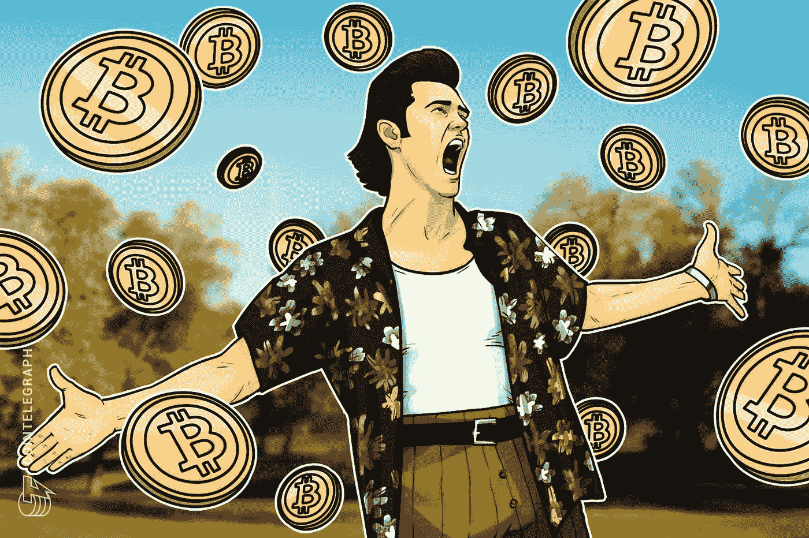

## 这本免费指南着眼于一些策略，帮助你从投资加密货币中获利

加密货币是我们当前时代风险最大但回报最高的投资之一。

从技术爱好者到普通人，各种各样的人都通过投资加密货币赚了大钱。

这导致人们寻找关于加密货币投资的信息，所以我做了这个指南。

从投资加密货币中获利并不需要付费群体或天才。像本指南这样的免费资源应该绰绰有余。

当我说“从加密货币中获利”时。我不是说你投资 100 美元睡觉就能一夜之间成为百万富翁。投资不是这样运作的。

真正的投资是持久的，需要对你投资的项目有所了解。你需要知道加密货币是否真的需要解决它想要解决的问题。

## 本指南将着眼于:

*   不同类型的加密货币
*   何时买入，何时卖出
*   加密货币投资者使用的术语
*   如何从你的投资中获利
*   是什么导致加密货币的价格上涨
*   如何追踪加密货币的价格
*   如何寻找新的机会

## 在我们开始之前，请记住:

*   只投资你能承受的损失
*   根据你的风险承受能力进行投资
*   总是做你自己的额外研究
*   购买比特币的最佳时间是 10 年前，第二好的时间是今天
*   如果你能负担得起，我推荐一个[硬件钱包](https://www.ledgerwallet.com/r/4c54)离线存储多种加密货币: [**在这里查看一些硬件钱包。**](https://www.ledgerwallet.com/r/4c54?path=/products/)

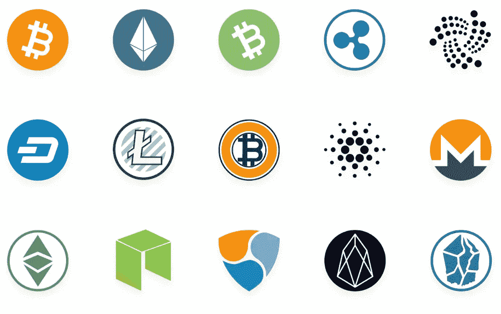

Other cryptocurrencies apart from Bitcoin are known as “altcoins”

# **“安全”策略**

## 比特币不是唯一的加密货币:

比特币以外的加密货币被称为 Altcoins(替代币)。这些替代硬币要么服务于与比特币类似的目的，要么完全不同的目的。

投资加密货币时，你可能想从“蓝筹股”加密货币开始。这些加密货币的市值超过 20 亿美元。

[一些消息来源](https://www.coindesk.com/800-growth-q1s-top-performing-cryptocurrencies-posted-big-gains/)称，市值超过 3000 万美元的加密货币有资格成为蓝筹加密货币。如果你想要更广阔的视角，你可以去 coinmarketcap 网站看看市值超过 3000 万美元的加密货币。

我更喜欢坚持 20 亿美元的限定条件，因为在我看来，这设置了更高的门槛，从而使投资更安全。

## 蓝筹加密货币包括。

市值超过 20 亿美元:

*   BTC——比特币——第一种去中心化的加密货币。
*   ETH —以太坊—智能合约和 Dapp 开发平台。
*   XRP——Ripple——为银行提供超快速、超廉价的国际支付。
*   BCH——比特币现金——比特币叉子，比比特币略快。
*   LTC — Litecoin —比特币分叉，更快更便宜的交易。
*   EOS —开发平台和 DAPP 框架，使用 dpo。
*   BNB——币安硬币——币安交易所的硬币将用于他们即将推出的 DEX。
*   XLM — Stellar —超快速国际支付和开发平台，Ripple & Ethereum 类加密货币。

市值超过 3000 万美元(5 亿美元以上):

*   ADA——Cardano——开发平台，所有代码都经过科学家的同行评审。
*   TRX——创——基于区块链的娱乐内容分享平台。
*   XMR — Monero —基于隐私的加密货币，最受欢迎的隐私币。
*   NEM —企业级开发平台。
*   dash——基于隐私的比特币叉子。
*   XTZ — Tezos —开发平台，使用 dpo。
*   MIOTA — IOTA —物联网支付，零费用。

大多数替代币可以使用比特币(BTC)或以太坊(ETH)购买，但是越来越多的交易所开始直接出售替代币来换取现金，例如:

比特币、以太坊、Ripple、比特币现金、Dash、比特币黄金、Stellar 可以直接从 [**CEX** 购买，供各地用户使用。](https://cex.io/r/0/up106280379/0/)

如果你住在欧洲的任何地方，可以直接从 [**BitPanda**](https://www.bitpanda.com/?ref=3127933809251797450) 购买比特币、NEM、尼奥、卡尔达诺、瑞波、莱特币、IOTA 等等。

对于其他大部分不能直接购买的加密货币，可以使用比特币(BTC)或以太坊(ETH)从 [**币安**](https://www.binance.com/en?ref=11282713) 购买。

# **什么时候买入合适？**

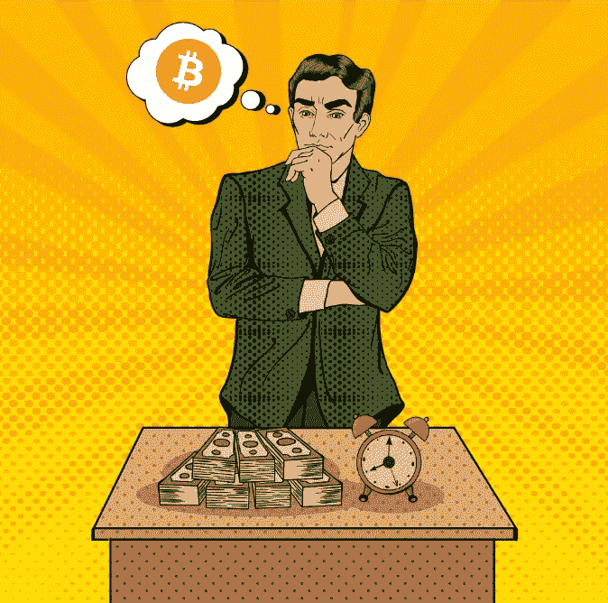

关于这一点，我喜欢遵循两条规则。

## **规则 1:现在就迈出你的第一步**

没有人能确定未来加密货币的价格会是多少，所以如果你对你选择的加密货币有信心，购买少量的加密货币来帮助你起步和奠定基础。

只要你选了一枚好硬币，最好现在就买入并长期持有。如果你试图把握市场时机，你就冒着以后以更高价格买入硬币的风险。

不要做这样的人:

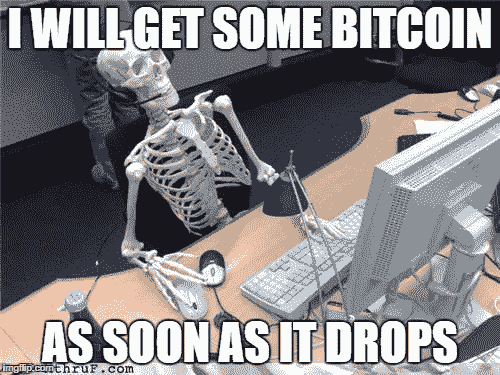

Timing the market is not always a reliable strategy

## **法则二:“当别人贪婪时要恐惧，当别人恐惧时要贪婪”**

这是沃伦·巴菲特的一句名言，它敦促人们在其他人抛售时买入(导致价格下跌)，在所有人都买入时保持谨慎(导致价格上涨)。

通常价格下跌后会出现反弹，导致价格上涨，因此投资者可以利用低迷期以更低的价格购买加密货币。

另一方面，上涨之后通常会出现回调，导致价格大幅下跌。这很自然，因为一旦加密货币的价格上涨，投资者可能会抛售，他们只是在获利。

最好不要想太多，因为它可能变得非常技术性，在我看来，如果你投资了一种好的加密货币，任何时候都是购买的好时机。

另一个很好的建议是要有耐心，如果你在价格高的时候买了一枚硬币，它开始下降，就等着价格回升吧。

你不希望在价格上涨时买入加密货币，然后在价格下跌时卖出，一旦价格再次开始回升，你就会面临很大的压力:

Losing all of your funds can be very stressful, just ask the guy above

另一个买入的好时机是当一枚硬币在积累的时候，这是指这枚硬币在一段时间内缓慢但非常稳定地上涨

如果你预计价格会进一步下跌，你甚至可以在交易所设置自动买单。

你也可以将硬币添加到 Blockfolio 等价格跟踪应用程序中，并设置价格提醒(这将在下文中进一步描述)。

# **低买高卖**

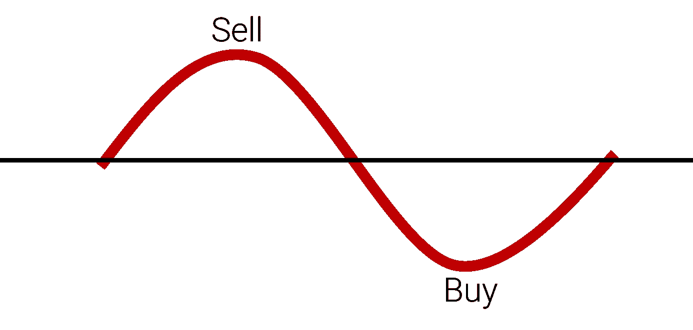

理想情况下，当一种加密货币物美价廉时，你希望投资它，然后在价格大幅上涨后卖出。

例如，如果你在 2016 年 8 月 12 日以 0.01 美元的价格购买了 300，000 股 Stratis，那么按照目前 1.10 美元的价格，你现在将拥有 300，000 美元。

如果你在 2018 年 1 月卖出，你将成为百万富翁，从最初的 3000 美元投资中，以当时每枚硬币 14 美元的价格获得超过 420 万美元。

如果你不是早期投资者，错过了底部价格，你仍然可以在偶尔的下跌中买入，但是仅仅因为你没有在最低价格买入一枚硬币，并不意味着你晚了。由于开发和用户采用需要时间，许多项目需要数年时间才能发挥出全部潜力。

同样，只要你投资了加密货币，耐心对你的帮助就大于伤害。

**让我们回到规则 2:** “当别人贪婪时要恐惧，当别人恐惧时要贪婪”。

这是指在别人都在买的时候等待，在别人都在卖的时候买入。

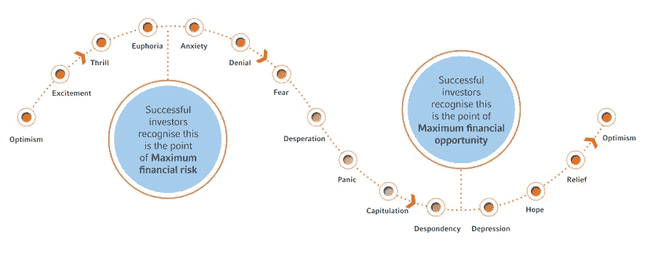

当投资者“贪婪”并购买时，这导致硬币的价格不断上涨，你有可能为硬币支付过高的价格，特别是如果后来出现价格调整(暂时降价)。

如果你看到的是一个没有任何可靠理由的泵(没有新的发展，没有伙伴关系，没有重要的新闻或更新)，那么你最好等待价格再次下跌后再买入。

# **霍德林**

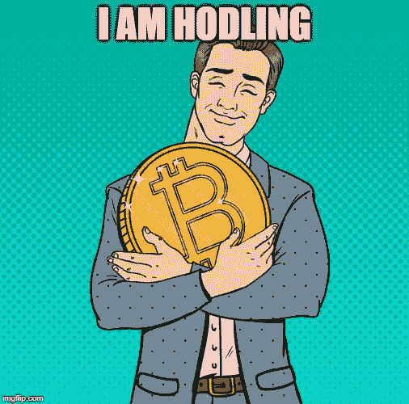

**是的，你没看错，霍德林。**这是一种坚持长期投资而不屈服于抛售冲动的做法。

这实际上是一个迷因，起源于一位比特币投资者在 bitcointalk 论坛上犯的一个[拼写错误。后来，人们开始用 HODL 来表示抓紧宝贵的生命。](https://bitcointalk.org/index.php?topic=375643.0)

许多加密货币投资者声称，他们通过长期持有投资而不是交易赚了更多的钱，而其他人则声称通过交易赚了更多的利润。如果你是新手，我建议你持有，把交易留给专业人士或更有经验的人。

如果你打算加入加密货币军团，那么这里有一些你应该知道的有用术语:

*   sats——Satoshis 的简称，比特币的一个分支，1 Satoshi = 0.00000001 比特币。
*   法定货币，你的标准货币，如美元，英镑，欧元，CNY 等。
*   ATH——硬币价格创历史新高。
*   牛市——硬币价格上涨，鼓励购买的市场
*   熊市——硬币价格下跌，鼓励抛售的市场
*   感觉乐观——对投资价值的增长感到乐观
*   感觉悲观——感觉投资将失去价值
*   弱手——买入一枚硬币的人，一旦价格下跌就卖出
*   强有力的手——不管价格跌得多低，投资者都坚持持有硬币
*   大屠杀——大量硬币价格大幅下跌
*   月亮——价格大幅上涨
*   震荡——当加密货币的价格跌至如此之低，导致许多担忧的投资者亏本出售。
*   Whale 拥有大量加密货币的投资者，由于他们持有大量的加密货币，人们认为他们可以通过买入墙壁、卖出墙壁和抛售大量硬币来影响硬币的价格。
*   买入墙——特定硬币的买入订单远远高于卖出订单。有传言说，鲸鱼可以使用购买订单来试图提高硬币的价格。
*   卖出墙——当卖出订单远高于买入订单时。有传言称，鲸鱼可以使用卖出墙来抑制加密货币的价格(通常这样他们可以为自己积累更多)。**示例:**假设一枚硬币价值 4 美元，总供应量为 500 万枚，有一个以每枚 4.2 美元的价格卖出 100 万枚硬币的订单，价格不会超过这个价格。
*   FUD——恐惧、不确定、怀疑。关于加密货币的负面消息正在传播。FUD 会让投资者怀疑他们的投资，卖掉他们的投资，或者阻止其他投资者买入一枚硬币。
*   泵转储(pump & Dump)——一种方案，其中团体在加密货币便宜时购买加密货币，并传播炒作，导致不知情的投资者购买，然后导致价格“泵”起来，然后新投资者被早期投资者“甩”出去，因为他们获得了利润。抛售之后，价格下跌，受骗的投资者被称为“袋持有者”。
*   袋持有人——持有可能的不良投资的投资者，也称为“左袋持有人”,他们可能是抽水和倾倒计划的受害者，或者他们只是在 ATH 买入一枚劣质硬币，然后在硬币价格下跌时继续持有。
*   FOMO——害怕错过，当投资者疯狂买入一枚硬币以避免错过价格上涨时，这通常发生在加油期间。
*   新血/鲜肉——新手或新投资者的另一个词。
*   DYOR——自己做研究
*   premine——premine 是指开发者在向开放社区发布源代码之前，向特定地址分配一定数量的硬币。通常当这种情况发生时，开发人员会出于某种特殊原因为自己预留一定数量的硬币。
*   血腥星期一——一个由加密 Twitter 创造的术语，根据他们的说法，大多数替代硬币的价格在每周一都会下降。

# **获利回吐**

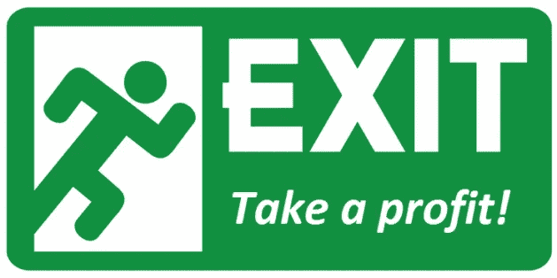

## *你为什么想要获利？*

以另一种形式(如法定货币)保护您的利润。

你可以从比特币中获利，然后用比特币购买新的加密货币，或者增持当前的替代比特币。

如果你的投资收益很高(10 倍至 100 倍)，你可以将利润投入比特币或法币，并在价格下跌时买入更多同样的硬币。

分散投资于传统投资，如黄金/白银、股票、指数基金、共同基金、房地产投资信托基金等。

如果你想从加密货币中获利，如果你认为加密货币的价值在未来会继续增加，我建议套现不超过 50%。

让我们称之为“耙子”法，每当你的投资达到历史最高水平时，你就拿出一定比例的利润。

例如，你以 0.50 美元的价格购买了价值 5000 美元的加密货币，当价格达到 5 美元时，你获得了 10 倍的收益，剩下 5 万美元。

现在你卖出 10，000 美元 **(20%)** ，保留剩余的 40，000 美元 **(80%)** 。在牛市中，10 倍的收益并不罕见，事实上也在意料之中。

这在熊市来临之前可能非常有效，在熊市中，大多数加密货币的价格都会下跌，因为投资者会抛售它们的代币，让你可以以更低的价格买回它们。

## **是什么原因导致硬币价格上涨？**

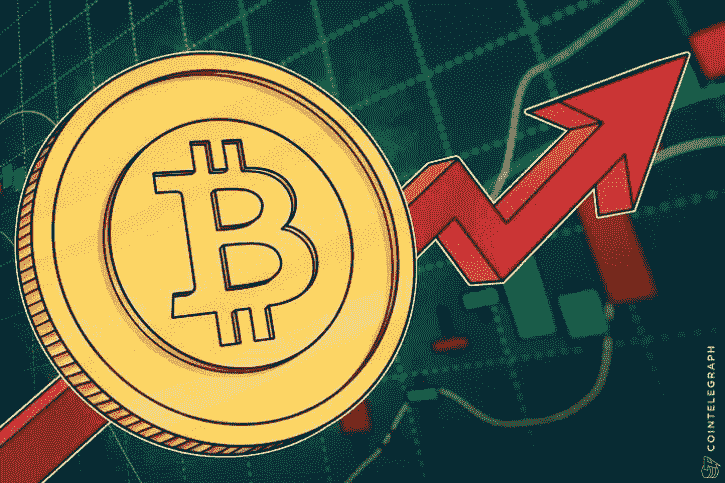

加密货币价格高增长的一个原因是其代币的供应，自然，如果某种东西供应稀缺而需求高，其价值就会增加。

可能导致加密货币价格上涨的其他因素包括:

*   新的开发和公告，如果一种加密货币有一个庞大的社区，一个简单的公告或新功能可以引起一波巨大的购买行为，从而提高硬币的价格。
*   加密货币开发商达到路线图期限和目标，这可能会导致投资者更多地购买加密货币，因为信心增加了。
*   小型交易所的加密货币被添加到更大、更受欢迎的交易所(增加用户采用率)
*   泵和转储组，通常与真正的小和阴暗的加密货币更容易操纵。
*   炒作，拥有大量追随者和影响力的人可以促使人们投资加密货币，约翰·迈克菲就是一个例子。
*   加密货币在现实世界中的使用和采用，减少了供给，增加了需求

您可以使用加密货币的供应量和市值，通过以下公式准确计算价格:

**市值/流通供应量=价格**

例如，比特币目前的市值为 93，779，421，380 美元，流通供应量为 17，654，937 BTC，因此:

93，779，421，380 美元/17，654，937 BTC = 5311.79 美元 2019 年 4 月 20 日比特币的价格。

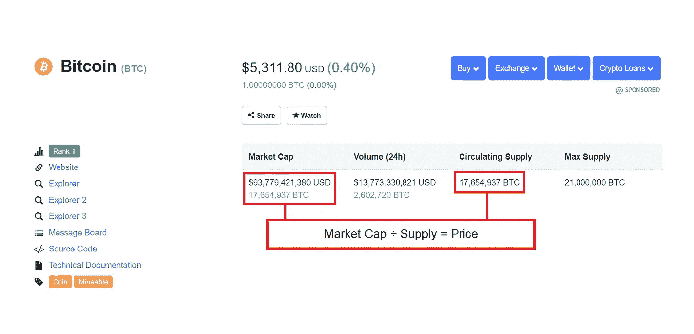

你也可以使用加密货币市场进行价格预测。

假设你遇到一个人，他预测到 2020 年比特币的市值将达到 1 万亿美元，那么你会这样计算:

10 亿美元/17，654，937 = 56，641.38 美元到 2020 年的预测价格。

然而，请记住，届时加密货币的流通供应量可能会增加，这将影响预测的价格，但在大多数情况下不会增加太多。

你可以在 coinmarketcap.com 的[找到一个硬币供应和市场。](https://coinmarketcap.com/)

# **追踪加密货币价格&利润**

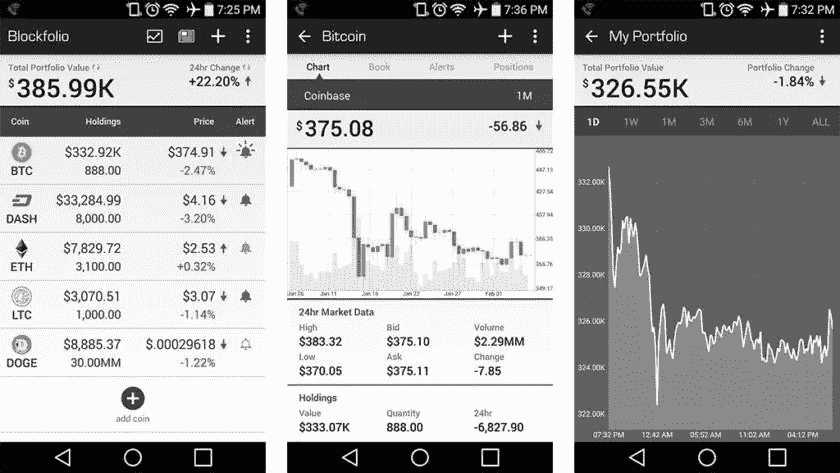

有很多应用程序可以用来观察你最喜欢的硬币的价格，也可以检查你从投资中获得了多少利润。

我最喜欢的三个是 Blockfolio、Coinfolio 和 CoinCap。

您还可以设置价格提醒，每当价格下跌或上涨超过一定水平时，它会向您发送推送通知。

尽管我已经安装了这三个软件，但我个人更喜欢 Blockfolio，因为它的“信号”功能，这是一个很酷的功能，可以向我发送通知，其中包含我正在跟踪的加密货币开发者的消息。

我没怎么用过 Coinfolio，所以我不能对它的功能发表太多评论，但 CoinCap 有一个漂亮的饼状图，可以显示你当前所有的加密货币投资。

如果你必须选择两个，你绝对应该选择 Blockfolio + CoinCap。

# **寻找新的投资机会**

最后，让我们看看如何在加密货币领域寻找新的投资机会。

# 中低风险

## Bitcointalk

Bitcointalk 是一个在线论坛，加密货币投资者可以聚集在一起讨论加密货币、区块链技术、新硬币和 ICO 等。

开发者也使用论坛来宣布他们正在开发的硬币，如果你不知道要寻找什么样的新硬币，只需在论坛的搜索栏中键入“ANN”或将它粘贴到你的搜索浏览器中:“site:【bitcointalk.org】T2:ANN”。

Bitcointalk 也是一个很好的来源，可以找到 slack、telegram 和 discord 频道的邀请链接，这些链接也提供了大量高质量的信息和来自开发人员自身的直接更新。

搜索 Bitcointalk 寻找关于硬币的信息，并找到 slack、telegram 和 discord channel 邀请。

## 需要考虑的重要信息:

加密货币或其背后的平台是否有真实的用例？加密货币的用途是什么？

“硬币”代表什么？所有权？货币？是代币吗？

加密货币有溢价吗？如果有，为什么？

加密货币的生态系统正在积极开发吗？(与 slack 上的开发人员交流并找出答案)

流通和总供应量背后的原因(在 slack 或 bitcointalk 上询问)

加密货币背后的人是谁，他们的凭证是什么？

## Reddit

查看加密货币子 Reddit:【https://www.reddit.com/r/CryptoCurrency/】T4 找到关于替代币和比特币本身的一般讨论。

你会在 reddit 上找到很多意见，所以我把这更多地归类为中等风险，总是做自己的研究，如果你在 Reddit 上发现了一枚硬币，在 Bitcointalk.org 上寻找它，并寻找硬币官方子 Reddit 以获得更精确的信息。

## 中度-高度风险

在推特上关注举报人。这一个比之前的选择更冒险，因为这涉及到信任在线 Twitter 账户，而且许多账户是匿名的。

举报人是指在推特上发布其活动和观点的投资者或交易者，包括:

*   特定加密货币的价格预测
*   他们交易的加密货币以及他们买卖的目标

在接受情报人员的建议时要非常小心，因为 twitter 上有活跃的抽油和甩油小组，永远记住这句格言:**做你自己的研究。**

如果你想找到告密者，使用标签(#crypto， [#bitcoin](https://steemit.com/trending/bitcoin) ，#cryptotwitter)或者价格标签($btc，$eth，$bnb $xrp 等等。)在这一点上，我不会发表任何建议，因为我相信每个投资者都应该选择听从谁的建议。

# 总结:

1.  更安全的方法是投资“蓝筹股”加密货币。
2.  一旦你选择了要投资的加密货币，买一些硬币来奠定你的基础。
3.  坚持长期购买，以实现利润最大化。
4.  当价格下跌时，购买更多的加密货币，以增加您的利润潜力。
5.  如果你长期持有一种加密货币，并希望获得 10-100 倍的回报，那么在获利时套现 20-30%。
6.  使用 Blockfolio、Coinfolio 或 CoinCap 等应用程序来监控价格变动和跟踪利润。
7.  使用 Bitcointalk 发现新的加密货币，并与开发人员和投资伙伴进行讨论。

# 有用的资源:

[CEX](https://cex.io/r/0/up106280379/0/) —加密货币交易所，允许用户从世界上任何一个国家直接用现金购买比特币、以太坊、Ripple 和其他替代币。 [**报名去 CEX**](https://cex.io/r/0/up106280379/0/)

[BitPanda](https://www.bitpanda.com/?ref=3127933809251797450) —欧洲加密货币交易所，可直接用现金购买的替代币数量最多。

目前，只有欧洲用户可以购买加密货币，但未来可能会提供全球支持。 [**检出 BitPanda**](https://www.bitpanda.com/?ref=3127933809251797450)

[币安](https://www.binance.com/en?ref=11282713) —加密货币交易所，用户可以使用比特币或以太坊购买大多数替代币。 [**报名去币安**](https://www.binance.com/en?ref=11282713)

[账本钱包](https://www.ledger.com?r=4c54) —硬件钱包(又名冷钱包)，你可以在这里安全地离线存储大多数加密货币，以增加安全性。 [**购买总账钱包**](https://www.ledger.com?r=4c54)

这就是“如何从加密货币中获利”指南，我希望你发现这个指南很有帮助，请随时关注我的[媒体](/@cryptonitecj900)更多指南，你也可以在[推特](https://twitter.com/CryptoniteTweet)上关注我。