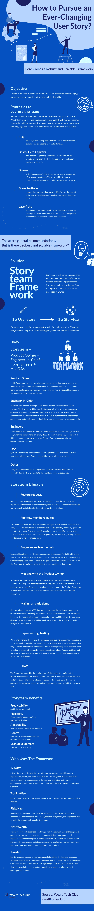

# 如何追求千变万化的用户故事？这是一个健壮的、可伸缩的框架

> 原文：<https://medium.com/hackernoon/how-to-pursue-an-ever-changing-user-story-here-comes-a-robust-and-scalable-framework-120ef45daa0a>

金融科技团队夜以继日地应对令人困惑的需求。这并不令人吃惊，因为“快速移动”是金融科技的本性。

为了在这场热潮中生存下来，许多团队采用了 **storyteams framework** ，它代表实时处理用户故事的敏捷短期子团队，而不是遵循正式的需求。

请看下面的信息图，了解这一切是如何发生的！

