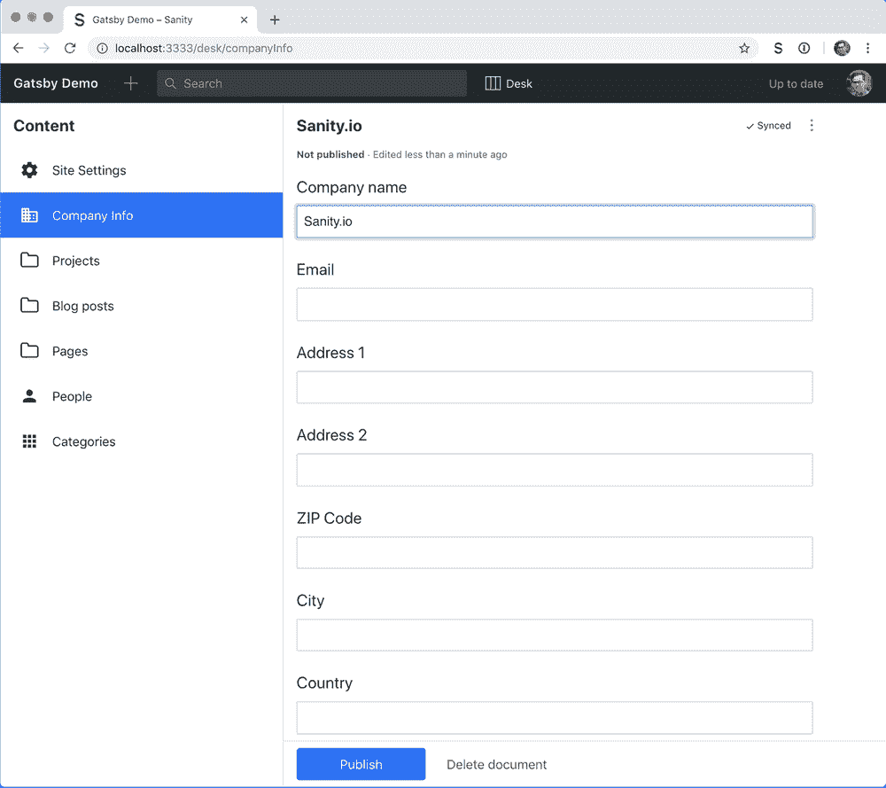
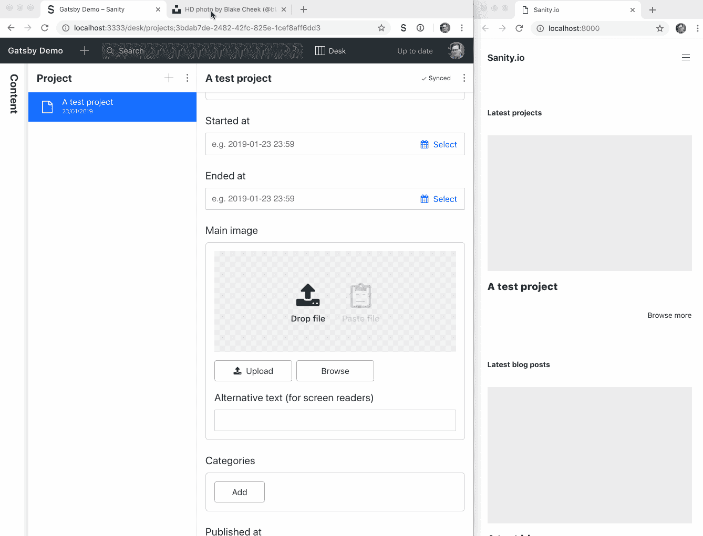
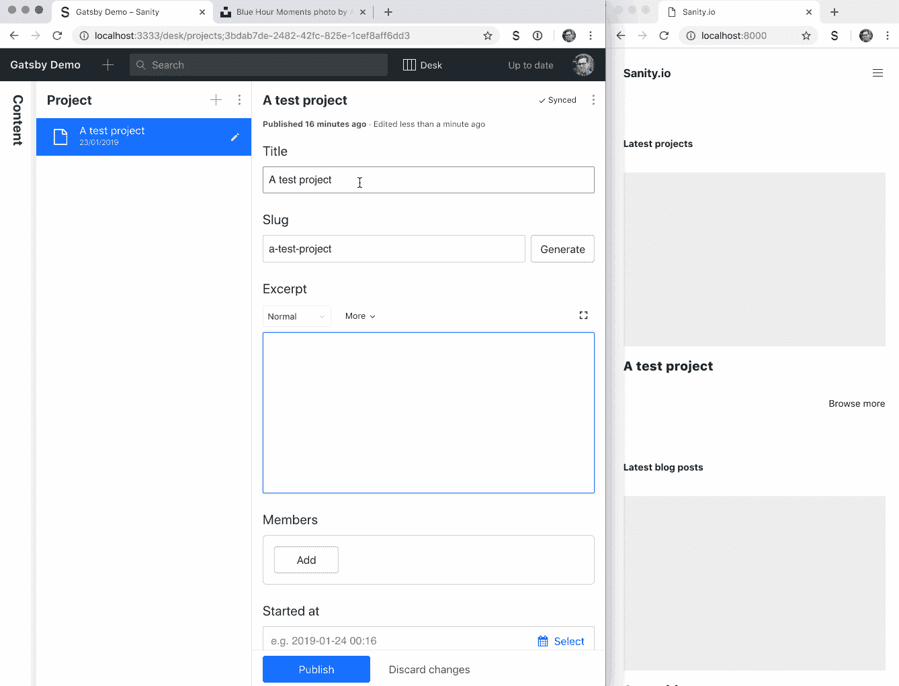

# 如何用无头 CMS 快速搭建一个 Gatsby.js JAMstack 网站

> 原文：<https://medium.com/hackernoon/how-to-quickly-set-up-a-gatsby-js-jamstack-website-with-a-headless-cms-4a3b51d67e5e>


有一个[新的源代码](https://www.sanity.io/blog/get-started-with-gatsby-and-structured-content)插件出来了，它使得使用 Sanity 作为一个用 [Gatsby.js](https://www.gatsbyjs.org) 构建的 JAMstack 网站的无头 CMS 变得很容易。在 [Gatsby](https://hackernoon.com/tagged/gatsby) 上安装和集成令人兴奋的项目非常容易。如果你是静态站点生成器的新手，或者想测试一下插件，我们制作了一个完整的公司网站和一个无头 CMS 示例，包括人员、项目、博客和一些信息页面。在本教程中，我们将展示如何设置它，以及如何在 web 服务器上以[开发](https://hackernoon.com/tagged/development)模式运行 Gatsby，以获得内容变化的实时在线预览。

这个例子是一个 monorepo，包含了 Sanity Studio 的配置，您将在这里编辑内容，以及 Gatsby 构建的网站。它还被配置为直接部署到[网络上](https://netlify.com/)或[现在是](https://zeit.co/now)。您可以在其中创建一个新的免费的 Sanity 项目，并在几分钟内启动和运行。JAMstack 时代的 Web 开发真是太棒了！

我们感到安全，你可以采取我们公司的网站的例子，并使它成为你自己的。

# 在 Github 上克隆或派生存储库

转到 GitHub 上的[示例库并克隆，或者从那里派生。您也可以在您的终端中保存 web 项目的文件夹中运行此程序(如果您分叉了项目，请用您自己的 URL 替换):](https://github.com/sanity-io/example-company-website-gatsby-sanity-combo)

```
git clone [https://github.com/sanity-io/example-company-website-gatsby-sanity-combo.git](https://github.com/sanity-io/example-company-website-gatsby-sanity-combo.git)
cd example-company-website-gatsby-sanity-combo
```

# 安装 Sanity CLI

在处理这样的项目时，使用 Sanity CLI 非常方便，安装时间也不长。在命令行中运行以下 npm 命令:

```
npm install --global @sanity/cli
```

# 安装依赖项

这个例子使用[节点包管理器](https://npmjs.com/) ( `npm`)进行依赖，如果您喜欢，您也可以使用 yarn:

```
~/example-company-website-gatsby-sanity-combo 
npm install
```

# 将 Sanity.io 设置为无头 CMS

```
~/example-company-website-gatsby-sanity-combo 
npm run init
```

安装脚本完成后运行此命令。按照 CLI 的说明为网站创建一个 Sanity.io 项目。我们建议将数据集设置为 **public** (如果您愿意，可以稍后将其更改为 private)。数据集是你存储所有内容的地方，有点像数据库。您可以拥有多个数据集。例如，如果您想要一个用于开发的内容测试平台。

`npm run init`命令还为您的 Sanity 项目部署了一个 GraphQL API(Sanity 同时支持 [GROQ](https://www.sanity.io/docs/reference/groq) 和 graph QL)。Gatsby source plugin for Sanity 使用 GraphQL 模式定义来防止 Gatsby 的模板 API 中缺少类型和字段。据我们所知，这是唯一能帮你做到这一点的插件——它非常实用！

# 启动本地开发服务器

在你的项目文件夹中，你有两个文件夹:`studio`和`web`。

studio 文件夹是您可以找到 Sanity Studio 的配置文件的地方，这是一个针对您的内容的开源编辑器，使用 JavaScript 和 React 构建。它连接到托管的 API，并且是实时的，就像你在谷歌文档中一样。你可以在任何可以托管 HTML 文件的地方托管这个工作室。在`studio/schema`文件夹中，您会找到所有类型和字段的配置文件。如果你想的话，你可以在以后调整和改变这些，但是我们现在就让它们保持原样。

`web`文件夹中有一个 Gatsby 网站，里面有你需要的所有东西，可以让内容得到合理的管理。如果你是盖茨比的新手，我们推荐他们的[综合文档](https://www.gatsbyjs.org/docs/)来学习基本思想。

您可以用一个命令启动 Studio 和 Gatsby 前端的开发服务器:

```
~/example-company-website-gatsby-sanity-combo 
npm start
```

工作室运行于 [localhost:3333](http://localhost:3333/) ，网站运行于 [localhost:8000](http://locahost:8000/) 。如果你打开网站，你会看到一条错误信息。那是因为它需要一些内容来构建。所以从打开工作室，登录开始。



进入[站点设置](http://localhost:3333/desk/siteSettings)和[公司设置](http://localhost:3333/desk/companyInfo)，至少填写名称。写一篇博文(只是一些模仿的内容就可以了)，一个项目，还有一些其他的东西。你应该给你的博客和项目条目都起一个**标题**，一个**标题**，最好是在日期(过去)发表的**。记得发布更改(左下方的蓝色按钮)。尽管所有的更改都会立即与托管的后端同步，但它们不会在没有发布的情况下出现在公共 API 中。**

现在您可能需要重启开发服务器，让 Gatsby 使用新的更改进行构建。`ctrl + C`将退出当前进程，而`npm start`将再次启动它。

# 尝试盖茨比的手表模式

如果您查看名为`gatsby-config.js`的文件，您会在插件部分看到以下条目:

```
{
  resolve: 'gatsby-source-sanity',
  options: {
    projectId,
    dataset,
    *// To enable preview of drafts, copy .env-example into .env,*
    *// and add a token with read permissions*
    token: process.env.SANITY_TOKEN,
    watchMode: true,
    overlayDrafts: true
  }
}
```

我们已经启用了`watchMode`，这意味着 Gatsby 可以动态地注入内容变更，而无需您重新加载开发服务器或刷新浏览器。很少有其他源代码插件能做到这一点。更酷的是，其他人可以坐在同一个工作室，编辑内容，这也立即反映在前端开发服务器上。默认情况下，该插件只能访问已发布的修改，但尝试编辑一些东西(可能会在第一篇博文中添加一张图片)，按下**发布**，看看它是否会在前端更新。



# 添加令牌以查看所有更改

在插件中，你可能注意到了`token: process.env.SANITY_TOKEN`和`overlayDrafts: true`。有了读特权，你就可以让盖茨比访问未发表的文件，比如草稿。当`overlayDrafts`设置为`true`时，Gatsby 将使用文档的草稿版本，如果它可以访问它的话。您需要在 web 文件夹中的一个名为`.env`的文件中保存一个读取令牌来启用此功能:

```
~/example-company-website-gatsby-sanity-combo/web 
cp .env-example .env
```

现在可以去[https://manage.sanity.io/projects/<YourProjectId>/设置/api](https://manage.sanity.io/projects/) (管理- >设置- > API)，然后**添加新令牌**。给它一个漂亮的描述性标签，并且只有读取权限。复制它，并将其粘贴到。环境文件:

```
~/example-company-website-gatsby-sanity-combo/web/.env
SANITY_TOKEN="YourToken"
```

要将令牌加载到 Gatsby 中，您需要再次重启本地开发服务器。不过，这是值得的。



# 用 Netlify 在网上建立你的盖茨比网站

也许你想调整前端一点，改变 CSS，或者做一些调整。在某些时候，你想与世界分享它。我们建议您将项目放在 GitHub 上。如果你分叉了，提交并推动你的改变。如果你是从我们这里克隆的，[遵循这些关于如何在 GitHub 上获得本地 git repo 的说明](https://kbroman.org/github_tutorial/pages/init.html)。

当它在 GitHub 上时，去 Netlify 注册或登录。如果您从 Git 中选择 **New site** 并找到您刚刚更新的存储库，那么由于项目中的`netlify.toml`文件，一切都已经设置好并准备好了。同样，如果您更喜欢现在的[Zeit](https://zeit.co/now)(或者想要使用两者以获得最终的冗余)，您可以在项目的根文件夹中运行`npm run now-deploy`。


要快速部署 Sanity studio，运行`studio`文件夹中的`sanity deploy`并选择一个主机名。现在你可以在永久免费开发者计划中免费邀请另外两个用户。如果你需要更多，在同一个计划中，现收现付的每位用户需要 10 美元。Gatsby 只用了 2 个 API 请求就构建了整个网站。一个用于所有内容，一个用于模式。因此，你将获得很大的里程数[与我们的免费计划](https://www.sanity.io/pricing/dev-2018-08-21)与盖茨比网站。我们挖它！

# 根据内容变化触发新的网络构建

当您将提交推送到它监视的分支时，Netlify 会触发新的构建。然而，内容并没有提交给 Git。幸运的是，还有其他触发构建的方法，其中之一就是使用 webhooks。

如果你在 Netlify 上托管你的站点，你可以进入**设置**->-构建&部署并向下滚动到**构建钩子**。选择 **Add build hook** ，给它一个名字，指向你想要构建的分支。复制 URL，并返回到终端:

```
~/example-company-website-gatsby-sanity-combo
cd studio
sanity hook create
? Hook name: netlify
? Select dataset hook should apply to: <yourDataset>
? Hook URL: https://api.netlify.com/build_hooks/<someId>
```

现在，每当您发布一些新的内容编辑时，Netlify 都会触发一个新的站点部署。

# 奖励:Heroku 上的在线内容预览

安德烈亚斯·凯勒写的这本有帮助的教程出现在我们的订阅源中。他想出了一个在 Heroku 上的开发服务器上运行 Gatsby 的方法，从而使在网上获得实时预览体验的观看模式成为可能。如果您的编辑器不能在终端中运行本地开发服务器，这是很好的。让我们用 Sanity source 插件来设置它，以获得无与伦比的预览体验！

# 安装 Heroku CLI

按照这些说明[安装 Heroku CLI。运行`heroku login`并登录或注册。](https://devcenter.heroku.com/articles/getting-started-with-nodejs#set-up)

# 调整 gatsby-config.js

为了让 Heroku 能够很好地使用 monorepo(它喜欢在根文件夹中使用它的应用程序)，我们必须在根文件夹中安装 gatsby-cli 作为开发依赖项:

```
~/example-company-website-gatsby-sanity-combo
npm install gatsby-cli --only=dev
```

也有其他的[方法，在](https://github.com/timanovsky/subdir-heroku-buildpack)中，你推`web`文件夹，但是然后你必须在`gatsby-config.js`中手动放入`projectId`和`dataset`，因为这些变量是从`studio`文件夹中的`sanity.json`导入的。

设置完成后，您应该执行以下操作:

```
~/example-company-website-gatsby-sanity-combo
# create a new heroku app
heroku create

# set node to run in development mode
heroku config:set NODE_ENV=development
heroku config:set NPM_CONFIG_PRODUCTION=false

# set the project id and dataset, found in sanity.json
heroku config:set PROJECT_ID=YourProjectId
heroku config:set DATASET=YourDatasetName

# add the read token to Heroku’s environment
# make sure that the token isn't wrapped in quotation marks
heroku config:set SANITY_TOKEN=$(cat web/.env|grep SANITY_TOKEN)

# add the app configuration to run gatsby on heroku’s dyno
echo "web: cd web && gatsby develop -p $PORT -H 0.0.0.0" > Procfile

# add the changes to git
git add Procfile package.json package-lock.json
git commit -m"Add Procfile and deps for Heroku"

# push it to heroku
git push heroku master

# open the app in the browser
heroku open

# check the logs to troubleshoot if things doesn't work
heroku logs --tail
```

这个应用程序运行在一个免费的 dyno 上，在一段时间不活动后会休眠，它可能需要几分钟才能再次启动。你当然可以在付费的 dyno 上运行它，这给了你完整的正常运行时间。我们不能保证它会非常稳定，因为开发服务器并不是为实际托管 web 上的网站而构建的。如果崩溃了，可以用`heroku restart`重启。

尽管如此，它还是很酷，而且当你想给你的网页编辑一种方法来立即预览他们的改变，而不必等待重建时，它无疑是有用的。

*最初发布于*[*www . sanity . io*](https://www.sanity.io/blog/how-to-quickly-set-up-a-gatsby-js-jamstack-website-with-a-headless-cms)*。*