# 如何筹集 2000 万美元并在币安上市——quark chain 的 ICO 活动市场分析。

> 原文：<https://medium.com/hackernoon/how-to-raise-20-million-and-get-listed-on-binance-quarkchains-ico-campaign-market-analysis-ebe53a0749d4>

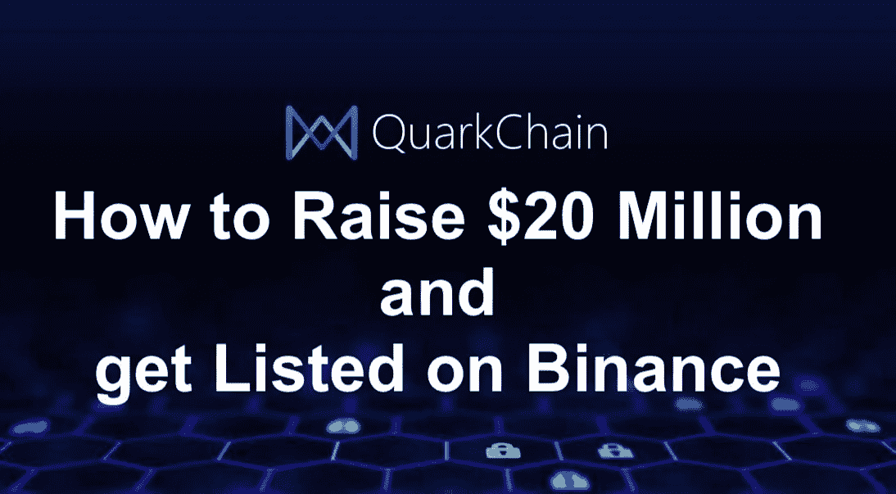

最近，对 ICO 市场的投资急剧下降——这是事实。

很长一段时间以来，在加密货币的普遍增长期间，那些几乎投入一切的人曾经提供的投资浪潮已经不复存在。除此之外，项目开始设置较小的上限，这真的很好，因为它让创始人回到了现实。出于某种原因，他们中的许多人希望为创意筹集数亿美元，而 10 万美元已经足够了。

然而，每个月都有项目成功地关闭了规模可观的上限。正如他们所说，只有最强者才能生存，尤其是在艰难的市场中。这些最强的项目有什么，是什么帮助他们取得这些成果？让我们从营销的角度来看看这个。

我们要分析的第一个项目是:

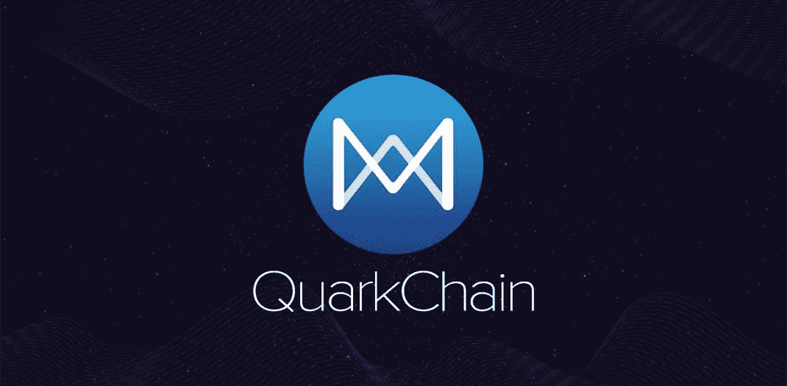

**夸克链**

夸克链是一个非常好的成功 ICO 的例子。如果你看了标题，那么你已经知道了——2018 年 6 月，该项目筹集了 2000 万美元，在 ICO 发生的第二天，令牌已经在币安交易。

**产品**

首先我们要讨论夸克链的产品。

创造者雄心勃勃地将他们的产品称为“区块链 3.0”，在阅读了描述后，这样一个响亮的声明背后的逻辑是非常清楚的。QuarkChain 是一种新型的安全区块链，其主要特点是高可扩展性。

目前，比特币区块链每秒可以支持大约 6-7 笔交易。以太坊的速度更快，每秒可以支持 15 次交易——但我们都记得广播网络是如何因为 CryptoKitties 而“挂起”的。

QuarkChain 区块链的目的是支持每秒 1，000，000 次交易。但现在最有趣的是，在测试阶段，该项目显示每秒超过 14，000 次交易。

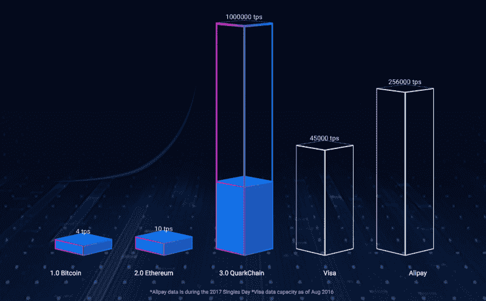

第二个特征是区块链本身将由两层组成-根区块链和碎片。

不过，我不会在这里用分片的细节来烦你(你可以在他们的白皮书中阅读关于产品本身及其背后的技术的更多信息)。

**ICO**

项目的硬性上限公布了——**【2000 万美元**。

然而，在公开销售开始前不久，该项目宣布，大部分上限，即 1600 万美元，将在私人销售阶段出售给各种基金和专业投资者。

公开销售只剩下 400 万美元。为了获得代币，你必须在他们的白名单中预先注册，通过 KYC 协议，并加入他们的电报聊天。

到那时，社区已经非常大，非常活跃，更重要的是，已经热起来了，以至于该项目不得不限制每个参与者购买代币——在销售的前 12 个小时内，一手不得超过 0.693 ETH 的代币。

这一举动简直是把头给了潜在投资者(请注意)，当然，销售很快就卖光了。

发生了什么事？

在这种情况下发生的事情正是绝大多数 ICO 项目所缺少的——需求的创造。

达到硬限额的 2/3，有一个限制投资的特殊列表，在通过 KYC 程序之前必须加入电报聊天，参与者在那里结束并相互取暖。随着观众的蜂拥而至，他们可以提出任何要求——加入聊天或纹上项目的标志——将会有一个等候名单。

这是一个真正成功的 ICO 的基础——**创造在公开销售的框架内不会被完全满足的需求**。只有当代币在交易所上市时，每个人才能购买代币。

**定位**

你必须注意三件主要的事情:

1.定位主要是关于**产品**，而不是关于 ICO

2.**有原型**。已经处于 ICO 阶段的测试网已经显示出非常好的结果。

3.与第二点相关的是，有一个团队正在更新和遵循的详细路线图**是很重要的。**

以前已经说过很多次了，以后还会继续说——没有原型/MVP 就没有 ICO。不要投资那些不能提供至少一个 MVP 的公司。同时，仔细检查，在项目聊天中询问任何你不完全了解的事情。检查答案，看看团队本身是如何理解的，并注意他们如何把你作为未来的用户和潜在的投资者。

**网站**

我经常从项目中听到这样的话，“我们需要在网站上改变这个和那个，并以不同的方式带来一些东西。”

毫无疑问，这是值得的——如果有东西要传达的话。许多常见而冗长的词语只会降低潜在投资者/用户的机会，首先，他们会弄清楚，其次，他们会对这样一个复杂的网站有足够高的注意力。

看看 QuarkChain 的网站(https://www . quark chain . io)——很简单，很小，只有最基本的东西，甚至有一种轻描淡写的感觉，这在他们的白皮书中得到弥补有余。

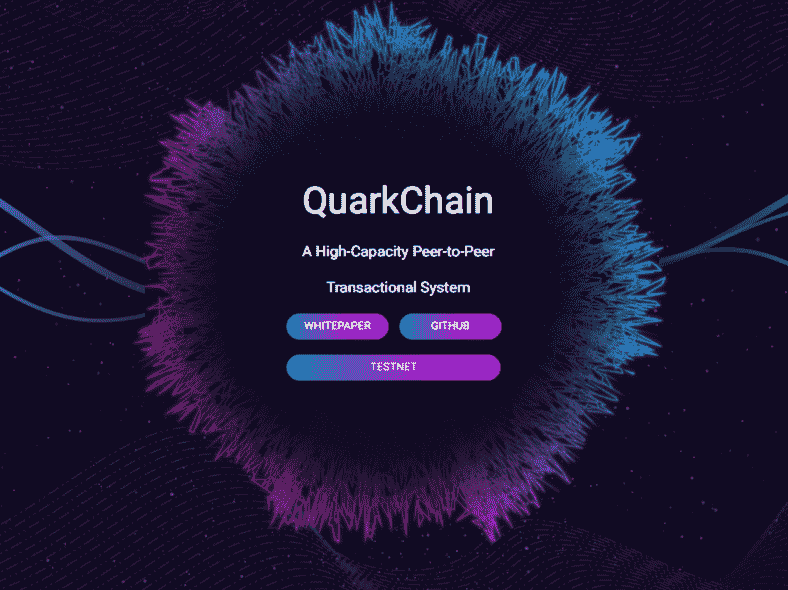

你有没有看到写着“*立即购买代币*”的红色大按钮？不，而且你不会在公开销售阶段看到它们。

看到方法的不同了吗？在那些到公开销售阶段已经有一个产品和一个提高的普遍部分上限的项目之间，从那些需要快速提高至少一些东西的项目，而“谷歌广告词允许广告。”

当然，QuarkChain 的网站绝对不是一个参考，但它是一个很好的例子，不仅网站本身或网站上的美丽图片在销售。这是一个重要因素，但不是主要因素。

此外，将网站翻译成世界上所有语言的趋势也消失了。例如，这里只有两种语言——英语和汉语。

**追踪器和列表**

*上市仍然是一个很好的流量来源，尽管效率不如“黄金”时期。*

许多人特别偏爱 ICO Bench，既买昂贵的付费套餐，也买“廉洁”的“专家”评价曾经，ICO Bench 真的很有效。

然而，QuarkChain 在 ICO Bench 上的评分很糟糕——3.3。

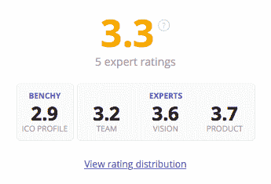

很明显，该团队没有使用 ICO Bench 的 bot，对它的评估是非常重要的。尽管随着某些动作和条件的执行，该评级可以提高到几乎 5.0。也没有与 Bench 的专家合作(顺便说一下，他们中的一些人可能会故意低估评级，但这是另一篇文章的话题)。

但该项目因在 ICO Drops 上获得最高分而中了头彩。

没有多少项目被授予“*非常高的兴趣*”评级，该网站令人印象深刻的观众很清楚这一点。

ICO Drops 现在几乎成了一个半神话般的上市公司，在那里上市相当困难。也正是因为这个原因，观众才热爱并相信 ICO 滴。

总的来说，处理追踪清单显然不是 QC 的优先任务，因为这个项目并不是随处可见的。只有 ICO 下降被作为一个基础(它已经涵盖了所有其他的一个很好的部分)。

**赏金和 BTT**

夸克链的赏金运动也非常简约。在这里你找不到 BTT (Bitcointalk)论坛的签名运动，也找不到各种社交网络的赞和转发运动。

主要活动由三部分组成:

1.内容活动:为脸书、YouTube、Twitter、Medium、Reddit、Steemit、微信、微博等提供文章和视频。

2.白皮书的翻译。

3.测试网络。该项目通过赏金运动招募志愿者进行额外的测试网检查和测试。

此外，所有活动的一个必要条件是加入官方的电报聊天。在 ICO 成立之初，有超过 60，000 名参与者。没有空投:)

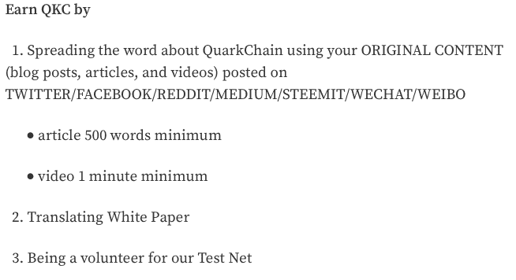

你可以在这里找到赏金战役—[https://steemit.com/quarkchain/@quarkchain/bounty-program](https://steemit.com/quarkchain/@quarkchain/bounty-program)

至于 **Bitcointalk 关于该项目的**官方帖子，这也是一个遗漏:对于如此规模和基础设施的项目来说，这是一个非常小的话题。与论坛社区的合作显然开展得很差。

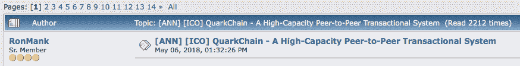

【安线】——[*https://bitcointalk.org/index.php?topic=3587645.0*](https://bitcointalk.org/index.php?topic=3587645.0)

**SMM**

借助社交媒体，该项目显然遵循了这一原则——质量重于数量。没有经常发生的那么多页面，但是几乎每个页面都会定期更新。

你可以自己去看看:

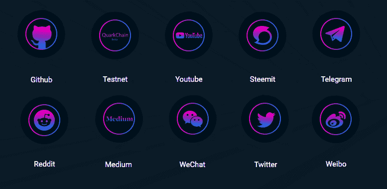

**投资者**

有很多相当著名的基金投资了 QC。他们中的许多人很乐意在他们的公司博客上讨论。

例如，太空人资本[公开表示](/astronaut-capital/astronaut-capital-invests-in-quarkchain-qkc-aa9d1f59e95f)他们真的想增加对这个项目的投资。

通过私人投资从 2000 万美元的硬性上限中筹集了 1600 万美元，公共 ICO 舞台本身最有可能需要做两件事:

1.公关，因为大量的人知道了这个项目。

2.社区，这将提供一个热潮，从而增加代币的价值的交流。这就是所发生的一切。

作为对这个话题的补充:在最近的一次加密会议上，一个项目找到了我。据他们说，他们建造了一个比以太坊更好/更快/等等的基础设施项目。所以他们想筹集资金(当然)。我对类似项目的建议是——拿着这份已经投资 QuarkChain 的基金清单，试着联系他们。

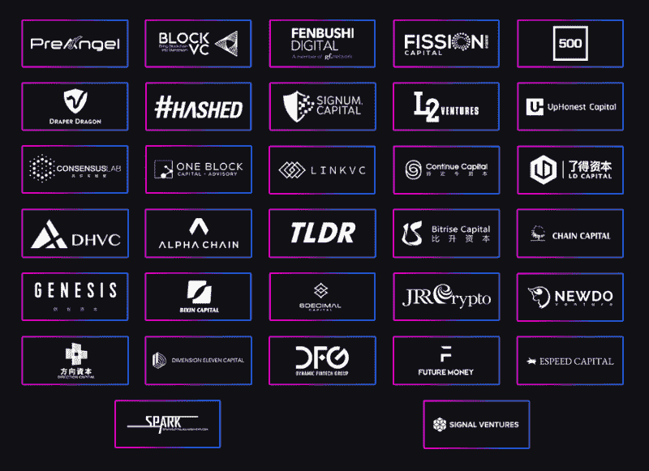

**ICO 后**

今天的最后一个话题是后 ICO。

它是什么，为什么这个阶段的重要性不低于(如果不是高于)ICO 的早期阶段，我们将在一个单独的帖子中讨论。请相信我的话，后 ICO 是项目和令牌健康生命的保证。

**我们在后 ICO 时期的夸克链中看到的。**

首先映入你眼帘的是相当详细的**周报**。

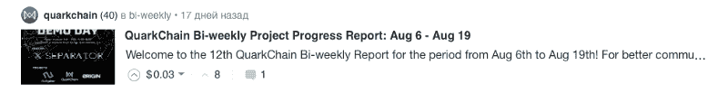

示例—[https://stee MIT . com/weekly/@ quark chain/quark chain-bi-weekly-project-progress-report-aug-20-sept-4](https://steemit.com/weekly/@quarkchain/quarkchain-bi-weekly-project-progress-report-aug-20-sept-4)

QuarkChain 团队每周分享新闻，描述产品的进展(首先是最重要的)和关于外部沟通的新闻，无论是参加会议、关于项目的出版物，还是战略合作伙伴关系。

我们也看到了社区内的许多活动。每个周六，团队的主要部分都会举行一个 AMA(问我任何问题)会议，现场回答社区问题。这是一个非常有用的东西，在代币和售后的各个阶段都值得推荐。

社区内的工作还包括管理聊天(目前有 7 万多名活跃参与者)和社交网络。在这方面，该项目也做得很好。

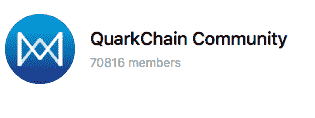

*最后，我们来谈谈交易所和代币的成本。*

目前，带有 QKC 股票代码的代币正在币安、Kucoin、Gate.io、IDEX 和其他一些小型交易所交易。

令人惊讶的是，关于拉托肯的优秀书籍，包括一对 LAT token，似乎很受拉托肯的持有者欢迎。

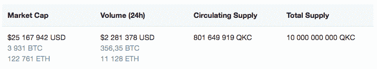

【https://coinmarketcap.com/currencies/quarkchain/#charts 

在出售当天，代币将立即在币安上市的消息引起了另一波非常强大的炒作，这使得那些没有时间参加 ICO 但准备在交易所购买代币的人加入了队列。

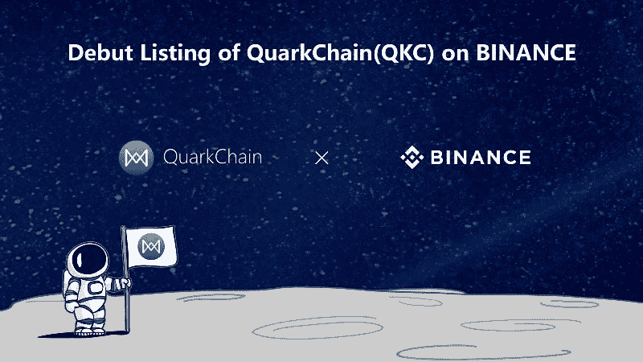

从第一个交易日开始，两个小时内每枚代币的价格为 **$ 0.019** ，价格上涨到 **$ 0.25** ，涨幅接近 1150%(这是在 2018 年 6 月)。而这个事实又制造了另一波炒作。

价格现在的表现如何(它随着整个市场下跌)可以在这里看到，例如:[https://www.livecoinwatch.com/price/QuarkChain-QKC](https://www.livecoinwatch.com/price/QuarkChain-QKC)

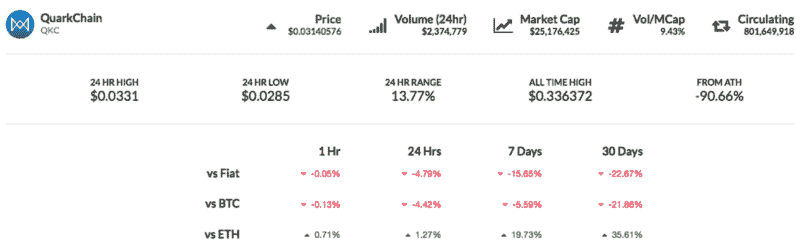

但事实是，那些投资并抓住合适时机卖出的人，用这枚硬币赚了很多。还有，这个项目有很多忠实的信徒；随着发展的继续，很可能会有大量的机会(只是不要把这个当成投资建议！)

**结论**

尽管 QuarkChain 在营销的某些方面有相当薄弱的地方，但产品的优势、原型、战略、他们对如何创造需求和炒作的理解，以及他们与投资者建立关系的明确能力足以弥补任何不足。

*PS —我在这个项目中没有任何既得利益，当这个项目成功时，它是一个非常响亮的案例，所以我决定从营销的角度来审视它。*