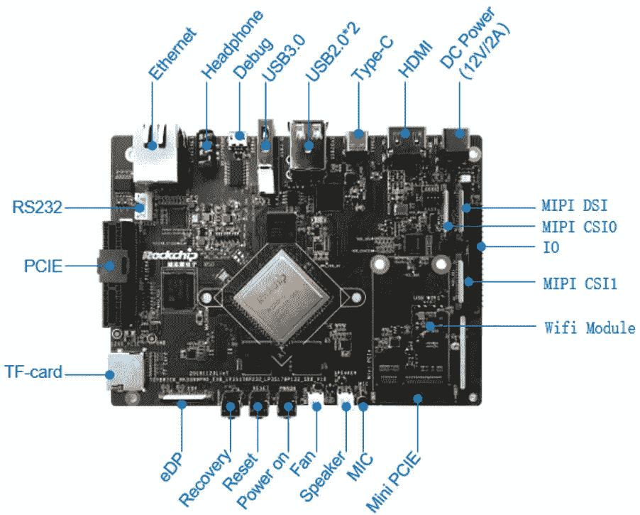
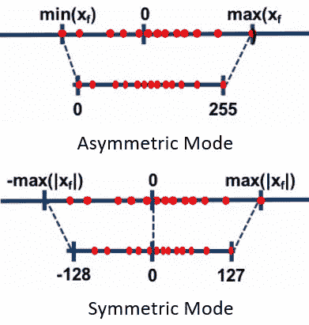

# 如何在 RK3399Pro 上运行 Keras 模型

> 原文：<https://medium.com/hackernoon/how-to-run-keras-model-on-rk3399pro-86093bf60372>

## 要获得完整的源代码，请查看我的 GitHub 库。


此前，我们已经推出了多种嵌入式边缘计算解决方案并进行基准测试，包括用于英特尔神经计算棒的 [OpenVINO](https://www.dlology.com/blog/how-to-run-keras-model-inference-x3-times-faster-with-cpu-and-intel-openvino-1/) 、用于 ARM 微控制器的 [CMSIS-NN](https://www.dlology.com/blog/how-to-run-deep-learning-model-on-microcontroller-with-cmsis-nn/) 以及用于 [Jetson Nano](https://www.dlology.com/blog/how-to-run-keras-model-on-jetson-nano/) 的 TensorRT 模型。

它们的共同点是每个硬件提供商都有自己的工具和 API 来量化张量流图，并结合相邻层来加速推理。

这一次，我们将看看 RockChip RK3399Pro SoC，它内置 NPU(神经计算单元)，在 8 位精度下的推理速度为 2.4 次，能够以超过 28 FPS 的速度运行 Inception V3 模型。您将会看到，在电路板上部署 Keras 模型与前面提到的解决方案非常相似。

1.  将 Keras 模型冻结为张量流图，并用 RKNN 工具包创建推理模型。
2.  将 RKNN 模型加载到 RK3399Pro 开发板上并进行预测。

让我们开始第一次设置。

# 设置 RK3399Pro 板

任何带有 RK3399Pro SoC 的开发板，如 [Rockchip Toybrick RK3399PRO 开发板](https://www.amazon.com/Toybrick-Development-Artificial-Intelligence-Acceleration/dp/B07P3M7683)或 [Firefly Core-3399Pro](http://shop.t-firefly.com/goods.php?id=98) 都应该可以工作。我有一个 Rockchip Toybrick RK3399PRO 板，6GB 内存(2GB 专用于 NPU)。

该板带有许多类似于 Jetson Nano 的连接器和接口。值得一提的是，HDMI 连接器无法与我的显示器一起工作，但是，我可以让 USB Type-C 转 HDMI 适配器工作。



[Rockchip Toybrick RK3399PRO Board](https://www.amazon.com/Toybrick-Development-Artificial-Intelligence-Acceleration/dp/B07P3M7683)

它预装了 Fedora Linux release 28，默认用户名和密码为“toybrick”。

RK3399Pro 有 6 个内核 64 位 CPU，采用 [aarch64 架构](https://en.wikipedia.org/wiki/ARM_architecture#AArch64)与[杰特森纳米](https://www.nvidia.com/en-us/autonomous-machines/embedded-systems/jetson-nano/)相同的架构，但与只有 ARMv7 32 位的树莓 3B+截然不同。这意味着任何针对 Raspberry Pi 的预编译 python wheel 包都不太可能与 RK3399Pro 或 Jetson Nano 一起工作。不过不要绝望，可以从我的[aarch 64 _ python _ packages](https://coding.net/u/zcw607/p/aarch64_python_packages/git)repo 下载预编译的 aarch64 python wheel 包文件包括 scipy、onnx、tensorflow 和 rknn_toolkit 从他们的[官方 GitHub](https://github.com/rockchip-toybrick/RKNPUTool/tree/master/rknn-toolkit/package) 下载。

将这些 wheel 文件传输到 RK3399Pro 板，然后运行以下命令。

# 步骤 1:冻结 Keras 模型并转换为 RKNN 模型

如果选择在开发板上运行，从 TensorFlow 图形到 RKNN 模型的转换将需要相当长的时间。因此，建议购买一台 Linux 开发机器，可以是 Windows WSL、Ubuntu VM，甚至是 [Google Colab](https://colab.research.google.com) 。

第一次设置你的开发，你可以从他们的[官方 GitHub](https://github.com/rockchip-toybrick/RKNPUTool/tree/master/rknn-toolkit/package) 找到 rknn 工具包轮子包文件。

将一个 Keras 模型冻结到一个单独的`.pb`文件类似于之前的教程。你可以在 GitHub 上的 [freeze_graph.py](https://github.com/Tony607/Keras_RK3399pro/freeze_graph.py) 中找到代码。一旦完成，你将有一个 ImageNet InceptionV3 冻结模型接受输入与形状

记下输入和输出节点名，因为我们将在使用 RKNN 工具包加载冻结模型时指定它们。对于 InceptionV3 和许多其他 [Keras ImageNet 型号](https://keras.io/applications/)来说，

```
INPUT_NODE: ['input_1']
OUTPUT_NODE: ['predictions/Softmax']
```

然后，您可以运行 [convert_rknn.py](https://github.com/Tony607/Keras_RK3399pro/convert_rknn.py) 脚本，将您的模型量化为 uint8 数据类型，或者更具体地说，非对称量化 uint8 类型。

对于非对称量化，与对称模式相比，量化范围得到了充分利用。这是因为我们将浮点范围的最小/最大值精确地映射到量化范围的最小/最大值。下图说明了两种基于范围的线性量化方法。你可以在这里阅读更多关于它的[。](https://nervanasystems.github.io/distiller/algo_quantization.html)



Asymmetric vs the symmetric mode

`rknn.config`还允许您用 4 个值的列表`(M0, M1, M2, S0)`来指定`channel_mean_value`，以此来自动将 uint8(0~255)数据类型的图像数据标准化到推理管道中的不同范围。具有 TensorFlow 后端的 Keras ImageNet 模型期望图像数据值归一化在-1 到 1 之间。为了实现这一点，我们将`channel_mean_value`设置为`"128 128 128 128"`，其中前三个值是每个 RGB 颜色通道的平均值，最后一个值是比例参数。输出数据计算如下。

```
R_out = (R - M0)/S0
G_out = (G - M1)/S0
B_out = (B - M2)/S0
```

如果您使用 Python OpenCV 读取或捕获图像，颜色通道是 BGR 顺序的，在这种情况下，您可以将`rknn.config()`的`reorder_channel`参数设置为`"2 1 0"`，这样颜色通道将在推理管道中重新排序为 RGB。

运行脚本后，项目目录中会有`inception_v3.rknn`，将文件传输到开发板进行推理。

# 步骤 2:加载 RKNN 模型并进行预测

推理管道负责包括图像标准化和颜色通道重新排序在内的工作，如前一步所配置的那样。留给您的是加载模型、初始化运行时环境和运行推理。

输出形状为(1，1，1000 ),代表 1000 个类的逻辑。

# 基准测试结果

基准设定。

*   型号:Inception V3
*   量化:uint8
*   输入大小:(1，499，499，3)

让我们运行几次推理，看看它能有多快。

它实现了 28.94 的平均 **FPS，甚至比运行小得多的 MobileNetV2 模型的 [Jetson Nano](https://www.dlology.com/blog/how-to-run-keras-model-on-jetson-nano/) 的 27.18 FPS 还要快。**

# 结论和进一步阅读

这篇文章向你展示了如何开始使用 RK3399Pro 开发板，转换和实时运行 Keras 图像分类。

## 要获得完整的源代码，请查看我的 GitHub 库。

*最初发表于*[*【https://www.dlology.com】*](https://www.dlology.com/blog/how-to-run-keras-model-on-rk3399pro/)*。*