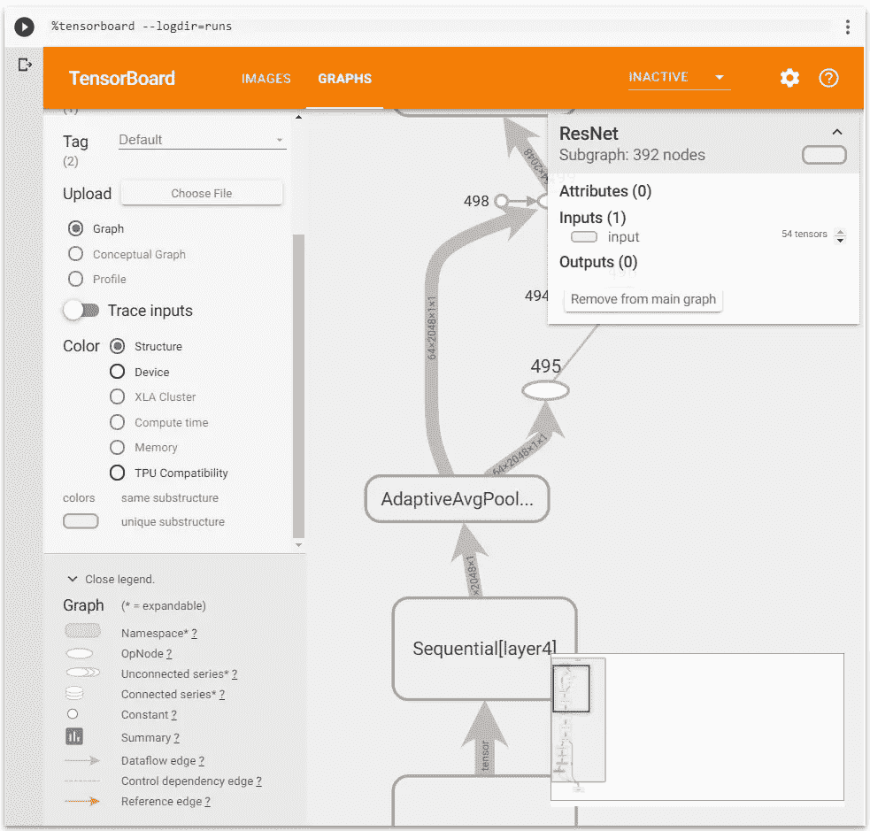

# 如何在 Jupyter 笔记本中运行用于 PyTorch 1.1.0 的 Tensorboard

> 原文：<https://medium.com/hackernoon/how-to-run-tensorboard-for-pytorch-1-1-0-inside-jupyter-notebook-cf6232498a8d>


脸书推出了支持 TensorBoard 的 PyTorch 1.1。让我们在 Colab 的 Jupyter 笔记本上快速尝试一下。

不需要在您的开发机器上本地安装任何东西。即使升级了特斯拉 T4 GPU，谷歌的 Colab 也能免费派上用场。

首先，让我们创建一个 [Colab 笔记本](https://colab.research.google.com/)或者打开[T5 这个我做的](https://github.com/Tony607/pytorch-tensorboard/blob/master/PyTorch_1_1_0_tensorboard.ipynb) 。

在第一个单元格中键入以检查 PyTorch 的版本是否至少为 1.1.0

```
**import** **torch**
torch.__version__
```

然后你要像这样安装尖端的张量板。

```
!pip install -q tb-nightly
```

输出可能会提醒您重新启动运行时以使新的 TensorBoard 生效。你可以点击进入

`Runtime -> Restart runtime...`

接下来，用这条魔线加载 TensorBoard 笔记本扩展。

```
%load_ext tensorboard
```

之后你可以开始探索[火炬。UTILS.TENSORBOARD](https://pytorch.org/docs/stable/tensorboard.html) API，这些实用程序允许您将 PyTorch 模型和指标记录到一个目录中，以便在 TensorBoard UI 中可视化。PyTorch 模型和张量都支持标量、图像、直方图、图形和嵌入可视化。

`SummaryWriter`类是记录数据的主要入口，供 TensorBoard 使用和可视化。让我们为 MNIST 数据集和 ResNet50 模型运行这个官方演示。

您刚刚将图像和模型图形数据写入 TensorBoard summary。编写器将输出文件写入到”。/runs "目录。

让我们运行张量板来可视化它们

```
%tensorboard --logdir=runs
```

就这样，你成功了！



# 总结和进一步阅读

这个非常短的教程让你在 Jupyter 笔记本上用最新的 Pytorch 1.1.0 开始运行 TensorBoard。继续尝试 PyTorch TensorBoard 支持的其他功能。

在这里阅读官方 API 文档— [TORCH。UTILS.TENSORBOARD](https://pytorch.org/docs/stable/tensorboard.html)

*原载于*[*https://www.dlology.com*](https://www.dlology.com/blog/how-to-run-tensorboard-for-pytorch-110-inside-jupyter-notebook/)*。*