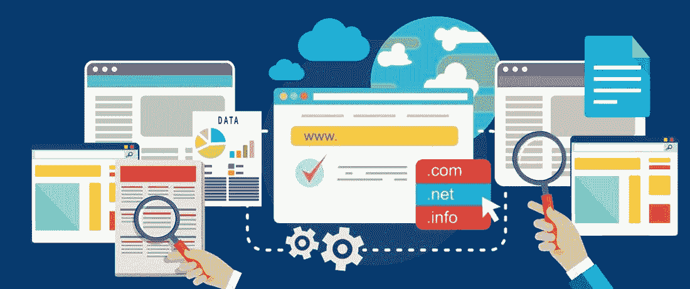

# 如何抓取网站而不被列入黑名单

> 原文：<https://medium.com/hackernoon/how-to-scrape-a-website-without-getting-blacklisted-271a605a0d94>

网站抓取是一种用于从网页中提取大量数据并将其存储在您的计算机上的技术。网站上的数据只能使用网络浏览器查看，不能保存供您个人使用。唯一的方法是手动复制和粘贴，这可能是一项繁琐的任务。完成这项工作可能需要几个小时甚至几天。

然而，这整个过程可以自动使用网页抓取技术。不需要手动复制粘贴数据；相反，您可以使用 web scrapers 在很短的时间内完成任务。如果你已经知道刮擦是什么，那么你就有机会知道它对营销人员和组织有多大的帮助。它可以用于品牌监控、数据扩充、跟踪最新趋势、情感分析等等。

有许多可用的抓取工具，可以用于基于 web 的数据收集。然而，并不是所有这些工具都能有效工作，因为搜索引擎不希望抓取器从其结果页面中提取数据。但是使用像 [SERP API](https://zenserp.com) 这样的高级基础设施，您可以成功地抓取数据。其他工具，如 scrapy、parsehub，通过完全有效地模仿人类行为，提供了收集数据的基础设施。

虽然这些工具非常有益，但它们并不是完全免费的。你也可以[建立自己的网页抓取器](https://hackernoon.com/building-a-web-scraper-from-start-to-finish-bb6b95388184)。但是请记住，你必须非常聪明。下面说一些在刮数据时避免被列入黑名单的小技巧。

# IP 旋转

从同一个 IP 发送多个请求是毁掉你被网站列入黑名单的最好方法。站点通过检查 IP 地址来检测刮刀。当从同一个 IP 发出多个请求时，它会阻止该 IP 地址。为了避免这种情况，您可以使用代理服务器或 VPN，它允许您通过一系列不同的 IP 地址来路由您的请求。你的真实 IP 会被屏蔽。因此，你将能够毫无问题地抓取大部分网站。

# 慢慢刮

对于抓取活动，趋势是尽可能快地抓取数据。当一个人访问一个网站时，浏览速度与爬虫相比是相当慢的。因此，网站可以很容易地通过跟踪访问速度来检测刮刀。如果你浏览网页的速度太快，网站就会屏蔽你。将爬虫调整到最佳速度，在你爬了几页后添加一些延迟，并在你的请求之间设置一些随机延迟时间。不要猛打服务器，你很好刮。

# 遵循不同的刮擦模式

人类浏览网站的方式不同。有不同的观看时间，随机点击等。当用户访问网站时。但是这些机器人遵循相同的浏览模式。当网站遇到重复和相似的浏览行为时，可以很容易地检测到刮刀。因此，在从站点提取数据时，您需要不时地应用不同的抓取模式。有些网站有非常先进的防刮擦机制。考虑添加一些点击，鼠标移动等。让刮刀看起来像人。

# 不要落入蜜罐陷阱

蜜罐是一种计算机安全机制，用于检测刮刀。它们是用户看不到的链接，可以在 HTML 代码中找到。因此，它们只对网页抓取工具可见。当蜘蛛访问该链接时，网站将阻止该客户端发出的所有请求。因此，在构建刮刀时，检查网站上隐藏的链接是必不可少的。

确保爬虫只跟随具有适当可见性的链接。一些蜜罐链接使用与背景相同的颜色隐藏在文本中。检测这种陷阱并不容易，需要一些编程技巧来避免这种陷阱。

# 切换用户代理

用户代理请求头由一个唯一的字符串组成，该字符串有助于识别正在使用的浏览器、其版本和操作系统。每次发出请求时，web 浏览器都会将用户代理发送到站点。如果您从单个用户代理发出大量请求，防抓取机制可以检测到僵尸程序。最终你会被屏蔽。为了避免这种情况，您应该创建一个用户代理列表，并为每个请求切换用户代理。没有网站想屏蔽正版用户。使用像 Googlebot 这样受欢迎的用户代理会很有帮助。

# 无头浏览器

有些网站真的很难刮。它们检测浏览器扩展、网络字体、浏览器 cookies 等。以检查请求是否来自真实用户。如果你想抓取这样的网站，你需要部署一个无头浏览器。像 [Selenium](https://www.seleniumhq.org/) 、 [PhantomJS](http://phantomjs.org/) 这样的工具是你可以探索的几个选项。它们可能有点难以设置，但在刮擦时非常有用。

所有这些提示都可以帮助你完善你的解决方案，你将能够在不被屏蔽的情况下浏览网站。