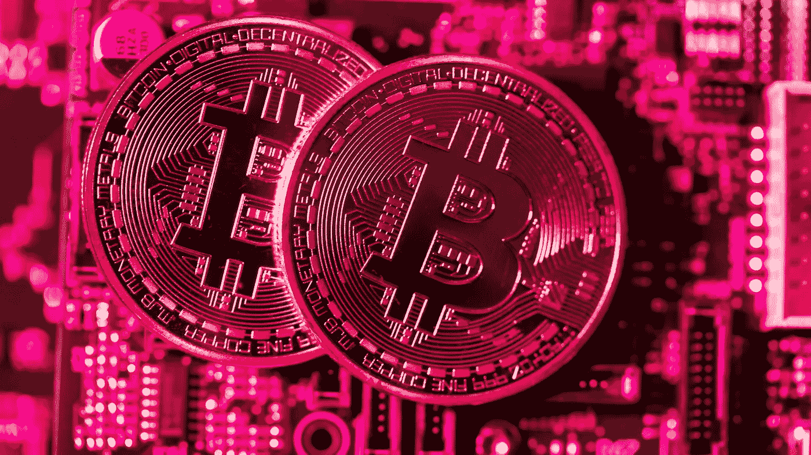
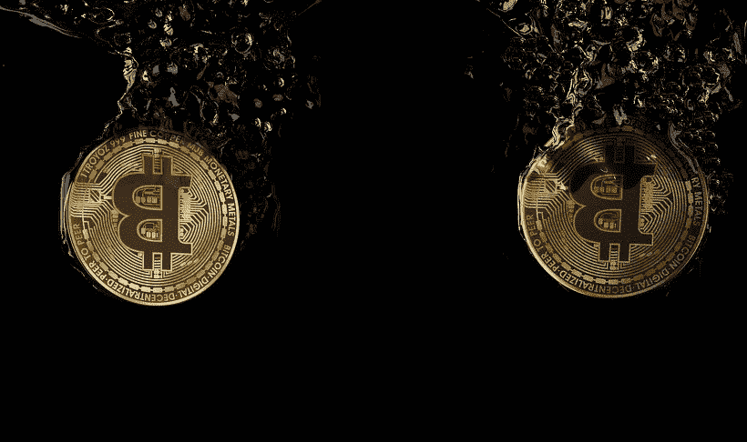
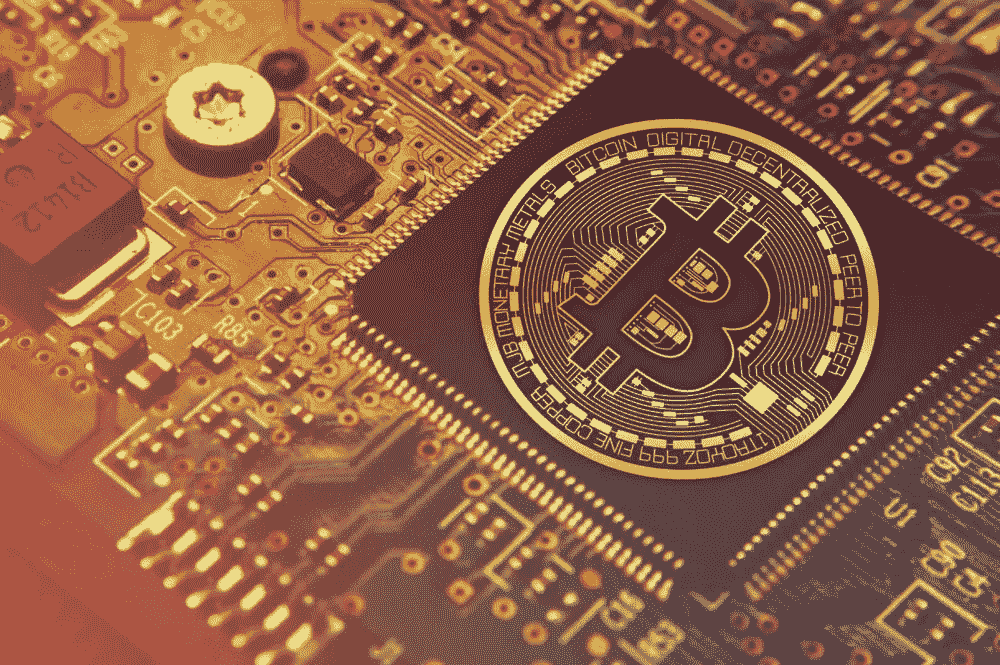

# 如何保护您的加密货币

> 原文：<https://medium.com/hackernoon/how-to-secure-your-cryptocurrencies-93b419e15fde>

## 权力下放将损失的责任完全放在了我们自己的肩上

## 1.0 一去不复返了

至少有 26500 个比特币、43 万个以太、11000 个比特币现金和 20 万个莱特币永远消失了。

这是由于加密货币交易所创始人的去世，他是唯一知道用于存储交易所各种加密货币的“冷钱包”私钥的人。

创建加密货币交易所 QuadrigaCX 的 30 岁创始人 Gerald Cotton 于 2018 年 12 月 9 日在印度因克罗恩病并发症意外去世。

QuadrigaCX 是加拿大最大的加密货币交易所之一，据估计，丢失的加密货币的美元价值约为 1.47 亿美元。

其他报告估计 QuadrigaCX 欠客户的资产超过 2.5 亿美元。

现在，我们有很多可能赔钱的投资者，还有一家公司，由于其创始人意外不幸去世，该公司欠客户价值数亿美元的资产。

然而，像这样的故事并不罕见，据估计，近 400 万个比特币因盗窃、丢失私钥和失误而永远丢失，比如一位投资者[扔掉了他的硬盘](https://www.theverge.com/2013/11/29/5156246/7-5-million-bitcoins-on-hard-drive-thrown-away-in-uk)，其中包含 7500 个比特币。

## 2.0 进入深渊

由于加密货币是通过区块链技术而不是单一实体来管理的，所以每个用户最终都要对他们在区块链的资产负责，除非他们通过一个集中的系统，比如交易所。

对于一个用户向另一个用户转移加密货币，他们需要钱包。钱包表示某个人拥有加密货币，但实际上没有加密货币存储在钱包上，而是存储在区块链上。

想象桌子上有一个苹果和两张纸:

苹果=加密货币，在这种情况下，让我们说 1 BTC

桌子=区块链，在这里是比特币区块链

两张纸=两个不同用户拥有的两个不同的钱包

现在假设用户 A 拥有第一张纸，在这张纸的上面是他也拥有的苹果。接下来，用户 A 想要将他的苹果转移给用户 B(一个朋友、一个交换或者仅仅是他拥有的另一个钱包)。

用户 A 将苹果从他的一张纸上移到用户 B 的一张纸上，苹果(比特币)留在桌子上(区块链)，但用户 B 的纸(用户 B 的钱包)表明用户 B 拥有苹果的所有权。

我希望这能弄清楚比特币和其他加密货币是如何转移的，但我们将在下面进行更多讨论。

每个加密货币钱包都由两个元素组成，公共地址(用于接收加密货币)和私钥(用于消费加密货币)。

如果你拥有一个热门钱包(以某种方式连接到互联网的软件钱包)，那么你可以像接收加密货币一样容易地发送加密货币。

然而，这些钱包被认为不太安全，因为私钥存储在连接到互联网的应用程序中。

由于与互联网连接的软件或应用程序持有私钥，因此如果黑客能够成功地危及应用程序的安全，它就很容易受到黑客的攻击。

这就是为什么许多交易所可能决定将用户的加密货币存储在“冷”或离线钱包中的原因。

“冷”或离线钱包不以任何方式连接到互联网，你通常必须使用私钥来“花”钱包。

例如，纸质钱包必须通过其私钥导入到“热”钱包中才能使用，这就是为什么建议用户在使用一个钱包后创建一个新的纸质钱包。

你可以用 BitAddress.org 的[生成一个比特币纸钱包，用 T4 的【MyEtherWallet】生成以太坊和 ERC-20 纸钱包。](https://www.bitaddress.org)

通过使用纸质钱包生成器，可以为纸质钱包增加一层额外的安全性，该生成器添加了用密码加密私钥的选项。

**我希望现在你能明白备份你的私钥或密码是多么重要，因为如果你丢失了它，没有密码或私钥重置选项！**

你也有像 [Ledger Nano S](https://www.ledger.com?r=4c54) 或 [Trezor](https://shop.trezor.io?a=22xad8w5rgj9) 这样的物理冷钱包，它们被称为硬件钱包。

对于这些冷钱包，你需要知道设备的 pin 码，然后使用它们各自的应用程序将资金转出。

其他冷钱包包括离线工作的软件钱包，这些通常是桌面钱包，如用于比特币的[比特币军械库](https://btcarmory.com/)和用于 Ripple/XRP 的 [Rippex](https://rippex.net/) 。

如果加密货币钱包的所有者丢失了私钥或去世而没有任何可访问的备份，这些硬币现在就丢失了。永远。

这种影响是如此的持久，以至于开发者们甚至用这种方法来“烧掉”或者让硬币不再流通。

他们将为他们的令牌创建一个地址，处理私钥，然后将一些令牌转移到该地址进行“烧录”。永远不会被访问或再次使用。永远不会。

这些交易是不可逆的，因为在区块链的交易中没有中间人，所有交易都是点对点的。

只有当接收钱包的主人决定将其寄回时，资金才能被退回。如果没有所有者或私钥丢失，那么你可以吻别宝贵的加密现金。

## 3.0 代码就是法律

私钥丢失并不是加密货币用户和投资者面临的唯一风险。

如果你熟悉臭名昭著的“道”事件背后的故事，那么你可能会理解区块链空间中的谚语“代码就是法律”。

DAO 是一个数字化的分散自治组织，是一种投资者导向的风险资本基金。DAO 在 2016 年通过代币销售众筹了 1.6 亿美元，这是当时历史上最大的众筹活动。

2016 年 6 月，黑客利用该代码的一个漏洞，窃取了 360 万以太网。在黑客能够将被盗资金从 DAO 账户转移到另一个地址之前，有 28 天的等待期。

以太坊社区最终决定在 2016 年 7 月执行硬分叉来撤销损害并归还被盗资金。以太坊社区的大多数人，包括 Vitalik Buterin，认为被盗金额太大，可能会导致以太坊的灭亡。

硬叉子被执行，被盗资金归还原主，但相当多的少数人认为，区块链应保持不变，“代码就是法律”。

这导致了一个叉子，原来不变的区块链被重新命名为“以太坊经典”(ETC)，新的区块链成为我们今天知道的以太坊(ETH)。

尽管投资者在这种情况下能够收回他们的资金，但这仍然凸显了早期采用者在处理加密货币和区块链资产时面临的风险。

我们现在所处的阶段是，随着区块链和加密货币的普及，加密货币不仅被懂技术的个人使用，非技术人员也越来越多地参与进来。

不精通技术的人习惯于在忘记密码或任何其他重要信息时，由一个中央机构来帮助他们摆脱困境。

有了区块链的技术，一旦你搞砸了或者私人钥匙的唯一拥有者去世了，那就完了。这是我们为去中心化的点对点系统付出的代价。

这种更大程度的自由伴随着对责任的更大需求。

## 我希望你喜欢我的故事，请随意查看下面这些有用的资源:

****——**交易所在这里你可以使用现金从世界任何地方购买比特币、比特币现金、以太坊、Ripple、Stellar Lumens、Zcash、比特币黄金和 Dash。**全球发售****

**[**bit panda**](https://www.bitpanda.com/?ref=3127933809251797450)**——**交易所在这里可以用现金购买比特币、比特币现金、以太坊、Ripple、EOS、IOTA、Tezos、OmiseGo、0x、莱特币、潘托斯和 Dash。**目前仅在欧洲提供。****

**也可以在 [**推特**](https://twitter.com/CryptoniteTweet) **上关注我。****