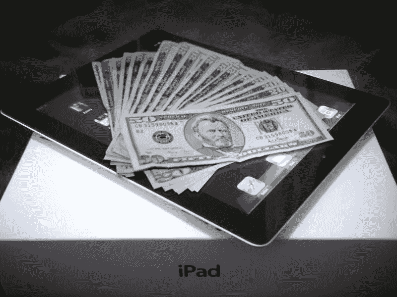

# 如何以最优惠的价格和最快的速度在网上出售你的 iPad

> 原文：<https://medium.com/hackernoon/how-to-sell-your-ipad-online-with-the-best-offers-and-quick-cash-22efee5167c3>

现代社会倾向于购买产品，并使用它们来满足他们的需求，然后在可重复使用的情况下出售它们。iPads 和其他苹果产品非常昂贵，因此它们通常是转售的最佳产品。二手苹果产品也有很好的需求，因为有些人买不起一手产品。通过 iGotOffer 的域名，你可以卖掉你的 iPad，从中获得适当的收益。

## **销售过程**

有三个简单的步骤让[快速卖掉你的 iPad](https://igotoffer.com/sell/ipad) 。这些步骤解释如下。

● **为你的产品寻找报价:**这是第一步，是一个简单的过程。你可以从 iGotOffer 的域名上买到很便宜的 iPad。这将有助于你安心，因为在你发货之前就已经有报价了。这也是一个很好的建立信任的过程。

● **免费运送产品:**产品需要免费运送。这不是一个非常繁琐的过程。你需要把 iPad 打包交给收集人员。你还会得到一份收据证明，在我们 iGotOffer 的域名中没有欺诈的机会。

● **快速轻松的拿到钱:**买家拿到产品后，会即时付款。这笔钱将记入你的账户。你将不必担心付款，它从来没有拖延之前被清除。

# 有效的广告技巧如何在 iPads 销售中发挥重要作用？

品牌和促销是成功开展活动的两个最重要的因素。没有这一点，一个人将无法获得成功的业务。如果你想获得可观的利润，那么你一定不能回避投资广告活动。开展促销活动的最佳方式是雇佣专业人员，在全国范围内做广告，让人们了解你的产品和服务。

# 保持现状

随着新的和先进的推广方式的发明，人们比以往任何时候都更倾向于选择在线域名。这背后的主要原因是，像 iGotOffer 这样的网站拥有丰富的媒体知识，能够让人们了解你的公司和你提供的服务。这家公司作为一家高效的广告代理公司，将确保你得到你所寻求的特定营销利益。他们还将确保您的所有活动需求得到充分满足。

# 减少发生的费用

毫无疑问，雇佣传统和数字营销媒体的成本会很高，而且只会接触到那些使用这些媒体的人。你可以通过雇佣有很好的销售功能的服务来节省很多钱。费用取决于你承保的服务。因此，跟踪预算变得很容易。这家公司的另一个优点是，你可以通过数字媒体接触到活跃在至少某种领域的个人。如果有人尝试户外广告，后果将是可怕的，因为广告将完全混乱和混乱。大量的金钱会浪费在思考和创造上。因此，最好使用 iGotOffer 的服务来为销售你的 iPad 做广告。

# 通过 iGotOffer 销售 iPad 的分步指南

**第一步:**选择要销售的设备。在这里，您将选择“iPad”选项来销售您的 iPad。

**第二步:**填写设备信息，如型号和产品的代。这是您拥有并准备出售的 iPad 的产品验证。

**第三步:**你可以选择自己的运营商，甚至以同样的方式选择 iPad 机型的存储容量。

**第四步:**你要告知包装里是否包含充电器。会有一个是或否的选项，你必须选择它。

**第五步:**还有一些选项可以描述你的 iPad 的状况。你必须在新的、完美的、好的、一般的和坏的选项中选择一个。

**第六步:**之后，你就可以出发了，你会让承运人到你的地方来取货。

**第 7 步:**您将获得一张设备收据，为了安全和保证，您需要保留这张收据。

**第 8 步:**iPad 将会送到 iGotOffer 的团队手中，他们会对产品进行翻新，然后运送给买家。

**第九步:**一旦买家收到商品，我们会通知你，然后你就可以等待付款了。

**第 10 步:**货款会被打到你的银行账户，你就完成了销售 iPad 的整个过程。

# 为什么选择 iGotOffer？

今天市场上有很多产品转售域名，你可能会想为什么你应该选择 iGotOffer 而不是其他的。这里有一些独特的功能，你可以在 iGotOffer 上使用，而在其他域中则没有。

●他们对你的产品有一个合理的定价体系，你会对收到的报价非常满意。

●他们被领先的市场信任机构——商业改善局(BBB)评为 A 级。

●他们使流程变得快速，整个系统从发行到资金转账都在一到三个工作日内完成。

●你可以通过你想要的任何方式获得付款，这取决于你，因为他们为你留下了许多选择。

通过这种方式，你可以利用 iGotOffer 的服务并出售你的 iPad。这是一种以优惠价格出售 iPad 的快捷方式。