# 如何在 AWS 媒体服务中设置实时和点播流

> 原文：<https://medium.com/hackernoon/how-to-set-up-live-and-on-demand-streaming-in-aws-media-services-a02fdc1c4a4f>

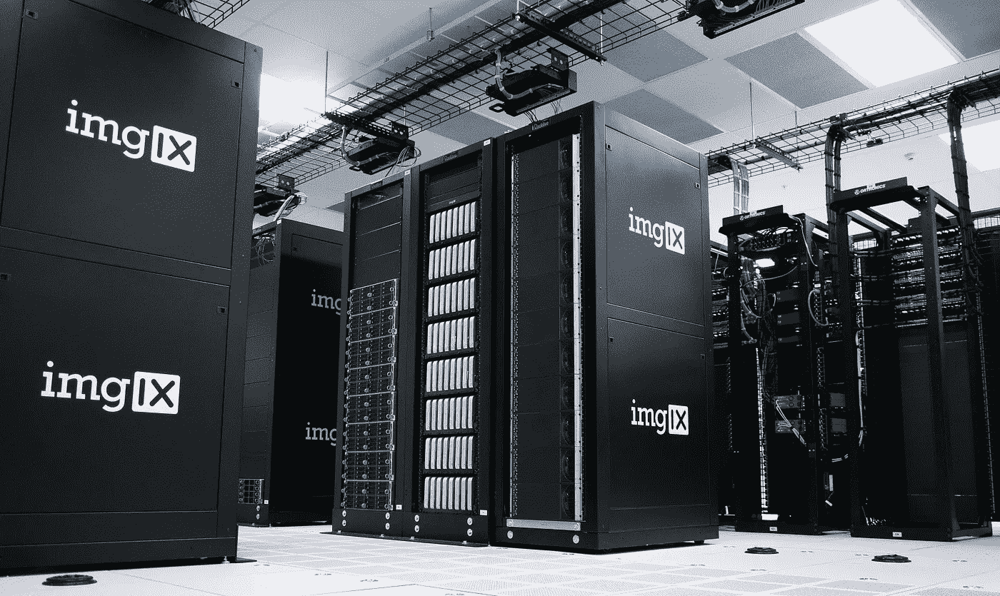

AWS 媒体服务代表了一套基于云的解决方案，旨在协助视频处理。他们使用 OTT (Over-the-Top)技术处理、存储和交付视频内容。

这些服务提供了随用随付的定价模式，这意味着它们非常适合在很短的时间内构建可扩展的解决方案。

# 一点理论

下面，我列出了 AWS 媒体服务系列的解决方案，并简要说明了它们的用途:

*   **AWS 元素媒体连接**。这是一项针对安全可靠的视频流传输而优化的服务。
*   **AWS 元素媒体转换**。这个负责视频文件处理和视频点播内容的创建。
*   **AWS Elemental MediaLive** 。该服务允许以实时模式为广播转换视频内容。
*   **AWS 元素媒体包**。它用于准备和保护互联网上的视频内容传输。MediaPackage 使用一个源创建采用不同格式和标准(MPEG-DASH、平滑流、HLS、CMAF)的视频流，以便在各种设备(电视、电脑、智能手机、平板电脑、游戏控制台)上播放。
*   **AWS 元素媒体商店**。AWS 存储针对实时视频内容进行了优化。它在大量查询时提供较低的读写延迟，因此您可以为用户提供高质量的服务。
*   **AWS 元素中介器**。这项服务允许视频提供商在服务器端将广告嵌入到他们的视频流中。

# AWS 媒体服务的优势

那么为什么 AWS 媒体服务值得使用呢？首先，它们[降低了基础设施支出](https://www.cleveroad.com/blog/how-to-use-aws-lambda-see-a-detailed-guide)并优化了广播组织者和媒体内容提供商的内容交付流程。

对于内容所有者来说，他们允许为任何规模的广播创建点播视频格式的内容。而媒体公司可以因 OTT 技术拓宽受众。

## 主要使用案例

*   实时创建视频广播(直播流)。
*   创建视频点播内容库。

# 设置实时视频流

我们现在开始练习吧。

实时视频流可通过以下服务构建:

1.  **AWS 元素媒体直播**。借助各种编解码器对视频和音频流进行转换/编码。它还负责添加字幕和水印。
2.  **AWS 媒体存储**。优化的媒体内容存储，让您可以存储视频流的记录及其进一步的点播交付(可选)。它有时可能无法正常工作，所以亚马逊建议使用 AWS S3。
3.  **AWS 元素媒体包**。使用不同技术(Apple HLS、MPEG-DASH、CMAF、Microsoft Smooth Streaming)将重新编码的视频流传输到目标设备。
4.  **AWS 云锋**。CDN 服务，用于加快跨不同地理区域的交付(可选)。

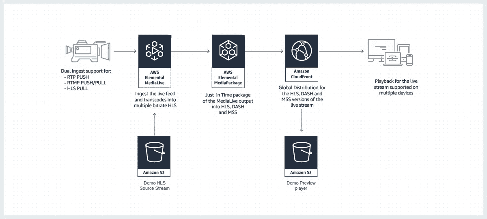

以下是设置实时视频广播需要做的简单说明:

1.  在 AWS MediaPackage 中创建一个通道。
2.  为通道创建一个端点。
3.  为 AWS MediaLive 频道创建一个源(输入)(如果需要，还可以创建输入安全组)。
4.  创建一个 AWS MediaLive 频道，将视频从源转换并传输到 AWS MediaPackage。
5.  开始视频广播。

让我们更详细地考虑一下前面提到的几点。

## 1.在 AWS 元素媒体包中建立通道

第一步是创建 AWS MediaPackage 通道，用于处理重新编码的视频流。您可以通过使用 AWS SDK 或开发人员控制台来实现。

(下面的**例子是基于使用开发者控制台**的，但是使用 SDK 也很容易做到。)

要创建频道，您应该指定其 ID 和描述(可选)。目前，AWS Elemental MediaPackage 仅支持 HLS 协议。所以请记住这一点。

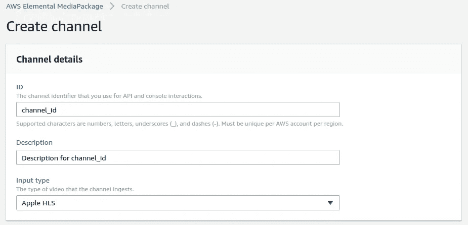

## 2.配置端点

下一步是配置端点(终端用户需要遵循的地址，以获得流视频)。

以下是所有支持的选项:

*   苹果 HLS
*   微软平滑
*   通用媒体应用程序格式(CMAF)
*   MPEG-DASH

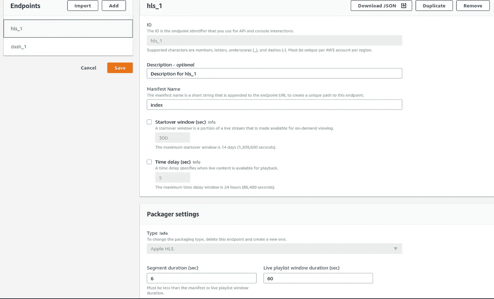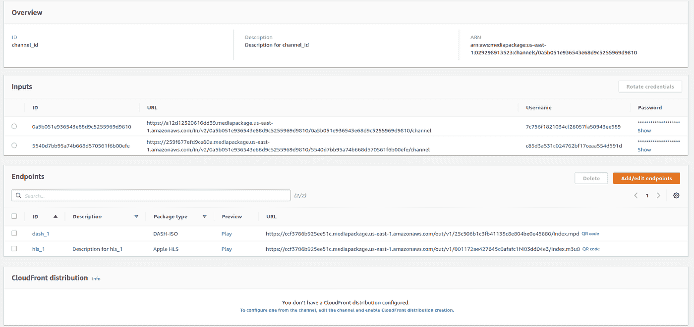

## 3.调整媒体直播

一旦 MediaPackage 设置完毕，您就可以继续调整 AWS MediaLive 了。首先，您需要创建**输入**(视频流的源)。

MediaLive 可以在输入端接收:

*   MP4 文件。
*   通过 RTMP/ RTP/HLS 协议传输的流。
*   使用 AWS MediaConnect 传输的流。

作为一个例子，让我们创建一个使用 RTMP 协议通过 OBS(开放广播软件)接收屏幕记录的输入。

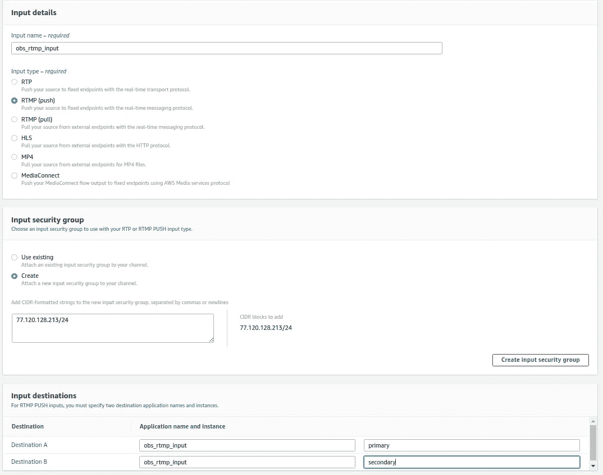

## 4.在 MediaLive 中创建视频流处理通道

为此，您需要指定名称，创建一个 IAM 角色(或者选择一个已经存在的角色)。然后，您应该选择先前创建的输入和**输出组**(转换后的媒体流的目的地)，以提供与其他服务集成所需的权限。

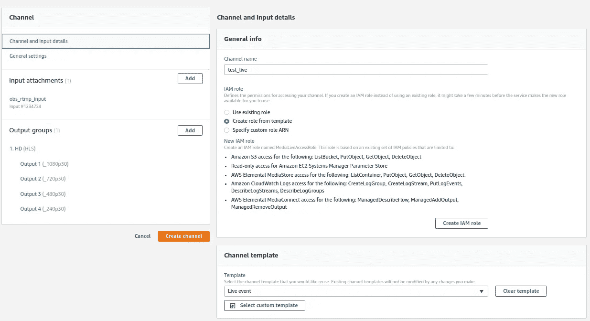

作为输出，AWS MediaLive 支持:

*   苹果 HLS
*   将视频流存档到 S3
*   RTMP(将视频传输到 YouTube、Twitch 等流媒体服务)
*   微软平滑
*   UDP/RTP

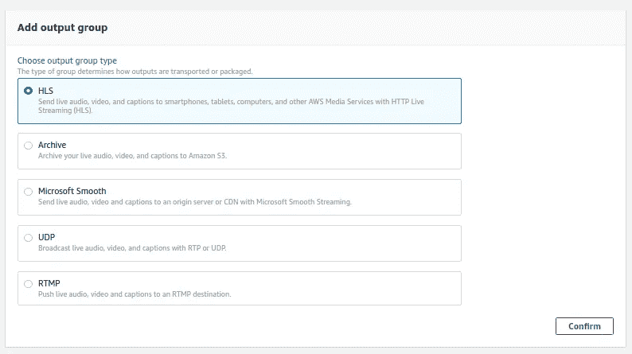

可以创建自己的输出组或从模板中选择一个。让我们以“实时事件”模板为例，创建一个支持四种分辨率(240p、480p、720p 和 1080p)的输出 HLS 流。

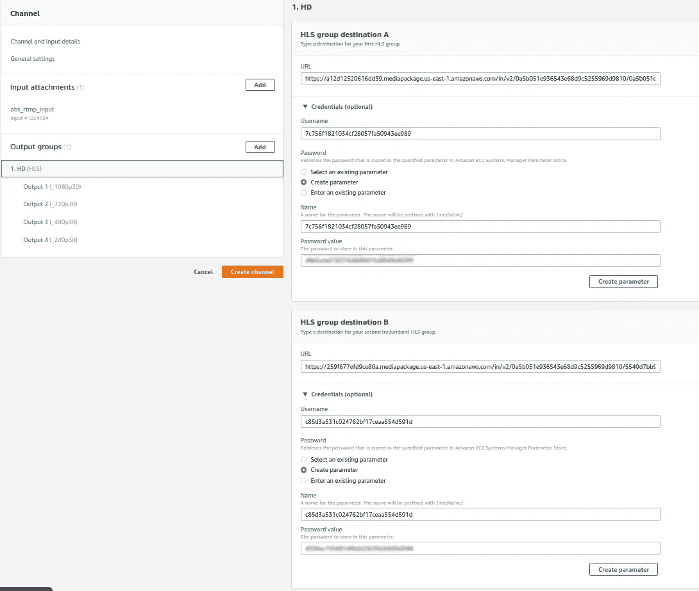

在输出流的设置中，应该指定目的地址。(例如，在 HLS 输出的情况下，它可以是诸如 MediaPackage、MediaStore、S3 或 Akamai CDN 之类的服务)。还要指定的一件事是 MediaPackage 通道的输入地址。

之后，你可以更改视频的编码设置，或者添加其他屏幕分辨率和比特率的输出。最后，通过点击“创建频道”按钮，您将创建频道本身。

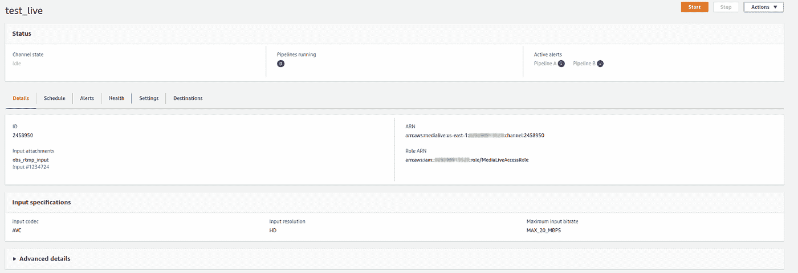

## 5.启动 MediaLive 频道

要最终开始广播，您应该指定在创建 RTMP 时获得的地址。

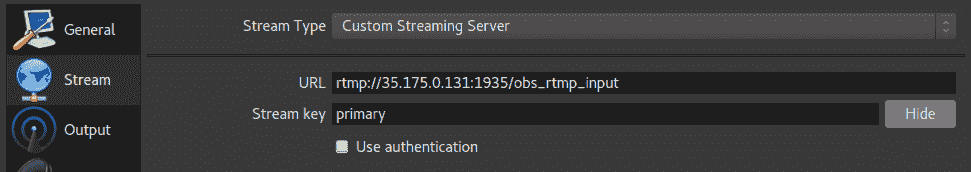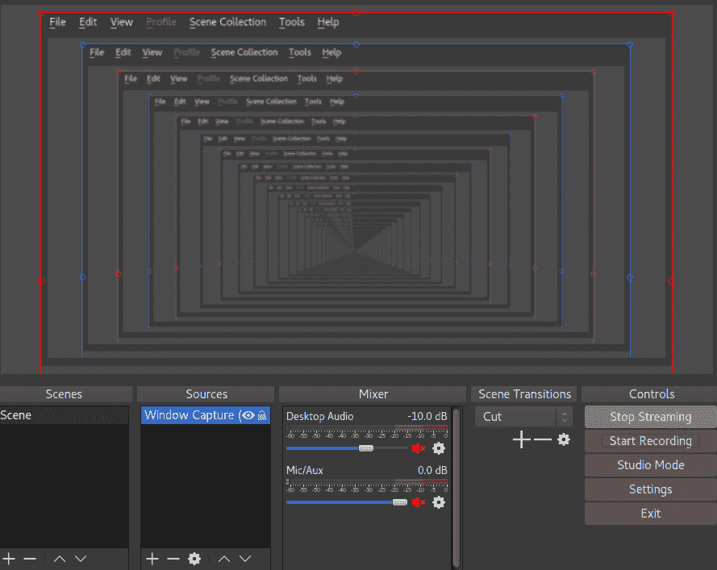

广播视图将在媒体包端点中创建的地址上可用。

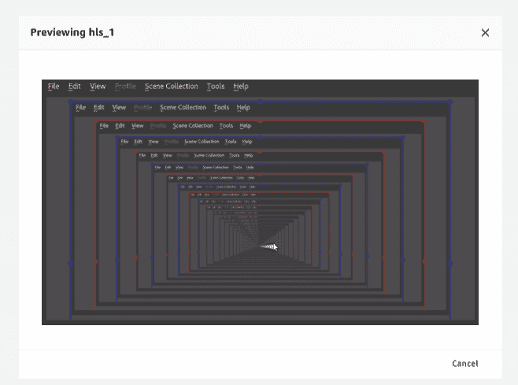

如果有必要保存广播，您应该使用 **MediaStore** 或 **S3** 而不是 MediaPackage。

# 设置视频点播

AWS Elemental MediaConvert 用于交付点播视频内容。它的工作方式与 MediaLive 类似，唯一的区别是 MediaLive 实时处理视频流，而 MediaConvert 对来自 S3 存储的视频文件进行同样的处理。

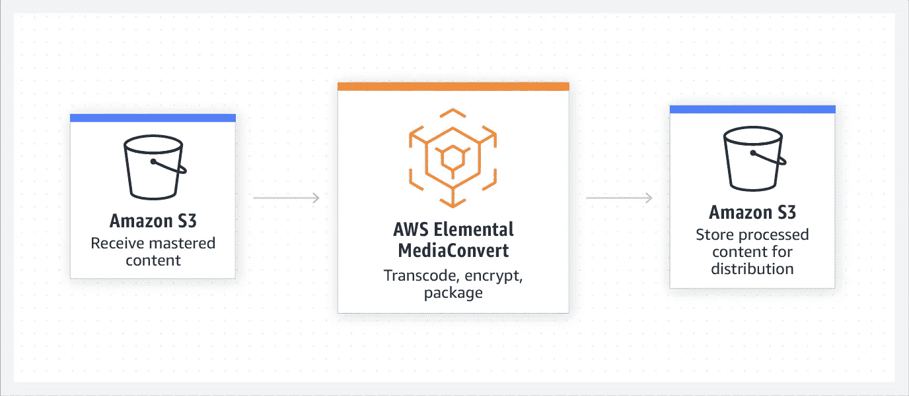

亚马逊给开发者一个[开源解决方案](https://github.com/awslabs/video-on-demand-on-aws)，需要几个步骤来调整:

1.  将带有标签的源文件加载到 S3，以便在 S3 冰川自动气象站存档。
2.  然后验证源视频，并根据元数据选择 AWS MediaConvert 模板。接收到的数据被保存到数据库中。
3.  基于配置文件在 AWS MediaConvert 中创建视频处理任务(作业)。
4.  在视频转换结束时，结果被传送到 S3，数据库记录被更新。
5.  来自 S3 的处理后的数据被缓存到 CloudFront，以加快跨不同地理区域的交付。
6.  这些虫子是在 CloudWatch 的帮助下捕获的。

在下面，我留下了一张示意图来说明它是如何工作的。

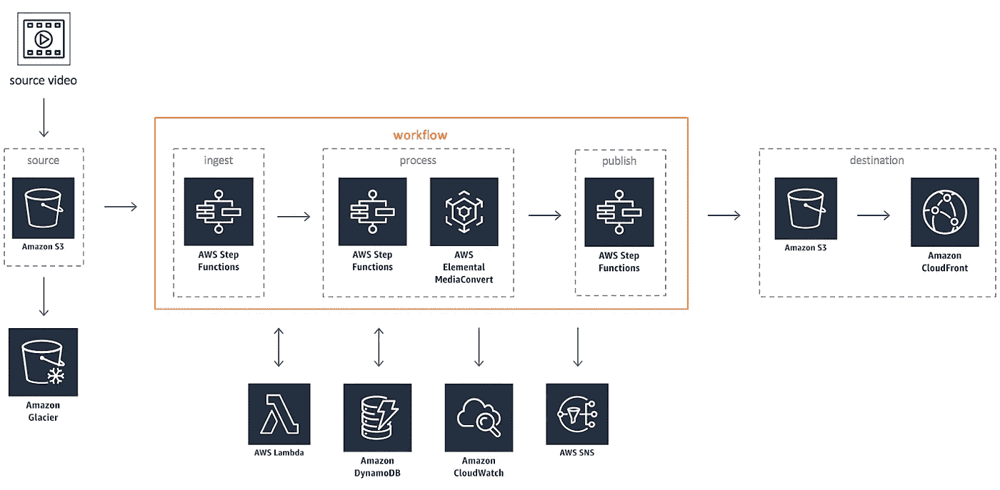