# 如何设置一个无头的树莓派

> 原文：<https://medium.com/hackernoon/how-to-setup-a-headless-raspberry-pi-7f2b8b00c790>

## 通过您的 Linux 系统无线操作 Raspberry Pi。


Photo by [Harrison Broadbent](https://unsplash.com/@hbtography?utm_source=medium&utm_medium=referral) on [Unsplash](https://unsplash.com?utm_source=medium&utm_medium=referral)

# 如何设置一个无头的树莓派

## ***通过你的 Linux 系统无线操作树莓 Pi。***

想要在不购买额外的键盘、鼠标、显示器等的情况下操作您的树莓派吗？那么这本指南是给你的。

*以下方法在* ***树莓派 3B*** *和* ***树莓派 Zero W*** *上测试成功，使用 Arch Linux 作为主机 OS。此外，本教程也可以用于微软视窗系统，因为视窗系统支持 Linux 终端。使用终端并按照步骤操作。*

*如果你觉得这个博客有帮助，请* ***点击*** 👏 ***按钮*** ***并分享*** *帮助别人找到！*

## 如何设置 Pi？

# 那么，让我们开始吧

# 第一步:满足需求

您将需要以下资源:

*   树莓派及其电源适配器
*   Micro SD 卡 *(8 GB 以上)*
*   无线路由器*(你甚至可以使用智能手机的热点)*
*   Linux 系统。
*   活跃的互联网。

# 第二步:下载 Raspbian

要进入官方下载页面，[点击这里](https://www.raspberrypi.org/downloads/raspbian/)。

下载**《Raspbian 拉伸用桌面及推荐软件》。**本 ISO 包含 **ssh 服务器**、 **vnc 服务器**以及其他所需工具。

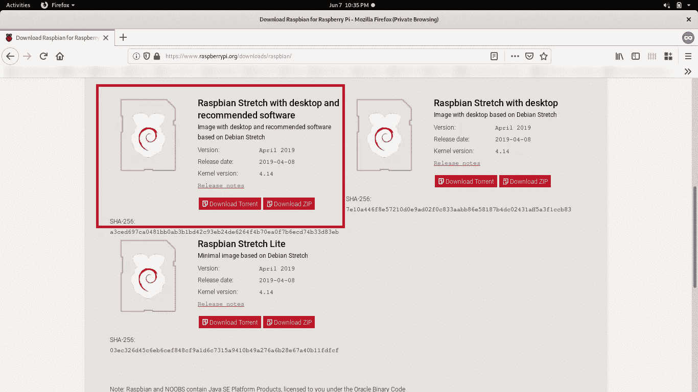

# 第三步:将 ISO 刻录到 Micro SD 卡

首先，把 Micro SD 卡连接到你的 Linux 系统上。

用 Balena 蚀刻机把 Raspbian 烧录到 SD 卡上。Etcher 是一款开源的，非常方便易用的 Linux 镜像刻录工具。 *(Raspbian 也是基于 Linux 的)。*从[这里](https://www.balena.io/etcher/)下载。

运行它。

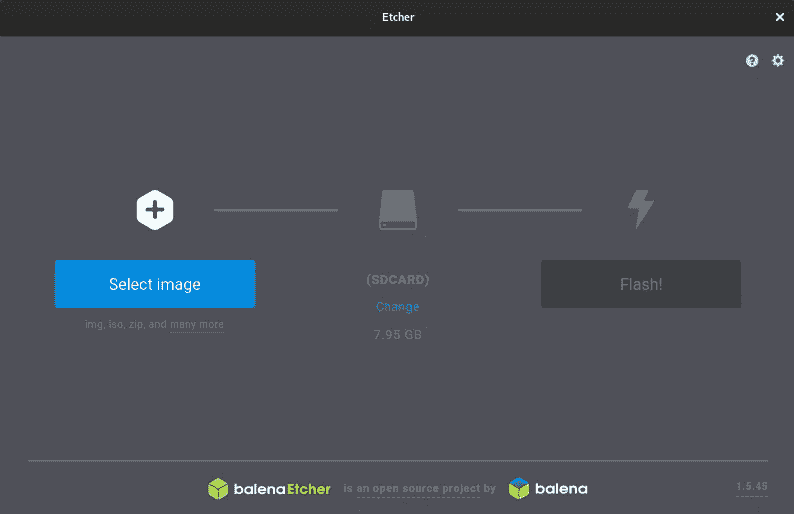

选择 Raspbian ISO 的路径，然后选择你要刻录的 SD 卡，点击 **Flash！**。它会要求认证。

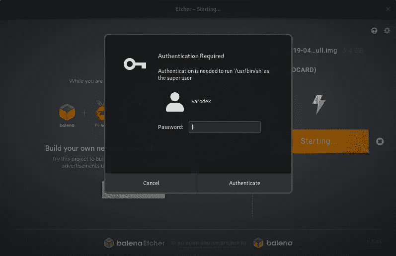

输入您的密码。这需要一些时间，直到你喝咖啡休息。:).

# 步骤 4:启用 SSH

在文件浏览器中打开 SD 卡的`**boot**`分区。现在，在同一个工作目录下运行终端，并创建一个名为`**SSH**` 的空文件。只有在第一次启动时才需要这样做，这将在您的 Pi 上启用 SSH 服务器，因此可以通过网络控制它。

运行以下命令:

`**$ touch SSH**`

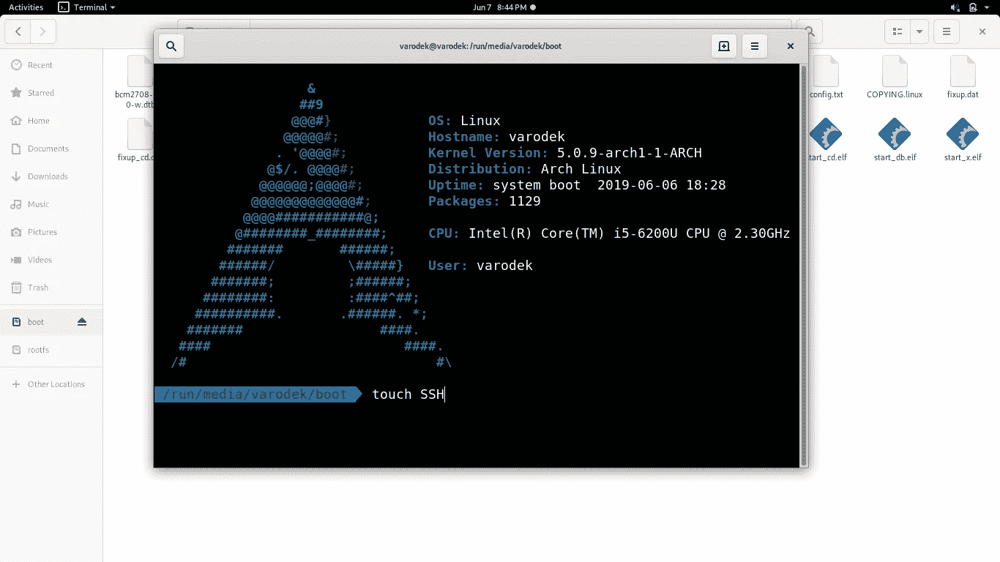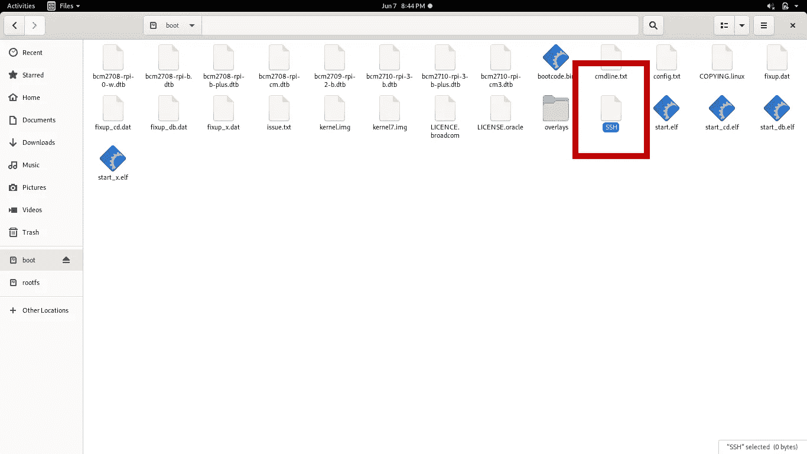

# 第五步:在您的 Pi 中输入 Wifi 密码

WiFi 连接可以由无线路由器或智能手机热点提供。

这是必要的，因为我们正在设置一个无头 Pi，我们需要它一启动就连接到网络。**将其连接到与您的 Linux 系统连接的同一网络**。这将创建一个局域网。

同样，只有在第一次启动时才需要这样做。

在文件浏览器中打开 SD 卡的`**rootfs**` 分区。现在在同一个工作目录下运行终端。

现在移动到`**etc/wpa_supplicant**` 目录并编辑`**wpa_supplicant.conf**` 文件。


Screenshot of my Terminal.

现在用下面的内容修改一下。

`**country=IN**` 为贵国。在我的代码中，`**IN**` 代表**。**

你的`**wpa_supplicant.conf**` 文件会是这样的。

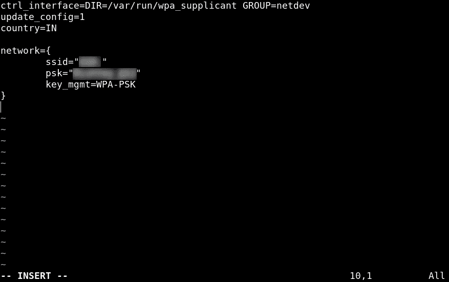

Screenshot of my Terminal

# 第六步:打开你的树莓派

# 步骤 7:找到你的 Raspberry Pi 的 IP 并使用 SSH 访问它。

**(注:如果使用静态 ip，我们可以跳过这个麻烦。但是这会让这个教程变得非常棘手。)**

*如果您的路由器支持*[*MDNS*](https://en.wikipedia.org/wiki/Multicast_DNS)*，(所有装有 Andoird < 9 的智能手机都通过其热点支持 MDNS)，只需使用命令*`***ssh pi@raspberrypi***`**或***登录您的 pi。它要求输入密码，默认为*`***raspberry***`**。****

**我们将在我们的主机 Linux 系统上运行 Pi。为了在两个系统之间建立通信，我们需要 IP 地址。这就是为什么我们将我们的系统和 Pi 连接到同一个路由器/智能手机热点，以便创建一个本地网络。**

**我们使用路由器/智能手机热点作为第三方设备，为我们的系统和 Raspberry Pi 提供 IP 地址。**

**因此，让我们找到我们的 Pi 的 IP 地址。为此，我们首先需要找到我们系统的 IP 地址。您可以运行以下任何命令:**

*   **`**ifconfig**`**
*   **`**ip addr**`**
*   **`**ip address show**`**

**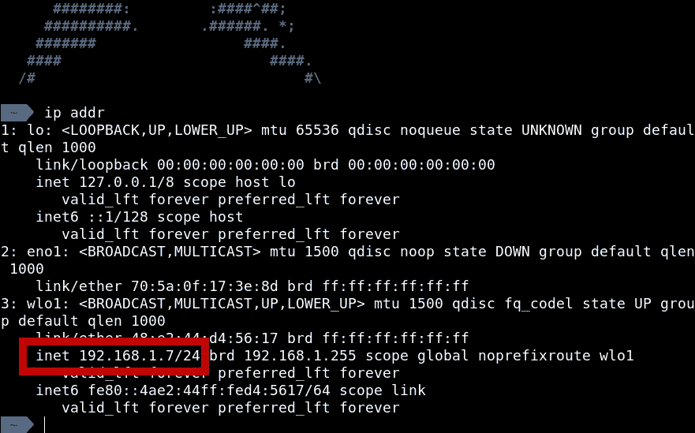**

**Screenshot of my Terminal**

**可以看到，从`**inet 192.168.1.7/24**` 这一行，很明显我的 IP 地址是`**192.168.1.7**` 。**

**由于我的 Linux 系统和 Raspberry Pi 连接到同一个网络，我的 Raspberry Pi 将有一个形式为`**192.168.1.xx**` 的 IP 地址，其中`**xx**` 是 1 到 255 之间的任何整数。**

**我们需要`**nmap**` 。在您的系统上安装它。**

**由于我的 IP 是`**192.168.1.7**` ，我将运行以下命令(根据您的 IP 修改命令):**

**`**$ nmap -sn 192.168.1.0/24**`**

****

**Screenshot of my terminal.**

**现在，你在我的终端截图中看到的所有 IP 地址都是连接到我的 Wifi 路由器的设备的 IP 地址。**

**检查哪一个是你的 Pi。**

**使用您获得的 IP 地址运行命令:**

**`**$ ssh pi@<ip-address>**`**

**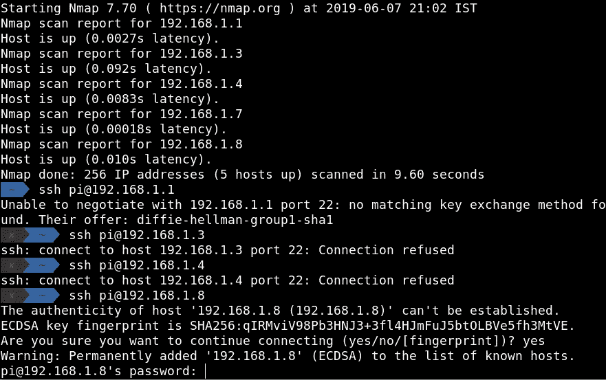**

**Screenshot of my Terminal**

**于是发现，`**192.168.1.8**` 是我 Pi 的 IP 地址。**

**你的树莓派默认密码是`**raspberry**` **。****

**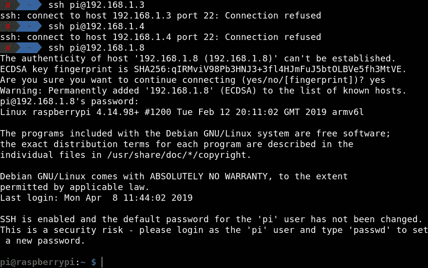**

**Screenshot of my Terminal**

# **万岁！恭喜你。您已经设置了您的无头 Pi。**

***有时运行* `***sudo nmap -sn 192.168.1.0/24***` *而不是仅仅*`***nmap -sn 192.168.1.0/24***`**显示连接的设备的主机名。比如:****

```
****sudo nmap -sn 192.168.1.0/24**Starting Nmap 6.40 ( http://nmap.org ) at 2014-03-10 12:46 GMT
Nmap scan report for **hpprinter** (192.168.1.2)
Host is up (0.00044s latency).
Nmap scan report for **Gordons-MBP** (192.168.1.4)
Host is up (0.0010s latency).
Nmap scan report for **ubuntu** (192.168.1.5)
Host is up (0.0010s latency).
Nmap scan report for **raspberrypi** (**192.168.1.8**)
Host is up (0.0030s latency).
Nmap done: 256 IP addresses (4 hosts up) scanned in 2.41 seconds**
```

**以上输出来自[https://www . raspberrypi . org/documentation/remote-access/IP-address . MD](https://www.raspberrypi.org/documentation/remote-access/ip-address.md)**

# **访问您的无头 Pi 的桌面**

## **步骤 1:在 Pi 上启用 VNC**

**访问您正在使用的 SSH 并运行以下命令:**

**`**$ sudo raspi-config**`**

****

**Screenshot of my Terminal**

**使用箭头键，转到**接口选项**的选项。按**键进入**。**

**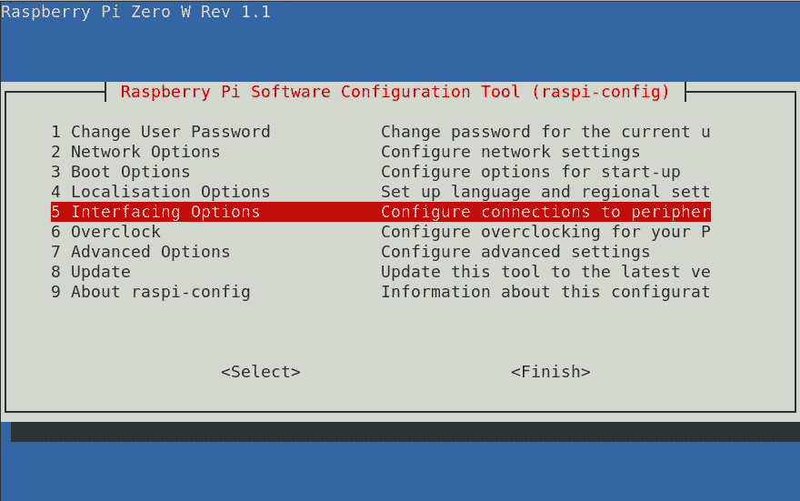**

**Screenshot of my Terminal**

**使用箭头键，转到 **VNC** 的选项。按**键进入**。按照所有选项**启用**它。**

**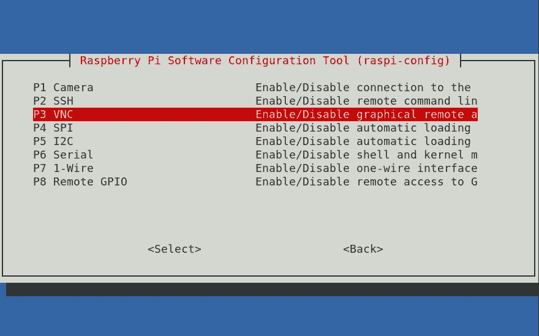**

**Screenshot of my Terminal**

**最后**完成**它。**

**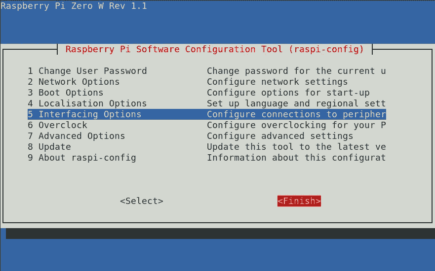**

**Screenshot of my Terminal**

## **步骤 2:下载 VNC 浏览器**

**为此，我们将需要 **VNC 浏览器**。从[这里](https://www.realvnc.com/en/connect/download/viewer/linux/)下载。**

****

**如果您已经下载了**独立**版本，解压文件。**右键点击**，勾选**“允许文件作为程序执行”复选框。****

**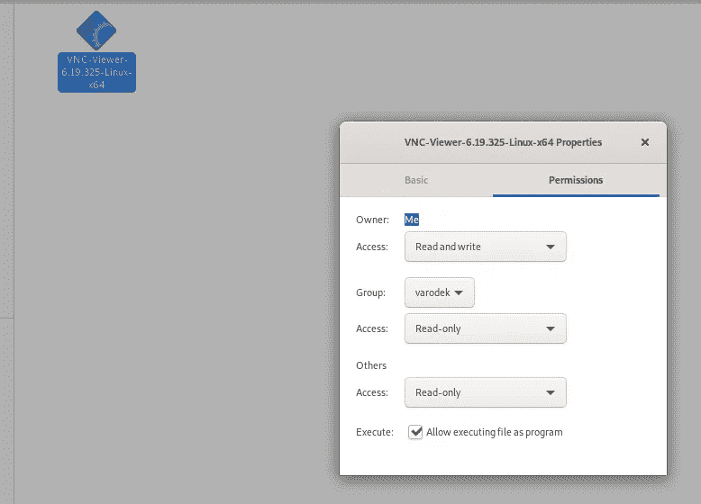**

## **步骤 3:使用 VNC 浏览器访问 Pi 的桌面**

**运行 VNC 浏览器，并输入您的 Pi 的 IP 地址。它会要求确认。点击**继续**。**

**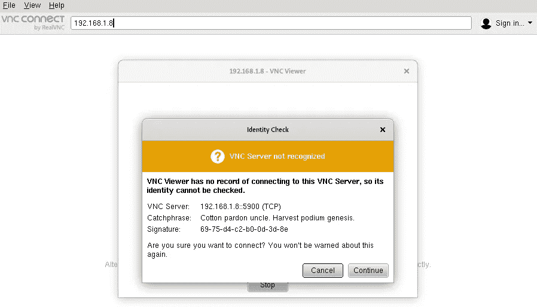**

**现在输入用户名和密码。**

**用户名是: **pi****

**密码是:**覆盆子****

**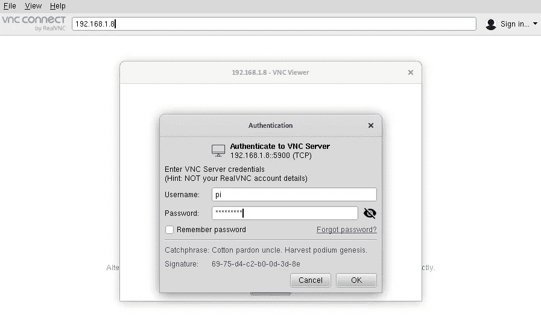**

**点击**确定。****

**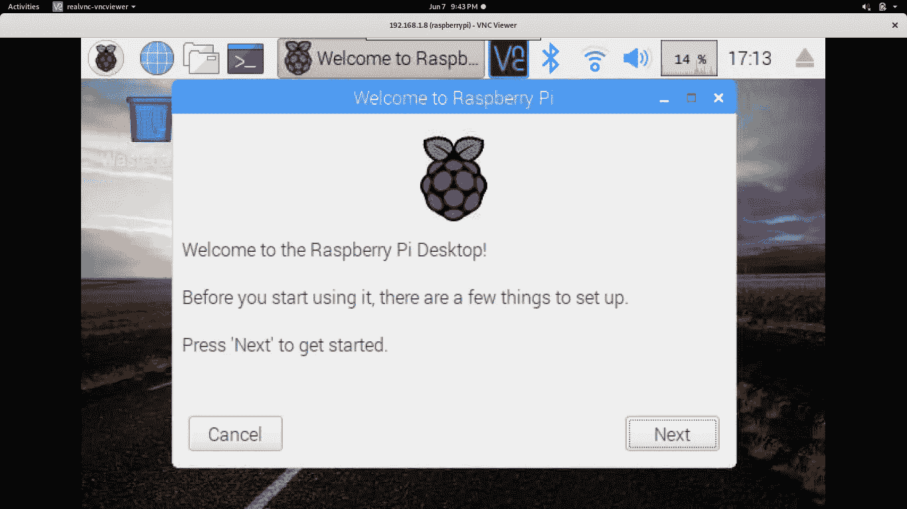**

# **万岁！恭喜你。您已经访问了您的无头 Pi 的桌面。**

# **关于我**

**你好，我叫瓦伊巴夫·古普塔。一个 OS/内核爱好者| GSoC '19 (RTEMS 项目)|开发者|导师|博客|素描师| Archer。**

**当我得到我的第一个 Pi 时，我遇到了很多问题来设置它，因为我在我的主机系统上运行 Linux，并且网上很少有关于这种情况的教程。连我学长都有教程，但只针对 Windows。我做了很多研究和实验，尝试了各种方法。现在我有一个完美的指南来操作一个 Pi。**

**我喜欢分享我学到的东西。所以，我写了这篇博客来帮助其他 IOT 爱好者:)。**

*   **对于我的其他项目，我的 GitHub 链接-[https://github.com/VARoDeK](https://github.com/VARoDeK/RGEVS)**
*   **我的其他特色博客-[https://medium . com/my-gsoc-2019-journey/my-pre-gsoc-journey-2c 528033 b66d](/my-gsoc-2019-journey/my-pre-gsoc-journey-2c528033b66d)**

## **让我们连接起来**

**如有任何疑问，请在 LinkedIn 或脸书上联系我。跟我来:**

*   **我的 LinkedIn 个人资料-[https://www.linkedin.com/in/varodek/](https://www.linkedin.com/in/varodek/)**
*   **我的脸书简介-[https://www.facebook.com/vaibhav.gupta.1004837](https://www.facebook.com/vaibhav.gupta.1004837)**
*   **我的推特账号-[https://twitter.com/varodek](https://twitter.com/varodek)**
*   **我的媒介账号-[https://medium.com/@varodek](/@varodek)**

***如果你觉得这个博客有帮助，请* ***点击*** 👏 ***按钮*** ***分享*** *帮助别人找到！欢迎留言*💬【以下 )。**