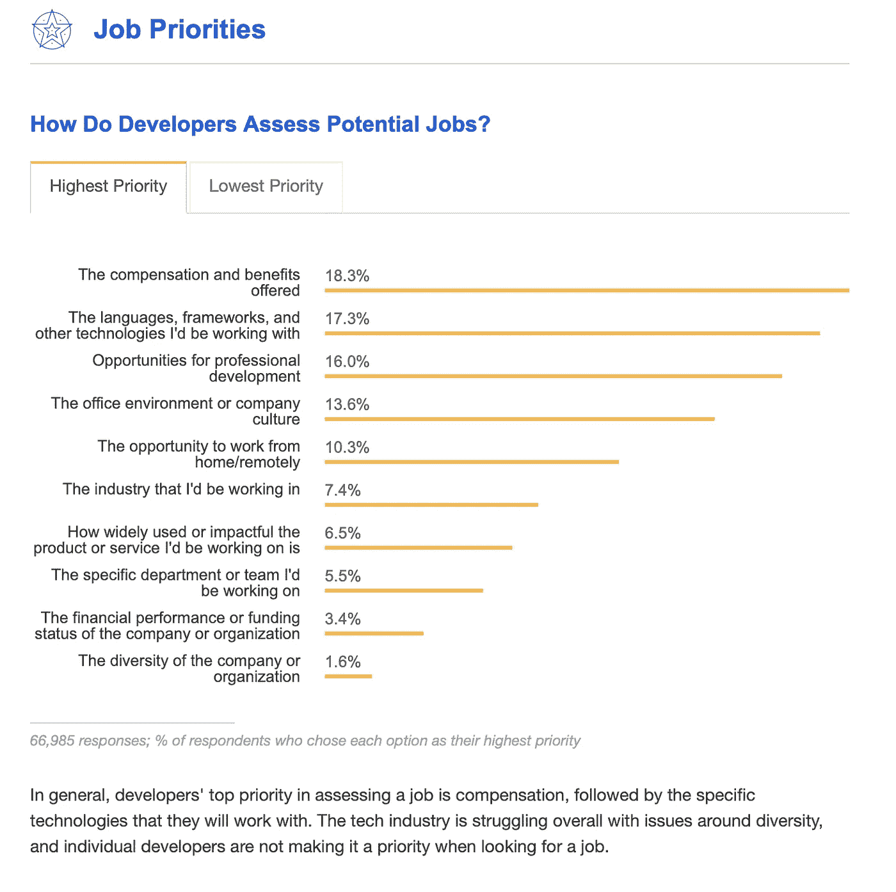

# 如何更快的出货，吸引最好的软件工程师，留住他们。

> 原文：<https://medium.com/hackernoon/how-to-ship-products-faster-attract-the-best-software-engineers-and-keep-them-f8216c43dc03>

## 有意义的工作与浪费

“这太糟糕了。”

软件开发人员嘀咕的一句常用语。

当有完成特性的压力时，花时间解决问题对开发人员来说很糟糕。当问题是由不合标准的工具、受限的访问或缺少文档引起时，情况会更糟。软件开发环境经常因为这些问题而变得糟糕，接下来会发生什么呢？生产率下降，产品交付期限推后，管理层撕掉了集体的头发。更糟糕的是，进步和动力下降。

> “进步的激励力量在几乎每个专注于掌握的领域都是众所周知的……把进步视为一种激励机制，你将创造一种完全不同的氛围。”
> 
> 《精力充沛的工人，精益思维》，作者汤姆·波彭迪克；玛丽·波彭迪克

大多数开发人员希望通过完成有意义的工作来看到进展，而有意义的工作很少等同于“解决由规定的工具、技术或语言引入的问题”。事实上，接受解决开发环境问题完全是一种浪费。这种浪费经常被开发人员增加的工作量掩盖，或者更糟，完全隐藏起来。

如果开发人员不能取得进展，通过完成有意义的工作，他们寻找其他地方工作。在 2018 年 Stack Overflow 开发者调查中，评估潜在开发者工作的第二重要标准是他们将使用的语言、框架和技术的选择，仅次于薪酬。

> 糟糕的开发体验会导致组织打一场消耗战，员工不断流失。

[https://insights.stackoverflow.com/survey/2018](https://insights.stackoverflow.com/survey/2018)

## 什么是开发者体验？

就像用户体验考虑最终用户的体验一样，开发人员体验考虑开发人员更细致入微的体验。

在 React Amsterdam 2019 上，Peggy Rayzis 讨论了她在 Apollo 的工作，她是一名开发人员体验团队的工程经理。

> 我是 Apollo 的一名工程经理，我领导着一个专注于开发人员体验的工程师团队。开发者体验等同于开发者生产力的提升。开发者体验很重要，因为它有助于更快地发布产品。这有助于我们吸引最好的工程师，也有助于留住他们。

在准备她的演讲时，Peggy 在 Twitter 上问了开发社区一个问题:

> 对你来说，伟大的开发者体验是什么样的？

开发商回应:

*   当做正确的事情是自然的，而搞砸是困难的时候，一个好的开发者体验就会发生。
*   伟大的开发者体验是当你可以将你的大脑直接投入到代码中。没有开发环境的阻碍！
*   伟大的开发者体验是你永远不必考虑的。它不碍事，让你专注于构建你的产品。
*   一个好的开发者体验可以抽象出适量的复杂性，并且仍然是透明的。当定制它时，这个过程是加法而不是减法。
*   伟大的开发者体验是你可以专注于业务逻辑和客户价值的体验。
*   一个伟大的开发者体验不能妨碍我正在努力做的事情，它需要适应工作流程。
*   伟大的开发者体验是当你的能力开始退步的时候。
*   最好的 DX 让正确的事情变得简单。内置的、默认的决策是很好的决策，可以根据需要轻松定制。
*   优秀的开发人员体验就是不要妨碍开发人员，让他们完成任务
*   优秀的开发人员体验是不需要花费数小时排除未记录的错误。用法不需要一遍又一遍地参考文档。

网上的文章多从生产软件和软件服务的角度谈 DX。

在“[优秀开发者体验的最佳实践](https://hackernoon.com/the-best-practices-for-a-great-developer-experience-dx-9036834382b0)”中，[山姆·贾曼](https://hackernoon.com/@samjarman)在制作软件时，对开源软件、清晰度和文档有一些很好的观点。

[贾斯汀·贝克](https://hackernoon.com/@justindesign)说“[开发人员也是人](https://hackernoon.com/developer-experience-dx-devs-are-people-too-6590d6577afe)”，我们在创建开发人员工具时应该考虑:功能、稳定性、易用性和清晰性。

DX 不一定以一个公司生产的软件开始或结束，也不一定只适用于销售开发人员使用的软件的组织。对于任何雇用开发人员的公司来说，在创建高效的开发人员环境时，这是一个重要的考虑因素。

> 好处应该很明显。如果您的公司正在创建软件，通过自动化提高效率，用软件推动创新等等，改善开发人员体验将增加您的投资回报。

那么，高级利益相关者、高管和经理如何应用 DX 思维来提高生产率和增加有意义工作的流动呢？

## 了解你的受众

> 研究。考虑写经验日记，并完成准备情况评估。

了解组织中的开发人员是重要的第一步。误解开发人员的需求并假设这些需求是什么，是良好开发人员体验的杀手。尤其是当做出假设的人没有积极开发软件的时候！不是所有的开发团队都是一样的。开发团队中的开发人员并不都是一样的。

生产力和商业价值应该是最初研究的重点。识别生产力和商业价值输出对商业和相关开发团队意味着什么。然后想办法衡量一下，问问有什么需要添加、删除或者改进的地方。

注意开发人员的生产力会因为以下任何一个常见的问题而降低；

*   防止利用习得的肌肉记忆
*   认知负荷的不必要增加
*   学习新工具的引入
*   迫使开发人员接受次优的工具
*   剥夺宝贵资源的使用权。

让开发人员写“体验日记”是一种观察开发人员体验的低成本方法。日记可以简单到记录花费在解决与交付商业价值没有直接关系的问题上的时间，但是通过利用敏捷工作流中已经很常见的工具和实践，日记可以形成更多的内容。

接下来，进行准备情况评估。这应该能够识别出需要做出的任何改变的潜在推动因素，以帮助解决研究中发现的挑战。准备情况评估的结果是一份报告。DX 就绪性报告的目的是帮助推动组织内部变革的讨论，其主要目标是通过提高留任率、生产力和幸福感来增加开发人员的回报！

## 将开发人员体验与其他目标结合起来

> 介绍“好的 DX ”,并使其与其他团队或组织目标保持一致。寻找代表或组建团队来支持良好的开发者体验

一旦准备报告完成，是时候了解研究提出的问题，并开始看看你可以“追求”什么。这不是一个小任务。你可能会遇到一些长期的决策，包括:环境、采购、支持、软件、硬件和安全，等等。就绪性评估可能会突出争论的领域或“不可移动的对象”,它们阻碍了组织获得采用开发人员体验思维的回报。

现在是鼓励商业利益相关者回答这个问题的时候了:“在计算净收益或损失时，引入过程、规则和规定的决策多久考虑一次开发人员的体验？”

正如我们在 Peggy Rayzis 的推文中看到的那样，好的 DX“避开了障碍，让开发人员交付商业价值。”

让开不是偶然发生的。因此，引入“良好的 DX”作为目标，将有助于减少开发人员生产率的低效率。让代表们将开发人员的经验和其他目标放在一起思考，将会提高意识，并增加开发人员在影响他们的对话中的发言权，这在以前是不存在的。有了合适的代表，就需要进行讨论来确定变更采用的合理方法。形成一个改变计划来改善一个公司或一个团队的开发者体验，你应该准备好了！

## 引入积极的 DX 变化

> 正式制定开发人员体验变更计划

DX 现在是一个经过深思熟虑的目标，在适当的级别有一些代表，有一个问题列表和一些经过深思熟虑的解决方案，团队准备好开始解决之前进行的研究中强调的问题。

改变时间表不一定要像听起来那么隆重！它可以是简单的十大优先改进列表和介绍它们的大纲。

那么是时候做出改变了！

任何变化和相关影响的经验证据都应构成有价值的变化反馈循环的一部分。使用反馈循环反复构建、测量和学习。

在向团队或组织推广之前，团队可能会尝试在人为的情况下引入低风险的研究阶段来测试变更。在提供真实反馈的真实环境中测试变化是很重要的。真实的反馈对于理解变革的影响至关重要。不要运行研究和开发阶段，保持小的变化，易于到位和易于回滚。

## 衡量改进

> 安装 DX 分析。定义业务价值，然后确定与变化相关的度量标准

改进的经验证据，通过引入良好的 DX，是实施变革时的“金蛋”。定义改进的含义并找到团队可以信赖的度量标准，就像使用 web 分析来衡量客户或用户体验的变化。“当我们引入这种变化时，就发生了这种情况。我们现在该怎么办？”。它形成了任何好的反馈循环的核心实践。

首先寻找量化数据来衡量变化。例如，改进的定义可能映射到特性的交付。然后，收集定性数据，进行同样的变化。请求开发人员反馈。例如:

*问题:“随着我们的改变，实现新功能有多容易？答案:1。更容易，2。同样的 3。更难。*

## 通往更有意义工作的道路

如果解决问题是你组织的核心业务，那么解决问题并没有错，但持续解决问题以尝试并完成有意义的工作是一种错误。“忙碌”是良好开发人员体验的对立面。当涉及到解决开发者体验问题时，由低努力驱动的高价值输出是努力争取的黄金比例！

如果成功被理解并被很好地定义，开发人员被信任，合理的自动化被引入，并且做出好的选择去抽象复杂性，那么好的开发人员体验的障碍将会消失，有意义的工作的流程将会改进。产品将被更快地运送，开发者将会更高兴，雇佣开发者的商业回报将会增加。

试试看。让我知道你进展如何。

我很有兴趣听听任何人对好的和坏的 DX 的体验。

给我发微博@barclaytweets 或者@ supasympa

—

## 参考

1.  佩吉·雷兹在 React Amsterdam 的演讲:[见 YouTube 上的视频](https://youtu.be/4KfAS3zrvX8?t=25959)
2.  推特对话:什么是好的 DX？[在推特上全文阅读。](https://twitter.com/peggyrayzis/status/1113475439601836039)
3.  [阿波罗](https://www.apollographql.com)
4.  [精益思维](https://www.amazon.co.uk/Lean-Mindset-Questions-Addison-Signature/dp/0321896904/)
5.  [建立测量学习反馈回路](https://www.youtube.com/watch?v=px5OxkYOHMk)

## 图像通过[https://unsplash.com](https://unsplash.com)

1.  回收和废物:[https://unsplash.com/photos/qph7tJfcDys](https://unsplash.com/photos/qph7tJfcDys)——**Alfonso Navarro**
2.  日记:[https://unsplash.com/photos/9n1USijYJZ4](https://unsplash.com/photos/9n1USijYJZ4)——
    JESHOOTS.COM
3.  车祸:【https://unsplash.com/photos/DFqg4jKDDVM】T21——**纪尧姆·布罗**
4.  分析:[https://unsplash.com/photos/pypeCEaJeZY](https://unsplash.com/photos/pypeCEaJeZY)——**活动创建者**
5.  路径:[https://unsplash.com/photos/jrzvClypPq8](https://unsplash.com/photos/jrzvClypPq8)——**詹姆斯·福布斯**