# 如何用 ALB 解决 API-GW“30 秒限制”

> 原文：<https://medium.com/hackernoon/how-to-solve-the-api-gw-30-seconds-limitation-using-alb-700bf3b1bd0e>

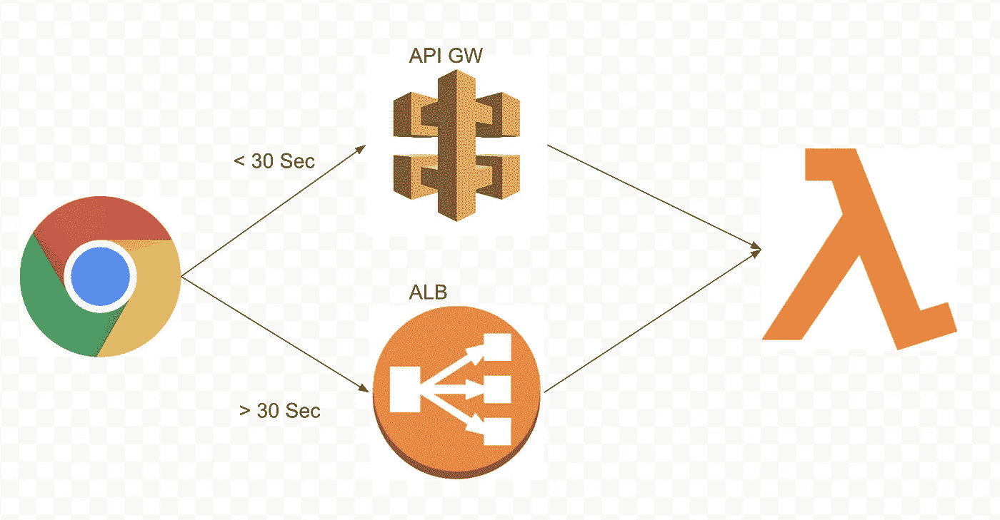

你有一个使用多个 AWS lambdas 和 API-GW 的无服务解决方案。一切都很好，但是你有一个(或多个)lambda 函数运行超过 30 秒——然后你得到**超时错误**。这是令人沮丧的，因为 lambda 可以运行长达 15 分钟。通常 AWS 为你提供选项来决定你的解决方案看起来如何，但是在这里他们为我们决定 API 必须花费少于 30 秒。

在我的例子中，我使用的是运行 SQL 查询的 API，在许多情况下，只需要 30 多秒就可以完成。类似的场景还有很多。

所以我们需要一个可以持续 30 秒以上的 API 服务，但是仍然希望停留在一个**无服务器架构中。**

我将在这里演示的解决方案是使用 **AWS ALB** (应用程序负载平衡器)

这些是我将介绍的步骤:

1.  创建一个 lambda 和 API-GW。显示在使用 API-GW 时，运行超过 30 秒的 API 请求会失败。
2.  创建调用相同 lambda 的 ALB 验证它工作 40 秒。
3.  创建第二个 lambda，并展示如何使用 URL 参数在 lambda 之间进行路由。

# 步骤 1:创建 Lambda 和 API GW

*   新的λ叫做**λ1。**这是一个非常基本的 lambda，它有一个名为 **waitSec -** 的参数，可以帮助我们控制 lambda 的持续时间。这是****节点的**代码:**

```
***exports***.handler = **async** (***event***) => { let start = **new *Date***();                // start time
    let waitSec  = ***event***.**queryStringParameters**.waitSec;//wait param
    await *wait*(waitSec);                   // wait!       
    let end = **new *Date***();                  // end time
    **const** response = {
        **statusCode**: 200,
        **headers**: {
            **"content-type"**: **"application/json"**,
        },
        **body**: ***JSON***.stringify(**`Hello from Lambda * 1 *, wait:**${***event***.**queryStringParameters**.waitSec} *****start:** ${start} *****end:** ${end}**`**),
    };
    **return** response;
};// wait function (sleep)
**async function** *wait*(timeSec){
    **return new** *Promise*(**resolved** => {
        setTimeout(() => {
        resolved()
    }, timeSec * 1000)
})
}
```

**将 lambda 超时更改为 5 分钟(或者您需要的任何大于 30 秒的时间)，并部署 lambda。**

*   **创建一个新 API-GW 来调用**λ1**，我把它叫做**λ1 API:****

**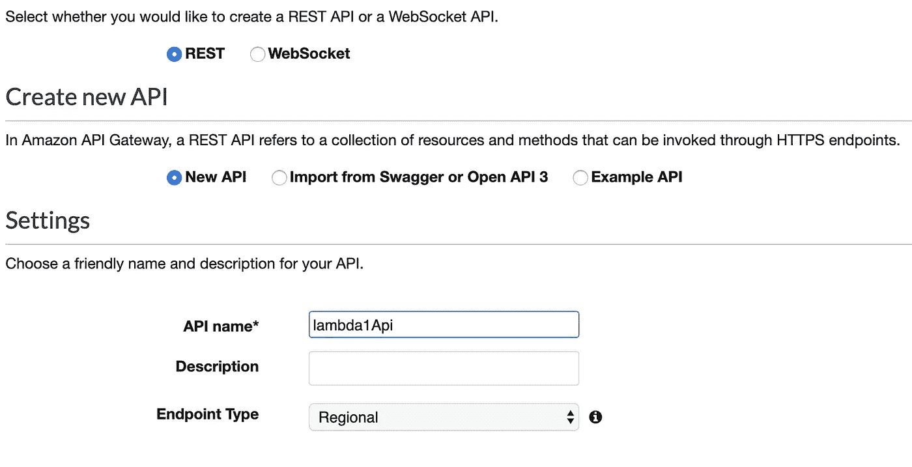**

**创建一个方法" **ANY "** ，它将调用**λ1****

**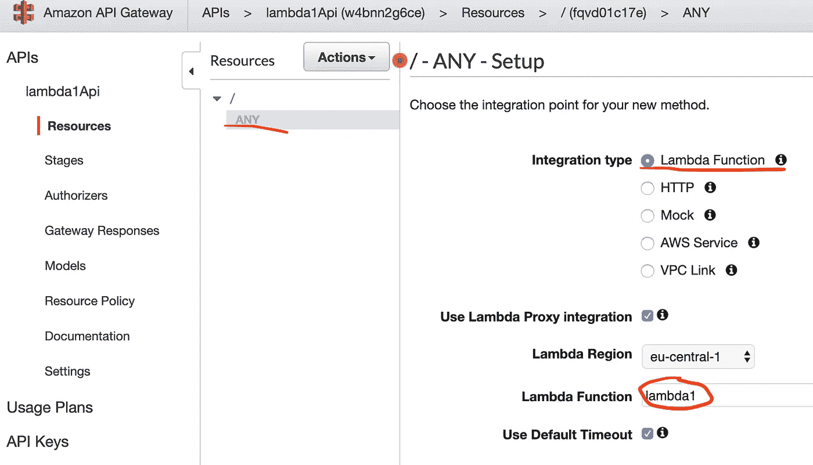**

**部署 API。**

**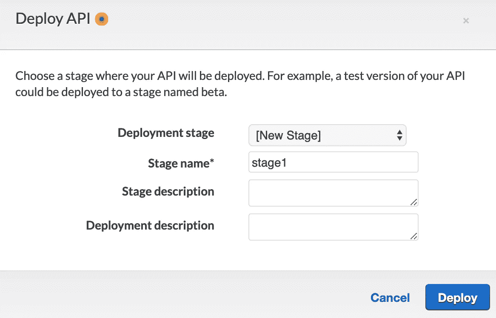**

*   **为了进行测试，我们需要从以下位置获取 API-GW URL:**

****阶段- >阶段 1 - >调用 URL(在标题中)****

**别忘了添加我们的 **waitSec** 参数！这是我得到的:**

**[https://w4 bn N2 g 6 ce . execute-API . eu-central-1 . Amazon AWS . com/stage 1？**wait sec = 3**](https://w4bnn2g6ce.execute-api.eu-central-1.amazonaws.com/stage1?waitSec=3)**

**工作 3 秒钟:**

**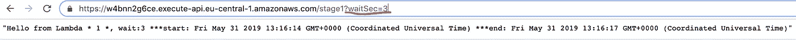**

**但是**没有**工作 40 秒:**

****

# **步骤 2:创建 ALB**

**从 EC2 服务控制台->目标组，创建一个新目标**

**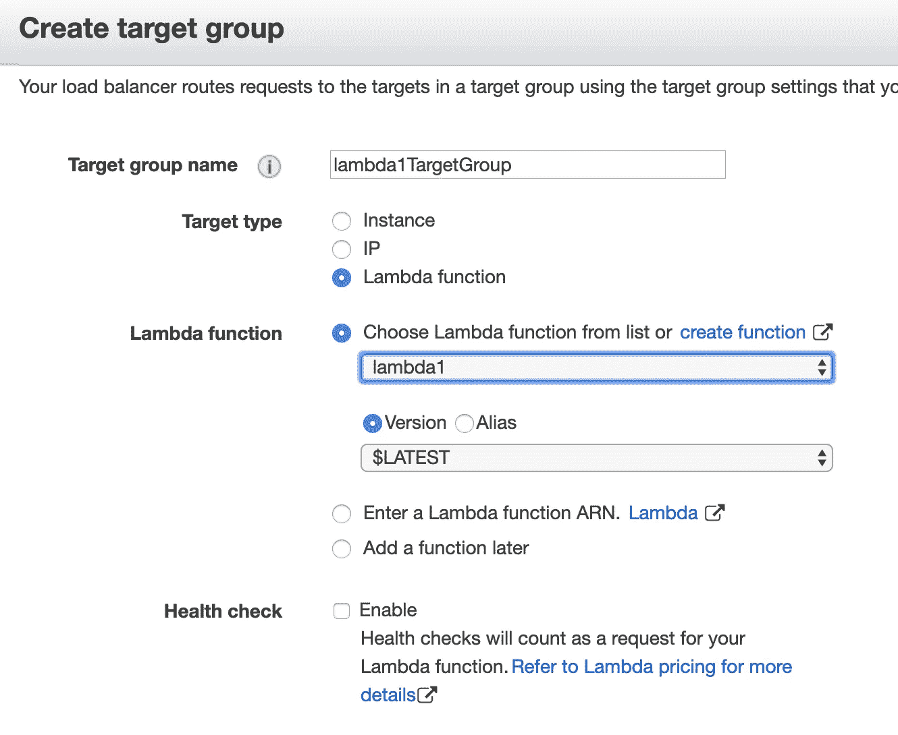**

**并从**“负载平衡器”**菜单中，创建一个新的 ELB - >“应用负载平衡器”**

**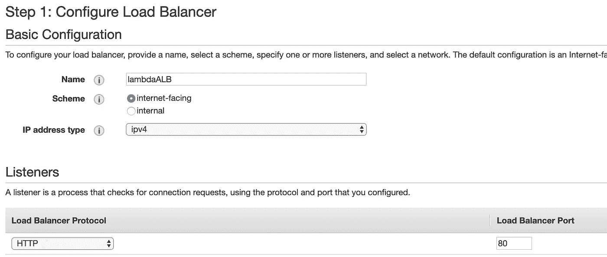**

**确保端口 80 在安全组中打开，以便我们浏览。**

**在路由步骤中，默认情况下，我们会将所有请求定向到我们的 **lambda1TargetGroup。****

**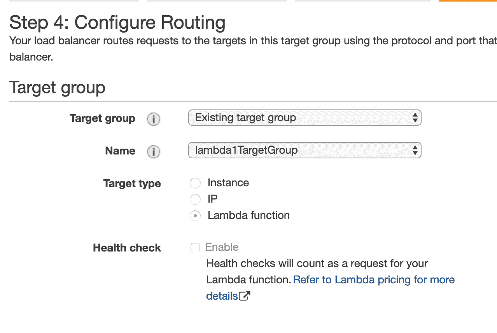**

**完成后，从“**描述**选项卡中获取 ALB DNS 名称。将 **waitSec** 参数添加到 URL，并测试:**

**【http://lambdaALB-641303138.eu-central-1.elb.amazonaws.com】T4？waitSec= 40**

**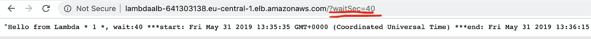**

**40 秒和**工作！！****

# **步骤 3:使用 URL 参数在 Lambdas 之间路由**

**如果需要通过 ALB 使用 API 调用多个 lambdas，可以使用 URL 参数进行路由，例如:**

**[http://lambdaalb-641303138.eu-central-1.elb.amazonaws.com/?wait sec = 2**λ=λ2**](http://lambdaalb-641303138.eu-central-1.elb.amazonaws.com/?waitSec=2&lambda=lambda2)**

1.  **使用步骤 1 中的指令再创建一个名为**λ2，**的 lambda。唯一的变化是返回的文本是" **lambda 2"** ，这样我们就可以识别我们使用了哪个 lambda。**

**2.在 ALB-> ce 中为**λ2**多创建一个目标组**

**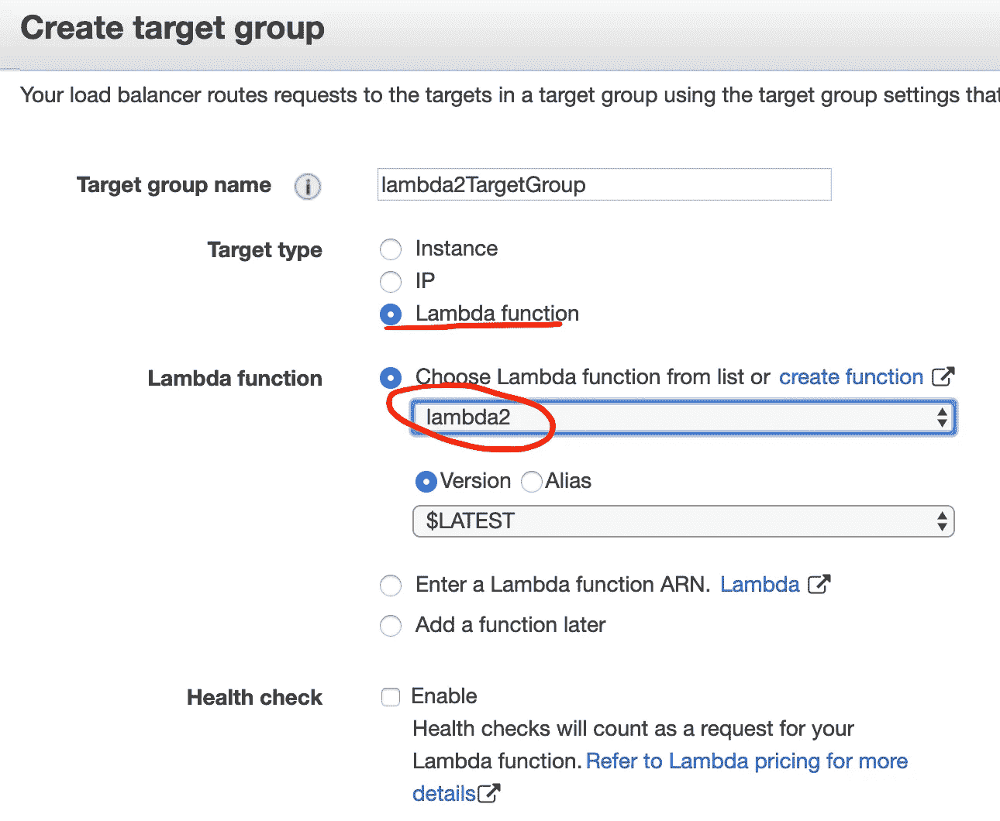**

**3.编辑路由规则，并为**λ2**添加路由:我们将使用名为**λ的 URL 查询参数将 API 路由到正确的λ。****

****λ=λ1**或**λ=λ2****

**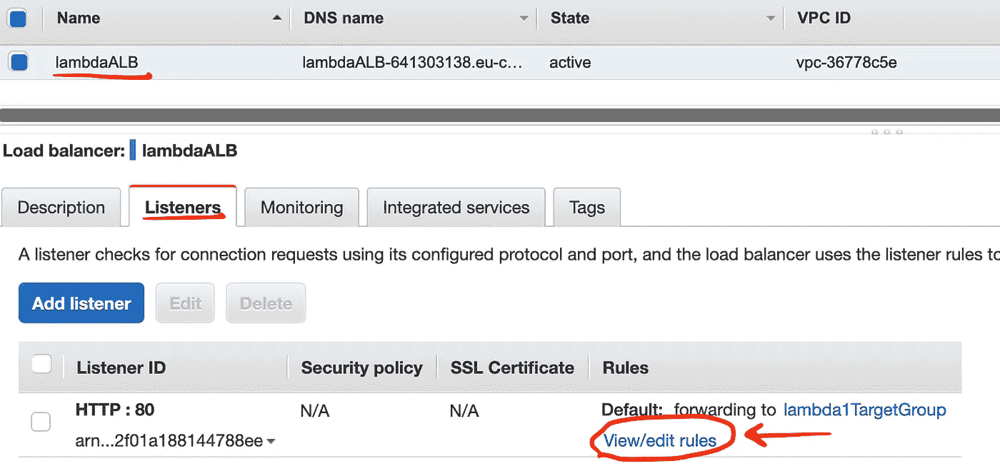****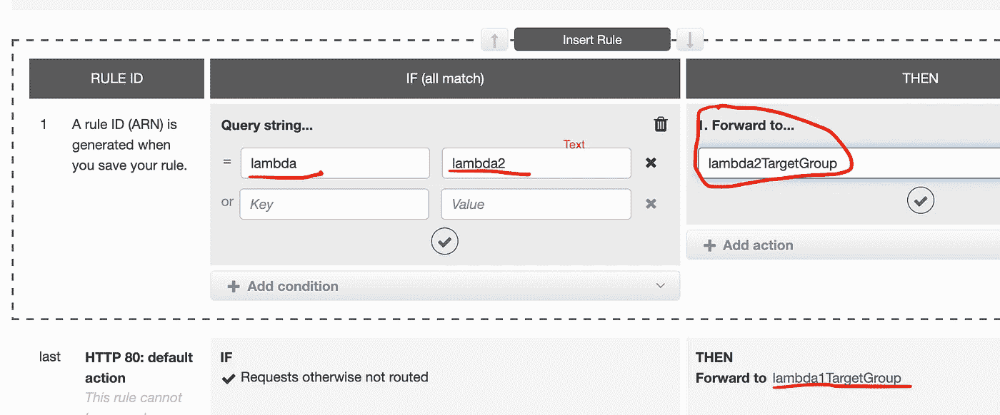**

**现在，让我们通过 **lambda** 参数测试并确保正确的 lambda 正在运行:**

**[http://lambdaalb-641303138.eu-central-1.elb.amazonaws.com/?wait sec = 2**&lambda = lambda**](http://lambdaalb-641303138.eu-central-1.elb.amazonaws.com/?waitSec=2&lambda=lambda2)**1****

**返回:**“你好来自 Lambda * 1 *，****

**http://lambdaalb-641303138.eu-central-1.elb.amazonaws.com/?wait sec = 2**λ=λ2****

**返回:**“你好来自 Lambda * 2*****

# ****结论****

**如果您的 lambda 耗时超过 30 秒，ALB 是 API-GW 的一个很好的无服务器替代方案。**

**尽情享受吧！**