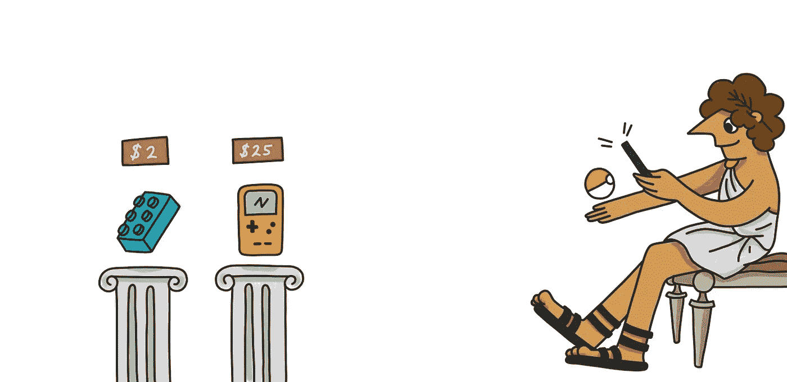
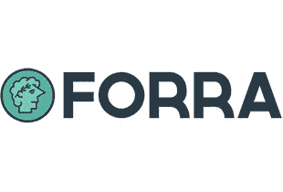

# 如何花你的比特币和密码购买 Ebay 商品

> 原文：<https://medium.com/hackernoon/how-to-spend-your-bitcoin-and-crypto-on-ebay-items-dd6347b532ec>

在易贝上买东西对大多数人来说很正常。现在，有办法使用比特币和其他加密货币购买易贝商品。Forra 已经将易贝的上市捆绑到其本地平台上。允许任何人使用比特币或加密货币从易贝购物。

你可以在这里查看我们的市场: [https://market.forra.io](https://market.forra.io/)

# 怎么可能用比特币或其他加密货币在易贝买东西

[Forra](https://market.forra.io) 负责让用户用比特币和其他加密货币购买易贝物品。我们希望开发一些工具，让人们可以将他们的加密货币用作货币。我们认为，通过构建这些工具，我们将增加加密货币的采用。

让易贝这样的企业接受比特币或其他加密货币在短期内不会发生。除了购买物品之外，我们还向人们收取物品的金额，并将他们的加密货币转换为美元。

在 [Forra](https://market.forra.io) 上订购安全可靠。您的订单通过易贝处理和交付，您的项目将到达，如果没有，我们会给你退款。

# 如何使用比特币在易贝购物

使用比特币在易贝购物非常简单。你所要做的就是登录[市场。Forra.io](https://market.forra.io/)

你看到的这些待售商品中，有一些实际上是 eBay.com 的易贝物品，也就是说，拥有一个 eBay.com 账户的人把它们列在了网上。你可以通过一个 API 使用比特币在 Forra 上购买易贝商品。

当你在 Forra 上用比特币购物时，系统会提示你使用我们的托管系统付款。我们的托管系统将处理整个支付工作流程。我们的保管暨代付款服务确保易贝卖家和使用 Forra 在易贝购买物品的人之间的公平交易。

# 如何使用加密货币在易贝购物

使用加密货币在易贝上购买商品很简单。当你使用加密货币在易贝上购买一件商品时，你所要做的就是登录 market.forra.io，购买带有易贝标签的商品。使用一个 API 调用从 eBay.com 本身提取带有易贝标签的商品。

使用 [Forra](https://forra.io) 可以快速完成购买过程。只需要几秒钟。

# 在 eBay.com 使用加密货币的好处

使用加密货币支付物品实际上更便宜。易贝将经常被迫对他们的每一笔交易征税。当你使用加密货币购买一件物品时，你通常不必支付任何税款。当您使用 Forra 购物时，我们会征税。这种税还不到你通常要付的一半。使得使用加密货币比法定货币更便宜。

# 如何为加密货币出售自己的物品

如果你也想在 Forra 上出售你的物品，你可以在这里注册:[market.forra.io/signup](https://market.forra.io/signup)

如果你知道你想要加密货币，Forra 是直接在易贝销售的一个惊人的替代选择。我们没有卖家费用或刊登费用。当你用 Forra 出售一件物品时，你会得到全额保证。

我们平台上的大多数房源都来自寻找易贝替代品的小企业主和个人。

浏览 Forra 的人希望在易贝消费他们的加密货币。