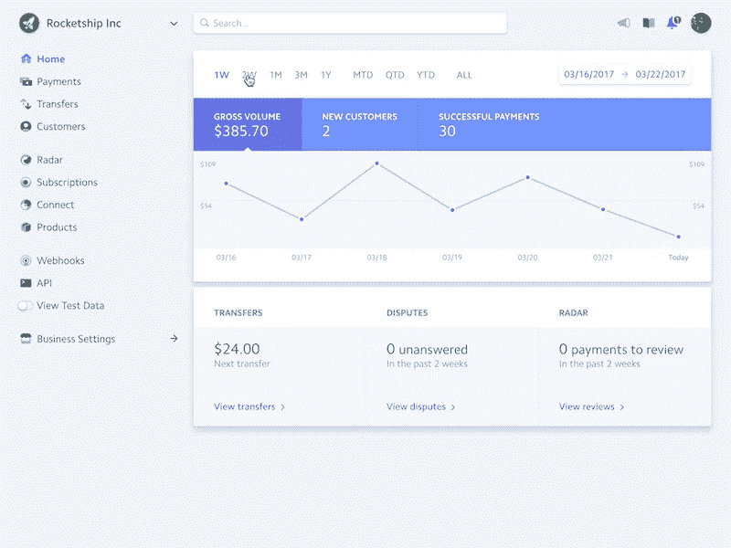
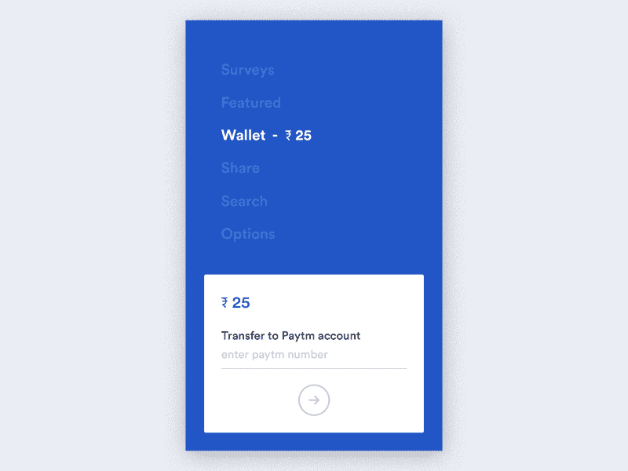
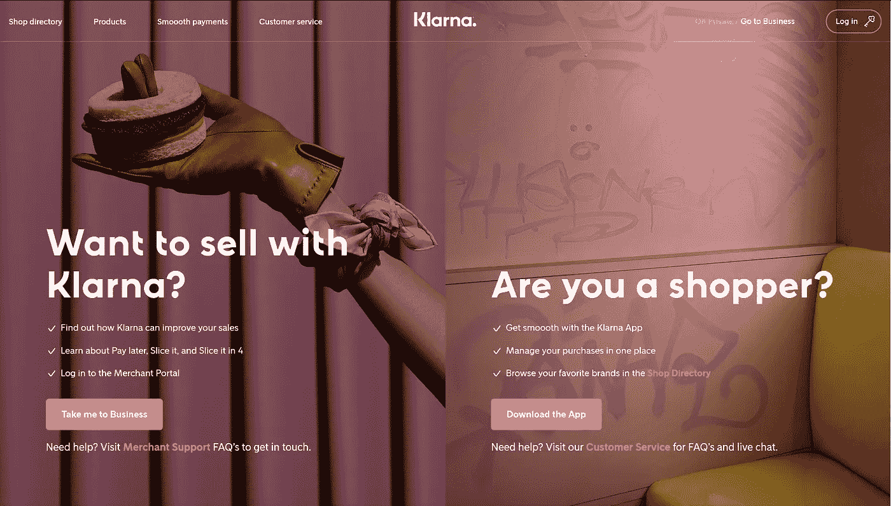
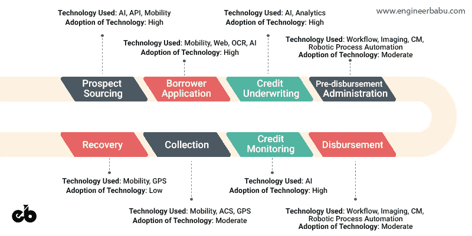
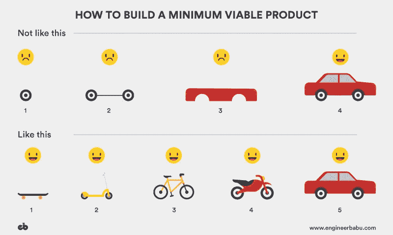
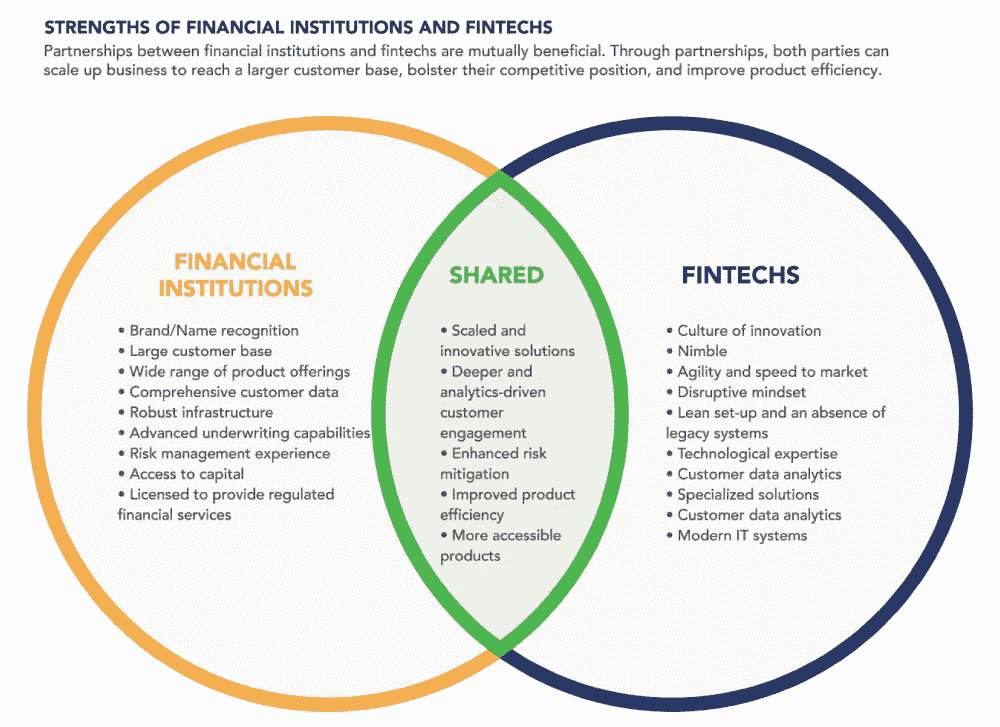

# 如何创办一家金融科技公司

> 原文：<https://medium.com/hackernoon/how-to-start-a-fintech-company-e12bf425338>

## 你绝对应该知道的 7 件事

> “为了服务于这些市场，你必须重新想象如何管理和转移资金，因为未来 5 年金融服务业将发生比过去 30 年更多的变化。”
> **–**贝宝公司首席执行官丹·舒尔曼

即使你不交易比特币，也不确定股票如何运作，你仍有可能使用过某种金融科技服务，如移动支付或在线银行解决方案。事实上，2017 年全球金融科技的采用率达到了**33%(2015 年为 16%)。**

因此，不可否认的事实是，技术将继续入侵古老的金融行业。乘着金融科技的潮流，许多千禧一代和创新者已经重塑了他们的企业，并在转型中获得了丰厚的利润。但是，你是如何开始的呢？

每个月都有数以吨计的初创公司进入市场，数十亿美元的巨头在运作，想要分得一杯羹可能相当困难。

**在这篇文章中，我们将讨论创办金融科技公司的诀窍，路上可能会遇到哪些障碍，如何安全通过并建立自己成功的金融科技公司。**

# 5 家最佳金融科技初创公司及其成功秘诀

*有什么比向已经成功的人学习更好的呢，*因此，在深入研究成功的秘诀之前，让我们先来看看当前金融科技环境中的一些引领潮流者，以及他们的秘密成分是什么。

## [1。条纹](https://stripe.com)

Stripe Dashboard
Courtesy: [dribbble.com](http://dribbble.com)

**未知因素:**

*   易于集成
*   工具
*   有竞争力和清晰的定价
*   定制
*   更好的客户支持

**利基:**在线支付服务

**资助:**

*   在 9 轮中总共筹集了 6 . 85 亿美元。
*   现在价值 200 亿美元。

Stripe 无可挑剔的功能和精心设计的 API 帮助为消费者创造了最好的产品。毫无疑问，它已经成为创建订阅服务、众筹平台、电子商务商店等的一站式目的地。这家科技公司通过帮助几乎各种规模的企业，已经能够为互联网建立一个经济基础设施。它将支付平台与应用程序相结合，将收入数据置于业务运营的核心。

## [2。罗宾汉](https://robinhood.com/)

Robinhood Dashboard
Courtesy: [dribbble.com](http://dribbble.com)

**X 因素:**

*   聚焦目标市场(千禧一代)
*   病毒式营销策略
*   无杂乱界面

利基:交易和投资

**资助:**

*   在 5 轮融资中总共筹集了**5 . 39 亿美元**
*   现在对**的估值为 56 亿美元**

它很容易被吹捧为今年的顶级金融科技公司。为了降低费用，公司不开设店面，也不提供额外的工具。它以一个受欢迎的虚构人物命名，通过使用和押注富人的钱来帮助经济地位较低的人成长。金融科技应用取消了传统上与发起买入或卖出相关的所有经纪费。它通过高级会员的[**robin hood****Gold**](https://support.robinhood.com/hc/en-us/articles/360001214583-Upgrading-to-Gold)账户赚钱，并像银行一样从持有的现金和股票中收取利息。这款应用简洁明了，每个人都可以轻松使用。

## [3。Lu.com/Lufax](http://www.lu.com/)

***X 因素:***

*   广泛的产品供应
*   多样化的流动性渠道

**小众:**点对点借贷融资平台

**资助:**

*   在两轮融资中筹集了 17 亿美元
*   现在价值约为。**100 亿美元**

在不到四年的时间里，Lufax 已经发展成为中国最大的金融科技公司。它被认为是中国最具创新性的非国有金融机构。Lufax 的注册用户数量最近超过了 1400 万。Lufax 充分利用最新的大数据和 IT 产品，并推出最先进的风险评估模型和风险控制系统。

## [4。Paytm](https://paytm.com/)

A Paytm wallet transaction
Courtesy: [dribbble.com/paytm](http://dribbble.com/paytm)

**未知因素:**

*   极高的品牌知名度
*   强大的营销活动
*   口碑
*   大人物的巨额投资

**利基:**在线支付

**资助:**

*   在 4 轮融资中筹集了 22 亿美元。
*   现在价值约为。150 亿美元。

被吹捧为印度最大的移动商务平台——它拥有***8000 万活跃月用户，每天处理约 500 万笔交易*** 。Paytm 试图保持一种开放的文化，在这种文化中，每个人都是动手的贡献者，并且乐于分享想法和意见。Paytm 的团队花费数小时设计每一个新功能，并关注最小的细节。
***Paytm 的方法很简单——设计他们会用的东西。***

## [5。克拉纳](https://www.klarna.com/)

Klarna’s Landing Page
Source: [klarna.com](http://klarna.com)

**X 因素:**商业模式

**利基:**在线支付

**资助:**

*   在 13 轮融资中筹集了**6.817 亿美元**
*   现在价值超过 25 亿美元

据 Klarna 首席执行官称，即使在成立 12 年后，Klarna 的使命仍然未变— ***让支付变得尽可能简单、安全，最重要的是，尽可能顺畅。这个简单的愿景帮助 Klarna 成为欧洲最大的银行之一。***

Klarna 的后付政策在整个欧洲取得了巨大的成功。先试用，后付款，让用户在送货后 14 天或 30 天付款，这取决于商店。除此之外，还有一个为其用户分期付款的选项。他们有将近 6000 万的用户基础，并且在他们的平台上有大约 90，000 个注册商家。

***那么，是什么让这些杰出的创业公司与众不同呢？***

您可能已经注意到，用来描述所有列出的产品的一些词语是—“**简单**”或“**简单**”这不可能只是巧合。
[**简单易用**](https://medium.theuxblog.com/how-to-k-i-s-s-guide-or-how-to-build-a-simple-product-29c36abbec07?gi=1a7619892d5) 是任何产品区别于竞争对手的强大优势。这些产品的简单性给了他们相对于其他老牌巨头的竞争优势。

以下是你需要考虑的 7 个步骤，以建立一个成功的金融科技创业公司。

# 第一步:确定你的定位

金融科技是一个宽泛的术语，包含很多方面。Fintech 的分类真的要看各种情况。

它可能指一组特定的初创企业和公司，也可能适用于由有助于金融部门发展的技术创新推动的计划。
***fin tech 有很多领域需要考虑，下面是其中的一些:***

**资金运动，或通过给予或接受付款的交易。**

*   **货币**
*   **支付解决方案**
*   **汇款**

****资金投放*、**或融资计划内或计划外的财务规定。*

*   **保存**
*   **投资**
*   **借款**
*   **另类融资**

****数据管理*** *、*获取洞察以改进决策*

*   **理财工具**
*   **研究与数据**

*要创办一家金融科技公司，你必须非常清楚目标市场和他们希望解决的问题。除了选择领域，你的产品应该迎合特定的受众，例如，一个国家，一个州，一个城市或一个特定的人口统计。然而，如果需要的话，最好是先在本地启动你的创业，然后再扩展到全球市场。*

# *第二步:了解规定*

**

*由于显而易见的原因，银行业和金融业受到高度监管。监管是金融服务业难以进入的原因。一些法律已经到位，以确保这些部门免受欺诈。此外，这些法规可能会因您想要开展业务的国家、州或地区的不同而有很大差异。*

*金融科技的到来带来了新的处理和赚钱方式，因此也创造了监管的灰色地带。这引起了立法者的注意。*

*因此，无论你希望涉足哪个领域，彻底了解根据人口统计和地理情况适用的监管措施都是至关重要的。*

# *第三步:发现你的优势*

**

****每一个能够成功颠覆一个行业的独特产品或创新，都是以不同方式做事情的。****

*没有比罗宾汉更好的例子了。凭借其独特的商业策略和病毒式营销活动，他们成功地扰乱了交易和投资领域。他们独特的商业服务，如零佣金，在囊中羞涩的千禧一代中迅速走红。*

*金融科技行业越来越拥挤。许多创新已经在进行中。尽管如此，一个关键的创业问题是，你的产品/企业是否能够提供一些独特且非常重要的东西。*

*创业公司面临的危险是成为“我也是”如果已经有一个实体在你的领域建立起来并且做得很好，那么你应该把你的注意力转移到一些新的和创新的东西上。*

*因此，对于新时代的金融科技创业公司来说，将注意力集中在开发一种提供专属服务或功能的产品上至关重要。您的解决方案必须提供一些细微差别。
这种区别可能就是你一直在寻找的颠覆。*

# *第四步:雇佣合适的人才和合适的技术团队*

****雇佣合适的人才*** 成功的企业是由人组成的。因此，从人群中雇佣精英是至关重要的。如果你所在的城市人才库有限，那么吸引优秀人才就变得相当棘手。*

*在这种情况下，创业公司最好的决定是雇佣海外软件开发团队(想想印度吧！).这不仅为有前途的初创公司削减了大量成本，还提供了一个拥有特定领域知识和相关经验的强大专家团队。*

*如果你正在寻找创造一个伟大的产品，并正在考虑聘请一家软件开发公司，那么不要再看了，我们已经编制了一份最佳金融应用程序开发公司的名单。*

****·选择合适的技术栈*** 每个 fintech 产品都必须有一个定制的软件。没有一家像样的初创公司依赖第三方 CMS 或框架来处理他们的事务。此外，没有现成的解决方案可以与定制设计软件的性能能力相媲美。*

**

*随着金融的发展，数据泄露的风险也随之而来。因此，**数据安全**是 Fintech App 开发最关键的方面之一。
每个初创公司都需要确保他们的产品是安全的，所有敏感数据都被加密并存储在云中。*

# *步骤 5:从创建 MVP(最小可行产品)开始*

*我强烈建议从最低可行产品开始。*

*对于初学者来说，***MVP 是一种开发技术，在这种技术中，新产品或网站的开发只需要足够满足产品早期用户的需求。只有在收到最初用户的反馈后，才设计和开发包含所有要素的最终产品。****

**

*The latter approach is the best practice for building an MVP.*

****遵循这个过程有很多好处，主要是:****

***1。更便宜:**MVP 为你节省了大量的投资，因为你不需要开发额外的功能，这些功能可能会损害产品。这些成本节约是必不可少的，因为你不能确定消费者是否会喜欢这个产品。通过 MVP，你可以试水，然后潜入水池的更深处。*

***2。有效的:**使用 MVP 方法意味着你最终只得到那些你最需要的特性，因此，相对来说外观更少，你的产品变得更干净、更简单。
 **3。更快:MVP 的另一个好处是开发速度。你不是想马上创造一个完美的产品；它作为一个平台来实现这个想法，研究它的用途，做出修正，然后继续前进。这使得整个过程更快更容易。***

***4。降低风险**:拥有最低可行产品的初创公司更有可能从投资者那里获得资金，这是因为 MVP 给了你一个试水的机会，而无需直接构建最终产品。它允许开发者在目标受众中测试你的产品的可行性，而不需要巨大的投资。*

****投资得不到回报的风险越低，投资者就越有可能资助你的想法。****

# *第六步:获得资助*

**

*创办一家金融科技公司是一件成本高昂的事情。制造令人难以置信的产品需要天赋，而天赋并不便宜。随着传统组织试图为自己获得金融科技人才，创业公司将不可避免地面临招聘竞争。如果你的企业不打算与能创造整个产品系列的专业人士合作，那就准备好为人才支付合理的费用。*

*现在，如果你没有雄厚的资金，要在这个动荡的领域生存下去会变得相当困难。因此，为了不损害产品质量，让投资者参与进来变得至关重要。*

****是什么诱惑着投资者？*** 随着当前围绕 fintech 的热潮。全球风险资本投资已经超过了 170 亿美元。然而，这也可能是早期创业公司的祸根，因为融资竞争正呈指数滚雪球式增长。风险投资变得越来越挑剔，正在寻找能够真正改变游戏规则的公司。*

*因此，需要让你的价值主张越来越有吸引力。*

# *第七步:建立伙伴关系*

*对于崭露头角的金融科技初创公司来说，与相关机构建立联盟和获得资金一样重要。*

**

*Both Financial Institutions and Fintech Startups can help expand the others outreach by adding a unique element through their collaboration.
Image Courtesy: centerforfinancialinclusion.org*

*合作是在创新和变革中增强实力的绝佳方式。在那里你可以以最小的成本和最小的风险学习。与该特定领域合作的主要原因是，'**信誉**'*

*用户可能很难信任一个新兴的实体，在这样一个动荡的领域也是如此。因此，当你与一个相关的名字联系在一起时，相对来说就更容易通过这些障碍。金融机构也带来了庞大的客户群和全面的客户数据。*

*因此，合作可以为初创企业提供相当大的推动力，它们可以一起提高产品效率，并构建高度可及的产品。*

# *包扎*

*金融科技可能不是最容易瞄准的行业。考虑到所有的陷阱，创建一家成功的金融科技公司需要汗水、时间和努力。在这样一个琐碎而竞争激烈的领域创业，需要专业知识、创造力，老实说，还需要很大的勇气。*

*有许多观点强调了缓慢发展的金融领域和高度混乱的技术世界之间的所谓不和谐。科技公司快速交付巨大成果的压力是巨大的。*

**尽管如此，*如果你相信你能够通过创新的方式为你的用户解决财务问题，那就去做吧。你也需要合适的人在你身边。一个拥有强大的技术技能和无可挑剔的领域专业知识的团队肯定会有助于构建一些伟大的东西。

***只是要看你怎么做。****

*最初发表于 [**EngineerBabu 博客**](https://www.engineerbabu.com/blog/) ，作者 [Saransh Sethi](https://medium.com/u/5028aadc44f?source=post_page-----e12bf425338--------------------------------)*

*— — — — — — — — — — — — — — — — — — — — — — — — — —*

## *看我的其他相关文章*

***1。** [**金融中的数字转换**](https://www.engineerbabu.com/blog/digital-transformation-in-finance/) **，也上** [**黑客**](https://hackernoon.com/digital-transformation-in-finance-23faefa35a45)
**2。** [**美国十大金融科技公司转型金融**](https://www.engineerbabu.com/blog/top-10-fintech-companies-in-usa/) **3。**[**fin tech 2019**](https://www.engineerbabu.com/blog/fintech-in-2019/)**，还上了**[**hacker noon**](https://hackernoon.com/fintech-in-2019-54309d19bdb7) **4。** [**区块链如何革命性地改变银行和金融市场**](https://www.engineerbabu.com/blog/blockchain-revolutionizing-banking-financial-markets/) **，也上**[**hacker noon**](https://hackernoon.com/how-is-blockchain-revolutionizing-banking-and-financial-markets-9241df07c18b) **5。** [**求教区块链给你的日常银行解决方案**](https://www.engineerbabu.com/blog/asking-for-blockchain-to-your-daily-banking-solutions/) **，也上**[**hacker noon**](https://hackernoon.com/asking-for-blockchain-to-your-daily-banking-solutions-1f9e649b0820)*

> **我是 Mayank，*[*engineer Babu*](https://www.engineerbabu.com/)*的联合创始人。随时联系我关于*[*LinkedIn*](https://www.linkedin.com/in/mayankpratap/)*| mayank@engineerbabu.com(关于 EngineerBabu —* [*中*](https://hackernoon.com/how-mayank-pratap-built-engineerbabu-a-profitable-it-service-company-generating-more-than-50-000-per-month-bcd3006bdbb5) *)。**

*此外， [EngineerBabu](https://www.engineerbabu.com/) 通过构建高级 IT 解决方案，帮助初创公司、企业和所有者发展业务。他们开发的项目 95%都按时完成了。 [30+获风投](https://www.engineerbabu.com/casestudies)资助，赢得最具创新总理设计奖，入选 Y-Combinator 2016 & 2017。*