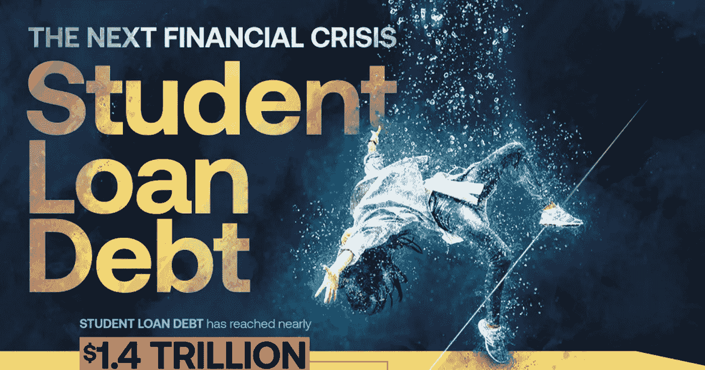
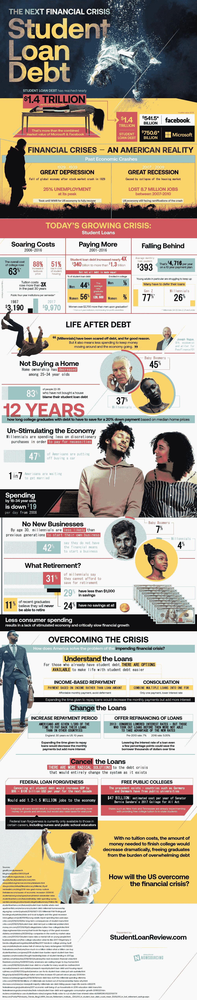

# 如何度过下一次金融危机:学生贷款债务

> 原文：<https://medium.com/hackernoon/how-to-survive-the-next-financial-crisis-student-loan-debt-566e1ab2eec4>

在 2006 年至 2016 年的十年间，大学的总成本上涨了 63%，学生贷款债务增加了 4 倍，并将美国学生贷款债务总额推高至万亿门槛以上。对许多学生来说，上大学的代价不仅仅是经济上的；它甚至可能以成年为代价。

回想大萧条和大衰退，学生贷款危机这些天看起来并不乐观。1.4 万亿美元的美国学生贷款债务超过了脸书和微软的总价值，这两家公司分别为 5415 亿美元和 7506 亿美元。对于背负着数万美元学生贷款的大学毕业生来说，开始步入成年比以往任何时候都难，这阻止了他们买房、组建家庭，并最终退休。克服这场危机需要的不仅仅是努力工作的千禧一代的辛勤劳动，还需要一些认真的改革。

从免费大学，到贷款再融资，再到联邦政府的宽恕，有很多措施可以帮助防止未来的经济崩溃。这张信息图详细描述了学生贷款危机的现状，如果任其发展会发生什么，以及我们如何在另一次经济崩溃前阻止它。

