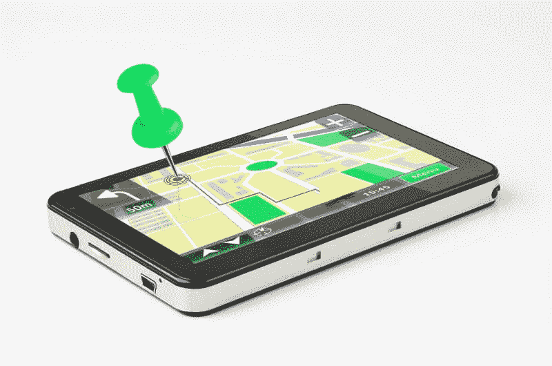
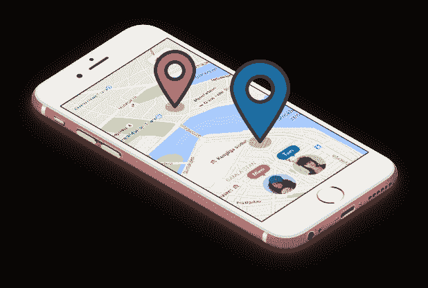

# 如何使用智能手机追踪某人

> 原文：<https://medium.com/hackernoon/how-to-track-someone-using-their-smartphone-70eb33eb8732>

有许多原因或情况要求某人在他们的电话上追踪另一个人。一些很好的例子包括父母监视他们的孩子，或者当他们不在对方身边时，家庭成员互相监视。

鉴于知道一个人的确切位置往往会给一个人关于他们所爱的人的安慰，人们会想知道他们家庭成员的下落是理所当然的。

随着手机技术的发展，我们可以做到这一点。这似乎是一个相当困难的任务，只有科技奇才能够完成，但事实并非如此。

相反，如果一个人掌握了必要的信息，就有可能着手做这件事。

如果你想用手机来监视某人，目前有几种选择。具体使用哪一种取决于你的实际需要，基于这一点你可以做出决定。

下面列出了两种最常见的通过手机追踪一个人的方法。

# 1.安装必要的跟踪软件

这是跟踪机制最常见的工作方式之一。

能被追踪的手机一般都是智能手机，运行在安卓、Windows、苹果等操作系统上。换句话说，这不是普通手机可以做到的，因为它们不具备这样的技术特性。

它的工作原理就像你可以安装在手机上的其他软件一样。它的工作方式通常是借助手机内置的 GPS 跟踪机制。

[监控软件](https://www.ttspy.com/blog/)，通常通过互联网，向服务器或其他设备发送关于其当前位置的信号。这可以被另一个授权用户访问，以了解个人的确切位置。

这是了解个人位置的最有效的方法之一。然而同时，这个软件也有一些限制。只有当手机上的功能为“活动”时，才能访问 GPS 坐标；如果手机用户出于某种原因关闭了定位功能，就很难找到他们的确切位置。

这里还要注意的是，使用的软件往往是免费的，也有付费的。结果，你可能不得不花钱去获得你正在寻找的那种特性，因为免费的应用程序通常没有这些特性。

# 2.信号三角测量——就像警察一样

这是一个很难完成的技巧，只有专业人士才能做到。

解释整个过程有点困难，因此为了便于理解，对其进行了简化。无论何时发送或接收信号，任何手机的位置都会暴露给手机信号塔。这不是一个准确的信号，而是一个“粗略”的信号。

然而，如果信号由多个蜂窝电话塔接收或发送，这可以变得更精确，以便获得每个塔和蜂窝电话之间的距离的粗略概念。还要补充的是，这适用于所有手机，无论是普通手机还是智能手机，如果你真的想找出一个人的位置，这将使它更加有效。

在某种程度上，这是一种估计，在熟练的专业人员和先进设备的帮助下，定位手机的“粗略”位置。

请注意，这个过程相当缓慢和繁琐。并且考虑到人们在使用他们的电话时会移动，该人的确切位置通常难以确定，因为与他们的电话最后一次接收或发送信号相比，该人可能已经改变了他们的位置。

通常情况下，像这样的工具对大多数平民来说是不允许的，但却被执法部门用来追踪嫌疑犯和违法者。事实上，使用这种策略的大多数时候是执法部门和其他政府机构，而不是个人。鉴于这需要大量的专业知识、技术和协调，这是一个普通公民很难参与的事情。但与此同时，如果情况需要，比如说，他们的家人或朋友失踪了，这些机构可以代表普通人使用这种策略。

# 必须解决的法律问题

最后但并非最不重要的一点是，这里必须补充的是，还有其他一些必须考虑的因素。

其中最重要的是合法性。例如，虽然为了孩子的安全而监视他们是没问题的，但为了监视而做同样的事情可能会让你陷入很多法律麻烦。

该法律的确切名称经常会有所不同，但它与侵犯某人的隐私有关。这里还要补充的是，这些法律适用于手机以及其他形式的技术，如互联网。如果你想知道更多关于这一切的确切法律性质，咨询当地律师是个好主意，因为他们会熟悉当地法律。请注意，法律随着司法管辖区的变化而变化，这意味着如果您打算在多个司法管辖区进行任何形式的监控，您必须向多名律师核实这一点。

所以请记住，在你决定开始用手机监控某人的位置之前，这样做的法律后果。根据侵犯隐私的性质，对任何未经授权的访问的处罚可能从小额罚款到监禁不等。

总的来说，当然有一些方法可以实现这个任务，即使看起来有点困难。如果你能确保你使用的原则和技术是合乎道德和合法的，那么从长远来看，你会做得很好，并完成工作。