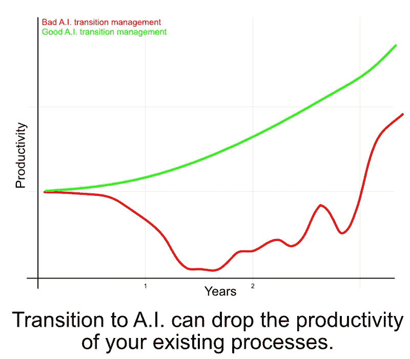
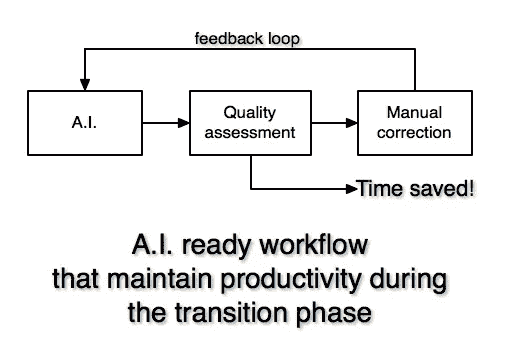

# 人工智能是一种工具，而不是魔杖:我们如何使用它来优化工业流程

> 原文：<https://medium.com/hackernoon/how-to-transition-an-industrial-process-to-a-i-770b130ee0a2>

Photo by [Franck V.](https://unsplash.com/photos/U3sOwViXhkY?utm_source=unsplash&utm_medium=referral&utm_content=creditCopyText) on [Unsplash](https://unsplash.com/search/photos/robot%20piano?utm_source=unsplash&utm_medium=referral&utm_content=creditCopyText)

人工智能可以解决越来越多的问题。问题是:

## 当一个工业过程过渡到人工智能时，你如何保持生产力？

在 Cornis 的这些年里，我们已经帮助风力发电行业的领导者从人工流程无缝过渡到自动化流程，以下是我们遵循的步骤。

Cornis 帮助风电行业的领导者优化他们的流程。以下是我们一直遵循的步骤。

# 1.你只有一份工作

从决定你想自动化哪项工作、哪项任务开始，然后把精力集中在这项工作上。

如果你试图同时在每个流程中应用 AI，你不会很快看到生产率的提高。

为了定义有效的范围，我们提出以下问题:

## 输入数据是什么？

每个人对自己的输入数据都有一个模糊的概念。例如*“风机检查图片”*用于风机检查。

您对输入数据的描述越多，过渡就越平稳。

> 输入数据是你的团队完成工作所需的每一个元素。例如图像、现场书面信息、文化或专家知识等。

对于检验图片，您是否拥有描述如何获取这些数据的程序？你使用为工作设计的特定相机吗？是否有更多可用数据？你的技术人员是否填写了描述任务的文件？你是把图片放在文件夹里，有序的还是和不相关的内容混在一起？

如果您一年中多次使用您的流程，您的输入数据必须遵守指导原则。拿这些数据的一堆例子来说明这个任务输入数据的相似性。

## 谁在做这项工作？

在您的过渡项目中包括执行您正在从事的任务的专家。他们是最了解如何完成任务以及从自动化过程中期望得到什么的人。

> 将人的经验转移到算法上是 AI 过渡的一个主要部分。找到每一个对你想自动化的任务有贡献的人是很重要的。

## **预期的结果是什么？**

对于工业公司来说，这个问题的通常答案是报告或 Excel 文件。如果您的流程是在线的，那么更具体一些，以便于过渡。你不想把你 AI 项目的大部分时间花在创建报告生成算法上。

在*风力涡轮机检查*中，我们着重于确定图片是否有缺陷。我们将流程的另一部分留在了范围之外。

> 花点时间描述你期望的结果。训练和改进机器学习算法会更容易。

# 2.像我 5 岁一样解释

头条呈现机器比人聪明只是营销。

> 机器是愚蠢的，但是它们有 T2 巨大的内存和计算能力。
> 人类是**聪明**，但是他们有**低**的内存和计算能力。

你需要把任务分成简单的步骤，让机器学习。你需要以一种任何人都能理解的方式来传递你的专业知识。这是将机器学习集成到您的业务中最费力的任务之一。

我们做这个细分是为了获取风力涡轮机方面的专业知识。我们发现 90%的工作——缺陷检测——不需要太多的专业知识。自动化第一个任务导致我们将专家时间除以 2。

# 3.无需自动化即可设计您的工作流程

为了管理一个人工智能的转变，你的过程需要足够健壮，以便在没有自动化的情况下仍然可以工作。

在成为自动化流程之前，它将是一个混合流程。机器学习算法只会对你的一小部分数据有效。

在早期阶段，人工智能算法的质量因输入而异。如果你不想生产力下降，就做好最坏的打算。

当我们开发 [Panoblade](https://home.cornis.fr/panoblade/) 生产链时，我们的算法有大约 10%的效率。它从 90%的图像拼接的少数检查到 0%的大多数。多亏了为失败而设计的架构，我们按时交付了每一项检查。

> 你的人工智能工作流程需要在没有自动化的情况下也能很好地工作。

不要取代你的好的旧的手动过程，通过确保这两个要素将它转变为**人工智能就绪**:

## 你需要一个质量评估程序。

描述你如何评估你的工作质量:步骤是什么？能给个质量分吗？

自动质量评估程序不是强制性的。设计良好的用户界面可以提高质量评估的效率。

## 你需要有一个工具来纠正一个命题。

你需要确保你已经准备好工具来纠正一个人工智能命题。

一旦你具备了这两个要素，你就可以在你的流程中使用 AI 了:

*   你通过早期人工智能算法处理每一个新数据
*   质量评估程序帮助您选择要纠正的数据
*   使用修正工具，你的用户可以调整人工智能的反应
*   反馈回路允许人工智能算法改善结果

> 根据我们的经验，您可以从一开始就节省时间。评估一个普通人工智能结果的质量通常比对所有数据进行评估需要更少的时间。

这种架构允许你对机器学习过程有持续的反馈。

您将使用质量评估结果来跟踪 AI 性能。您将能够使用检测到的错误来重新训练算法。

*在* [*康尼斯博客*](https://ai.cornis.fr) *上了解更多工业过程中的自动化和* AI *。*