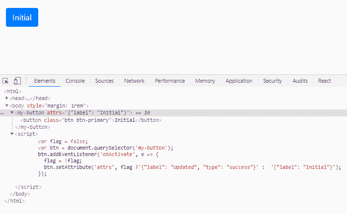

# 如何将 React 组件转换成本地 Web 组件

> 原文：<https://medium.com/hackernoon/how-to-turn-react-component-into-native-web-component-84834315cb24>


如何将 React 组件包装在框架无关的 HTML 定制元素中的分步说明；如何公开它的属性和事件，并支持子进程。

我有一个副业项目，创建和维护[一个名为 dotNetify-Elements](https://www.dotnetify.net/elements) 的 React 组件库；一组非常专业的 UI 组件，能够通过 [web](https://hackernoon.com/tagged/web) socket/SignalR 与. NET 核心后端实时对话。

有几次我想在静态网页或者用其他 UI 框架构建的网站上使用它们。这是可能的，但它需要经历一些困难才能让 [React](https://hackernoon.com/tagged/react) build 系统运行起来，有时这可能并不理想。

Web 组件标准[虽然不像 React 那样通用，但至少提供了一种构建可以在大多数浏览器上本地操作的专门 UI 元素的方法。但是从头开始重新构建我的库听起来对我来说并不太有吸引力，所以我进行了一次反复试验，看看我是否可以将我现有的 React 组件封装到这项技术中。](https://developer.mozilla.org/en-US/docs/Web/Web_Components)

在某种程度上，这是一个成功的结果。我还没有解决每个问题；有一些黑客攻击，我怀疑有性能打击，但你可以在这里看到结果:

*   实时仪表板演示:[https://jsfiddle.net/dsuryd/ygosxk8m](https://jsfiddle.net/dsuryd/ygosxk8m)
*   反应式表单演示:[https://jsfiddle.net/dsuryd/hmvwpjx0](https://jsfiddle.net/dsuryd/hmvwpjx0/1/)

*(你会看到的是 HTML 视图部分；如果你也有兴趣看后端代码，* [*从这里开始*](https://www.dotnetify.net/elements/examples/customerform) *。)*

如果你想了解我是如何做到的，以及你自己是如何做到的，下面是一套指导说明。

## 创建元素外壳

创建 HTML 自定义元素有两个步骤:

1.  编写一个扩展 HTMLElement(或其任何派生类型，如 HTMLParagraphElement)的类。
2.  向 window.customElements 对象注册该类。

例如，让我们创建一个名为“我的按钮”的按钮:

```
class MyButton extends HTMLElement {
   constructor() {
      super(); 
  }
}customElements.define('my-button', MyButton);
```

*(注意:您必须将*[*custom-elements-es5-adapter . js*](http://"https://unpkg.com/@webcomponents/webcomponentsjs@2/custom-elements-es5-adapter.js)*添加到 index.html 才能工作；不要编了！).*

现在我们有了 shell，让我们创建一个组件，当它应用到页面时，它将呈现一个 React 按钮组件。

## 包装反应

就像 React 一样，定制元素也有一些生命周期挂钩，您可以通过回调方法来访问它们。当元素被添加到文档中时，`connectedCallback`被调用，而`disconnectedCallback`则相反。这些是安装和卸载 React 组件的好地方:

```
class MyButton extends HTMLElement {
   constructor() {
      super(); 
   } connectedCallback() {
      ReactDOM.render(<MyReactComponent />, this);
   } disconnectedCallback(){
      ReactDOM.unmountComponentAtNode(this);
   }
```

通过使用`this`，我们告诉 ReactDOM 在元素上安装组件，因此任何呈现的标记都将成为主文档 DOM 的一部分。这是我有意为之的，因为我希望组件受到 css 全局主题的影响。但是如果您希望它更加独立，那么我们可以将它安装在影子 DOM 上，这基本上是一个对其他代码隐藏的 DOM 子树:

```
this.root = this.attachShadow({mode: 'open'});
ReactDOM.render(<MyReactComponent />, this.root);
```

模式`open`仅仅意味着您仍然希望允许 Javascript 代码访问影子 DOM。当然，如果你想完全隔离它，使用模式`closed`代替。

## 传递属性

自然，我们希望允许人们通过自定义元素的属性将属性值传递给 React 组件。事实是，自定义元素属性将被视为字符串，而 React 属性接受所有类型。

显然，我们需要将值转换成适当的类型。您可以很容易地为每个元素编写自定义代码，但是让我们选择一个以通用方式实现这一点的函数:

```
connectedCallback() {
   const props = {
      ...this.getProps(this.attributes, MyReactComponent.propTypes)
   };
   ReactDOM.render(<MyReactComponent {...props} />, this);
}getProps(attributes, propTypes) {
   propTypes = propTypes|| {};
   return [ ...attributes ]         
      .filter(attr => attr.name !== 'style')         
      .map(attr => this.convert(propTypes, attr.name, attr.value))
      .reduce((props, prop) => 
         ({ ...props, [prop.name]: prop.value }), {});
}convert(propTypes, attrName, attrValue) {
   const propName = Object.keys(propTypes)
      .find(key => key.toLowerCase() == attrName); let value = attrValue;
   if (attrValue === 'true' || attrValue === 'false') 
      value = attrValue == 'true';      
   else if (!isNaN(attrValue) && attrValue !== '') 
      value = +attrValue;      
   else if (/^{.*}/.exec(attrValue)) 
      value = JSON.parse(attrValue); return {         
      name: propName ? propName : attrName,         
      value: value      
   };
}
```

自定义元素的属性可从`this.attributes`访问。该函数所做的是遍历属性，通过查看其值来猜测类型，从组件的`propTypes`中找到匹配的 React 属性名称(因为属性名称都是小写的)，通过查看其值来猜测类型，将它们转换并聚合为要传递给 React 组件的对象文字。

## 处理属性更新

我们现在能够通过自定义元素属性设置 React 属性值，但是如果我们想在元素呈现后通过 Javascript 更改任何值呢？

我们需要一种机制来通知我们的元素它的任何属性已经改变，这样它就可以强制 React 组件进行更新。定制元素有另一个处理这种类型事件的回调方法，恰当地命名为`attributeChangedCallback`。但是遗憾的是，只有当我们添加了返回属性名称的静态函数`getObservedAttributes`时，这个回调才会起作用，我们必须静态地声明这个函数。

我正在寻找一种解决方案，它不会强迫我列出我想要观察的所有属性，幸运的是有一种东西叫做`MutationObserver`。这是 DOM 事件规范的一部分，它允许我们观察对 DOM 树所做的更改。

让我们更新元素的构造函数，使用这个 API 来监听任何属性更改，并在发生这种情况时强制 React 组件重新装载。在这个过程中，我们将 React 挂载和卸载代码重构为独立的方法，以实现可重用性:

```
constructor() {
   super();
   this.observer = new MutationObserver(() => this.update());
   this.observer.observe(this, { attributes: true });
}connectedCallback() {
   this.mount();
}disconnectedCallback() {
   this.unmount();
   this.observer.disconnect();
}update() {
   this.unmount();
   this.mount();
}mount() {
   const props = {
      ...this.getProps(this.attributes, MyReactComponent.propTypes)
   };
   ReactDOM.render(<MyReactComponent {...props} />, this);
}unmount() {
   ReactDOM.unmountComponentAtNode(this);
}
```

## 引发事件

如果没有引发事件的能力，我们的按钮元素将毫无用处。所以接下来要解决的是如何将 React 组件引发的任何事件转换成可以用`addEventListener`监听的 DOM 事件。

假设组件遵循 React 事件命名约定(camel-case *on* *)，我们将再次使用`propTypes`寻找匹配模式的属性名，并传递给它一个调用 DOM `dispatchEvent`的函数:

```
mount() {
   const props = {
      ...this.getProps(this.attributes, MyReactComponent.propTypes)
      ...this.getEvents(MyReactComponent.propTypes)
   };
   ReactDOM.render(<MyReactComponent {...props} />, this);
}getEvents(propTypes) {
   return Object.keys(propTypes)
      .filter(key => /on([A-Z].*)/.exec(key))
      .reduce((events, ev) => ({
         ...events,
         [ev]: args => 
            this.dispatchEvent(new CustomEvent(ev, { ...args }))
      }), {});
}
```

这是我们目前所拥有的一个屏幕截图，一个按钮元素响应一个点击事件和属性的改变:



## 跨群体儿童

虽然这种实现对于叶组件来说很好，但是我的 React 组件是其他元素的容器，无论是简单的标量值、DOM 元素，还是其他 React 组件。这被证明是一个相当大的挑战，因为 ReactDOM `render`似乎只想接受 React 组件作为子组件，而我需要它来接受自定义元素的内部 HTML 标记。

我最终决定使用库`html-to-react`，它接受 HTML 标记并生成一个 React 组件。让我们将代码更新为:

```
import htmlToReact from 'html-to-react';
...mount() {
   const props = {
      ...this.getProps(this.attributes, MyReactComponent.propTypes)
      ...this.getEvents(MyReactComponent.propTypes),
      children: this.parseHtmlToReact(this.innerHTML) };
   ReactDOM.render(<MyReactComponent {...props} />, this);
}parseHtmlToReact(html) {
   return html && new htmlToReact.Parser().parse(html);
}
```

自定义元素现在能够呈现嵌套元素。但是，一旦元素得到更新，它们就会消失。为什么？是因为`this.innerHTML`的内容在元素挂载后就没有了。为了克服这个问题，让我们在`connectedCallback`期间缓存初始内容，并使用`mount`中的变量:

```
connectedCallback() {
   this._innerHTML = this.innerHTML;
   this.mount();
}
```

就是这样！这就是它的要点。你可以超越这个，就像我一样。对于我的组件，我实现了更多来处理我的非常具体的用例，比如上下文注入和你看到的演示中的反应式表单的管理。

感谢您的阅读！