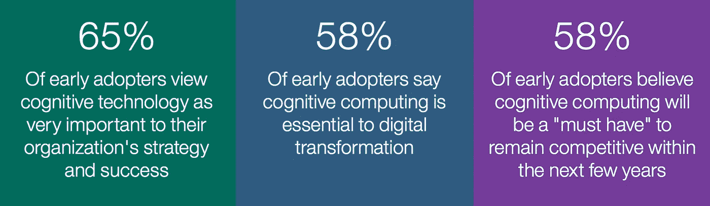
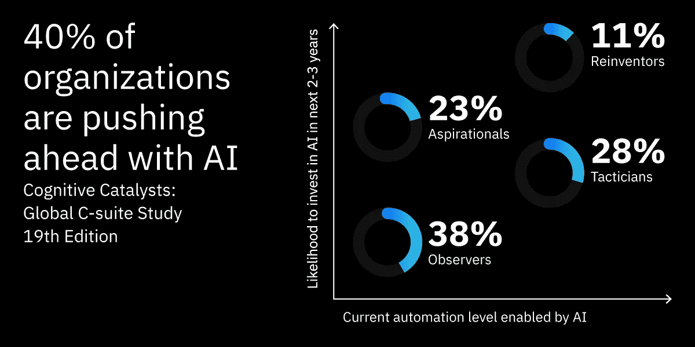
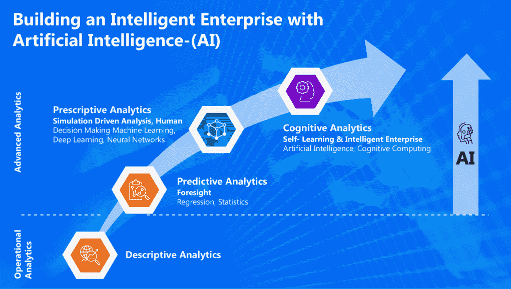
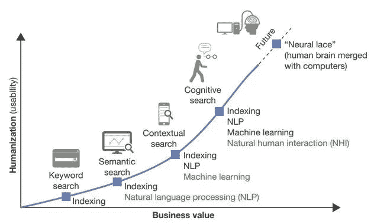
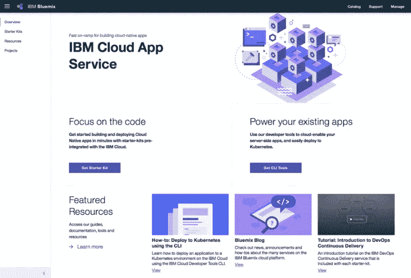
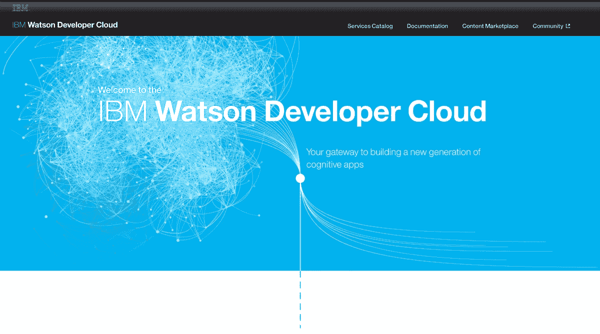
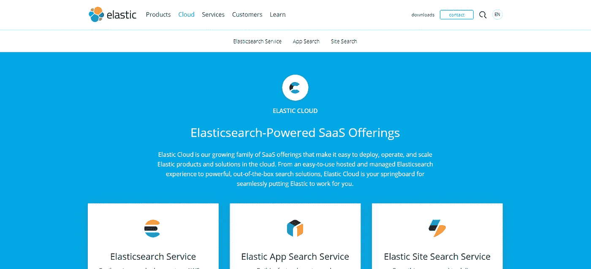
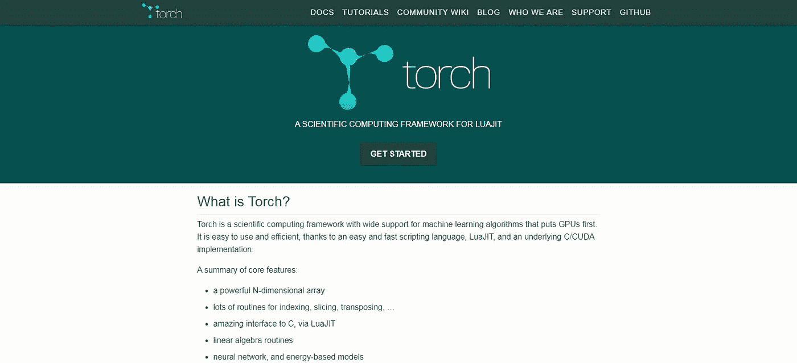

# 利用认知人工智能技术将您的企业转变为现代企业？

> 原文：<https://medium.com/hackernoon/how-to-turn-your-business-into-a-cognitive-enterprise-with-ai-technologies-83cd7621bcc8>

## 这里有一个概述，你可以做些什么来利用认知人工智能技术将你的企业变成一个认知企业。此外，为你的公司寻找设计和开发认知人工智能应用的工具。

人工智能无处不在，认知企业机会多多。我们所说的认知型企业是什么意思？数以百万计的想法和想法正等待着蓬勃发展，而认知人工智能技术将在将你的想法转化为活的作品方面发挥更大的作用。

预计认知人工智能将为复杂的商业问题带来简单性，并提供更有用、更具吸引力、更直观、更有利可图的解决方案，这就是我们所说的企业认知方法。

根据 IDC 发布的一份报告，一家市场研究公司指出，到 2021 年，全球在认知人工智能系统上的支出将达到 576 亿美元。

认知人工智能系统的最大投资者是银行、零售和制造企业。这些行业的公司将大力投资认知解决方案，以寻求创新，更好地将服务与客户要求相匹配，并处理欺诈和风险检测。

> ***4 月 23 日，纳斯达克上市咨询公司*** [***ISG 集团***](https://www.prnewswire.com/news-releases/leveraging-cognitive-technologies-for-business-value-the-subject-of-isg-webinar-300833440.html) ***(信息服务集团)也举办了一场 Smartalk 网络研讨会，主题是企业如何通过将认知人工智能技术融入其运营中来实现有价值的成果。***

**本次网络研讨会的成果如下:**

## **认知人工智能技术在商业自动化中的作用**

认知人工智能技术在当今的现代企业中是如何应用的？认知人工智能技术在一系列不同的工具、技术和软件上工作，能够在复杂的商业环境中做出明智的决策。也可以称为人工智能和机器学习在你的工作运营中的实际实现。

根据受欢迎程度指数对企业目前部署的认知人工智能技术类型进行分类:

**机器人流程自动化** —机器人流程自动化有助于减轻日常重复性任务的负担，并帮助企业自动化某些被工人拒绝的任务。

**统计机器学习** —一套统计[机器学习](https://www.valuecoders.com/blog/technology-and-apps/top-machine-learning-frameworks-for-web-development/)和认知人工智能技术使用 ML 算法自动建立分析模型，帮助企业预测他们的客户行为、欺诈检测和产品推荐。

**自然语言处理** —在商业领域，NLP 有助于从大量数据中提取数据洞察力，并通过创建智能 NLP 通信模型和聊天机器人来帮助改善整体用户体验。

**专家或基于规则的系统** —如今，所有领先企业都希望实施“智能”业务流程管理平台，帮助减少复杂管理解决方案中的手动处理需求。

**深度学习神经网络—** 深度学习非常有助于解决与图像分类和对象识别相关的复杂问题，这些问题目前正用于在线游戏、产品分类和全自动汽车。

**物理机器人** —一次添加智能机器人可以让你的工作更好，减少潜在的错误风险，并使用认知人工智能技术提高生产率。

认知人工智能技术提高了速度，降低了运营成本。当今的组织正在实施认知技术来实现流程自动化、创造洞察力并从大型复杂的数据集中得出结论，这有助于做出高质量的预测，并且很可能有助于改善企业的整体运营。

***据***[***Statista***](https://www.statista.com/statistics/755331/worldwide-spending-on-cognitive-ai-systems-segment-share/)***报道，2019 年全球认知人工智能系统支出预计将增长 135 亿美元。***

## **为什么公司都在追求认知人工智能技术？**

研究表明，当今企业的目标是通过创造新产品和新客户群来增加收入，而不是通过削减成本。他们将 ML、NLP、深度学习、机器人等认知人工智能技术视为重塑其业务的一种方式，也是商业模式转型的基础。

> IBM 是通过认知人工智能技术追求业务转型的公司的最佳例子。约 1 亿美元投资于 IBM 沃森开发者云技术旗下的 [**IBM 的认知应用**](https://cognitiveclass.ai/learn/cognitive-analytics-ibm/) 理念，为不同的垂直市场构建稳健的商业生态系统。
> 
> [**思科的认知**](https://www.cisco.com/c/en/us/products/security/cognitive-threat-analytics/index.html) **威胁分析**是网络安全高级形式的另一个伟大例子，它基于基于认知人工智能和机器学习算法的云解决方案，旨在发现网络内部的威胁。

在贸易生命周期中，已经有许多认知人工智能技术的例子。整个行业至少还有一些要推出，但更多的企业仍在寻求采用认知人工智能解决方案。幸运的是，现在市场上有很多工具和资源可以用来构建认知应用。

## **这里是我见过的构建认知人工智能应用的工具列表。**

## [**IBM 云**](https://www.ibm.com/cloud/)

IBM Cloud 是一个全栈云平台，为您提供了跨公共、私有和混合环境的应用程序开发和管理的单点。该平台允许您查看您的应用程序和数据在云上的位置。IBM Cloud 上的工具帮助您安全地连接到您的云环境，允许您同步和转换数据，并为 IBM Cloud catalog 创建企业 API。

**IBM 云的智能存储选项**

您可以根据公司的安全需求选择[公共、私有或混合存储](https://www.ibm.com/cloud/storage)。

**IBM Cloud 上控制选项的工具选择**

您可以通过选择[即服务选项](https://www.ibm.com/cloud/learn/iaas-paas-saas)来为您的组织选择控制级别，这些选项包括:

> **软件即服务(SaaS)**
> 
> **平台即服务(PaaS)**
> 
> **基础设施即服务(IaaS)**

**IBM Cloud 上的云服务提供商(CSP)**

这将帮助您管理和简化组织中的底层基础结构，并允许您专注于软件开发和其他开发任务。

## [**沃森开发者云**](https://www.ibm.com/watson/developer/)

在沃森开发者云平台上，大型数据集易于使用且组织良好。允许您跨不同渠道快速开发和部署聊天机器人和虚拟代理。在认知人工智能上运行，解锁数据中隐藏的价值以找到答案，监控趋势，并消除有害的偏见。

**你可以在沃森开发者云上尝试这三个选项:**

> [**沃森发现**](https://www.ibm.com/watson/services/discovery/) **监控趋势，解锁数据中隐藏的价值。**
> 
> [**沃森助手**](https://www.ibm.com/cloud/watson-assistant/) **设计、开发、部署聊天机器人。**
> 
> [**Watson open scale**](https://www.ibm.com/cloud/watson-openscale/)**让 AI 自动化并消除有害偏见。**

## [**麋栈**](https://www.elastic.co/products/)

Elasticsearch 与 Logstash、Beats 和 Kibana 相结合，可以帮助您实时提供可操作的见解，并且您可以根据自己喜欢的聚合和过滤器可视化输出。Elasticsearch 是一个轻量级平台，可以快速洞察大型数据集。

ELK Strack 允许您使用 Kibana 中的地图应用程序搜索应用程序数据。

组织可以尝试新的开发特性，如 6.7 中的跨集群复制。

基于异常检测和警报方法，通过认知人工智能和机器学习来跟踪变化。

展示数据日志和指标在单一平台中的价值。

尝试基于角色的访问控制的弹性云企业 2.2 和跨集群搜索的用户界面。

## [**火炬**](http://torch.ch/)

Torch 用它的脚本语言 LuaJIT 支持机器学习算法。LuaJIT 是一种脚本语言，支持 Torch 的科学计算框架，并在实现复杂的神经网络拓扑结构方面具有最大的灵活性。使用 Torch，你可以用神经网络开发任意形式的图形，并以一种简单的方式将它们放在 CPU 和 GPU 上。

> **Torch 为您提供快速高效的 GPU 支持。**
> 
> **支持强大的 N 维数组和线性代数例程。**
> 
> **易于嵌入 iOS 端口和 Android 后端。**
> 
> **支持索引、切片和转置。**

所以，就这些了！然而，还有更多。如果你想在你的业务中实施认知方法，那么最好的方法是找到一个可靠的软件开发公司，它可以帮助你理解认知人工智能技术的整体概念。

不仅如此，你还可以通过在一些论坛上回顾和发表你的观点来寻求行业专家的建议，如、 [XDA 开发者](https://www.xda-developers.com/)、 [Hackr.io](https://hackr.io/forum/android-development) 和 [TechRepublic](https://www.techrepublic.com/forums/mobile-apps/) 。

认知人工智能技术是一个极其广阔的知识领域，它拥有你的问题的答案，也解决了商业行业今天面临的许多问题，并可能在未来为你的业务查询提供许多解决方案。