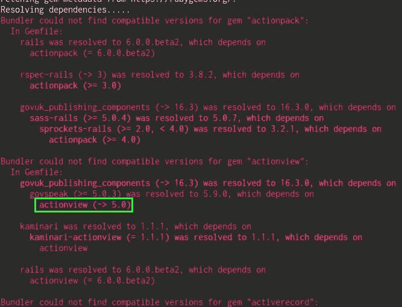
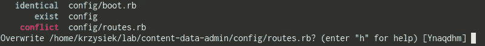
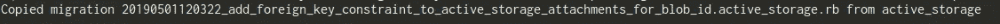

# 如何升级到 Rails 6

> 原文：<https://medium.com/hackernoon/how-to-upgrade-to-rails-6-ee23ca29976a>

我希望这是一个相当详细的概述，说明 Rails 的升级过程总体上是怎样的，但重点强调 Rails 5.2 > 6 升级部分(RC1 是最新的版本)。我已经看到了许多描述 Rails 6 中等待我们的变化列表的精彩帖子，所以我将完全跳过这些，只关注升级。请记住，尽管这只是一个概述，但当给定一个足够大的应用程序时，您这边的定制可能会使使用`rails app:update`成为不可能。

# 我应该升级吗/需要考虑的事情

据 DHH 称，Rails 6 beta1 已经足够稳定，可以在上面运行你的项目。事实上，在他的 [Rails 博客文章](https://weblog.rubyonrails.org/2019/1/18/Rails-6-0-Action-Mailbox-Action-Text-Multiple-DBs-Parallel-Testing/)中，他写道 Basecamp 已经被迁移了。

> *Basecamp 已经在生产中运行 Rails 6.0.0.beta1，Shopify 和 GitHub 以及其他公司肯定会紧随其后。这不是什么摇摇欲坠的小屋释放。* DHH

但是，由于还没有正式发布，您可能会发现您使用的一些 gem 还没有为升级做好准备。如果 gem 的 Rails 版本被限制在 5 或更低版本(或任何其他依赖版本)，那么您可能会从一开始就陷入依赖地狱。如果你现在真的不想在你的生活中遇到这种情况，等到大多数宝石的创造者赶上来可能是一个更好的选择。请记住，这可能会很快改变——在过去的几周里，我看到了这方面的巨大进步。

另一件要考虑的事情是，你觉得你的应用程序被测试覆盖的程度有多深。良好的测试对于重大升级来说绝对至关重要。在这个过程中，你将改变几十个设置，每个设置都可能改变应用程序的工作方式。如果您想知道哪个问题是由哪个变更引起的(我想您也想知道)，您可能会在手工测试上花费大量的时间。因此，如果你的应用程序在这方面有所欠缺，那么在前进之前，尝试填补你的测试套件的所有空白。

# 升级过程

## 1.将 Ruby 至少更新到 2.5 版

根据应用程序的大小和升级的规模，在 Ruby 升级过程中，你可能会遇到一大堆错误，也可能看不到任何错误(好吧，这不太可能)。即使来自相对较新的 Ruby 版本，我也建议您逐步进行这些更改。Ruby 版本有以下几种模式:`ruby_{MAJOR}_{MINOR}_{TEENY}`。我不认为每个小版本都需要升级，但是每隔一个小版本(每年圣诞节发布)进行升级是个好主意。至少，我会把过程分成两部分，从中间的版本开始(在当前版本和目标版本之间)。

在每次迭代后运行您的测试。一旦您在测试/开发中完成了工作，在试运行服务器上重复同样的操作，对任何明显的问题进行手动测试，然后才开始生产。根据您对测试的信任程度，您可能希望在进一步升级 Rails 之前给应用程序几天时间。

## 2.将 Rails 升级到 5.2 系列的最新版本(撰写本文时是 5.2.3)

在开始 Rais 6 升级之前，请确保您使用的是最新的 Rails 5 版本。如果你来自早于 5 的版本，有很多文章涉及这个主题，包括来自 [Kickstarter](https://kickstarter.engineering/upgrading-kickstarter-to-rails-5-e8203f93df55) 、 [Shopify](https://engineering.shopify.com/blogs/engineering/upgrading-shopify-to-rails-5-0) 和 [GitHub](https://github.blog/2018-09-28-upgrading-github-from-rails-3-2-to-5-2/) 的报道。

## 3.更新 Gemfile

将`gem "rails", github: "rails/rails"`添加到您的 gem 文件中，并在终端中运行`bundle update rails`。如前所述，这可能说起来容易做起来难。对于成熟的应用程序，您很可能会看到一长串红色的未解决依赖项列表。通常情况下，事情并不像看上去那么糟糕——你所看到的是一颗宝石可能引发的连锁反应的结果。这个列表没有按照任何特定的顺序显示(至少我知道是这样)。你会得到一堆`Bundler could not find compatible versions for gem XXX`错误，但是通常，只有少数错误包含一个冲突的宝石。根据我的经验，通常有两种罪魁祸首:

*   rails 相关宝石(`rails`)。`railties`、`actionpack`、`activesupport`等。)仅限于版本< 6
*   通过使用`~>`操作符，gems 的升级仅限于次要版本

这就是为什么我倾向于首先在列表中寻找这些。为了修复它们，我通常不得不操作项目的`Gemfile`和`Gemfile.lock`的组合，以及 gems 的`.gemspec`和有时的`Rakefile`。

根据本文的需要，我(实验性地)打包的项目之一是来自 [alphagov](https://github.com/alphagov) 的`content-data-admin`。在他们的例子中，这个列表有 70 多行，但是只有一个依赖关系阻碍了这个包的进展(在这个例子中，它是来自`govuk_publishing_components` gem 的`actionview`(截图如下)。

当然，gem 是否能在依赖项解锁的情况下正常工作是另一回事，但是如果大多数 gem 已经在 Rails 5 上工作了，那么在 Rails 6 上工作应该没有问题。对于以前的版本(Rails 4 和 5)，您可以使用 [Ready4Rails](http://www.ready4rails.net/) 应用程序来检查 gem 是否准备好与特定的 Rails 版本一起工作——目前，没有提到 Rails 6，但当您阅读本文时，这可能会发生变化。

修改 Rails 版本可能会解决这个问题，尽管这带来了一个明显的缺点，即要么派生出每一个 gem，要么找一个已经为你做了这件事的人。我不知道这里有什么变通办法，所以在继续之前请记住这一点。在我捆绑的 231 个宝石中最大的一次升级中，有 6 个必须手动分叉和升级。

## 4.从终端运行更新任务

运行`rails app:update` 命令，它会引导您一步一步地将新的配置设置添加到您的应用程序中。这是一个互动的过程，看似简单，但如果不够谨慎，可能会导致一些意想不到的问题。我建议您对每个建议的文件更改运行 diff 工具(`d`)，以充分了解更改程度。

我怀疑你会想要覆盖它将建议的一些文件(例如路线或 I18n 文件)。您有两种选择:

*   在选择`y` / `n`之前，选择(`m`)并用您选择的工具合并文件
*   对每个文件使用`y`，然后使用合并工具/IDE 一个文件一个文件地检查，看看实现了什么变化。将新设置与旧的自定义设置相结合。

就个人而言，我更喜欢第二种方法——我可以决定文件更新的顺序，这样可以更好地控制和查看整体情况。

注意:这一步和下一步都会令人厌倦。帮你自己一个忙，单独处理每一个场景。错过/添加/删除一个小东西是非常容易的，这最终会导致本来可以避免的几个小时的调试。如果你迷失在新旧事物中，[这个网站](http://railsdiff.org/) *会很有帮助。既然你在上面，也要检查以前升级的[默认配置](https://edgeguides.rubyonrails.org/configuring.html#results-of-load-defaults)(如果项目在 Rails 5 之前开始)，这是一个正确设置它们的好时机。

*正如主页上的评论所说——该工具显示了不同 Rails 版本中新生成的应用程序之间的差异。它*没有*显示内部版本之间实现的所有提交。

## 5.取消注释新的框架默认值

到目前为止(Rails 6.0 RC1 版)，`new_framework_defaults_6_0.rb`文件顶部的注释有点误导。它建议“翻转缺省值”，实际上您应该简单地取消对标志的注释。这要追溯到 Rails 5.0，在从 Rails 4.2 更新之后，默认情况下，这些标志被取消注释并设置为`false`，只有在那时才应该切换到`true`。Rails 6 不是这种情况——在这里，标志已经有了正确的值。不过在最终版本中，注释应该是[固定的](https://github.com/rails/rails/pull/33584)。在[配置 Rails 应用程序](https://edgeguides.rubyonrails.org/configuring.html)指南中列出并描述了所有标志及其默认值，尽管文件中的注释已经是描述性的，应该足以让您做出正确的决定(取消注释或不取消注释)。

## 6.添加丢失的宝石和捆绑

每个主要的 Rails 版本都带有一组稍微不同的 gem。不幸的是，`rails app:update`命令在这方面没有帮助，所以如果没有手动更改，应用程序可能会在没有一些依赖项的情况下崩溃。有很多方法可以解决这个问题——使用 RailsDiff 就是其中之一(参见:Gemfile)。

## 7.运行迁移

[仅在安装了 active storage](https://github.com/rails/rails/pull/35620)时才需要。

## 8.通过[官方升级导轨](https://edgeguides.rubyonrails.org/upgrading_ruby_on_rails.html#upgrading-from-rails-5-2-to-rails-6-0)和[发布说明](https://edgeguides.rubyonrails.org/6_0_release_notes.html)

如果需要，从第一个链接开始实施更改。浏览第二个链接，搜索任何可能特定于您的应用程序的潜在重大变化。如果你有好的测试覆盖率，大多数问题都会在运行测试套件时出现。

## 9.运行测试，抑制反对意见

在较大的更新之后(特别是在遗留项目上)，弃用警告可能会占用测试的大部分输出。我的建议是尽快修复它们。你*可以*用`ActiveSupport::Deprecation.silenced = true`隐藏它们，但是无论如何你将不得不在某个时候处理这个问题，所以为什么不现在就做呢？这一部分并不太难，同时也很有价值——让输出变得清晰真的感觉像是一种进步。

## 10.运行测试，修复失败的测试

这里不可能涵盖足够多的材料来帮助任何数量可观的读者。似乎很多人已经开始试用 Rails 6 了，因为我遇到的大多数问题已经在论坛上被报道/询问过了。其中一些甚至已经被修复，这表明升级只会变得更容易，久而久之。

## 11.执行手动测试

尽管我很愿意相信自动测试是我们所需要的，但在一切正常后，我喜欢打开服务器上的页面，手动检查是否有任何遗漏。

## 12.推送至暂存

在上线之前，设置或使用现有的试运行，在更接近生产的环境中测试应用程序。如果可能的话，让其他人和你一起测试。

## 13.推向生产

# 包裹

Rails 6 RC1 版在最终发布之前可能不会有太大变化，所以现在是认真考虑升级的好时机。我的感觉是，这个过程比从 4.2 到 5.0 要容易得多，特别是如果应用程序是在 5.0 中的一个上启动的。x 版本。和往常一样，拥有最新的依赖项和良好的测试覆盖率会大大简化整个过程。本文的第一稿是在 Beta1 发布后写的，在过去的几周里，我可以看到社区为实现这一飞跃所做的准备有所不同。希望在你读到这篇文章之前，大多数问题都已经解决了。

*最初发表于*[*【https://selleo.com】*](https://selleo.com/blog/how-to-upgrade-to-rails-6)*。*