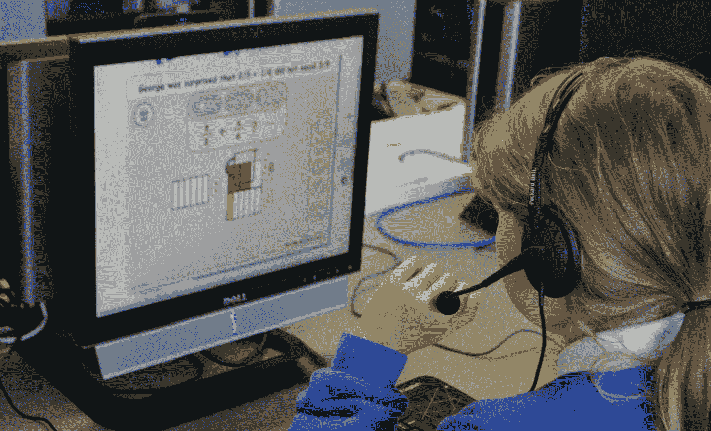

# 如何在教育中使用人工智能

> 原文：<https://medium.com/hackernoon/how-to-use-artificial-intelligence-in-education-874717612f20>

教育中的人工智能似乎前景光明。是因为 AI 技术的助人性质，它也帮助我们拍出完美的照片，自动泊车，等等。

人工智能正朝着成为一个抚慰和帮助我们的非人类伴侣的方向发展。而且，就人工智能在教育中的作用而言，以下数据表明了一切:

根据 Adobe 的数据，自 2000 年以来，风险资本家的启动资金已经暴涨了六倍。人工智能被认为是构建未来[数字化转型解决方案](https://www.valuecoders.com/digital-transformation-development-services)所需的最关键要素。

虽然我们现在没有发现像老师一样工作的人形机器人，但在教育领域有许多关于人工智能的项目正在进行中，以满足教师和学生的要求。

人工智能在教育中有许多好处，以下是我们可以在教育中使用人工智能的一些方式:

# **1。AI 可以自动评分:**

在学校或大学里给家庭作业和考试打分是非常乏味的。

由于评分的原因，老师不能做其他更必要的事情，如与学生互动，备课，从事教学发展。

虽然 AI 不会完全达到人类分级的标准，但会接近它。如今，老师可以自动给学生的写作评分，填空测试等等。

我们已经知道，论文的评分系统正在全力以赴地开发，并且在未来几年似乎会有所改进。

在通过[tensorflow 应用](https://www.valuecoders.com/hire-developers/hire-tensorflow-developers)进行机器学习的帮助下，由于无需评分，教师可以更好地关注课堂活动和学生互动。

Photo by [Franck V.](https://unsplash.com/@franckinjapan?utm_source=medium&utm_medium=referral) on [Unsplash](https://unsplash.com?utm_source=medium&utm_medium=referral)

# **2。可以根据学生的需求开发教育应用和软件:**

无论是人工智能在高等教育还是幼儿园学校的使用，学习者都可以很好地体验个性化学习，这是教育中最伟大的事情。

如今，我们经常会遇到数不清的适应性学习程序、软件和游戏。这种学习系统根据学生的个人需求工作。

这种学习材料更关注学生面临问题的特定主题，并不断重复它们，以帮助学生根据自己的速度和能力学习它们。

这种个性化教育可以在一个教室里很好地为不同学习水平的学生服务。适应性学习已经在全世界产生了巨大的影响。

而且，在未来几年，人工智能肯定会以自己的方式触摸天空，带有[人工智能](https://www.valuecoders.com/hire-developers/hire-machine-learning-experts)的适应性程序也会这样做。

# **3。需要改进的部分非常明显:**

教师没有足够的时间注意到他们的讲座和教育材料中的空白是正常的，这往往会使学生对一些概念感到困惑。

人工智能可以帮助教师解决这个问题。Coursera ，一个巨大的开放在线课程提供商，正在努力将此付诸实践。

在这种情况下，当许多学生发现给了家庭作业错误的答案时，系统会让老师知道。

除此之外，它还为未来的学生提供了定制的信息，给他们提示如何做出正确的答案。

这种系统有助于改善和填补可能对课程产生负面影响的差距。此外，它有助于确保所有学生建立相同的概念基础。

学生不需要等待他们的教授；他们可以立即得到反馈，因此，他们可以有一个更好的理解，并会记住如何在未来做得正确。

# **4。学生将获得额外的支持**

如今，很容易找到无数基于人工智能的辅导程序，这些程序以帮助学生处理数学、写作和其他复杂的科目而闻名。

这种有用的程序可以帮助学生掌握基础知识。然而，这些程序并不擅长为高水平的创造性任务提供教育帮助。

上面提到的事实并不意味着人工智能导师在未来没有这种可能性。在过去的几年里，这个时代见证了技术进步的快速发展。

并且，它给我们带来了在未来几年看到先进的教学系统的希望。

# **5。人工智能驱动的程序可以为教师和学生提供有用的反馈**

除了帮助学生和教师按照要求和方便地制作课程之外，AI 还可以为教师和学生提供关于课程成功的有用反馈。

大多数提供在线课程的学校依靠人工智能系统来跟踪学生的进步，并在学生表现不佳时提醒教师和教授。

这种具有人工智能的系统使学生获得所需的支持成为可能。

而且，教授们也可以发现问题，他们可以在这些问题上改进对有问题的学生的指导。由此，人工智能在教育中的作用变得更加重要。

# **6。寻找信息和与信息互动的不同方式**

人们甚至很少注意影响我们日常看到和找到的信息的人工智能系统。

谷歌根据用户的位置调整搜索结果，Siri 根据用户的需求和命令调整搜索结果，亚马逊根据用户最近的购买情况进行推荐，几乎所有的网络广告都根据用户的兴趣和购物偏好进行调整。

这种智能系统影响了我们在职业和个人生活中与信息互动的方式，并可能改变我们在学术界和学校中查找和使用信息的方式。

在过去的几年里，人工智能驱动的系统已经改变了我们与信息互动的方式。此外，随着更新和更集成的技术，未来的学生可能会经历与今天的学生更不同的研究和发现事实。

# **7。人工智能系统可以改变老师的角色**

没有任何东西或任何人可以取代教师，然而，由于智能计算系统等新技术，他们的角色可能会发生变化。

正如在这篇博客中已经说过的，人工智能可以用于评分等任务，使学生的学习更好，并且可以作为现实世界辅导的[替代品](https://en.wikipedia.org/wiki/Intelligent_tutoring_system)。AI 在教育领域还能做的不止这些。

这种先进的系统可以用来提供专业知识，作为学生提问和查找信息的一个点。

这些人工智能系统甚至有可能取代基础教师。然而，由于 AI，教师在未来的大多数情况下都可以成为推动者。

教师将改进人工智能课程，帮助学生解决问题，并为学生提供人际互动和动手体验。

由于这种先进的技术，一些变化正在课堂上以无数种方式发生。这种变化正在网络学校或接受翻转课堂模式的学校中发生。

# **8。人工智能可以减轻对尝试学习的恐惧**

学习的时候，犯错误是很正常的。然而，有些学生害怕失败。而且，一些学生发现犯错误违背了他们的自我。人工智能可以完美地处理这种情况。

可以准备具有人工智能的计算机系统，以方便有趣的方式辅助学生学习。这样的系统不会像老师的外表那样吓到他们。

学生可以获得一个几乎没有评判环境的平台，特别是当人工智能导师可以提供改进的解决方案时。

简而言之，人工智能是这种学习的最佳媒介，因为具有人工技术的系统本身大多通过试错法来学习。

# **结论**

在这篇文章中，我们就人工智能在教育中的应用进行了长时间的讨论，并讨论了人工智能在教育中的作用。

从评分自动化、学生的特定需求、需要改进的部分、向学生提供额外的支持、向教师和学生提供反馈、以不同的方式查找信息并与之交互、稍微改变教师的角色，到缓解试讲课堂紧张局势，都可以通过具有人工智能的计算机程序来实现。

此外，从专家那里获得电子学习应用程序和软件开发服务，将使您不断了解最新的技术，您可以考虑将这些技术集成到您的软件或应用程序中。